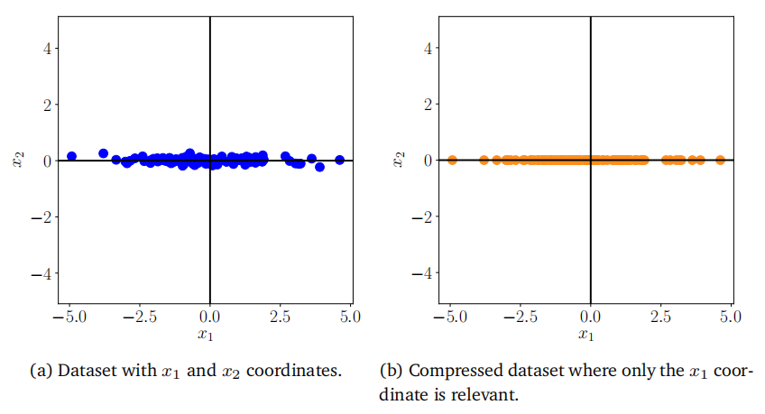

# 第10章 主成分分析与降维

直接处理高维数据（如图像）会带来一些困难：难以分析、解释困难、几乎不可能可视化，而且（从实际角度来看）数据向量的存储成本可能很高。然而，高维数据往往具有我们可以利用的特性。例如，高维数据通常是冗余的，即许多维度是多余的，可以通过其他维度的组合来解释。此外，高维数据中的维度往往相互关联，从而使数据具有固有的低维结构。降维利用这种结构和相关性，使我们能够使用更紧凑的数据表示方式，理想情况下不会丢失信息。我们可以将降维视为一种压缩技术，类似于jpeg或mp3，这些是图像和音乐的压缩算法。

在本章中，我们将讨论主成分分析（PCA），这是一种线性降维算法。PCA由皮尔逊（Pearson, 1901）和霍特林（Hotelling, 1933）提出，至今已有100多年的历史，仍然是数据压缩和数据可视化最常用的技术之一。它还用于识别高维数据的简单模式、潜在因素和结构。在信号处理领域，PCA也被称为Karhunen-Loève变换。在本章中，我们将从基本原理出发推导PCA，利用我们对基和基变换（第2.6.1节和第2.7.2节）、投影（第3.8节）、特征值（第4.2节）、高斯分布（第6.5节）和约束优化（第7.2节）的理解。

降维通常利用高维数据（如图像）的一个特性，即它通常位于低维子空间上。图10.1给出了一个二维示例。尽管图10.1(a)中的数据并不完全位于一条直线上，但数据在$x_2$方向上的变化不大，因此我们可以将其视为几乎无损地位于一条直线上；见图10.1(b)。为了描述图10.1(b)中的数据，仅需要$x_1$坐标，且数据位于R$^2$的一个一维子空间中。

**图10.1说明：降维。(a)原始数据集在x2方向上变化不大。(b)来自(a)的数据可以单独用x1-坐标来表示，几乎没有损失。**

