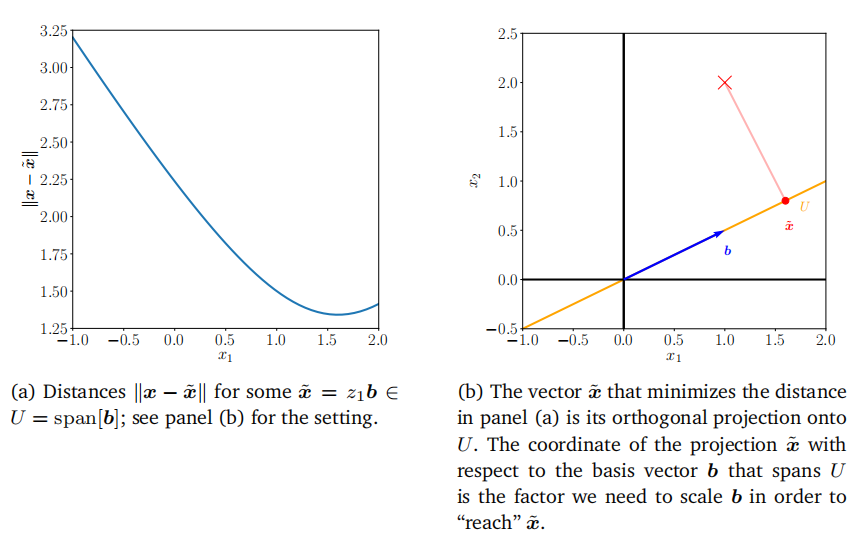
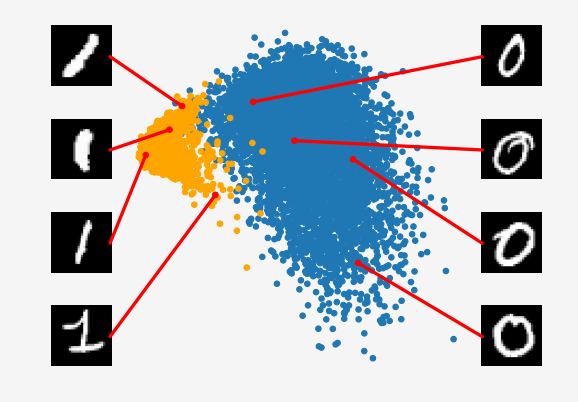

## 10.3 投影视角

接下来，我们将推导主成分分析（PCA）作为一种直接最小化平均重构误差的算法。这一视角使我们能够将PCA解释为实现最优线性自编码器的方法。我们将大量借鉴第2章和第3章的内容。

在上一节中，我们通过最大化投影空间中的方差来推导PCA，以便尽可能多地保留信息。接下来，我们将关注原始数据$x_n$与其重构$\tilde{x}_n$之间的差向量，并最小化这一距离，以便$x_n$和$\tilde{x}_n$尽可能接近。图10.6展示了这一设置。

图10.7简化的投影设置。(a) A向量x∈R2（红十字）应投影到由b跨越的一维子空间U⊆R2上。(b)表示x和一些候选项˜x之间的差分向量。

### 10.3.1 设定与目标

假设有一个（有序的）正交归一基（ONB）$B=(\boldsymbol b_1,\ldots,\boldsymbol b_D)$在$\mathbb{R}^D$上，即当且仅当$i=j$时，$b_i^\top\boldsymbol{b}_j=1$，否则为0。从第2.5节我们知道，对于$\mathbb{R}^D$的一个基$(\boldsymbol b_1,\ldots,\boldsymbol b_D)$，任何$x\in\mathbb{R}^D$都可以表示为该基向量的线性组合，即

$$\boldsymbol{x}=\sum\limits_{d=1}^D\zeta_d\boldsymbol{b}_d=\sum\limits_{m=1}^M\zeta_m\boldsymbol{b}_m+\sum\limits_{j=M+1}^D\zeta_j\boldsymbol{b}_j$$
(10.26)

其中，$\zeta_d\in\mathbb{R}$是适当的坐标。

我们感兴趣的是找到向量$\tilde{x}\in\mathbb{R}^D$，这些向量位于较低维度的子空间$U\subseteq\mathbb{R}^D$中，且$\dim(U)=M$，使得

(10.27)
$$\bar{\boldsymbol{x}}=\sum_{m=1}^Mz_m\boldsymbol{b}_m\in U\subseteq\mathbb{R}^D$$

尽可能接近$x$。请注意，此时我们需要假设$\tilde{x}$的坐标$z_m$与$x$的坐标$\zeta_m$不相同。接下来，我们将使用这种$\tilde{x}$的表示方式，来找到最优的坐标$z$和基向量$\boldsymbol b_1,\ldots,\dot{\boldsymbol{b}}_M$，使得$\tilde{x}$尽可能接近原始数据点$x$，即我们的目标是最小化（欧几里得）距离$\|x-\bar{x}\|$。图10.7展示了这一设定。

不失一般性，我们假设数据集$\mathcal{X}=\{\tilde{x_1,\ldots,x_N}\}$，其中$x_n\in\mathbb{R}^D$，以0为中心，即$E[X]=\boldsymbol{0}$。如果不假设均值为0，我们也能得到相同的解，但表示会更加复杂。

我们感兴趣的是找到$\chi$到较低维度子空间$U\subseteq\mathbb{R}^D$（其中$\dim(U)=M$）的最佳线性投影，该子空间具有正交归一基向量$b_1,\ldots,b_M$。我们将这个子空间$U$称为主子空间。数据点的投影表示为

(10.28)
$$\tilde{x}_n:=\sum_{m=1}^Mz_{mn}b_m=Bz_n\in\mathbb{R}^D\:,$$

其中$z_n:=[z_{1n},\ldots,z_{Mn}]^\top\in\mathbb{R}^M$是$\tilde{x}_n$相对于基$(b_1,\ldots,b_M)$的坐标向量。更具体地说，我们希望$\tilde{x}_n$尽可能接近$x_n$。

在后续中，我们使用的相似度度量是$x$和$\tilde{x}$之间的平方距离（欧几里得范数）$\left\|x-\tilde{x}\right\|^2$。因此，我们将目标定义为最小化平均平方欧几里得距离（重构误差）（Pearson, 1901）

$$J_M:=\frac{1}{N}\sum_{n=1}^N\|\boldsymbol{x}_n-\bar{\boldsymbol{x}}_n\|^2,$$
(10.29)

其中我们明确指出，我们将数据投影到的子空间的维度是$M$。为了找到这种最优线性投影，我们需要找到主子空间的正交归一基以及在该基下投影的坐标$z_n\in\mathbb{R}^M$。

为了找到坐标$z_n$和主子空间的正交归一基，我们采用两步法。首先，我们针对给定的正交归一基$(\boldsymbol b_1,\ldots,\boldsymbol b_M)$优化坐标$z_n$；其次，我们找到最优的正交归一基。

图10.8向量x∈R2在一维子空间上的最优投影（从图10.7开始的延续）。(a)距离kx−˜xk˜为一些x∈U。(b)正交投影和最优坐标。

### 10.3.2 寻找最优坐标

让我们首先找到投影 $\tilde{x}_n$ 的最优坐标 $z_{1n},\ldots,z_{Mn}$，其中 $n=1,\ldots,N$。考虑图 10.7(b)，其中主子空间由单个向量 $b$ 张成。从几何上讲，找到最优坐标 $z$ 对应于找到线性投影 $\tilde{x}$ 相对于 $b$ 的表示，这种表示使 $\bar{x}-x$ 之间的距离最小化。从图 10.7(b) 可以清楚地看出，这将是正交投影，接下来我们将确切地展示这一点。

我们假设 $U\subseteq\mathbb{R}^D$ 的一个标准正交基（ONB）为 $(\boldsymbol{b}_1,\ldots,\boldsymbol{b}_M)$。为了找到关于这个基的最优坐标 $z_m$，我们需要偏导数

(10.30a)
$$\begin{aligned}
&\frac{\partial J_{M}}{\partial z_{in}}=\frac{\partial J_{M}}{\partial\tilde{x}_{n}}\frac{\partial\tilde{x}_{n}}{\partial z_{in}}\:,\\
&\frac{\partial J_{M}}{\partial\tilde{x}_{n}}=-\frac{2}{N}(\boldsymbol{x}_{n}-\tilde{\boldsymbol{x}}_{n})^{\top}\in\mathbb{R}^{1\times D}\:,
\end{aligned}$$
(10.30b)

(10.30c)
$$\frac{\partial\tilde{\boldsymbol{x}}_n}{\partial z_{in}}\stackrel{(10.28)}{=}\frac{\partial}{\partial z_{in}}\left(\sum_{m=1}^Mz_{mn}\boldsymbol{b}_m\right)=\boldsymbol{b}_i$$
对于 $i=1,\ldots,M$，我们得到
$$\frac{\partial J_{M}}{\partial z_{in}}\stackrel{(10.30\boldsymbol{b})}{=}-\frac{2}{N}(\boldsymbol{x}_{n}-\bar{\boldsymbol{x}}_{n})^{\top}\boldsymbol{b}_{i}\stackrel{(10.28)}{=}-\frac{2}{N}\left(\boldsymbol{x}_{n}-\sum_{m=1}^{M}z_{mn}\boldsymbol{b}_{m}\right)^{\top}\boldsymbol{b}_{i}$$
(10.31a)
$$\stackrel{\mathrm{ONB}}{=}-\frac{2}{N}(\boldsymbol{x}_{n}^{\top}\boldsymbol{b}_{i}-z_{in}\boldsymbol{b}_{i}^{\top}\boldsymbol{b}_{i})=-\frac{2}{N}(\boldsymbol{x}_{n}^{\top}\boldsymbol{b}_{i}-z_{in})\:.$$
(10.31b)

由于 $\boldsymbol{b}_i^\top\boldsymbol{b}_i=1$。将偏导数设为 0 立即得到最优坐标
$$z_{in}=x_n^\top b_i=b_i^\top x_n$$
(10.32)

对于 $i=1,\ldots,M$ 和 $n=1,\ldots,N$。这意味着投影 $\tilde{x}_n$ 的最优坐标 $z_{in}$ 是原始数据点 $x_n$ 在由 $b_i$ 张成的一维子空间上的正交投影的坐标（见第 3.8 节）。因此：

- $x_n$ 的最优线性投影 $\tilde{x}_n$ 是正交投影
- $\tilde{x}_n$ 相对于基 $(\boldsymbol b_1,\ldots,\boldsymbol b_M)$ 的坐标是 $x_n$ 在主子空间上的正交投影的坐标
- 正交投影是在给定目标（10.29）下的最佳线性映射
- $x$ 在（10.26）中的坐标 $\zeta_m$ 和 $\tilde{x}$ 在（10.27）中的坐标 $z_m$ 对于 $m=1,\ldots,M$ 必须相同，因为 $U^\perp=\operatorname{span}[\boldsymbol{b}_{M+1},\ldots,\boldsymbol{b}_D]$ 是 $U=\operatorname{span}[\boldsymbol{b}_1,\ldots,\boldsymbol{b}_M]$ 的正交补（见第 3.6 节）

**注记（具有标准正交基向量的正交投影）**。让我们简要回顾一下第3.8节中的正交投影。如果$(\boldsymbol{b}_1,\ldots,\boldsymbol{b}_D)$是$\mathbb{R}^{D}$的一个**标准正交基**，那么

$$\tilde{\boldsymbol{x}}=\boldsymbol{b}_j(\boldsymbol{b}_j^\top\boldsymbol{b}_j)^{-1}\boldsymbol{b}_j^\top\boldsymbol{x}=\boldsymbol{b}_j\boldsymbol{b}_j^\top\boldsymbol{x}\in\mathbb{R}^D$$

(10.33)

是向量$x$在第$j$个基向量所张成的子空间上的正交投影，并且$z_j=\boldsymbol{b}_j^\top x$是该投影相对于基向量$b_j$（该基向量张成该子空间）的坐标，因为$z_j\boldsymbol{b}_j=\tilde{x}$。图10.8(b)展示了这种设置。

更一般地，如果我们想要将向量投影到$\mathbb{R}^D$的一个$M$维子空间上，我们可以得到向量$x$在由标准正交基向量$b_1,\ldots,b_M$所张成的$M$维子空间上的正交投影为

(10.34)

$$\tilde{\boldsymbol{x}}=B(\underbrace{\boldsymbol{B}^{\top}\boldsymbol{B}}_{=I})^{-1}B^{\top}\boldsymbol{x}=BB^{\top}\boldsymbol{x}\:,$$

其中我们定义了$B:=[b_1,\ldots,b_M]\in\mathbb{R}^{D\times M}$。关于有序基$(\boldsymbol b_1,\ldots,\boldsymbol b_M)$的该投影的坐标是$z:=B^\top x$，如第3.8节所述。

我们可以将这些坐标视为投影向量在由$(\boldsymbol{b}_1,\ldots,\boldsymbol{b}_M)$定义的新坐标系中的表示。注意，虽然$\tilde{x}\in\mathbb{R}^D$，但我们只需要$M$个坐标$z_1,\ldots,z_M$来表示这个向量；关于基向量$(\boldsymbol{b}_{M+1},\ldots,\boldsymbol{b}_D)$的其他$D-M$个坐标总是0。

到目前为止，我们已经证明了对于给定的标准正交基（ONB），我们可以通过将向量正交投影到主子空间上来找到$\tilde{x}$的最优坐标。接下来，我们将确定什么是最好的基。

### 10.3.3 寻找主子空间的基

图10.9正交投影和位移向量。当将数据点xn（蓝色）投影到子空间U1上时，我们得到了˜xn（橙色）。位移向量˜xn−xn完全位于U1的正交补体U2中

为了确定主子空间的基向量$b_1,\ldots,b_M$，我们使用到目前为止的结果重新表述损失函数（10.29），这将有助于我们更容易地找到基向量。为了重新表述损失函数，我们利用之前的结果得到

$$\tilde{\boldsymbol{x}}_n=\sum_{m=1}^Mz_{mn}\boldsymbol{b}_m\stackrel{(10.32)}{=}\sum_{m=1}^M(\boldsymbol{x}_n^\top\boldsymbol{b}_m)\boldsymbol{b}_m\:.$$
(10.35)

现在我们利用点积的对称性，得到

(10.36)

$$\tilde{\boldsymbol{x}}_n=\left(\sum_{m=1}^M\boldsymbol{b}_m\boldsymbol{b}_m^\top\right)\boldsymbol{x}_n\:.$$

由于我们一般可以将原始数据点$x_n$表示为所有基向量的线性组合，因此有

$$\begin{aligned}\boldsymbol{x}_{n}&=\sum_{d=1}^{D}z_{dn}\boldsymbol{b}_{d}\stackrel{(10.32)}{=}\sum_{d=1}^{D}(\boldsymbol{x}_{n}^{\top}\boldsymbol{b}_{d})\boldsymbol{b}_{d}=\left(\sum_{d=1}^{D}\boldsymbol{b}_{d}\boldsymbol{b}_{d}^{\top}\right)\boldsymbol{x}_{n}&\text{(10.37}\\&=\left(\sum_{m=1}^{M}\boldsymbol{b}_{m}\boldsymbol{b}_{m}^{\top}\right)\boldsymbol{x}_{n}+\left(\sum_{j=M+1}^{D}\boldsymbol{b}_{j}\boldsymbol{b}_{j}^{\top}\right)\boldsymbol{x}_{n}\:,&\text{(10.37}\end{aligned}$$

其中我们将包含$D$项的求和拆分为$M$项和$D-M$项的求和。根据这个结果，我们发现位移向量$x_n-\tilde{x}_n$，即原始数据点与其投影之间的差向量是

(10.38a)

$$\begin{aligned}\boldsymbol{x}_{n}-\bar{\boldsymbol{x}}_{n}&=\left(\sum_{j=M+1}^{D}\boldsymbol{b}_{j}\boldsymbol{b}_{j}^{\top}\right)\boldsymbol{x}_{n}\\&=\sum_{j=M+1}^{D}(\boldsymbol{x}_{n}^{\top}\boldsymbol{b}_{j})\boldsymbol{b}_{j}\:.\end{aligned}$$
(10.38b)

这意味着这个差正好是数据点在主子空间正交补上的投影：我们识别出(10.38a)中的矩阵$\sum_{j=M+1}^{D}b_{j}b_{j}^{\top}$是执行这个投影的投影矩阵。因此，位移向量$x_n-\tilde{x}_n$位于与主子空间正交的子空间中，如图10.9所示。

**注记（低秩近似）**。在(10.38a)中，我们看到将$x$投影到$\tilde{x}$的投影矩阵由

(10.39)

$$\sum_{m=1}^Mb_mb_m^\top=BB^\top\:.$$

给出。由于它是由秩一矩阵$b_mb_m^\top$的和构成的，我们可以看到$BB^\top$是对称的且秩为$M$。因此，平均平方重建误差也可以写为

$$\begin{aligned}&\frac{1}{N}\sum_{n=1}^{N}\left\|\boldsymbol{x}_{n}-\bar{\boldsymbol{x}}_{n}\right\|^{2}=\frac{1}{N}\sum_{n=1}^{N}\left\|\boldsymbol{x}_{n}-\boldsymbol{B}\boldsymbol{B}^{\top}\boldsymbol{x}_{n}\right\|^{2}\\&=\frac{1}{N}\sum_{n=1}^{N}\left\|(\boldsymbol{I}-\boldsymbol{B}\boldsymbol{B}^{\top})\boldsymbol{x}_{n}\right\|^{2}\:.\end{aligned}$$
(10.40a)

寻找正交归一基向量$b_1,\ldots,b_M$，以最小化原始数据$x_n$与其投影$\tilde{x}_n$之间的差异，等价于找到单位矩阵$I$的最佳秩$M$近似$BB^\top$（参见第4.6节）。

(10.40b)

寻找正交归一化基向量$b_1,\ldots,b_M$，这些向量能最小化原始数据$x_n$与它们投影$\tilde{x}_n$之间的差异，这等价于找到单位矩阵$I$的最佳秩$M$近似$BB^\top$（参见第4.6节）。

现在我们有了所有工具来重新表述损失函数（10.29）。

(10.41)
$$J_M=\dfrac{1}{N}\sum_{n=1}^N\|\boldsymbol{x}_n-\bar{\boldsymbol{x}}_n\|^2\stackrel{(10.38\boldsymbol{b})}{=}\dfrac{1}{N}\sum_{n=1}^N\left\|\sum_{j=M+1}^D(\boldsymbol{b}_j^\top\boldsymbol{x}_n)\boldsymbol{b}_j\right\|^2.$$
我们现在明确计算平方范数，并利用$b_j$形成正交归一基（ONB）的事实，得到

(10.42a)
$$\begin{aligned}J_{M}&=\frac{1}{N}\sum_{n=1}^{N}\sum_{j=M+1}^{D}(\boldsymbol{b}_{j}^{\top}\boldsymbol{x}_{n})^{2}=\frac{1}{N}\sum_{n=1}^{N}\sum_{j=M+1}^{D}\boldsymbol{b}_{j}^{\top}\boldsymbol{x}_{n}\boldsymbol{b}_{j}^{\top}\boldsymbol{x}_{n}\\&=\frac{1}{N}\sum_{n=1}^{N}\sum_{j=M+1}^{D}\boldsymbol{b}_{j}^{\top}\boldsymbol{x}_{n}\boldsymbol{x}_{n}^{\top}\boldsymbol{b}_{j}\:,\end{aligned}$$
(10.42b)

在最后一步中，我们利用了点积的对称性来写作$b_j^\top x_n=x_n^\top b_j$。现在我们交换求和顺序，得到
$$\begin{aligned}J_{M}&=\sum_{j=M+1}^{D}\boldsymbol{b}_{j}^{\top}\underbrace{\left(\frac{1}{N}\sum_{n=1}^{N}\boldsymbol{x}_{n}\boldsymbol{x}_{n}^{\top}\right)}_{=:\boldsymbol{S}}\boldsymbol{b}_{j}=\sum_{j=M+1}^{D}\boldsymbol{b}_{j}^{\top}\boldsymbol{S}\boldsymbol{b}_{j}&\text{(10.43a}\\&=\sum_{j=M+1}^{D}\mathrm{tr}(\boldsymbol{b}_{j}^{\top}\boldsymbol{S}\boldsymbol{b}_{j})=\sum_{j=M+1}^{D}\mathrm{tr}(\boldsymbol{S}\boldsymbol{b}_{j}\boldsymbol{b}_{j}^{\top})=\mathrm{tr}\Big(\underbrace{\Big(\sum_{j=M+1}^{D}\boldsymbol{b}_{j}\boldsymbol{b}_{j}^{\top}\Big)}_{\text{投影矩阵}}\boldsymbol{S}\Big),\end{aligned}$$
这里我们利用了迹算子tr(·)（见(4.18)）的线性性质以及对其参数循环置换的不变性。由于我们假设数据集是居中的，即$\mathbb{E}[\mathcal{X}]=\boldsymbol{0}$，我们将$S$识别为数据协方差矩阵。由于（10.43b）中的投影矩阵是秩一矩阵$b_jb_j^\top$的和，因此它自身的秩为$D-M$。

方程（10.43a）表明，我们可以将平均平方重构误差等价地表述为数据协方差矩阵投影到主子空间正交补上的矩阵。因此，最小化平均平方重构误差等价于最小化当我们忽略某个子空间（即主子空间的正交补）时数据的方差。等价地，我们最大化保留在主子空间中的投影的方差，这立即将投影损失与第10.2节中讨论的最大方差PCA公式联系起来。但这也意味着我们将获得与最大方差视角相同的解。因此，我们省略了与第10.2节中给出的推导相同的部分，并根据投影视角总结了前面的结果。

投影到$M$维主子空间上的平均平方重构误差为

(10.44)
$$J_M=\sum_{j=M+1}^D\lambda_j\:,$$
其中$\lambda_j$是数据协方差矩阵的特征值。因此，为了最小化（10.44），我们需要选择最小的$D-M$个特征值，这意味着它们对应的特征向量是主子空间正交补的基。Consequently, this means that the basis of the principal subspace comprises the eigenvectors $b_1,\ldots,b_M$ that are associated with the largest $M$ eigenvalues of the data covariance matrix.

> **例 10.3（MNIST 数字嵌入）**
>
> 
>
> 
图10.10使用PCA将MNIST数字0（蓝色）和1（橙色）嵌入到二维主子空间中。主子空间中的数字“0”和“1”的四个嵌入用红色和它们对应的原始数字突出显示。

>
> 图 10.10 展示了 MNIST 数字“0”和“1”的训练数据，这些数据被嵌入到由前两个主成分构成的向量子空间中。我们观察到“0”（蓝色点）和“1”（橙色点）之间相对清晰的分离，并且可以看到每个单独集群内的变化。在主成分子空间中，数字“0”和“1”的四个嵌入示例被用红色突出显示，并附有它们对应的原始数字。该图表明，“0”集合内的变化显著大于“1”集合内的变化。
