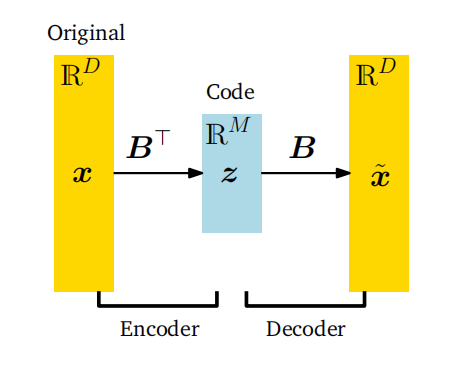

## 10.8 拓展阅读

我们从两个角度推导了PCA：（a）最大化投影空间中的方差；（b）最小化平均重构误差。然而，PCA也可以从不同角度进行解释。让我们回顾一下我们所做的：我们采用了高维数据$x\in\mathbb{R}^D$，并使用矩阵$B^\top$来找到一个低维表示$z\in\mathbb{R}^M$。矩阵$B$的列是数据协方差矩阵$S$与最大特征值相关联的特征向量。一旦我们有了低维表示$z$，我们就可以通过$x\approx\tilde{x}=Bz=BB^\top x\in\mathbb{R}^D$得到其高维版本（在原始数据空间中），其中$BB^\top$是一个投影矩阵。

我们还可以将PCA视为如图10.16所示的线性自编码器。自编码器将数据$x_n\in\mathbb{R}^D$编码为代码$\boldsymbol z_n\in\mathbb{R}^M$，并将其解码为与$x_n$相似的$\tilde{x}_n$。从数据到代码的映射称为编码器，而从代码返回原始数据空间的映射称为解码器。如果我们考虑线性映射，其中代码由$z_n=B^\top x_n\in\mathbb{R}^M$给出，并且我们关注于最小化数据$x_n$与其重构$\tilde{x}_n=B\boldsymbol{z}_n,n=1,\ldots,N$之间的平均平方误差，我们得到

(10.76)
$$\dfrac{1}{N}\sum\limits_{n=1}^{N}\|\boldsymbol{x}_{n}-\bar{\boldsymbol{x}}_{n}\|^{2}=\dfrac{1}{N}\sum\limits_{n=1}^{N}\left\|\boldsymbol{x}_{n}-\boldsymbol{B}\boldsymbol{B}^{\top}\boldsymbol{x}_{n}\right\|^{2}\:.$$

这意味着我们最终得到了与第10.3节中讨论的(10.29)相同的目标函数，因此当我们最小化平方自编码损失时，我们得到了PCA的解。如果我们用非线性映射替换PCA的线性映射，我们得到一个非线性自编码器。这种情况的一个突出例子是深度自编码器，其中线性函数被深度神经网络所替代。在这种情况下，编码器也被称为识别网络或推理网络，而解码器也被称为生成器。

图10.16 PCA可以看作是一个线性的自动编码器。它将高维数据x编码为低维表示（代码）z∈RM，并使用解码器对z进行解码。解码的向量˜x是原始数据x在m维主子空间上的正交投影。

PCA的另一种解释与信息论有关。我们可以将代码视为原始数据点的较小或压缩版本。当我们使用代码重构原始数据时，我们不会得到完全相同的数据点，而是其稍微失真或带有噪声的版本。这意味着我们的压缩是“有损”的。直观地说，我们希望最大化原始数据与低维代码之间的相关性。更正式地说，这与互信息有关。然后，我们可以通过最大化互信息（信息论中的一个核心概念，MacKay, 2003）来得到我们在第10.3节中讨论的PCA的相同解。

在关于PPCA的讨论中，我们假设了模型的参数，即$B$、$\mu$和似然参数$\sigma^2$是已知的。Tipping和Bishop（1999）描述了如何在PPCA设置中推导出这些参数的最大似然估计（请注意，我们在本章中使用了不同的符号）。当将$D$维数据投影到$M$维子空间时，最大似然参数为

(10.77)
$$\begin{aligned}
&\mu_{\mathrm{ML}}=\frac{1}{N}\sum_{n=1}^{N}x_{n}\:,\\
&B_{\mathrm{ML}}=T(\Lambda-\sigma^{2}I)^{\frac{1}{2}}R\:,\\
&\sigma_{\mathrm{ML}}^{2}=\frac{1}{D-M}\sum_{j=M+1}^{D}\lambda_{j}\:,
\end{aligned}$$

其中$T\in\mathbb{R}^{D\times M}$包含数据协方差矩阵的$M$个特征向量，矩阵$\Lambda-\sigma^2I$中，$\Lambda=\operatorname{diag}(\lambda_1,\ldots,\lambda_M)\in\mathbb{R}^{M\times M}$是一个对角矩阵，其对角线上的元素是与主成分相对应的特征值（见(10.78)），而$R\in\mathbb{R}^{M\times M}$保证是任意正交矩阵。最大似然解$B_\mathrm{ML}$在任意正交变换下是唯一的，例如，我们可以将$B_\mathrm{ML}$与任意旋转矩阵$R$右乘，所以(10.78)本质上是数据协方差矩阵的奇异值分解（见第4.5节）。Tipping和Bishop（1999）给出了证明的概要。

(10.77)中给出的$\mu$的最大似然估计是数据的样本均值。(10.79)中给出的观测噪声方差$\sigma^2$的最大似然估计是在主成分子空间的正交补空间中的平均方差，即我们不能用前$M$个主成分捕获的平均剩余方差被视为观测噪声。

在无噪声极限下，即$\sigma\to0$时，PPCA和PCA提供相同的解：由于数据协方差矩阵$S$是对称的，它可以被对角化（见第4.4节），即存在$S$的特征向量矩阵$T$，使得
$$S=T\Lambda T^{-1}\:.$$

在PPCA模型中，数据协方差矩阵是高斯似然$p(\boldsymbol x_{\perp}\boldsymbol{B},\boldsymbol{\mu},\sigma^{2})$的协方差矩阵，即$\boldsymbol B\boldsymbol B^\top+\sigma^{2}\boldsymbol I$，见(10.70b)。对于$\sigma\to0$，我们得到$\hat{B}B^+$，因此这个数据协方差必须等于PCA的数据协方差（以及其在(10.80)中给出的分解），从而
$$\mathrm{Cov}[\mathcal{X}]=T\Lambda T^{-1}=BB^{\top}\iff B=T\Lambda^{\frac{1}{2}}R\:,$$
(10.81)

即，我们在(10.78)中获得了$\sigma=0$时的最大似然估计。从(10.78)和(10.80)可以看出，(P)PCA对数据协方差矩阵进行了分解。

在数据流设置中，数据是顺序到达的，建议使用迭代期望最大化(EM)算法进行最大似然估计(Roweis, 1998)。

为了确定潜在变量的维度（即代码的长度，或我们将数据投影到的低维子空间的维度），Gavish和Donoho(2014)提出了一种启发式方法：如果我们能够估计数据的噪声方差$\sigma^2$，则应丢弃所有小于$\frac{4\sigma\sqrt D}{\sqrt3}$的奇异值。或者，我们可以使用（嵌套）交叉验证（第8.6.1节）或贝叶斯模型选择标准（第8.6.2节讨论）来确定数据内在维度的一个良好估计（Minka, 2001b）。

类似于我们在第9章关于线性回归的讨论，我们可以在模型的参数上放置一个先验分布，并将其积分出来。这样做可以（a）避免参数的点估计以及这些点估计带来的问题（见第8.6节），（b）允许自动选择潜在空间的适当维度$M$。在Bishop(1999)提出的贝叶斯PCA中，模型参数上放置了一个先验$p(\boldsymbol{\mu},\boldsymbol{B},\sigma^{2})$。生成过程允许我们积分出模型参数而不是对其进行条件化，这解决了过拟合问题。由于这种积分在解析上是不可行的，Bishop(1999)建议使用近似推理方法，如MCMC或变分推理。关于这些近似推理技术的更多细节，请参考Gilks等人(1996)和Blei等人(2017)的工作。

在PPCA中，我们考虑了线性模型$p(x_n\mid z_n)=\mathcal{N}(x_n\mid\boldsymbol{B}z_n+\boldsymbol{\mu},\sigma^{2}\boldsymbol{I})$，其中先验$p(\boldsymbol{z}_{n})=\mathcal{N}(\boldsymbol{0},\boldsymbol{I})$，所有观测维度都受到相同数量的噪声影响。如果我们允许每个观测维度$d$具有不同的方差$\sigma_d^2$，则得到因子分析(FA)(Spearman, 1904; Bartholomew等人, 2011)。这意味着FA比PPCA在似然上提供了更多的灵活性，但仍然迫使数据由模型参数$B,\mu$来解释。然而，FA不再允许封闭形式的最大似然解，因此我们需要使用迭代方案（如期望最大化算法）来估计模型参数。在PPCA中，所有驻点都是全局最优解，但在FA中则不然。与PPCA相比，如果我们缩放数据，FA不会改变，但如果我们旋转数据，FA会返回不同的解。

与PCA紧密相关的另一种算法是独立成分分析（ICA，Hyvarinen等人，2001）。再次从潜在变量的角度出发$p(x_n\mid z_n)=\mathcal{N}(x_n\mid Bz_n+\mu,\sigma^2\boldsymbol{I})$，我们现在将$z_n$的先验改为非高斯分布。ICA可用于盲源分离。想象一下你身处一个繁忙的火车站，周围有很多人说话。你的耳朵充当麦克风的作用，它们会线性地混合火车站中的不同语音信号。盲源分离的目标是识别出混合信号中的组成部分。正如之前在讨论PPCA的最大似然估计时所提到的，原始的PCA解决方案对任何旋转都是不变的。因此，PCA可以识别出信号所在的最佳低维子空间，但无法识别信号本身（Murphy，2012）。ICA通过修改潜在源上的先验分布$p(\boldsymbol{z})$来解决这个问题，要求非高斯先验$p(\boldsymbol{z})$。关于ICA的更多细节，请参考Hyvarinen等人（2001）和Murphy（2012）的著作。

PCA、因子分析和ICA是使用线性模型进行降维的三个例子。Cunningham和Ghahramani（2015）对线性降维进行了更广泛的综述。

我们在这里讨论的（P）PCA模型允许几个重要的扩展。在第10.5节中，我们解释了当输入维度$D$远大于数据点数量$N$时如何进行PCA。通过利用PCA可以通过计算（许多）内积来执行的见解，这个想法可以通过考虑无限维特征而被推向极端。核技巧是核PCA的基础，它允许我们隐式地计算无限维特征之间的内积（Schölkopf等人，1998；Schölkopf和Smola，2002）。

有一些从PCA衍生出的非线性降维技术（Burges，2010提供了一个很好的概述）。我们在本节前面讨论的PCA的自编码器视角可以将其呈现为深度自编码器的一个特例。在深度自编码器中，编码器和解码器都由多层前馈神经网络表示，这些神经网络本身是非线性映射。如果我们将这些神经网络中的激活函数设置为恒等函数，则该模型变得与PCA等价。非线性降维的另一种方法是Lawrence（2005）提出的高斯过程潜在变量模型（GP-LVM）。GP-LVM从我们用于推导PPCA的潜在变量视角出发，将潜在变量$z$与观测值$x$之间的线性关系替换为高斯过程（GP）。与我们在PPCA中估计映射参数不同，GP-LVM对模型参数进行边缘化，并对潜在变量$z$进行点估计。与贝叶斯PCA类似，Titsias和Lawrence（2010）提出的贝叶斯GP-LVM在潜在变量$z$上保持一个分布，并使用近似推理来将其积分出来。
