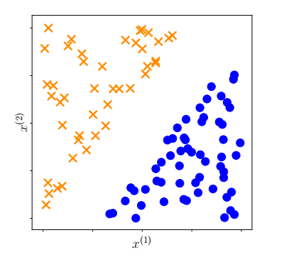

# 第12章 支持向量机分类

在许多情况下，我们希望机器学习算法能够预测多个（离散）结果中的一个。例如，电子邮件客户端将邮件分类为个人邮件和垃圾邮件，这就有两种结果。另一个例子是望远镜识别夜空中的对象是星系、恒星还是行星。通常结果的数量很少，而且更重要的是，这些结果之间通常没有额外的结构。在本章中，我们考虑输出二进制值的预测器，即只有两个可能的结果。这种机器学习任务被称为二分类。这与第9章不同，第9章我们考虑的是具有连续值输出的预测问题。

对于二分类，标签/输出可能取得的值集合是二进制的，在本章中我们用${+1, -1}$来表示它们。换句话说，我们考虑的预测器形式为
$$f:\mathbb{R}^{D}\to\{+1,-1\}\:.$$
(12.1)

回顾第8章，我们将每个示例（数据点）$x_n$表示为一个$D$个实数的特征向量。标签通常分别称为正类和负类。需要注意的是，不要从+1类的正性中推断出直观的属性。例如，在癌症检测任务中，患有癌症的患者通常被标记为+1。原则上，可以使用任何两个不同的值，例如${True,False}$、${0,1}$或${red,blue}$。二分类问题已经被广泛研究，我们将在第12.6节介绍其他方法。

我们介绍了一种称为支持向量机（SVM）的方法，它解决了二分类任务。与回归一样，我们有一个监督学习任务，其中我们有一组示例$x_n\in\mathbb{R}^D$以及它们对应的（二进制）标签$y_n\in{+1,-1}$。给定一个由示例-标签对${(\boldsymbol{x}_1,y_1),\ldots,(\boldsymbol{x}_N,y_N)}$组成的训练数据集，我们希望估计模型参数，以便给出最小的分类错误。与第9章类似，我们考虑一个线性模型，并将非线性隐藏在示例的变换$\phi$中（9.13）。我们将在第12.4节重新讨论$\phi$。

SVM在许多应用中提供了最先进的结果，并具有可靠的理论保证（Steinwart和Christmann，2008）。我们选择使用SVM来说明二分类有两个主要原因。首先，SVM允许我们通过几何方式思考监督机器学习。虽然在第9章中我们从概率模型的角度考虑了机器学习问题，并使用最大似然估计和贝叶斯推断来攻击它，但在这里我们将考虑一种替代方法，即我们对机器学习任务进行几何推理。它大量依赖于我们在第3章中讨论的内积和投影等概念。其次，我们发现SVM具有启发性是因为与第9章不同，SVM的优化问题不允许解析解，因此我们需要求助于第7章中介绍的各种优化工具。

**图12.1例子2D数据，说明了数据的直觉，我们可以找到一个线性分类器，分离橙色交叉和蓝色圆盘。**

SVM对机器学习的看法与第9章的最大似然观点略有不同。最大似然观点基于数据的概率分布模型提出一个模型，并从中推导出优化问题。相比之下，SVM观点则是从基于几何直觉的设计一个特定函数开始，该函数在训练过程中需要被优化。我们在第10章中已经看到了类似的东西，其中我们从几何原理推导出PCA。在SVM的情况下，我们首先从设计一个损失函数开始，该损失函数在训练数据上需要被最小化，遵循经验风险最小化原则（第8.2节）。

让我们推导出与在样本-标签对上训练支持向量机（SVM）相对应的优化问题。直观上，我们想象二分类数据，这些数据可以通过一个超平面进行分离，如图12.1所示。在这里，每个样本$x_n$（一个二维向量）是一个二维位置（由$x_n^{(1)}$和$x_n^{(2)}$组成），而对应的二分类标签$y_n$是两种不同符号之一（橙色叉或蓝色圆）。“超平面”是机器学习中常用的术语，我们在第2.8节已经遇到过超平面。超平面是维度为$D-1$的仿射子空间（如果对应的向量空间维度为$D$）。样本由两类组成（有两个可能的标签），这些样本的特征（表示样本的向量的分量）以这样的方式排列，使得我们可以通过画一条直线来分离/分类它们。

接下来，我们将寻找两个类别之间线性分隔器的想法形式化。我们引入间隔的概念，然后将线性分隔器扩展到允许样本落在“错误”的一侧，从而产生分类错误。我们提出了两种等价的方式来形式化SVM：几何视角（第12.2.4节）和损失函数视角（第12.2.5节）。我们使用拉格朗日乘数法推导出SVM的对偶形式（第7.2节）。对偶SVM使我们能够观察到第三种形式化SVM的方式：即基于每个类别样本的凸包（第12.3.2节）。最后，我们简要介绍了核函数以及如何数值求解非线性核SVM优化问题。

## 12.1 分隔超平面

给定两个以向量形式表示的样本$x_i$和$x_j$，计算它们之间相似度的一种方法是使用内积$\langle x_i,x_j\rangle$。回顾第3.2节，内积与两个向量之间的角度紧密相关。两个向量之间的内积值取决于每个向量的长度（范数）。此外，内积使我们能够严格定义诸如正交性和投影等几何概念。

许多分类算法背后的主要思想是将数据表示为R$^D$中的点，然后对这个空间进行划分，理想情况下是使得具有相同标签的样本（且没有其他样本）位于同一划分中。在二分类的情况下，空间将被分成两部分，分别对应于正类和负类。我们考虑一种特别方便的划分方式，即使用超平面（线性地）将空间分成两半。设样本$x\in\mathbb{R}^D$是数据空间中的一个元素。考虑一个函数
$$
\begin{aligned}
&f:\mathbb{R}^{D}\to\mathbb{R}\\
&x\mapsto f(x):=\langle\boldsymbol{w},\boldsymbol{x}\rangle+b\:,
\end{aligned}
$$
(12.2a) (12.2b)

其中参数为$w\in\mathbb{R}^D$和$b\in\mathbb{R}$。回顾第2.8节，超平面是仿射子空间。因此，我们将二分类问题中分隔两个类别的超平面定义为
$$
\left\{x\in\mathbb{R}^{D}:f(x)=0\right\}\:.
$$
(12.3)

超平面的一个图示如图12.2所示，其中向量$w$是超平面的法向量，$b$是截距。我们可以通过选择超平面上的任意两个样本$x_a$和$x_b$，并证明它们之间的向量与$w$正交，来推导出$w$是超平面(12.3)的法向量。以方程的形式表示，
$$
\begin{aligned}
f(\boldsymbol{x}_{a})-f(\boldsymbol{x}_{b})&=\langle\boldsymbol{w},\boldsymbol{x}_{a}\rangle+b-(\langle\boldsymbol{w},\boldsymbol{x}_{b}\rangle+b)\\
&=\langle\boldsymbol{w},\boldsymbol{x}_{a}-\boldsymbol{x}_{b}\rangle\:,
\end{aligned}
$$

其中第二行是通过内积的线性性质（第3.2节）得到的。由于我们已经选择$x_a$和$x_b$在超平面上，这意味着$f(\boldsymbol{x}_a)=0$和$f(\boldsymbol{x}_b)=0$，因此$\langle\boldsymbol{w},\boldsymbol{x}_a-\boldsymbol{x}_b\rangle=0$。回忆两个向量当且仅当它们的内积为零时正交。因此，我们得到$w$与超平面上的任何向量都正交。

注：回顾第2章，我们知道可以以不同的方式思考向量。在本章中，我们将参数向量$w$视为指示方向的箭头，即我们将$w$视为几何向量。相比之下，我们将样本向量$x$视为数据点（由其坐标指示），即我们认为$x$是相对于标准基向量的向量坐标。

当给出一个测试样本时，我们根据它位于超平面的哪一侧来将其分类为正或负。请注意，(12.3)不仅定义了一个超平面；它还定义了一个方向。换句话说，它定义了超平面的正面和负面。因此，为了对测试样本$x_{\text{test}}$进行分类，我们计算函数$f(x_{\text{test}})$的值，并在$f(\boldsymbol{x}_{\text{test}})\geqslant0$时将其分类为+1，否则分类为-1。从几何角度来看，正样本位于超平面的“上方”，而负样本位于超平面的“下方”。

在训练分类器时，我们希望确保带有正标签的样本位于超平面的正面，即

(12.5)
$$\langle\boldsymbol{w},\boldsymbol{x}_n\rangle+b\geqslant0\quad\text{当}\quad y_n=+1$$

并且带有负标签的样本位于超平面的负面，即

(12.6)
$$\langle\boldsymbol{w},\boldsymbol{x}_n\rangle+b<0\quad\text{当}\quad y_n=-1\:.$$

参考图12.2，可以获得正负样本的几何直观理解。这两个条件通常可以合并为一个方程

(12.7)
$$y_n(\langle\boldsymbol{w},\boldsymbol{x}_n\rangle+b)\geqslant0\:.$$

当我们分别在(12.5)和(12.6)的两边乘以$y_n=1$和$y_n=-1$时，方程(12.7)与(12.5)和(12.6)是等价的。

图12.2 分隔超平面(12.3)的方程（a）3D中方程的标准表示方式（b）为了便于绘制，我们从侧面查看超平面。

## 12.2 初级支持向量机

基于点到超平面的距离概念，我们现在可以讨论支持向量机了。对于一个线性可分的数据集$\{(\boldsymbol{x}_1,y_1),\ldots,(\boldsymbol{x}_N,y_N)\}$，我们有无数个候选超平面（参考图12.3），因此也有无数个分类器，它们可以在没有任何（训练）错误的情况下解决我们的分类问题。为了找到一个唯一解，一个想法是选择分隔超平面，该超平面最大化正例和反例之间的间隔。换句话说，我们希望正例和反例被一个较大的间隔分开（第12.2.1节）。接下来，我们计算一个样本与超平面之间的距离，以推导出这个间隔。回想一下，给定点（样本$x_n$）到超平面上最近点的距离是通过正交投影获得的（第3.8节）。

### 12.2.1 间隔的概念

间隔的概念直观上很简单：在假设数据集是线性可分的情况下，它是分隔超平面到数据集中最近样本的距离。然而，在尝试将这个距离形式化时，可能会遇到一个技术上的难题。这个技术难题在于我们需要定义一个测量距离的尺度。一个潜在的尺度是考虑数据的尺度，即$x_n$的原始值。但这存在问题，因为我们可以改变$x_n$的测量单位，从而改变$x_n$中的值，进而改变到超平面的距离。正如我们稍后将看到的，我们将基于超平面方程(12.3)本身来定义这个尺度。

考虑一个超平面$\langle w,x\rangle+b$和一个样本$x_\alpha$，如图12.4所示。不失一般性，我们可以考虑样本$x_{\alpha}$位于超平面的正面，即$\langle w,x_a\rangle+b>0$。我们想要计算$x_a$到超平面的距离$r>0$。我们通过考虑$x_a$到超平面的正交投影（第3.8节）来实现这一点，我们将其表示为$x_a^{\prime}$。由于$w$与超平面正交，我们知道距离$r$只是这个向量$w$的一个缩放。如果知道$w$的长度，那么我们可以使用这个缩放因子$r$来计算$x_\alpha$和$x_\alpha^{\prime}$之间的绝对距离。为了方便起见，我们选择使用单位长度的向量（其范数为1），并通过将$w$除以其范数$\frac{w}{\|w\|}$来获得。使用向量加法（第2.4节），我们得到

(12.8)
$$x_{a}=x_{a}^{\prime}+r\frac{w}{\|w\|}\:.$$

**图12.2分离超平面方程（12.3）。(a)用三维方法表示该方程的标准方法。(b)为了便于绘制，我们将查看超平面边缘。**

另一种思考$r$的方式是，它是$x_{\alpha}$在由$w/\|w\|$跨越的子空间中的坐标。现在我们已经将$x_{\alpha}$到超平面的距离表示为$r$，如果我们选择$x_\alpha$为最接近超平面的点，那么这个距离$r$就是间隔。

回想一下，我们希望正样本距离超平面超过$r$，负样本距离超平面（在负方向上）超过距离$r$。类似于将(12.5)和(12.6)组合成(12.7)，我们将这个目标表述为

(12.9)
$$y_n(\langle\boldsymbol{w},\boldsymbol{x}_n\rangle+b)\geqslant r\:.$$

换句话说，我们将样本至少距离超平面$r$（在正方向和负方向上）的要求合并为一个不等式。由于我们只关心方向，我们在模型中增加了一个假设，即参数向量$w$的单位长度为1，即$\|\boldsymbol w\|=1$，其中我们使用欧几里得范数$\|w\|=\sqrt{w^\top w}$（第3.1节）。这个假设也使得对距离$r$（12.8）的解释更加直观，因为它是长度为1的向量的缩放因子。

备注。熟悉其他间隔表示法的读者会注意到，如果支持向量机（SVM）是由Schölkopf和Smola（2002）等人提供的，那么我们对$\|w\|=1$的定义与标准表示法不同。在第12.2.3节中，我们将展示这两种方法的等价性。

**图12.4表示到超平面距离的向量加法： xa = x 0a + r k w wk**

将这三个要求合并为一个带约束的优化问题，我们得到目标函数

(12.10)
$$\begin{aligned}\max_{\boldsymbol{w},b,r}&\underbrace{r}_{\text{margin}}\\\text{subject to}&\underbrace{y_{n}(\langle\boldsymbol{w},\boldsymbol{x}_{n}\rangle+b)\geqslant r}_{\text{数据拟合}}\:,\underbrace{\|\boldsymbol{w}\|=1}_{\text{归一化}}\:,\quad r>0\:,\end{aligned}$$

**图12.5边际的推导： r = 1 k周。**

这表示我们想要最大化间隔$r$，同时确保数据位于超平面的正确一侧。

备注。间隔的概念在机器学习中非常普遍。Vladimir Vapnik和Alexey Chervonenkis使用这个概念来表明，当间隔较大时，函数类的“复杂性”较低，因此学习是可能的（Vapnik，2000）。事实证明，这个概念对于从理论上分析泛化误差的各种不同方法非常有用（Steinwart和Christmann，2008；Shalev-Shwartz和Ben-David，2014）。

**图12.3可能的分离的超平面。有许多线性分类器（绿色的线）将橙色的交叉和蓝色的圆盘分开。**

### 12.2.2 间隔的传统推导

在上一节中，我们通过观察到我们只关心$w$的方向而不是其长度，从而得出了（12.10），并假设了$\|w\|=1$。在本节中，我们将通过不同的假设来推导间隔最大化问题。我们不是选择参数向量进行归一化，而是选择数据的比例尺。我们选择这个比例尺，使得预测器$\langle\boldsymbol w,\boldsymbol x\rangle+b$在最接近的样本上的值为1。我们还将数据集中最接近超平面的样本表示为$x_a$。

图12.5与图12.4相同，但现在我们重新调整了坐标轴的比例，使得样本$x_a$正好位于间隔上，即$\langle w,x_a\rangle+b=1$。由于$x_a^\prime$是$x_a$在超平面上的正交投影，根据定义，它必须位于超平面上，即

(12.11)
$$\langle\boldsymbol{w},\boldsymbol{x}_a^{\prime}\rangle+b=0\:.$$

将（12.8）代入（12.11），我们得到

(12.12)
$$\left\langle\boldsymbol{w},\boldsymbol{x}_a-r\frac{\boldsymbol{w}}{\|\boldsymbol{w}\|}\right\rangle+b=0\:.$$

利用内积的双线性性质（见第3.2节），我们得到

$$\langle\boldsymbol{w},\boldsymbol{x}_a\rangle+b-r\frac{\langle\boldsymbol{w},\boldsymbol{w}\rangle}{\|\boldsymbol{w}\|}=0\:.$$

(12.13)

根据我们设定的比例尺，第一项为1，即$\langle w,x_a\rangle+b=1$。从第3.1节的（3.16）中，我们知道$\langle w,w\rangle=\|\boldsymbol{w}\|^2$。因此，第二项简化为$r\|w\|$。使用这些简化，我们得到

(12.14)
$$r=\frac{1}{\|\boldsymbol w\|}\:.$$

这意味着我们根据超平面的法向量$w$推导出了距离$r$。乍一看，这个方程似乎有些反直觉，因为我们似乎是用向量$w$的长度来表示了到超平面的距离，但我们还不知道这个向量。一种思考方式是将距离$r$视为一个临时变量，我们仅在此推导中使用它。因此，在本节的其余部分，我们将到超平面的距离表示为$\frac1{\|w\|}$。在第12.2.3节中，我们将看到选择间隔等于1与我们在第12.2.1节中的假设$\|\boldsymbol w\|=1$是等价的。

类似于获得（12.9）的论证，我们希望正样本和负样本都至少距离超平面1个单位，这产生了条件

(12.15)
$$y_n(\langle\boldsymbol{w},x_n\rangle+b)\geqslant1\:.$$

将间隔最大化与样本需要根据其标签位于超平面的正确一侧这一事实相结合，我们得到

(12.16)
$$\begin{aligned}&\max_{\boldsymbol{w},b}\quad\frac{1}{\|\boldsymbol{w}\|}\\&\mathrm{subject~to~}y_{n}(\langle\boldsymbol{w},\boldsymbol{x}_{n}\rangle+b)\geqslant1\quad\mathrm{for~all}\quad n=1,\ldots,N.\end{aligned}$$

(12.17)

而不是像（12.16）那样最大化范数的倒数，我们通常最小化范数的平方。我们还经常包含一个常数$\frac12$，它不会影响最优的$w,b$，但在我们计算梯度时会得到一个更整洁的形式。然后，我们的目标变为

(12.18)
$$\min_{\boldsymbol{w},b}\quad\frac12\|\boldsymbol{w}\|^2$$

受约束于 $y_n( \langle \boldsymbol{w}, \boldsymbol{x}_n\rangle + b) \geqslant 1$ 对所有 $n= 1, \ldots , N$ 成立。 (12.19)

方程（12.18）被称为硬间隔SVM。“硬”这个表达的原因是因为该公式不允许间隔条件有任何违反。我们将在第12.2.4节中看到，如果数据不是线性可分的，这个“硬”条件可以放宽以容纳违反情况。

### 12.2.3 为什么我们可以将间隔设置为1

在12.2.1节中，我们论证了希望最大化某个值$r$，它代表最接近超平面的样本点的距离。在12.2.2节中，我们对数据进行了缩放，使得最接近超平面的样本点到超平面的距离为1。在本节中，我们将这两个推导联系起来，并证明它们是等价的。

定理12.1. 最大化间隔$r$，其中我们考虑如(12.10)所示的规范化权重，

$$\begin{aligned}
&\max_{\boldsymbol{w},b,r}\underbrace{r}_{间隔}\\
&\text{约束条件}\quad\underbrace{y_{n}(\langle\boldsymbol{w},\boldsymbol{x}_{n}\rangle+b)\geqslant r}_{数据拟合},\quad\underbrace{\|\boldsymbol{w}\|=1}_{规范化},\quad r>0
\end{aligned}$$
(12.20)

这等价于对数据进行缩放，使得间隔为1：

(12.21)
$$\min_{\boldsymbol{w},b}\quad\underbrace{\frac{1}{2}\left\|\boldsymbol{w}\right\|^{2}}_{间隔}\\
\text{约束条件}\quad\underbrace{y_{n}(\langle\boldsymbol{w},\boldsymbol{x}_{n}\rangle+b)\geqslant1}_{数据拟合}\:.$$

证明：考虑(12.20)。由于平方是对于非负参数的严格单调变换，如果我们在目标函数中考虑$r^2$，则最大值保持不变。由于$\|w\|=1$，我们可以使用新的权重向量$w^{\prime}$（不显式地进行规范化）来重新参数化方程，即使用$\frac{w^{\prime}}{\|w^{\prime}\|}$。我们得到

(12.22)
$$\begin{aligned}
\max_{\boldsymbol{w}^{\prime},b,r}&r^{2}\\
\text{约束条件}&y_{n}\left(\left\langle\frac{\boldsymbol{w}^{\prime}}{\|\boldsymbol{w}^{\prime}\|},\boldsymbol{x}_{n}\right\rangle+b\right)\geqslant r,\quad r>0
\end{aligned}$$

**图12.6 (a)线性可分数据和(b)非线性可分数据。**

方程(12.22)明确指出距离$r$是正数。因此，我们可以将第一个约束条件除以$r$，得到

(12.23)
$$\begin{aligned}
&\max_{\boldsymbol{w}^{\prime},b,r}\quad r^{2}\\
&\text{约束条件}\quad y_{n}\left(\underbrace{\left\langle\frac{\boldsymbol{w}^{\prime}}{\left\|\boldsymbol{w}^{\prime}\right\|r},\boldsymbol{x}_{n}\right\rangle+\underbrace{\frac{b}{r}}_{\boldsymbol{w}^{\prime\prime}}}_{\boldsymbol{w}^{\prime\prime}}\right)\geqslant1,\quad r>0
\end{aligned}$$

将参数重命名为$w^{\prime\prime}$和$b^{\prime\prime}$。由于$w^{\prime\prime}=\frac{w^{\prime}}{\|w^{\prime}\|_r}$，重新排列得到

$$\|\boldsymbol w''\|=\left\|\frac{\boldsymbol w'}{\|\boldsymbol w''\|\:r}\right\|=\frac{1}{r}\cdot\left\|\frac{\boldsymbol w'}{\|\boldsymbol w'\|}\right\|=\frac{1}{r}\:.$$
(12.24)

将这个结果代入(12.23)，我们得到

$$\begin{aligned}
\max_{\boldsymbol{w}^{\prime\prime},b^{\prime\prime}}&\frac{1}{\left\|\boldsymbol{w}^{\prime\prime}\right\|^{2}}\\
\text{约束条件}&y_{n}\left(\left\langle\boldsymbol{w}^{\prime\prime},\boldsymbol{x}_{n}\right\rangle+b^{\prime\prime}\right)\geqslant1
\end{aligned}$$
(12.25)

最后一步是观察到，最大化$\frac1{\|w^{\prime\prime}\|^2}$与最小化$\frac12\|w^{\prime\prime}\|^2$得到相同的解，这完成了定理12.1的证明。

### 12.2.4 软间隔支持向量机：几何视角

当数据不是线性可分的情况下，我们可能希望允许一些样本落在间隔区域内，甚至落在超平面的错误一侧，如图12.6所示。允许一定分类错误的模型被称为软间隔支持向量机（soft margin SVM）。在本节中，我们将使用几何论证来推导出相应的优化问题。在12.2.5节中，我们将使用损失函数的思想推导出等价的优化问题。利用拉格朗日乘子（第7.2节），我们将在12.3节中推导出SVM的对偶优化问题。这个对偶优化问题使我们能够观察到SVM的第三种解释：作为平分正样本和负样本凸包之间连线的超平面（12.3.2节）。

关键的几何思想是引入一个松弛变量$\xi_n$，对应于每个样本-标签对$(x_n,y_n)$，允许特定样本位于间隔内甚至超平面的错误一侧（参考图12.7）。我们从间隔中减去$\xi_n$的值，并约束$\xi_n$为非负。为了鼓励样本的正确分类，我们将$\xi_n$添加到目标函数中：

$$
\begin{aligned}
\min_{\boldsymbol{w},b,\boldsymbol{\xi}}&\frac{1}{2}\|\boldsymbol{w}\|^{2}+C\sum_{n=1}^{N}\xi_{n}\\
\text{subject to }&y_{n}(\langle\boldsymbol{w},\boldsymbol{x}_{n}\rangle+b)\geqslant1-\xi_{n}\\
&\xi_{n}\geqslant0
\end{aligned}
$$

(12.26a) (12.26b) (12.26c)

**图12.7软边缘SVM允许示例在超平面的边缘内或在错误的一侧。当x+在错误的一侧时，松弛变量ξ测量一个正的例子x+到正的边缘超平面h w，xi + b = 1的距离。**

对于$n=1,\ldots,N$。与硬间隔SVM的优化问题（12.18）相比，这被称为软间隔SVM。参数$C>0$用于权衡间隔大小和总松弛量。这个参数被称为正则化参数，因为正如我们将在下一节看到的那样，目标函数（12.26a）中的间隔项是一个正则化项。间隔项$\|w\|^2$被称为正则化器，在许多数值优化书籍中，正则化参数会乘以这个项（第8.2.3节）。这与我们在本节中的表述不同。在这里，$C$的较大值意味着较低的正则化，因为我们给松弛变量更大的权重，因此更优先考虑不在间隔正确一侧的样本。

**备注**：在软间隔SVM的表述（12.26a）中，$\boldsymbol{w}$被正则化，但$b$没有被正则化。我们可以通过观察正则化项不包含$b$来看到这一点。未正则化的项$b$使理论分析复杂化（Steinwart和Christmann，2008，第1章），并降低了计算效率（Fan等，2008）。

### 12.2.5 软间隔支持向量机：损失函数视角

让我们考虑一种不同的方法来推导支持向量机（SVM），遵循经验风险最小化原则（第8.2节）。对于SVM，我们选择超平面作为假设类，即

(12.27)
$$f(x)=\langle\boldsymbol{w},\boldsymbol{x}\rangle+b.$$

我们将在本节中看到，间隔对应于正则化项。剩下的问题是，损失函数是什么？与第9章考虑回归问题（预测器的输出是实数）不同，本章我们考虑二分类问题（预测器的输出是两个标签之一$\{+1, -1\}$）。因此，每个样本-标签对的误差/损失函数需要适用于二分类。例如，用于回归的平方损失（9.10b）不适用于二分类。

**备注**：二进制标签之间的理想损失函数是计算预测与标签之间不匹配的数量。这意味着对于应用于样本$x_n$的预测器$f$，我们将输出$f(x_n)$与标签$y_n$进行比较。如果它们匹配，我们定义损失为零；如果不匹配，则损失为一。这表示为$1_{(f(x_n)\neq y_n)}$，并称为零一损失。不幸的是，零一损失导致了一个组合优化问题，用于寻找最佳参数$w,b$。组合优化问题（与第7章中讨论的连续优化问题相比）通常更难解决。

$\diamondsuit$

SVM对应的损失函数是什么？考虑预测器$f(x_n)$的输出与标签$y_n$之间的误差。损失描述了训练数据上的误差。推导（12.26a）的等效方法是使用合页损失（hinge loss）

$$\ell(t)=\max\{0,1-t\}\quad\text{其中}\quad t=yf(\boldsymbol{x})=y(\langle\boldsymbol{w},\boldsymbol{x}\rangle+b)\:.$$
(12.28)

如果$f(\boldsymbol x)$位于超平面的正确一侧（基于相应的标签$y$），并且距离大于1，这意味着$t\geqslant1$，并且合页损失返回零。如果$f(x)$位于正确一侧但太接近超平面（$0<t<1$），则样本$x$位于间隔内，并且合页损失返回一个正值。当样本位于超平面的错误一侧（$t<0$）时，合页损失返回一个更大的值，该值线性增加。换句话说，一旦我们比间隔更接近超平面，即使预测是正确的，我们也会受到惩罚，并且该惩罚线性增加。合页损失的另一种表示方法是将其视为两个线性部分

$$\ell(t)=\begin{cases}0&\text{if}\quad t\geqslant1\\1-t&\text{if}\quad t<1\end{cases},$$
(12.29)

如图12.8所示。硬间隔对应的损失定义为

$$\ell(t)=\begin{cases}0&\text{if}\quad t\geqslant1\\\infty&\text{if}\quad t<1\end{cases}.$$
(12.30)

这种损失可以理解为绝不允许任何样本位于间隔内部。

对于给定的训练集$\{(x_1,y_1),\ldots,(x_N,y_N)\}$，我们寻求最小化总损失，同时使用$\ell_2$正则化（见第8.2.3节）对目标进行正则化。使用合页损失（12.28），我们得到了无约束优化问题

(12.31)
$$\min_{\boldsymbol{w},b}\quad\underbrace{\frac{1}{2}\|\boldsymbol{w}\|^2}_{\text{正则化项}}+\underbrace{C\sum_{n=1}^N\max\{0,1-y_n(\langle\boldsymbol{w},\boldsymbol{x}_n\rangle+b)\}}_{\text{误差项}}\:.$$

(12.31)中的第一项称为正则化项或正则器（见第8.2.3节），第二项称为损失项或误差项。回想第12.2.4节，$\frac12\left\|w\right\|^{2}$这一项直接来源于间隔。换句话说，最大化间隔可以解释为正则化。

**图12.8铰链损耗是零1损耗的凸上界。**

原则上，(12.31)中的无约束优化问题可以直接用第7.1节中描述的（子）梯度下降法求解。为了看到(12.31)和(12.26a)是等价的，请注意合页损失（12.28）本质上由两部分线性函数组成，如(12.29)所示。考虑单个样本-标签对的合页损失（12.28）。我们可以等价地将$t$上的合页损失最小化替换为带有两个约束的松弛变量$\xi$的最小化。以方程形式表示，

(12.32)
$$\min\limits_{t}\max\{0,1-t\}$$

等价于

$$\begin{array}{rl}\min\limits_{\xi,t}&\xi\\\text{subject to}&\xi\geqslant0\:,\quad\xi\geqslant1-t\:.\end{array}$$
(12.33)

将此表达式代入(12.31)并重新排列其中一个约束，我们正好得到软间隔SVM（12.26a）。

**备注**：让我们将本节中选择的损失函数与第9章中线性回归的损失函数进行对比。回想第9.2.1节，为了找到最大似然估计量，我们通常最小化负对数似然。此外，由于带有高斯噪声的线性回归的似然项是高斯分布，因此每个样本的负对数似然是一个平方误差函数。平方误差函数是在寻找最大似然解时最小化的“损失函数”。

## 12.3 对偶支持向量机

前面几节中对支持向量机（SVM）的描述，涉及变量$w$和$b$，这被称为原始SVM。回想一下，我们考虑的输入$x\in\mathbb{R}^D$具有$D$个特征。由于$w$与$x$具有相同的维度，这意味着优化问题的参数数量（即$w$的维度）随特征数量的增加而线性增长。

接下来，我们考虑一个等效的优化问题（即所谓的对偶视图），它与特征数量无关。相反，参数的数量随训练集中样本数量的增加而增加。我们在第10章中看到过类似的想法，即以一种不随特征数量变化的方式来表达学习问题。这对于特征数量多于训练数据集中样本数量的问题非常有用。对偶SVM还具有另一个优点，即它很容易应用核函数，我们将在本章末尾看到这一点。在数学文献中，“对偶”一词经常出现，在这个特定情况下，它指的是凸对偶性。以下小节基本上是对我们在第7.2节中讨论的凸对偶性的应用。

### 12.3.1 通过拉格朗日乘数法实现的凸对偶性

回顾原始软间隔SVM（12.26a）。我们将与原始SVM相对应的变量$w,b$和$\xi$称为原始变量。我们使用$\alpha_n \geq 0$作为与约束（12.26b）相对应的拉格朗日乘数，该约束要求样本被正确分类；使用$\gamma_n \geq 0$作为与松弛变量的非负性约束相对应的拉格朗日乘数；参见（12.26c）。然后，拉格朗日函数由下式给出：

通过对拉格朗日函数（12.34）分别关于三个原始变量$w,b$和$\xi$求导，我们得到：

(12.35)
$$
\begin{aligned}
&\frac{\partial\mathcal{L}}{\partial\boldsymbol{w}}=\boldsymbol{w}^{\top}-\sum_{n=1}^{N}\alpha_{n}y_{n}\boldsymbol{x}_{n}^{\top}\:,\\
&\frac{\partial\mathcal{L}}{\partial b}=-\sum_{n=1}^{N}\alpha_{n}y_{n}\:,\\
&\frac{\partial\mathcal{L}}{\partial\xi_{n}}=C-\alpha_{n}-\gamma_{n}\:.
\end{aligned}
$$

我们现在通过将每个偏导数设置为零来找到拉格朗日函数的最大值。通过将（12.35）设置为零，我们发现：

(12.38)
$$
\boldsymbol{w}=\sum_{n=1}^N\alpha_ny_n\boldsymbol{x}_n\:,
$$
这是表示定理（Kimeldorf和Wahba，1970）的一个特例。方程（12.38）表明，原始问题中的最优权重向量是样本$x_n$的线性组合。回想第2.6.1节的内容，这意味着优化问题的解位于训练数据的张成空间中。此外，通过将（12.36）设置为零得到的约束意味着最优权重向量是样本的仿射组合。表示定理对于正则化经验风险最小化的非常一般设置都是成立的（Hofmann等人，2008；Argyriou和Dinuzzo，2014）。该定理有更一般的形式（Schölkopf等人，2001），并且可以在Yu等人（2013）中找到其存在性的必要和充分条件。

备注。表示定理（12.38）还解释了“支持向量机”这个名字的由来。对于对应的参数$\alpha_n=0$的样本$x_n$，它们对解$w$没有任何贡献。而其他$\alpha_n>0$的样本被称为支持向量，因为它们“支撑”超平面。

通过将$w$的表达式代入拉格朗日函数（12.34），我们得到对偶函数

$$\begin{aligned}\mathfrak{D}(\xi,\alpha,\gamma)&=\frac{1}{2}\sum_{i=1}^{N}\sum_{j=1}^{N}y_{i}y_{j}\alpha_{i}\alpha_{j}\left\langle\boldsymbol{x}_{i},\boldsymbol{x}_{j}\right\rangle-\sum_{i=1}^{N}y_{i}\alpha_{i}\left\langle\sum_{j=1}^{N}y_{j}\alpha_{j}\boldsymbol{x}_{j},\boldsymbol{x}_{i}\right\rangle\\&+C\sum_{i=1}^{N}\xi_{i}-b\sum_{i=1}^{N}y_{i}\alpha_{i}+\sum_{i=1}^{N}\alpha_{i}-\sum_{i=1}^{N}\alpha_{i}\xi_{i}-\sum_{i=1}^{N}\gamma_{i}\xi_{i}\:.\end{aligned}$$

注意，此时已经不再包含原始变量$w$的任何项。通过将（12.36）设置为零，我们得到$\sum _{n= 1}^{N}y_{n}\alpha _{n}= 0$。因此，包含$b$的项也消失了。回想一下，内积是对称且双线性的（参见第3.2节）。因此，（12.39）中的前两项是针对相同对象的。这些项（用蓝色标记）可以简化，我们得到拉格朗日函数

$$\mathfrak{D}(\xi,\alpha,\gamma)=-\frac{1}{2}\sum_{i=1}^{N}\sum_{j=1}^{N}y_{i}y_{j}\alpha_{i}\alpha_{j}\left\langle\boldsymbol{x}_{i},\boldsymbol{x}_{j}\right\rangle+\sum_{i=1}^{N}\alpha_{i}+\sum_{i=1}^{N}(C-\alpha_{i}-\gamma_{i})\xi_{i}\:.$$

该方程中的最后一项是所有包含松弛变量$\xi_i$的项的集合。通过将（12.37）设置为零，我们可以看到（12.40）中的最后一项也为零。此外，通过使用相同的方程并回忆拉格朗日乘数$\gamma_i$是非负的，我们得出$\alpha_i\leqslant C$。现在，我们得到了SVM的对偶优化问题，它完全用拉格朗日乘数$\alpha_i$表示。从拉格朗日对偶性（定义7.1）中我们知道，我们需要最大化对偶问题。这等价于最小化负对偶问题，从而我们得到对偶SVM

$$\begin{aligned}&\operatorname*{min}_{\alpha}\quad\frac{1}{2}\sum_{i=1}^{N}\sum_{j=1}^{N}y_{i}y_{j}\alpha_{i}\alpha_{j}\left\langle\boldsymbol{x}_{i},\boldsymbol{x}_{j}\right\rangle-\sum_{i=1}^{N}\alpha_{i}\\&\mathrm{subject~to}\quad\sum_{i=1}^{N}y_{i}\alpha_{i}=0\\&0\leqslant\alpha_{i}\leqslant C\quad\mathrm{for~all}\quad i=1,\ldots,N\:.\end{aligned}$$

(12.41)

（12.41）中的等式约束是通过将（12.36）设置为零得到的。不等式约束$\alpha_i\geqslant0$是对不等式约束的拉格朗日乘数施加的条件（第7.2节）。不等式约束$\alpha_i\leqslant C$在前面的段落中已讨论。

SVM中的不等式约束集被称为“盒约束”，因为它们将拉格朗日乘数的向量$\alpha=[\alpha_1,\cdots,\alpha_N]^{\top}\in\mathbb{R}^{N}$限制在每个轴上由0和$C$定义的盒子内。这些轴对齐的盒子在数值求解器中实现时特别高效（Dostál，2009，第5章）。

一旦我们获得了对偶参数$\alpha$，我们就可以使用表示定理（12.38）来恢复原始参数$w$。让我们将最优原始参数称为$w^*$。但是，如何获得参数$b^*$仍然是一个问题。考虑一个正好位于边界上的样本$x_n$，即$\langle w^*,x_n\rangle+b=y_n$。回想一下，$y_n$要么是+1，要么是-1。因此，唯一未知的是$b$，它可以通过 http://fouryears.eu/2012/06/07/the-svm-bias-term-conspiracy/.访问。

**图12.9凸包。(a)凸包的点，其中一些位于边界内；凸出正例子和负例子的(b)凸壳。**

### 12.3.2 双SVM：凸包视图

获得双SVM的另一种方法是考虑另一种几何论证。考虑具有相同标签的示例集$x_n$。我们希望构建一个包含所有示例的凸集，并且这个凸集尽可能小。这被称为凸包，如图12.9所示。

首先，让我们对点的凸组合有一些直观的理解。考虑两个点$x_1$和$x_2$以及对应的非负权重$\alpha_1,\alpha_2\geqslant0$，使得$\alpha_1+\alpha_2=1$。方程$\alpha_1x_1+\alpha_2x_2$描述了$x_1$和$x_2$之间直线上的每个点。考虑当我们添加第三个点$x_3$以及一个权重$\alpha_3\geqslant0$，使得$\sum_{n=1}^{3}\alpha_n=1$时发生的情况。这三个点$x_1,x_2,x_3$的凸组合跨越了一个二维区域。这个区域的凸包是由每对点对应的边所形成的三角形。随着我们添加更多的点，并且点的数量大于维度数时，一些点将位于凸包内部，如图12.9(a)所示。

一般来说，构建凸包可以通过为每个示例$x_n$引入非负权重$\alpha_n\geqslant0$来完成。然后，凸包可以描述为集合

$$\mathrm{conv}\left(\boldsymbol{X}\right)=\left\{\sum\limits_{n=1}^{N}\alpha_{n}\boldsymbol{x}_{n}\right\}\quad\mathrm{with}\quad\sum\limits_{n=1}^{N}\alpha_{n}=1\quad\mathrm{and}\quad\alpha_{n}\geqslant0,$$

对于所有$n=1,\ldots,N$。如果对应于正类和负类的两个点云是分开的，则它们的凸包不会重叠。给定训练数据$(x_1,y_1),\ldots,(\boldsymbol{x}_N,y_N)$，我们形成两个凸包，分别对应于正类和负类。我们选择一个点$c$，它位于正例集合的凸包内，并且最接近负类分布。类似地，我们在负例集合的凸包中选择一个点$d$，它最接近正类分布；如图12.9(b)所示。我们定义$d$和$c$之间的差向量为

(12.44)
$$w:=c-d\:.$$

选择$c$和$d$点如前面所述，并要求它们彼此最接近，这相当于最小化$w$的长度/范数，因此我们得到了相应的优化问题

$$\arg\min_{\boldsymbol{w}}\left\|\boldsymbol{w}\right\|=\arg\min_{\boldsymbol{w}}\frac{1}{2}\left\|\boldsymbol{w}\right\|^{2}\:.$$
(12.45)

由于$c$必须在正凸包内，因此它可以表示为正例的凸组合，即对于非负系数$\alpha_n^+$

(12.46)
$$c=\sum_{n:y_n=+1}\alpha_n^+\boldsymbol{x}_n\:.$$

在(12.46)中，我们使用符号$n:y_n=+1$来表示$y_n=+1$的索引集$n$。类似地，对于具有负标签的示例，我们得到

(12.47)
$$d=\sum_{n:y_n=-1}\alpha_n^-\boldsymbol{x}_n\:.$$

通过将(12.44)、(12.46)和(12.47)代入(12.45)，我们得到目标函数

$$\min_{\alpha}\frac{1}{2}\left\|\sum_{n:y_n=+1}\alpha_n^+\boldsymbol{x}_n-\sum_{n:y_n=-1}\alpha_n^-\boldsymbol{x}_n\right\|^2\:.$$
(12.48)

设 $\alpha$ 为所有系数的集合，即 $\alpha^+$ 和 $\alpha^-$ 的连接。回顾一下，我们要求每个凸包的系数之和为1，即
$$\sum_{n:y_n=+1}\alpha_n^+=1\quad\text{和}\quad\sum_{n:y_n=-1}\alpha_n^-=1\:.$$
(12.49)

这意味着存在约束
$$\sum_{n=1}^Ny_n\alpha_n=0\:.$$
(12.50)

这个结果可以通过分别乘以每个类别的系数来观察：

(12.51a)
$$\sum_{n=1}^{N}y_{n}\alpha_{n}=\sum_{n:y_{n}=+1}(+1)\alpha_{n}^{+}+\sum_{n:y_{n}=-1}(-1)\alpha_{n}^{-}\\=\sum_{n:y_{n}=+1}\alpha_{n}^{+}-\sum_{n:y_{n}=-1}\alpha_{n}^{-}=1-1=0\:.$$
(12.51b)

目标函数（12.48）和约束（12.50），以及假设 $\alpha\geqslant0$，共同构成了一个带约束的（凸）优化问题。可以证明，这个优化问题与对偶硬间隔SVM（Bennett 和 Bredensteiner, 2000a）的优化问题是相同的。

$备注$：为了获得软间隔对偶，我们考虑缩减的凸包。缩减的凸包与凸包类似，但系数的大小有一个上限。$\alpha$ 中元素的最大可能值限制了凸包可以取的大小。换句话说，对 $\alpha$ 的限制将凸包缩小到了一个更小的体积（Bennett 和 Bredensteiner, 2000b）。

## 12.4 核函数

考虑对偶SVM的公式（12.41）。注意到目标函数中的内积仅发生在样本$x_i$和$x_j$之间，而没有样本与参数之间的内积。因此，如果我们考虑一组特征$\phi(x_i)$来表示$x_i$，对偶SVM中唯一的变化将是替换内积。这种模块化特性允许我们分别考虑分类方法（SVM）和特征表示$\phi(x)$的选择，从而为我们独立探索这两个问题提供了灵活性。在本节中，我们将讨论表示$\phi(x)$并简要介绍核函数的概念，但不涉及技术细节。

由于$\phi(x)$可能是非线性函数，我们可以使用SVM（它假设了一个线性分类器）来构造在样本$x_n$上非线性的分类器。除了软间隔之外，这为用户处理非线性可分的数据集提供了第二条途径。事实证明，在对偶SVM中我们观察到的这种特性（即仅存在样本之间的内积）在许多算法和统计方法中都存在。我们不需要显式地定义一个非线性特征映射$\phi(\cdot)$并计算样本$x_i$和$x_j$之间的内积，而是可以定义一个相似度函数$k(x_i,x_j)$来表示$x_i$和$x_j$之间的关系。对于一类特定的相似度函数，称为核函数，这个相似度函数隐式地定义了一个非线性特征映射$\phi(\cdot)$。核函数根据定义是函数$k:\mathcal{X}\times\mathcal{X}\to\mathbb{R}$，其中存在一个希尔伯特空间$\mathcal{H}$和一个特征映射$\phi:\mathcal{X}\to\mathcal{H}$，使得
$$k(\boldsymbol{x}_i,\boldsymbol{x}_j)=\langle\boldsymbol{\phi}(\boldsymbol{x}_i),\boldsymbol{\phi}(\boldsymbol{x}_j)\rangle_{\mathcal{H}}\:.$$
(12.52)

与每个核函数$k$相关联的，都有一个唯一的再生核希尔伯特空间（Aronszajn, 1950; Berlinet 和 Thomas-Agnan, 2004）。在这种独特的关联中，$\phi(\boldsymbol{x})=k(\cdot,\boldsymbol{x})$被称为规范特征映射。从内积到核函数的推广（12.52）被称为核技巧（Schölkopf 和 Smola, 2002; Shawe-Taylor 和 Cristianini, 2004），因为它隐藏了显式的非线性特征映射。

由数据集上的内积或应用$k(\cdot,\cdot)$得到的矩阵$K\in\mathbb{R}^{N\times N}$被称为Gram矩阵，通常简称为核矩阵。核函数必须是对称和正半定函数，以确保每个核矩阵$K$都是对称和正半定的（第3.2.3节）：
$$\forall z\in\mathbb{R}^{N}:z^{\top}Kz\geqslant0\:.$$
(12.53)

**图12.10使用不同内核的SVM。注意，虽然决策边界是非线性的，但要解决的潜在问题是一个线性分离超平面（尽管有一个非线性核）。**

对于多变量实值数据$x_i\in\mathbb{R}^D$，一些流行的核函数示例包括多项式核、高斯径向基函数核和有理二次核（Schölkopf 和 Smola, 2002; Rasmussen 和 Williams, 2006）。图12.10展示了不同核函数在示例数据集上对超平面分隔效果的影响。请注意，我们仍然是在求解超平面，即函数假设类仍然是线性的。非线性曲面是由核函数引起的。

备注。对于初学者来说，不幸的是，“核”（kernel）这个词有多种含义。在本章中，“核”一词来源于再生核希尔伯特空间（RKHS）的概念（Aronszajn, 1950; Saitoh, 1988）。我们在线性代数中已经讨论过“核”的概念（第2.7.3节），在那里，“核”是零空间的另一种说法。在机器学习中，“核”一词的第三个常见用途是核密度估计中的平滑核（第11.5节）。

由于显式表示$\phi(x)$在数学上与核表示$k(x_i,x_j)$等价，因此从业者通常会设计核函数，使其计算效率高于显式特征映射之间的内积。例如，考虑多项式核（Schölkopf 和 Smola, 2002），当输入维度较大时，显式展开中的项数会迅速增长（即使是低次多项式）。核函数每输入一个维度只需进行一次乘法运算，这可以显著节省计算量。另一个例子是高斯径向基函数核（Schölkopf 和 Smola, 2002; Rasmussen 和 Williams, 2006），其对应的特征空间是无限维的。在这种情况下，我们无法显式地表示特征空间，但仍可以使用核来计算两个示例之间的相似性。核技巧的另一个有用方面是，原始数据不需要已经表示为多变量实值数据。请注意，内积是在函数$\phi(\cdot)$的输出上定义的，但并不限制输入为实数。因此，函数$\phi(\cdot)$和核函数$k(\cdot,\cdot)$可以定义在任何对象上，例如集合、序列、字符串、图和分布（Ben-Hur 等人, 2008; Gärtner, 2008; Shi 等人, 2009; Sriperumbudur 等人, 2010; Vishwanathan 等人, 2010）。

## 12.5 数值解

我们通过探讨如何根据第7章介绍的概念来表达本章中推导的问题，来结束对支持向量机（SVMs）的讨论。我们考虑两种不同的方法来找到SVM的最优解。首先，我们考虑SVM的损失视角（8.2.2节），并将其表达为一个无约束优化问题。然后，我们将原始和对偶SVM的约束版本表达为标准形式的二次规划（7.3.2节）。

考虑SVM的损失函数视角（12.31）。这是一个凸无约束优化问题，但合页损失（12.28）不可微。因此，我们采用次梯度方法来解决它。然而，合页损失几乎在所有地方都是可微的，除了合页$t=1$处的单点。在这一点上，梯度是一个介于0和-1之间的可能值集。因此，合页损失的次梯度$g$由下式给出：
$$
g(t)=\begin{cases}
-1 &t<1\\ 

[-1,0] &t=1\\

0 &t>1\end{cases}
$$

(12.54)

使用这个次梯度，我们可以应用第7.1节中介绍的优化方法。

原始和对偶SVM都导致了凸二次规划问题（约束优化）。请注意，原始SVM（12.26a）中的优化变量具有输入示例维度$D$的大小。对偶SVM（12.41）中的优化变量具有示例数量$N$的大小。

为了将原始SVM表达为二次规划的标准形式（7.45），我们假设使用点积（3.5）作为内积。我们重新排列原始SVM的方程（12.26a），使得优化变量都在右侧，并且约束的不等式与标准形式相匹配。这产生了以下优化问题：
$$\begin{aligned}\min_{\boldsymbol{w},b,\boldsymbol{\xi}}&\frac{1}{2}\|\boldsymbol{w}\|^{2}+C\sum_{n=1}^{N}\xi_{n}\\\text{subject to}&-y_{n}\boldsymbol{x}_{n}^{\top}\boldsymbol{w}-y_{n}b-\xi_{n}\leqslant-1\\&-\xi_{n}\leqslant0\end{aligned}$$
(12.55)

$n=1,\ldots,N$。通过将变量$w,b,\boldsymbol{x}_n$连接成一个单独的向量，并仔细收集项，我们得到软间隔SVM的以下矩阵形式：
$$\begin{aligned}&\min_{\boldsymbol{w},b,\boldsymbol{\xi}}\quad\frac{1}{2}\begin{bmatrix}\boldsymbol{w}\\b\\\boldsymbol{\xi}\end{bmatrix}^{\top}\begin{bmatrix}\boldsymbol{I}_{D}&\boldsymbol{0}_{D,N+1}\\\boldsymbol{0}_{N+1,D}&\boldsymbol{0}_{N+1,N+1}\end{bmatrix}\begin{bmatrix}\boldsymbol{w}\\b\\\boldsymbol{\xi}\end{bmatrix}+\begin{bmatrix}\boldsymbol{0}_{D+1,1}&C\boldsymbol{1}_{N,1}\end{bmatrix}^{\top}\begin{bmatrix}\boldsymbol{w}\\\boldsymbol{b}\\\boldsymbol{\xi}\end{bmatrix}\\&\mathrm{subject~to}\begin{bmatrix}-\boldsymbol{Y}\boldsymbol{X}&-\boldsymbol{y}&-\boldsymbol{I}_{N}\\\boldsymbol{0}_{N,D+1}&&-\boldsymbol{I}_{N}\end{bmatrix}\begin{bmatrix}\boldsymbol{w}\\\boldsymbol{\xi}\end{bmatrix}\leqslant\begin{bmatrix}-\boldsymbol{1}_{N,1}\\\boldsymbol{0}_{N,1}\end{bmatrix}\:.\end{aligned}$$

在前面的优化问题中，最小化是针对参数$[\boldsymbol w^{\top},b,\boldsymbol{\xi}^{\top}]^{\top}\in\mathbb{R}^{D+1+N}$进行的，我们使用的符号包括：$I_m$表示大小为$m\times m$的单位矩阵，$\mathbf{0}_{m,n}$表示大小为$m\times n$的零矩阵，$\mathbf{1}_{m,n}$表示大小为$m\times n$的全1矩阵。此外，$y$是标签向量$[y_1,\cdots,y_N]^\top$，$\boldsymbol{Y}=\text{diag}(\boldsymbol y)$是一个$N\times N$的对角矩阵，其对角线元素来自$y$，且$X\in\mathbb{R}^{N\times D}$是通过连接所有示例获得的矩阵。

我们同样可以对支持向量机（SVM）的对偶版本（12.41）中的项进行一系列收集。为了将对偶SVM表达为标准形式，我们首先需要表示核矩阵$K$，使得其每个元素为$K_{ij} = k(\boldsymbol{x}_i,\boldsymbol{x}_j)$。如果我们有明确的特征表示$x_i$，则我们定义$K_{ij} = \langle x_i,x_j \rangle$。为了方便表示，我们引入一个矩阵，其所有元素均为零，除了对角线上存储标签的位置，即$Y = \operatorname{diag}(\boldsymbol{y})$。对偶SVM可以表示为

$$\begin{aligned}
\min_{\boldsymbol{\alpha}}&\quad\frac{1}{2}\boldsymbol{\alpha}^{\top}\boldsymbol{Y}\boldsymbol{K}\boldsymbol{Y}\boldsymbol{\alpha}-\boldsymbol{1}_{N,1}^{\top}\boldsymbol{\alpha}\\
\text{subject to}&\quad\begin{bmatrix}\boldsymbol{y}^{\top}\\-\boldsymbol{y}^{\top}\\-\boldsymbol{I}_{N}\\\boldsymbol{I}_{N}\end{bmatrix}\boldsymbol{\alpha}\leqslant\begin{bmatrix}\boldsymbol{0}_{N+2,1}\\C\boldsymbol{1}_{N,1}\end{bmatrix}\:.
\end{aligned}$$
(12.57)

**备注**。在7.3.1和7.3.2节中，我们介绍了约束的标准形式为不等式约束。我们将对偶SVM的等式约束表示为两个不等式约束，即

(12.58)
$$Ax=b\quad\text{被替换为}\quad Ax\leqslant b\quad\text{和}\quad Ax\geqslant b\:.$$

凸优化方法的特定软件实现可能提供了表达等式约束的能力。

$\diamondsuit$

由于SVM有许多不同的可能视角，因此解决由此产生的优化问题也有许多方法。这里介绍的方法，即将SVM问题表达为标准凸优化形式，在实践中并不常用。SVM求解器的两个主要实现是Chang和Lin（2011）（开源）以及Joachims（1999）。由于SVM具有清晰且定义良好的优化问题，因此可以应用许多基于数值优化技术（Nocedal和Wright，2006）的方法（Shawe-Taylor和Sun，2011）。

## 12.6 深入阅读

支持向量机（SVM）是研究二分类问题的众多方法之一。其他方法包括感知机、逻辑回归、费舍尔判别分析、最近邻、朴素贝叶斯和随机森林（Bishop, 2006; Murphy, 2012）。Ben-Hur等人（2008）的文献中提供了关于SVM和离散序列上核的简短教程。SVM的发展与第8.2节中讨论的经验风险最小化密切相关，因此SVM具有强大的理论特性（Vapnik, 2000; Steinwart和Christmann, 2008）。关于核方法的书籍（Schölkopf和Smola, 2002）详细介绍了支持向量机的许多细节以及如何优化它们。另一本关于核方法的更广泛的书籍（Shawe-Taylor和Cristianini, 2004）也包含了许多针对不同机器学习问题的线性代数方法。

利用勒让德-芬切尔变换（Legendre-Fenchel transform，第7.3.3节）的思想，可以得到对偶SVM的另一种推导。该推导分别考虑了SVM无约束形式（12.31）的每一项，并计算了它们的凸共轭（Rifkin和Lippert, 2007）。对SVM的功能分析视角（也是正则化方法视角）感兴趣的读者可以参考Wahba（1990）的工作。核的理论阐述（Aronszajn, 1950; Schwartz, 1964; Saitoh, 1988; Manton和Amblard, 2015）需要线性算子基础知识（Akhiezer和Glazman, 1993）。核的概念已被推广到巴拿赫空间（Banach spaces）（Zhang等人, 2009）和克列因空间（Kreǐn spaces）（Ong等人, 2004; Loosli等人, 2016）。

请注意，合页损失函数有三种等价表示，如（12.28）和（12.29）所示，以及（12.33）中的约束优化问题。在将SVM损失函数与其他损失函数进行比较时，（12.28）式经常被使用（Steinwart, 2007）。（12.29）式的两段形式便于计算次梯度，因为每段都是线性的。第12.5节中看到的第三种形式（12.33）使得能够使用凸二次规划（第7.3.2节）工具。

由于二分类是机器学习中研究得很好的一项任务，因此有时也会使用其他术语，如判别、分离和决策。此外，二分类器的输出可以是三个量之一。首先是线性函数本身的输出（通常称为分数），它可以取任何实数值。这个输出可以用于对示例进行排名，而二分类可以被认为是在排名后的示例上选择一个阈值（Shawe-Taylor和Cristianini, 2004）。第二个经常被认为是二分类器输出的是，在通过非线性函数传递后确定的输出，以将其值限制在有界范围内，例如在区间[0,1]内。一个常见的非线性函数是Sigmoid函数（Bishop, 2006）。当非线性结果得到良好校准的概率（Gneiting和Raftery, 2007; Reid和Williamson, 2011）时，这被称为类别概率估计。二分类器的第三个输出是最终的二值决策{+1,-1}，这是最常假设为分类器输出的形式。

SVM是一种二分类器，它本身并不自然地适合概率解释。有几种方法可以将线性函数的原始输出（分数）转换为校准后的类别概率估计（$P(Y=1|X=x)$），这些方法涉及一个额外的校准步骤（Platt, 2000; Zadrozny和Elkan, 2001; Lin等人, 2007）。从训练的角度来看，有许多相关的概率方法。在第12.2.5节的末尾，我们提到损失函数和似然之间存在关系（也请比较第8.2节和第8.3节）。在训练过程中，与良好校准的变换相对应的最大似然方法称为逻辑回归，它来自一类称为广义线性模型的方法。从这个角度来看，逻辑回归的详细信息可以在Agresti（2002，第5章）和McCullagh和Nelder（1989，第4章）中找到。当然，可以通过使用贝叶斯逻辑回归估计后验分布来更贝叶斯地看待分类器输出。贝叶斯视角还包括先验的规范，其中包括与似然相关的设计选择，如共轭性（第6.6.1节）。此外，还可以将潜在函数视为先验，这导致了高斯过程的分类(Rasmussen and Williams, 2006, chapter 3).
