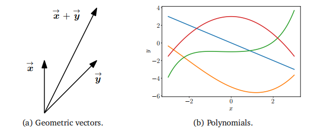
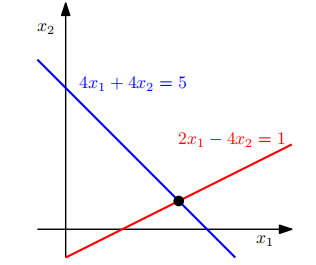
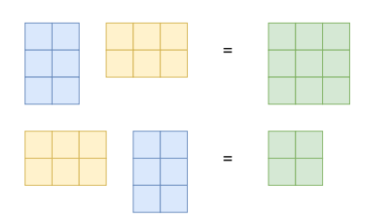

# 线性代数
> 译者：马世拓
> 
> 这一章是后续很多概念的基础，我国工科生在本科阶段需要强制学习线性代数课程，但很多同学对学校的线性代数课程感到有些云里雾里。所以我这里对这一章进行了一些翻译与补充。

形成直观概念的一种常见方法是构建一系列的符号对象以及针对这些对象的规则。这就是我们所知道的**代数学**。线性代数是一门研究向量与向量运算法则的学科。我们在中学阶段所熟知的“向量”被称为**几何向量**，通常会用小箭头作标记，例如$\vec{x}$, $\vec{y}$等。在本书中我们讨论的是更为一般的向量概念并用粗体来表示它们,比如$\boldsymbol{x}$,$\boldsymbol{y}$等。

一般来说，向量这种特殊的对象可以进行叠加，并且乘以标量后会产生新的同类型对象。从抽象的数学角度来看，任何满足这两个属性的对象都可以被认为是一个向量。下面是一些这样的向量对象的例子：

1. **几何向量**。这种定义下的向量案例对于有中学数学和物理基础的人来说再熟悉不过了。如图2.1(a)所示，几何向量在图中被表示为一个至少有两个维度的有向线段。两个几何向量$\boldsymbol{\vec{x}}$,$\boldsymbol{\vec{y}}$可以相加，例如$\boldsymbol{\vec{x}}+\boldsymbol{\vec{y}}=\boldsymbol{\vec{z}}$就是一个新的几何向量。进一步地，一个几何向量$\boldsymbol{\vec{x}}$乘上一个标量$\lambda\in \R$变为$\lambda\boldsymbol{\vec{x}}$，结果仍然是一个几何向量。事实上，它是由原向量放缩$\lambda$倍得到的结果。因此，几何向量是前面介绍的向量概念的实例。将向量解释为几何向量使我们能够使用我们关于方向和大小的直觉来推理数学运算。
2. **多项式也是向量**。如图2.1(b)所示，两个多项式加在一起可以进而产生新的多项式；它们也可以用一个标量$\lambda\in \R$去乘，结果同样是一个新的多项式。因此，多项式是（不太寻常的）向量实例。要注意到多项式与几何向量有很大不同。几何向量是具体的图形，而多项式是抽象概念。然而，它们都是我们前面描述的向量。
3. **音频信号是向量**。音频信号用一系列的数字来表示。我们可以把音频信号加在一起，它们的总和就是一个新的音频信号。如果我们缩放一个音频信号，我们也会得到一个音频信号。因此，音频信号也是一种矢量的类型。
4. **$\R^n$（n个实数组成的元组）中的元素也是向量**（译者注：这里我们往往也叫做“n维欧几里得空间”）。$\R^n$是比多项式更抽象的概念，也是我们在这本书中会聚焦的概念。例如：
$
\boldsymbol{a}=
\left [
\begin{matrix}
1 \\ 2 \\3
\end{matrix}
\right ]\in \R^3
$
就是一个三元数组的实例。对两个向量$\boldsymbol{a}$,$\boldsymbol{b}$按分量相加会得到一个新的向量$\boldsymbol{a}+\boldsymbol{b}=\boldsymbol{c}\in \R^n$。进一步说，用一个标量$\lambda \in \R$乘一个向量$\boldsymbol{a}$会得到一个放缩后的新向量$\lambda\boldsymbol{a}\in\R^n$。将向量作为$\R^n$的元素有一个额外的好处，就是能够自然对应于计算机上的实数数组。许多编程语言都支持数组操作，这允许方便地实现涉及向量操作的算法。

线性代数聚焦于这些向量概念之间的相似性。我们可以对这些向量进行加法或标量乘法。我们主要会聚焦$\R^n$中的向量因为线性代数中的绝大部分算法都是在n维欧几里得空间中形成的。我们会在第8章中看到我们也经常会把数据用$\R^n$中的向量来表示。在本书中，我们会聚焦有限维向量空间，在这种情况下任何一个向量在$\R^n$中存在唯一对应关系。在方便的时候，我们也会使用有关几何向量的认知并考虑一些基于数组的算法。

“**闭包**”是数学中一个很重要的概念。这基于一个问题：根据我设定的操作规则所得到的元素构成了一个怎样的集合？对于向量而言，将一个很小的向量集合经过相加与放缩操作后会得到一个怎样的向量集？这就引出了向量空间的概念（详见2.4节）。向量空间的概念及其正确性是很大一部分机器学习的基础。这一章中要介绍的一些概念总结如图2.2所示。

本章主要是基于下列作者的课堂笔记与著作：Drumm & Weil (2001), Strang (2003), Hogben (2013), Liesen & Mehrmann(2015), 还有Pavel Grinfeld的线性代数系列，以及其他的好资源例如Gilbert Strang在MIT的线性代数课程以及3Blue1Brown的线性代数系列。

线性代数在机器学习与基础数学中扮演着重要角色。这一章引入的概念是对第3章中几何概念的更高扩充。在第5章中，我们将讨论向量微积分，这里对于矩阵运算法则的知识就很有必要了。在第10章中，我们会使用投影（在3.8节中会介绍）通过主成分分析（PCA）进行降维。在第9章中，我们会讨论线性回归，线性代数在这里起到了解最小二乘问题的主要作用。

## 2.1 线性方程组
线性方程组是线性代数的核心部分。很多问题都可以用线性方程组表示，线性代数也为我们提供了解这类问题的方法。
> **例2.1**
> 一家公司生产产品$N_1,N_2,...,N_n$需要用到原料$R_1,R_2,...,R_m$。生产一单位产品$N_j$所需要原料$R_i$的用量为$a_{ij}$，这里$i$=1,2,...,m;$j$=1,2,...,n。
>
> 问题的目标是找到一组可行的生产方案：在原料$R_i$总可用量为$b_i$的条件下生产产品$N_j$的量$x_j$为多少时没有任何原料剩余。
>
> 如果我们生产$x_1,x_2,...,x_n$单位的对应产品，我们需要:
> $$
> a_{i1}x_1+a_{i2}x_2+\cdots+a_{in}x_n
> $$
> 这么多原材料$R_i$。可行解$(x_1,x_2,...,x_n)\in \R^n$，因此也就需要满足下列条件：
> $$
> a_{11}x_1+a_{12}x_2+\cdots+a_{1n}x_n=b_1\\
> \vdots\\
> a_{m1}x_1+a_{m2}x_2+\cdots+a_{mn}x_n=b_m
> $$
> 这里$a_{ij}\in \R$, $b_{ij}\in \R$

式2.3是线性方程组的通用表达形式，$x_1,x_2,...,x_n$是方程组中的未知量。每个满足2.3式的n-元组$(x_1,x_2,...,x_n)\in \R^n$都是这个线性方程组的一个解。

> **例2.2**
> 线性方程组
> $$
> x_1+x_2+x_3=3\\
> x_1-x_2+2x_3=2\\
> 2x_1+3x_3=1
> $$
> 是没有解的。因为把第一个方程和第二个方程相加得到$2x_1+3x_3=5$与第三个方程发生了冲突。
>
> 我们再来看这样一个方程组：
> $$
> x_1+x_2+x_3=3\\
> x_1-x_2+2x_3=2\\
> x_2+x_3=2
> $$
> 第一个方程减掉第三个方程可以得到$x_1=1$。第一个方程加第二个方程可以得到$2x_1+3x_3=5$，因此$x_3=1$。根据第三个方程，我们又得到$x_2=1$。因此，(1,1,1)是唯一的可行解也就是唯一解（可以通过代入法验证(1,1,1)是方程组的一个解）。
> 
> 第三个案例我们再来看这样一个方程组：
> $$
> x_1+x_2+x_3=3\\
> x_1-x_2+2x_3=2\\
> 2x_1+3x_3=5
> $$
> 因为第一个方程和第二个方程相加得到第三个方程，我们可以把第三个多余的方程消掉。从前两个方程中我们可以得到$2x_1=5-3x_3$, $2x_2=1+x_3$。我们定义$x_3=a\in \R^3$作为自由变量，任意一个满足下列形式的三元组都是方程组的解：
> $$
> (\frac{5}{2}-\frac{3}{2}a,\frac{1}{2}+\frac{1}{2}a,a), a\in \R
> $$
> 因此，我们得到了一个包含无穷个解的解集。

总的来说，对于一个实数域内的线性方程组，它的解只有三种情况：无解，唯一解或无穷个解。线性回归（第9章）解决了例2.1的一个版本，此时我们无法求解线性方程组。

*注：线性方程组的几何意义*。在一个只有$x_1,x_2$两个变量的方程组中，每个方程都被代表了$x_1$-$x_2$平面内的一条直线。线性方程组的解要分别满足其中所有方程里任意一个方程，所以它同时也是这些直线的交点。交点可以组成一条直线（如果两个方程描述的是同一条直线），可以组成一个点，或为空（两条直线平行）。图2.3描述了下面这个线性方程组的几何表示：
$$
\begin{cases}
4x_1+4x_2=5\\
2x_1-4x_2=1
\end{cases}
$$

最终的解为($x_1$,$x_2$)=(1,1/4)。类似地，对于三个变量，每个线性方程在三维空间中确定一个平面。这些平面相交形成的结果同时满足所有的线性方程，它们可以得到一个解集，可能是一个平面、一条线、一个点或为空（在这些平面没有公共的交点的情况下）。

为了引出解线性方程组的符号方法，我们介绍一种有效的缩写方法。我们将系数$a_{ij}$写作向量并将向量构造为矩阵。换而言之，我们将线性方程组改写为如下形式：
$$
\left [\begin{matrix}a_{11} \\ \vdots \\a_{m1}\end{matrix}\right ]x_1
+\left [\begin{matrix}a_{12} \\ \vdots \\a_{m2}\end{matrix}\right ]x_2
+\cdots
+\left [\begin{matrix}a_{1n} \\ \vdots \\a_{mn}\end{matrix}\right ]x_n=
\left [\begin{matrix}b_{1} \\ \vdots \\b_{m}\end{matrix}\right ]\\
\Leftrightarrow
\left [
    \begin{matrix}
    a_{11}&\cdots&a_{1n} \\ 
    \vdots&\vdots&\vdots \\
    a_{m1}&\cdots&a_{mn}
    \end{matrix}
\right ]
\left [
    \begin{matrix}
    x_{1} \\ 
    \vdots\\
    x_{n}
    \end{matrix}
\right ]
=
\left [
    \begin{matrix}
    b_{1} \\ 
    \vdots\\
    b_{m}
    \end{matrix}
\right ]
$$

接下来，我们将对这些**矩阵**及其定义的运算规则作出进一步的探究。我们将在第2.3节中讲述线性方程组的解法。

## 2.2 矩阵
矩阵在线性代数中起到了关键作用。它们不仅可以表示线性方程组，还可以表示线性函数（或者线性映射），我们将在2.7节中看到。在我们讨论这些有趣的话题之前，我们首先要定义什么是矩阵以及我们可以对矩阵进行怎样的操作。我们会在第4章看到更多有关矩阵的性质。

**定义2.1（矩阵）**：对于$m,n\in \Z$，一个大小为$(m,n)$的实矩阵$\boldsymbol{A}$是一个关于元素$a_{ij}$的m*n元组，其中$i=1,2,\dots,m, j=1,2,\dots,n$，按照m行n列的方式进行排布。
$$
\boldsymbol{A}=
\left [
    \begin{matrix}
    a_{11}&\cdots&a_{1n} \\ 
    \vdots&\vdots&\vdots \\
    a_{m1}&\cdots&a_{mn}
    \end{matrix}
\right ],
a_{ij}\in\R
$$
按照惯例，矩阵按第二个下标(从1到n)索引称为行，矩阵按第一个下标索引(从1到m)称为列。这些特殊的矩阵也被称为行/列向量。

$\R^{m\times n}$是所有实值（m，n）矩阵的集合。通过将矩阵的所有n列叠加成一个长向量，一个$\boldsymbol{A}\in\R^{m\times n}$可以等价地表示为一个$a\in\R^{m\times n}$，如图2.4所示。

### 2.2.1 矩阵的加法与乘法
两个矩阵$\boldsymbol{A}\in\R^{m\times n}$，$\boldsymbol{B}\in\R^{m\times n}$的和被定义为两个矩阵按对应元素的相加得到的新矩阵，即：
$$
\boldsymbol{A}+\boldsymbol{B}=
\left [
    \begin{matrix}
    a_{11}+b_{11}&\cdots&a_{1n}+b_{1n} \\ 
    \vdots&\vdots&\vdots \\
    a_{m1}+b_{m1}&\cdots&a_{mn}+b_{mn}
    \end{matrix}
\right ]\in\R^{m\times n}
$$
对于矩阵$\boldsymbol{A}\in\R^{m\times n}$，$\boldsymbol{B}\in\R^{n\times k}$的乘积矩阵$\boldsymbol{C}=\boldsymbol{A}\boldsymbol{B}\in\R^{m\times k}$(注意这里矩阵的大小)中元素的计算法则为：
$$
c_{ij}=\sum_{l=1}^n a_{il}b_{lj},(i=1,2,\dots,m, j=1,2,\dots,k)
$$
也就是说，为了计算元素$c_{ij}$我们用$\boldsymbol{A}$的第i行和$\boldsymbol{B}$的第j列元素逐项相乘并求和。在后续的3.2节中，我们把这种操作称作对应行与列的**内积**。在我们需要显式地执行乘法的情况下，我们使用符号$\boldsymbol{A}\cdot \boldsymbol{B}$来表示乘法（显式地表示“·”）。

*注意*：矩阵只有在“相邻”的尺寸匹配时才可以相乘。例如，一个大小为$n\times k$的矩阵$\boldsymbol{A}$可以与一个$k\times m$大小的矩阵$\boldsymbol{B}$相乘，但只能从左边乘：
$$
\underbrace{\boldsymbol{A}}_{n\times k} \underbrace{\boldsymbol{B}}_{k\times m}=\underbrace{\boldsymbol{C}}_{n\times m}
$$
而乘积$\boldsymbol{B}\boldsymbol{A}$如果$m\neq n$时则是不被定义的，因为相邻的维度无法匹配。

*注意*：矩阵乘法并不是对矩阵的按元素乘，即：$c_{ij}\neq a_{ij}b_{ij}$（即使$\boldsymbol{A}$,$\boldsymbol{B}$的尺寸被正确选择）。当我们进行多维数组之间的乘法时，这种按位的乘法往往也出现在编程语言中，它被称作阿达玛乘积（Hadamard product）。
> **例2.3**
> 对于矩阵$
\boldsymbol{A}=
\left [
    \begin{matrix}
    1&2&3 \\ 
    3&2&1
    \end{matrix}
\right ]\in\R^{2\times 3}$，$
\boldsymbol{B}=
\left [
    \begin{matrix}
    0&2 \\
    1&-1\\ 
    0&1
    \end{matrix}
\right ]\in\R^{3\times 2}
$，我们有
> 
$$
\boldsymbol{A}\boldsymbol{B}=\left [
    \begin{matrix}
    1&2&3 \\ 
    3&2&1
    \end{matrix}
\right ]\left [
    \begin{matrix}
    0&2 \\
    1&-1\\ 
    0&1
    \end{matrix}
\right ]=
\left [
    \begin{matrix}
    2&3 \\
    2&5
    \end{matrix}
\right ]\in \R^{2\times 2}
> $$
> 
> $$
> \boldsymbol{B}\boldsymbol{A}=
    \left [
    \begin{matrix}
    0&2 \\
    1&-1\\ 
    0&1
    \end{matrix}
\right ]
    \left [
    \begin{matrix}
    1&2&3 \\ 
    3&2&1
    \end{matrix}
\right ]
    =
\left [
    \begin{matrix}
    6&4&2 \\
    -2&0&2\\
    3&2&1
    \end{matrix}
\right ]\in \R^{3\times 3}
 $$

从这个例子中我们可以看到，矩阵的乘法并不具备交换律，即：$\boldsymbol{A}\boldsymbol{B}\neq \boldsymbol{B}\boldsymbol{A}$。图2.5给出了它的几何解释。

**定义（单位矩阵）**：在$\R^{n\times n}$中，定义**单位矩阵**
$$
\boldsymbol{I}_n=\left [
    \begin{matrix}
    1&0&\cdots&0 \\
    0&1&\cdots&0\\
    \vdots&\vdots&\cdots&\vdots\\
    0&0&\cdots&1
    \end{matrix}
\right ]\in \R^{n\times n}
$$
为对角线上全部为1，其他位置全部为0的$n\times n$维矩阵。

现在，我们定义了矩阵的加法、乘法和单位矩阵，让我们来看看它们的运算性质：

- **结合律**：
$$
\forall \boldsymbol{A}\in\R^{m\times n}, \boldsymbol{B}\in\R^{n\times p}, \boldsymbol{C}\in\R^{p\times q}, (\boldsymbol{A}\boldsymbol{B})\boldsymbol{C}=\boldsymbol{A}(\boldsymbol{B}\boldsymbol{C})
$$

- **分配律**：
$$
\forall \boldsymbol{A},\boldsymbol{B}\in\R^{m\times n}, \boldsymbol{C},\boldsymbol{D}\in\R^{n\times p}, \\
(\boldsymbol{A}+\boldsymbol{B})\boldsymbol{C}=\boldsymbol{A}\boldsymbol{B}+\boldsymbol{A}\boldsymbol{C},\\
\boldsymbol{A}(\boldsymbol{C}+\boldsymbol{D})=\boldsymbol{A}\boldsymbol{C}+\boldsymbol{A}\boldsymbol{D}
$$

- **与单位矩阵相乘**：
$$
\forall \boldsymbol{A}\in\R^{m\times n}, \boldsymbol{I}_m\boldsymbol{A}=\boldsymbol{A}\boldsymbol{I}_n=\boldsymbol{A}
$$

注意，由于$m\neq n$所以$\boldsymbol{I}_m\neq \boldsymbol{I}_n$

### 2.2.2 矩阵的逆与转置
**定义2.3（逆矩阵）**：考虑一个方阵$\boldsymbol{A}\in \R^{n\times n}$，令矩阵$\boldsymbol{B}$满足性质：$\boldsymbol{AB}=\boldsymbol{BA}=\boldsymbol{I}_n$，$\boldsymbol{B}$被称作$\boldsymbol{A}$的**逆**并记作$\boldsymbol{A}^{-1}$。

不幸的是，并不是每个矩阵$\boldsymbol{A}$都存在逆矩阵$\boldsymbol{A}^{-1}$。如果这个逆存在，矩阵$\boldsymbol{A}$被称作**可逆矩阵/非奇异矩阵/规则矩阵**，否则就叫作**不可逆矩阵/奇异矩阵**。如果一个矩阵的逆存在，那么它也必然唯一。在2.3节中，我们将会讨论一种通过求解线性方程组的解计算矩阵逆的通用方法。

*注意*：（$2\times 2$矩阵逆的存在性）考虑一个矩阵
$$
\boldsymbol{A}=
\left [
    \begin{matrix}
    a_{11}&a_{12} \\
    a_{21}&a_{22}
    \end{matrix}
\right ]\in \R^{2\times 2}
$$
如果我们对矩阵$\boldsymbol{A}$乘上：
$$
\boldsymbol{A}'=
\left [
    \begin{matrix}
    a_{22}&-a_{12} \\
    -a_{21}&a_{11}
    \end{matrix}
\right ]\in \R^{2\times 2}
$$
我们就会得到：
$$
\boldsymbol{AA}'=
\left [
    \begin{matrix}
    a_{11}a_{22}-a_{12}a_{21}&0 \\
    0&a_{11}a_{22}-a_{12}a_{21}
    \end{matrix}
\right ]=(a_{11}a_{22}-a_{12}a_{21})\boldsymbol{I}
$$
因此，
$$
\boldsymbol{A}^{-1}=
\frac{1}{a_{11}a_{22}-a_{12}a_{21}}
\left [
    \begin{matrix}
    a_{22}&-a_{12} \\
    -a_{21}&a_{11}
    \end{matrix}
\right ]
$$
当且仅当$a_{11}a_{22}-a_{12}a_{21}\neq 0$。在4.1节中，我们会看到$(a_{11}a_{22}-a_{12}a_{21})$是这个$2\times 2$矩阵的行列式。此外，我们通常可以使用这个行列式来检查一个矩阵是否可逆。

> **例2.4**
> 矩阵$\boldsymbol{A}=
\left [
    \begin{matrix}
    1&2&1\\
    4&4&5\\
    6&7&7
    \end{matrix}
\right ]$与$\boldsymbol{B}=
\left [
    \begin{matrix}
    -7&7&6\\
    2&1&-1\\
    4&5&-4
    \end{matrix}
\right ]$互为逆矩阵，因为$\boldsymbol{AB}=\boldsymbol{BA}=\boldsymbol{I}$。

**定义2.4（转置）**：对于矩阵$\boldsymbol{A}\in \R^{m\times n}$，满足$b_{ij}=a_{ji}$的矩阵$\boldsymbol{B}\in \R^{n\times m}$被称作$\boldsymbol{A}$的转置。我们记$\boldsymbol{B}=\boldsymbol{A}^T$

总的来说，$\boldsymbol{A}^T$可以通过把$\boldsymbol{A}$的行作为$\boldsymbol{A}^T$的对应列得到（译者注：这里其实通俗来讲就是行列互换）。下面是一些有关逆与转置的重要性质：
$$
\boldsymbol{A}\boldsymbol{A}^{-1}=\boldsymbol{A}^{-1}\boldsymbol{A}_n=\boldsymbol{I}
$$
$$
(\boldsymbol{AB})^{-1}=\boldsymbol{B}^{-1}\boldsymbol{A}^{-1}
$$
$$
(\boldsymbol{A+B})^{-1}\neq \boldsymbol{A}^{-1}+\boldsymbol{B}^{-1}
$$
$$
(\boldsymbol{A}^T)^{T}=\boldsymbol{A}
$$
$$
(\boldsymbol{A+B})^{T}= \boldsymbol{A}^{T}+\boldsymbol{B}^{T}
$$
$$
(\boldsymbol{AB})^{T}=\boldsymbol{B}^{T}\boldsymbol{A}^{T}
$$
**定义2.5（对称矩阵）**：一个矩阵$\boldsymbol{A}\in \R^{n\times n}$是**对称矩阵**若$\boldsymbol{A}=\boldsymbol{A}^T$。

注意只有$n\times n$矩阵才可能具备对称性。通常来说，我们也把$n\times n$矩阵叫**方阵**因为它具备相同的行数和列数。进一步的，如果矩阵$\boldsymbol{A}$可逆，$\boldsymbol{A}^T$也可逆，那么$(\boldsymbol{A}^{-1})^T=(\boldsymbol{A}^T)^{-1}$，记作$\boldsymbol{A}^{-T}$

*注意*（对称矩阵的和与积）。对称矩阵$\boldsymbol{A,B}\in \R^{n\times n}$的和矩阵也是对称的。但是，尽管二者的积存在，结果却通常是不对称的。例如：
$$
\left [
    \begin{matrix}
    1&0\\
    0&0
    \end{matrix}
\right ]
\left [
    \begin{matrix}
    1&1\\
    1&1
    \end{matrix}
\right ]=
\left [
    \begin{matrix}
    1&1\\
    0&0
    \end{matrix}
\right ]
$$

### 2.2.3 矩阵的标量乘
让我们来看看如果矩阵乘上一个标量$\lambda \in \R$会发生什么吧。令$\boldsymbol{A}\in\R^{m\times n}, \lambda \in \R$, 那么$\lambda\boldsymbol{A=K}$,$K_{ij}=\lambda a_{ij}$。实际上，$\lambda$对矩阵$\boldsymbol{A}$中每个元素进行了放缩。对于$\lambda, \psi\in \R$，有如下性质：

- 结合律1
$$
(\lambda\psi)\boldsymbol{C}=\lambda(\psi\boldsymbol{C}), \boldsymbol{C}\in\R^{m\times n}
$$

- 结合律2
$$
\lambda(\boldsymbol{B}\boldsymbol{C})=(\lambda\boldsymbol{B})\boldsymbol{C}=\boldsymbol{B}(\lambda\boldsymbol{C})=(\boldsymbol{B}\boldsymbol{C})\lambda, \boldsymbol{B}\in\R^{m\times n}, \boldsymbol{C}\in\R^{n\times k}
$$

- 转置
$$
(\lambda\boldsymbol{C})^T=\boldsymbol{C}^T\lambda^T=\boldsymbol{C}^T\lambda=\lambda\boldsymbol{C}^T
$$
因为对于$\forall \lambda \in \R$, $\lambda^T=\lambda$

- 分配律
$$
\boldsymbol{B}\in\R^{m\times n}, \boldsymbol{C}\in\R^{m\times n}, \\
(\lambda+\psi)\boldsymbol{C}=\lambda\boldsymbol{C}+\psi\boldsymbol{C},\\
\lambda(\boldsymbol{B}+\boldsymbol{C})=\lambda\boldsymbol{B}+\lambda\boldsymbol{C}
$$
> **例2.5（分配律）**
> 如果我们令$\boldsymbol{C}=\left [
>     \begin{matrix}
>     1&2\\
>     3&4
>     \end{matrix}
> \right ]$，对于任意$\lambda, \psi\in\R$都有：
>
> $$
> 
> $$
> ​    \begin{matrix}
> ​    1(\lambda+\psi)&2(\lambda+\psi)\\
> ​    3(\lambda+\psi)&4(\lambda+\psi)
> ​    \end{matrix}
> \right ]=\left [
> ​    \begin{matrix}
> ​    \lambda+\psi&2\lambda+2\psi\\
> ​    3\lambda+3\psi&4\lambda+4\psi
> ​    \end{matrix}
> \right ]=\\
> \left [
> ​    \begin{matrix}
> ​    1\lambda&2\lambda\\
> ​    3\lambda&4\lambda
> ​    \end{matrix}
> \right ]+
> \left [
> ​    \begin{matrix}
> ​    1\psi&2\psi\\
> ​    3\psi&4\psi
> ​    \end{matrix}
> \right ]=\lambda\boldsymbol{C}+\psi\boldsymbol{C}
>
> $$
### 2.2.4 线性方程组的矩阵表示
如果我们考虑这样一个线性方程组：

2x_1+3x_2+5x_3=1\\
4x_1-2x_2+7x_3=8\\
9x_1+5x_2-3x_3=2
$$
利用矩阵乘法的规则，我们可以把这个方程组写成更紧凑的形式:
$$
\left [
    \begin{matrix}
    2&3&5\\
    4&-2&7\\
    9&5&-3
    \end{matrix}
\right ]\left [
    \begin{matrix}
    x_1\\x_2\\x_3
    \end{matrix}
\right ]=\left [
    \begin{matrix}
    1\\8\\2
    \end{matrix}
\right ]
$$

注意，$x_1$缩放了第一列，$x_2$是第二列，$x_3$是第三列。

一般的，一个线性方程组可以缩写为矩阵形式$\boldsymbol{Ax=b}$。参考2.3式，乘积$\boldsymbol{Ax}$是对$\boldsymbol{A}$的列的线性组合。我们将在第2.5节中更详细地讨论线性组合。

## 2.3 解线性方程组

### 2.3.1 特解与通解

### 2.3.2 基本变换

### 2.3.3 -1技巧

### 2.3.4 解线性方程组的算法

## 2.4 向量空间
到目前为止，我们已经在2.3节中研究了线性方程组以及如何求解它们。我们看到，线性方程组可以用式（2.10）中的矩阵向量符号缩写。接下来，我们将更仔细地研究向量空间，也就是一个向量所在的结构化空间。

在本章一开始，我们把向量初步定义为可以相加或乘以一个标量能够保持结果类型一致的一类对象。现在，我们准备正式定义它，我们将在一开始引入群论中的一些概念，它是一组元素和一个在这些元素上定义的操作，这些操作能够保持集合的结构完整。

### 2.4.1 群

### 2.4.2 向量空间

### 2.4.3 向量子空间

## 2.5 线性无关

## 2.6 向量组的基与秩

### 2.6.1 生成集与基

### 2.6.2 秩

## 2.7 线性映射

### 2.7.1 线性映射的矩阵表示法

### 2.7.2 基变换

### 2.7.3 核与映像

## 2.8 仿射空间

### 2.8.1 仿射子空间

### 2.8.2 仿射映射

## 2.9 拓展阅读
学习线性代数的资源有很多，包括Strang（2003）、Golan（2007）、Axler（2015）、Liesen和Mehrmann（2015）的教科书。我们在本章的介绍中也提到了一些在线资源。我们在这里只讨论了高斯消去，但有许多其他方法来求解线性方程组，我们参考斯托尔和布里施（2002），Golub和Van Loan（2012）和Horn和Johnson（2013）的数值线性代数教科书进行深入讨论。

在本书中，我们解读了线性代数中的一些话题（例如向量、矩阵、线性无关、基等）以及向量空间中测度的一些话题。在第三章中，我们将会介绍内积的概念，这导出了范数的概念。这些概念让我们能够定义角度、长度与距离，我们将使用这些概念来进行正交投影。投影是很多机器学习算法的关键，例如线性回归与主成分分析，我们会分别在第9章与第10章中讨论它们。

