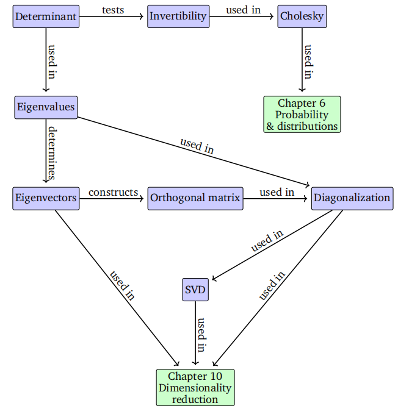
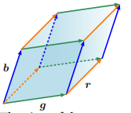
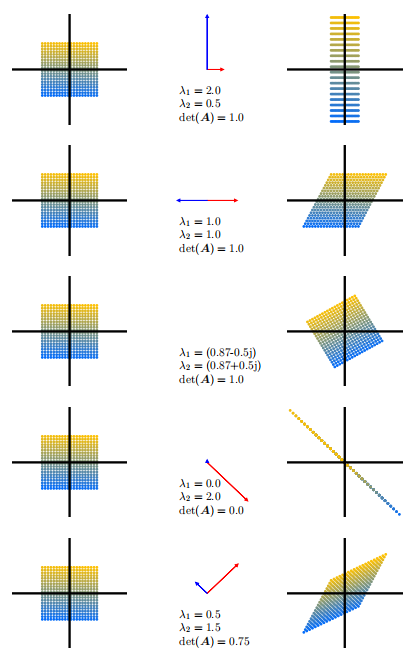
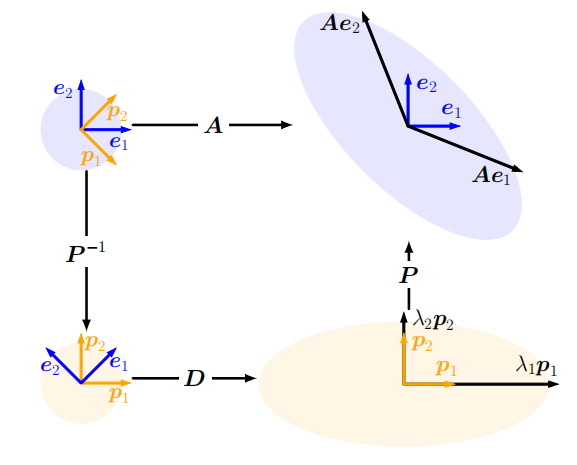
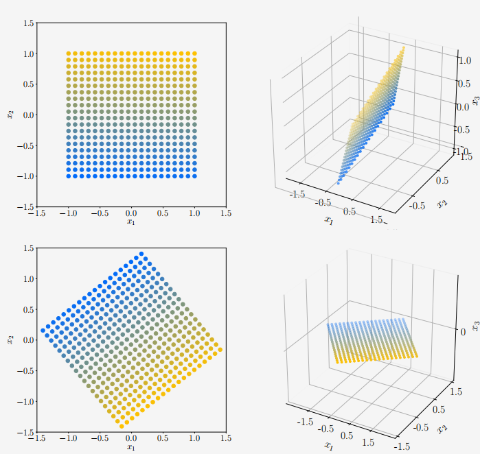
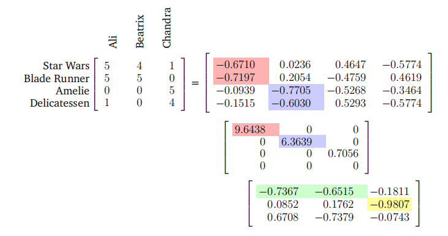

# 第四章 矩阵分解

> 译者注：这一章是线性代数运算中比较重要的章节，也是后续很多算法的核心原理例如PCA等。在这一节中要注意体会矩阵分解的基本思想，并能给出不同分解方法的实现。

在第2章和第3章中，我们研究了向量的运算与度量、向量投影和线性映射的方法。向量的映射和变换可以方便地描述为由矩阵执行的操作。此外，数据通常也以矩阵形式表示，例如，可以用矩阵的行表示不同的人，列描述人的不同特征，如体重、身高和社会经济地位。在本章中，我们将介绍矩阵的三个方面：如何对矩阵组合，如何分解矩阵，以及如何将这些分解用于矩阵近似。

我们首先考虑允许我们用几个数字来描述矩阵特征的方法，这些数字表征了矩阵的整体性质。对于方阵的重要特例，我们将在行列式（第4.1节）和特征值（第4.2节）部分进行讨论。这些特征值具有重要的数学意义，使我们能够快速掌握矩阵具有哪些有用的性质。在这里我们将继续讨论矩阵分解方法：矩阵分解可以类比为数字的因式分解，例如将21因式分解为素数7和3。因此，矩阵分解（matrix decomposition）也常被称为**matrix factorization**。矩阵分解用于通过使用可解释矩阵的因子的不同表示来描述矩阵。

我们将首先介绍对称正定矩阵的平方根运算，即Cholesky分解（第4.3节）。从这里，我们将看看将矩阵分解为规范形式的两种相关方法。第一种称为矩阵对角化（第4.4节），如果我们选择合适的基，它允许我们使用对角变换矩阵来表示线性映射。第二种方法，奇异值分解（第4.5节），将这种因式分解扩展到非方阵，它被认为是线性代数中的基本概念之一。这些分解是有帮助的，因为表示数值数据的矩阵通常非常大，很难分析。我们以矩阵分类的形式系统地概述了矩阵的类型和区分它们的特征属性（第4.7节）来结束本章。

这一章中讲述的一些方法对后续的一些数学理论性章节例如第6章以及一些应用性章节例如第10章中的降维和第11章中的密度估计都有重要作用。本章的整体结构如图4.1所示：

**图4.1** 本章介绍的概念的思维导图，以及它们在本书其他部分的使用位置。

## 4.1 矩阵的行列式与迹

行列式是线性代数中的重要概念。行列式是线性方程组分析和求解中的数学对象。行列式仅在方阵$A\in R^{n\times n}$上定义，即具有相同行数和列数的矩阵。在这本书中，我们把行列式写成$\det(A)$，有时写成$|A|$：
$$
\det(A)=
\begin{vmatrix}
a_{11}& a_{21}& \cdots& a_{n1}\\
a_{12}& a_{22}& \cdots& a_{n2}\\
\vdots& \vdots& \ddots& \vdots\\
a_{1n}& a_{2n}& \cdots& a_{nn}\\
\end{vmatrix}\tag{4.1}
$$
方阵$A\in R^{n\times n}$的行列式是一个将$A$映射为一个实数的函数。在给出一般$n\times n$矩阵行列式的定义之前，让我们来看一些典型的例子，并定义一些特殊矩阵的行列式。

> **例4.1 检验矩阵是否可逆**
>
> 让我们从一个方阵$A$是否可逆（参考2.2.2节）开始。对于最小的二维方阵，我们已经知道何时矩阵是可逆的了。如果$A$是一个1×1矩阵，即它是一个标量，那么$A=a \Rightarrow A^{-1}=\frac{1}{a}$，当且仅当$a\neq 0$时$a\frac{1}{a}=1$成立。
>
> 对于一个$2\times 2$矩阵，由逆矩阵的定义（式2.3）我们知道$AA^{-1}=I$，随即，由式2.24，A的逆可以定义为：
> $$
> A^{-1}=\frac{1}{a_{11}a_{22}-a_{12}a_{21}}\begin{bmatrix}
> a_{22}&-a_{12}\\
> -a_{21}&a_{11}
> \end{bmatrix}\tag{4.2}
> $$
> 这里，$A$是可逆矩阵当且仅当：
> $$
> a_{11}a_{22}-a_{12}a_{21}\neq 0\tag{4.3}
> $$
> 这个式子就是对于$A\in R^{2\times 2}$的行列式：
> $$
> \det(A)=\begin{vmatrix}
> a_{11}&a_{12}\\
> a_{21}&a_{22}
> \end{vmatrix}=a_{11}a_{22}-a_{12}a_{21}\tag{4.4}
> $$

例4.1已经指出了行列式和逆矩阵存在之间的关系。下一个定理陈述了*n×n*矩阵的相同结果。

**定理4.1** 对于任意方阵$A\in R^{n\times n}$，当且仅当$\det(A)\neq 0$时$A$可逆。

我们有针对小型矩阵的行列式的显式（封闭形式）表达式。对于*n=*1，
$$
\det(A)=\det(a_{11})=a_{11}\tag{4.5}
$$
对于n=2,
$$
\det(A)=\begin{vmatrix}
a_{11}&a_{12}\\
a_{21}&a_{22}
\end{vmatrix}=a_{11}a_{22}-a_{12}a_{21}\tag{4.6}
$$
对于n=3（也就是大家熟知的Sarrus规则）：
$$
\begin{vmatrix}
a_{11}&a_{12}&a_{13}\\
a_{21}&a_{22}&a_{23}\\
a_{31}&a_{32}&a_{33}
\end{vmatrix}=a_{11}a_{22}a_{33}+a_{21}a_{32}a_{13}+a_{31}a_{12}a_{23}-a_{31}a_{22}a_{13}-a_{11}a_{32}a_{23}-a_{21}a_{12}a_{33}
\tag{4.7}
$$
为了帮助记忆Sarrus规则中的乘积项，请尝试在矩阵中追踪三乘积的元素。

如果对于每个$i>j$都有$T_{ij}=0$，我们称一个方阵$T$为上三角矩阵，即矩阵对角线以下为零。类似地，我们定义下三角矩阵，即对角线上方为零的矩阵。对于一个三角矩阵$T\in R^{n\times n}$，它的行列式就是对角线上元素的乘积：
$$
\det(T)=\prod_{i=1}^n T_{ii} \tag{4.8}
$$

> **例4.2 行列式可以作为体积的度量**
>
> 当我们将行列式视为$R^n$中跨越对象的*n*个向量集的映射时，行列式的概念是很自然的。结果表明，行列式$ \det(A)$是由矩阵$A$的列形成的n维平行六面体的有符号体积。
>
> 对于*n*=2，矩阵的列形成平行四边形；见图4.2。随着向量之间的角度变小，平行四边形的面积也会缩小。
>
> 
>
> **图4.2**向量$b$和$g$所跨越的平行四边形（阴影区域）的面积为$|\det([b,g])|$
>
> 考虑将两个列向量$b,g$构成一个矩阵$A=[b,g]$，那么，A行列式的绝对值是顶点为0,b,g,b+g的平行四边形的面积。特别的，如果b,g线性相关，也就有$b=\lambda g, \lambda\in R$，它们无法构成二维平行四边形，因此对应的区域面积为0。相反地，如果b,g线性无关且构成一组正交基向量$e_1,e_2$，那么它们也可以写作$b=\begin{bmatrix}b\\0\end{bmatrix}$和$g=\begin{bmatrix}0\\g\end{bmatrix}$，那么这个行列式就是$\begin{vmatrix}b&0\\0&g\end{vmatrix}=bg-0=bg$。
>
> 行列式的符号表示生成向量b、g相对于标准基（e1，e2）的方向。在我们的图中，把顺序翻转为g,b就可以交换A的列并翻转阴影区域面积的方向。这就是我们所熟悉的：平行四边形面积等于底乘高。这样的直觉可以扩展到更高的维度。在$R^{3}$中，我们考虑三个向量$r,b,g\in R^3$构成平行六面体的三条边，即六个面都是平行四边形的立体图形，如图4.3所示：
>
> 
>
> **图4.3**向量$r$,$b$和$g$所跨越的平行六面体（阴影区域）的体积为$|\det([r,b,g])|$，行列式的符号表示生成向量的方向。
>
> 这个$3\times3$矩阵$[r,b,g]$行列式的绝对值就是平行六面体的体积。因此，行列式充当一个函数，用于测量由矩阵中组成的列向量形成的有符号体积。
>
> 考虑三个线性无关的向量$r,g,b\in R^3$：
> $$
> r=\begin{bmatrix}2\\0\\-8\end{bmatrix},g=\begin{bmatrix}6\\1\\0\end{bmatrix},b=\begin{bmatrix}1\\4\\-1\end{bmatrix} \tag{4.9}
> $$
> 把这些向量作为矩阵的列：
> $$
> A=[r,g,b]=\begin{bmatrix}
> 2&6&1\\0&1&4\\-8&0&-1
> \end{bmatrix} \tag{4.10}
> $$
> 这样我们就可以计算所需的体积：
> $$
> V=|\det(A)|=186.\tag{4.11}
> $$

计算$n\times n$矩阵的行列式需要一个通用的算法来解决n>3的情况，我们将在下面进行探索。下面的定理4.2将计算$n\times n$矩阵行列式的问题简化为计算$(n-1)\times(n-1)$矩阵的行列式。通过递归应用拉普拉斯展开（定理4.2），我们可以通过最终计算2×2矩阵的行列式来计算$n\times n$矩阵的行列式。

**定理4.2** （拉普拉斯展开）考虑一个矩阵$A\in R^{n\times n}$，那么，对于$j=1,2,\cdots,n$，有：

1. 按第j列展开：

$$
\det(A)=\sum_{k=1}^n (-1)^{k+j}a_{kj}\det(A_{k,j})\tag{4.12}
$$

2. 按第i行展开：

$$
\det(A)=\sum_{k=1}^n (-1)^{k+j}a_{jk}\det(A_{j,k})\tag{4.13}
$$

这里$A_{k,j}$是矩阵A删除第i行和第j列得到的子矩阵。

> **例4.3 拉普拉斯展开**
>
> 让我们计算这样一个矩阵的行列式：
> $$
> A=\begin{bmatrix}
> 1&2&3\\3&1&2\\0&0&1
> \end{bmatrix} \tag{4.14}
> $$
> 按式（4.13）的规则对第一行应用一次拉普拉斯展开：
> $$
> \begin{vmatrix}
> 1&2&3\\3&1&2\\0&0&1
> \end{vmatrix}
> =(-1)^{1+1}1\begin{vmatrix}1&2\\0&1\end{vmatrix}
> +(-1)^{1+2}2\begin{vmatrix}3&2\\0&1\end{vmatrix}
> +(-1)^{1+3}3\begin{vmatrix}3&1\\0&0\end{vmatrix}
> \tag{4.15}
> $$
> 我们利用(4.6)来计算所有的二阶行列式：
> $$
> \det(A)=1(1-0)-2(3-0)+3(0-0)=-5\tag{4.16}
> $$
> 为了完整起见，我们可以将这个结果与使用Sarrus规则（4.7）计算行列式进行比较：
> $$
> \det(A)=1·1·1+3·0·3+0·2·2−0·1·3−1·0-2−3·2·1=1−6=−5\tag{4.17}
> $$

对于$A\in R^{n\times n}$，行列式具有以下性质：

- 矩阵乘积的行列式等于行列式的乘积，也就是$\det(AB)=\det(A)\det(B)$
- 矩阵转置后求行列式与自身行列式相等，$\det(A)=\det(A^T)$
- 如果矩阵A是正规矩阵（可逆），那么$\det(A^{-1})=\frac{1}{\det(A)}$
- 相似矩阵（定义2.22）具有相同的行列式。因此，对于线性映射$\Phi: V\to V$，$\Phi$的所有变换矩阵$A_\Phi$具有相同的行列式。因此，行列式对于线性映射的基的选择是不变的。
- 将列/行的倍数添加到另一列/行不会改变$\det(A)$
- 将某一列/行放大$\lambda$倍会使得行列式被放大$\lambda\in R$倍。特别地，$\det(\lambda A)=\lambda^n\det(A)$
- 交换两行/两列会改变$\det(A)$的符号

由于最后三个性质，我们可以使用高斯消元法（见第2.1节）通过将A转化为行阶梯形式来计算det(A)。当A呈三角矩阵，也就是对角线以下的元素都为0时，我们可以停止高斯消元。回想一下（4.8），三角矩阵的行列式是对角元素的乘积。

**定理4.3** 一个方阵$A\in R^{n \times n}$有$\det(A)=0$，当且仅当$rank(A)=n$。换言之**，**当且仅A满秩时A可逆。

当数学主要由手工完成时，行列式计算被认为是分析矩阵可逆性的一种基本方法。然而，现代机器学习方法使用直接数值方法，取代了行列式的显式计算。例如，在第2章中，我们了解到逆矩阵可以通过高斯消元法计算。因此，高斯消元法可用于计算矩阵的行列式。

行列式将在后续章节中发挥重要的理论作用，特别是当我们通过特征多项式学习特征值和特征向量时（第4.2节）更是如此。

**定义4.4** 一个方阵$A\in R^{n \times n}$的迹为:
$$
tr(A)=\sum_{i=1}^n a_{ii} \tag{4.18}
$$
即，一个矩阵的迹是A的对角线元素之和。

迹满足如下性质：

- 对于$A,B\in R^{n \times n}$, $tr(A+B)=tr(A)+tr(B)$
- 对于$A\in R^{n \times n}, \alpha \in R$, $tr(\alpha A)=\alpha tr(A)$
- $tr(I_n)=n$
- 对于$A\in R^{n \times k}, B\in R^{k \times n}$, $tr(AB)=tr(BA)$

可以证明只有一个函数能同时满足上述四条性质，就是矩阵的迹(Gohberg et al., 2012)。

矩阵相乘求迹的性质可以更泛化。具体而言，该性质在循环置换下是不变的。即：
$$
tr(AKL)=tr(KLA)\tag{4.19}
$$
对于$A\in R^{a\times k}, B\in R^{k\times l}, C\in R^{l\times a}$成立。这个性质可以推广到任意数量的矩阵的乘积。作为（4.19）的特例，对于两个向量$x,y\in R^n$，
$$
tr(xy^T)=tr(y^Tx)=y^Tx\in R \tag{4.20}
$$
给定一个线性映射$\Phi:V\to V$，其中V是一个向量空间，我们通过使用$\Phi $的矩阵表示的轨迹来定义这个映射的迹。对于给定V的基，我们可以用变换矩阵A来描述$\Phi $。那么$\Phi $的迹就是A的迹。对于不同的V基来说，它认为Φ的相应变换矩阵B可以对适当的S通过$S^{-1}AS$形式的基变化来获得（见第2.7.2节）。对于$\Phi $的对应迹，这也就是说：
$$
tr(B)=tr(S^{-1}AS)=tr(AS^{-1}S)=tr(A) \tag{4.21}
$$
因此，虽然线性映射的矩阵表示是基相关的，但线性映射$\Phi$的轨迹与基无关。

在本节中，我们介绍了行列式和迹作为表征方阵的函数。结合我们对行列式和迹的理解，我们现在可以定义一个用多项式描述矩阵A的重要方程，我们将在后续章节中广泛使用。

**定义4.5** （特征多项式）对于$\lambda \in R$和$A\in R^{n\times n}$, 
$$
\begin{align}
p_A(\lambda)&=det(A-\lambda I)\\
&=c_0+c_1\lambda+c_2\lambda^2+\cdots+c_{n-1}\lambda^{n-1}+c_n\lambda^n
\end{align}
\tag{4.22}
$$
$c_0,c_1,\cdots,c_n\in R$，这被称作A的特征多项式。特别地，
$$
c_0=\det(A)\tag{4.23}
$$

$$
c_{n-1}=(-1)^{n-1}tr(A) \tag{4.24}
$$

特征多项式（4.22）将允许我们计算特征值和特征向量，下一节将介绍。

## 4.2 特征值与特征向量

现在，我们将了解一种新的方式来描述矩阵及其相关的线性映射。回想一下第2.7.1节的内容，给定一个有序基，每个线性映射都有一个唯一的变换矩阵。我们可以通过进行“特征”分析来解释线性映射及其相关的变换矩阵。正如我们将看到的，线性映射的特征值将告诉我们一组特殊向量（即特征向量）是如何被线性映射变换的。

**定义4.6**. 设$A\in\mathbb{R}^{n\times n}$是一个方阵。那么，如果$\lambda\in\mathbb{R}$满足
$$
Ax=\lambda x \tag{4.25}
$$
则称$\lambda$为$A$的特征值，而$x\in\mathbb{R}^n\backslash\{0\}$为对应的特征向量。我们称(4.25)为特征值方程。

**备注**：在线性代数文献和软件中，通常约定特征值按降序排列，因此最大的特征值及其对应的特征向量被称为第一特征值和第一特征向量，次大的被称为第二特征值和第二特征向量，以此类推。然而，教科书和出版物可能有不同的排序观念，或者根本没有排序。如果本书中没有明确说明排序，我们则不假定任何排序。

以下陈述是等价的：

- $\lambda$是$A\in\mathbb{R}^{n\times n}$的特征值。
- 存在一个$x\in\mathbb{R}^n\backslash\{\mathbf{0}\}$使得$Ax=\lambda x$，或者等价地，$(A-\lambda I_n)x=0$有非零解，即$x\neq0$。
- $\mathrm{rk}(A-\lambda I_n)<n$。
- $\mathrm{det}(A-\lambda I_n)=0$。

**定义4.7（共线性和同向性）**。两个指向相同方向的向量称为同向的。如果两个向量指向相同或相反的方向，则它们是共线的。

**备注（特征向量的非唯一性）**：如果$x$是与特征值$\lambda$相关联的$A$的特征向量，那么对于任意$c\in\mathbb{R}\backslash\{0\}$，$cx$也是与相同特征值$\lambda$相关联的$A$的特征向量，因为:
$$
A(c\boldsymbol{x})=cA\boldsymbol{x}=c\lambda\boldsymbol{x}=\lambda(c\boldsymbol{x}) \tag{4.26}
$$
因此，所有与$x$共线的向量也都是$A$的特征向量。

**定理4.8**. $\lambda\in\mathbb{R}$是$A\in\mathbb{R}^{n\times n}$的特征值当且仅当$\lambda$是矩阵$A$的特征多项式$p_{\boldsymbol{A}}(\lambda)$的根。

**定义4.9**. 设方阵$A$有一个特征值$\lambda_i$，则$\lambda_i$的代数重数是指该根在特征多项式中出现的次数。

**定义4.10（特征空间和特征谱）**。对于$A\in\mathbb{R}^{n\times n}$，与特征值$\lambda$相关联的所有特征向量张成的$\mathbb{R}^n$的子空间称为$A$关于$\lambda$的特征空间，记作$E_\lambda$。矩阵$A$的所有特征值的集合称为$A$的特征谱或简称谱。

如果$\lambda$是$A\in\mathbb{R}^{n\times n}$的特征值，则对应的特征空间$E_\lambda$是齐次线性方程组$(A-\lambda I)x=0$的解空间。从几何角度看，与非零特征值相对应的特征向量指向一个被线性映射拉伸的方向，而特征值则是拉伸的因子。如果特征值为负，则拉伸的方向会反转。

> **例4.4 单位矩阵的情况**
> 单位矩阵$I\in\mathbb{R}^{n\times n}$的特征多项式为$p_I(\lambda)=\det(\boldsymbol{I}-\lambda\boldsymbol{I})=(1-\lambda)^n=0$，它只有一个特征值$\lambda=1$，且该特征值出现$n$次。此外，对于所有非零向量$x\in\mathbb{R}^n$，都有$Ix=\lambda x=1x$。因此，单位矩阵的唯一特征空间$E_1$张成$n$维空间，且$\mathbb{R}^n$的所有标准基向量都是$I$的特征向量。

关于特征值和特征向量的有用性质包括：

- 矩阵$A$及其转置$A^\top$具有相同的特征值，但不一定具有相同的特征向量。
- 特征空间$E_\lambda$是$A-\lambda I$的零空间，因为

$$\begin{aligned}
Ax=\lambda x&\iff Ax-\lambda x=0\\
&\iff(A-\lambda\boldsymbol{I})\boldsymbol{x}=\boldsymbol{0}\iff\boldsymbol{x}\in\ker(\boldsymbol{A}-\lambda\boldsymbol{I}).
\end{aligned}\tag{4.27}$$

- 相似矩阵（见定义2.22）具有相同的特征值。因此，线性映射$\Phi$的特征值与其变换矩阵的基选择无关。这使得特征值、行列式和迹成为线性映射的关键特征参数，因为它们在基变换下是不变的。
- 对称、正定矩阵总是具有正实特征值。

> **例 4.5 计算特征值、特征向量和特征空间**
>
> 让我们找到$2\times2$矩阵
>
> $$
> \boldsymbol A=\begin{bmatrix}4&2\\1&3\end{bmatrix} \tag{4.28}
> $$
>
> 的特征值和特征向量。
>
> **步骤 1: 特征多项式**。根据特征向量$x\neq0$和特征值$\lambda$的定义，存在向量使得$Ax=\lambda x$，即$(A-\lambda I)x=0$。由于$x\neq0$，这要求$A-\lambda I$的核（零空间）包含除0以外的元素。这意味着$A-\lambda I$不可逆，因此$\det(\boldsymbol{A}-\lambda\boldsymbol{I})=0$。因此，我们需要计算特征多项式（4.22a）的根来找到特征值。
>
> **步骤 2: 特征值**。特征多项式为
> $$
> \begin{aligned}
> p_{\boldsymbol{A}}(\lambda)&=\det(\boldsymbol{A}-\lambda\boldsymbol{I})\\
> &=\det\left(\begin{bmatrix}4&2\\1&3\end{bmatrix}-\begin{bmatrix}\lambda&0\\0&\lambda\end{bmatrix}\right)=\begin{vmatrix}4-\lambda&2\\1&3-\lambda\end{vmatrix}\\
> &=(4-\lambda)(3-\lambda)-2\cdot1.
> \end{aligned} \tag{4.29}
> $$
> 我们分解特征多项式得到
>
> $$
> p(\lambda)=(4-\lambda)(3-\lambda)-2\cdot1=10-7\lambda+\lambda^2=(2-\lambda)(5-\lambda) \tag{4.30}
> $$
> 给出根$\lambda_1=2$和$\lambda_2=5$。
>
> **步骤 3: 特征向量和特征空间**。我们通过查看满足以下条件的向量$x$来找到与这些特征值相对应的特征向量
> $$
> \begin{bmatrix}4-\lambda&2\\1&3-\lambda\end{bmatrix}\boldsymbol x=\boldsymbol0.\tag{4.31}
> $$
> 对于$\lambda=5$，我们得到
>
> $$
> \begin{bmatrix}4-5&2\\1&3-5\end{bmatrix}\begin{bmatrix}x_1\\x_2\end{bmatrix}=\begin{bmatrix}-1&2\\1&-2\end{bmatrix}\begin{bmatrix}x_1\\x_2\end{bmatrix}=\mathbf{0}. \tag{4.32}
> $$
> 我们解这个齐次系统，得到解空间
>
> $$
> E_5=\operatorname{span}[\begin{bmatrix}2\\1\end{bmatrix}]. \tag{4.33}
> $$
> 这个特征空间是一维的，因为它只有一个基向量。类似地，我们通过解齐次方程组来找到对应于$\lambda=2$的特征向量
>
> $$
> \begin{bmatrix}4-2&2\\1&3-2\end{bmatrix}\boldsymbol x=\begin{bmatrix}2&2\\1&1\end{bmatrix}\boldsymbol x=\boldsymbol0. \tag{4.34}
> $$
>
> 这意味着任何形式为 $x=\begin{bmatrix}x_1\\x_2\end{bmatrix}$ 的向量，其中 $x_2 = -x_1$，比如 $\begin{bmatrix}1\\-1\end{bmatrix}$，都是对应于特征值2的特征向量。对应的特征空间由下式给出：
>
> $$
> E_2 = \operatorname{span}[\begin{bmatrix}1\\-1\end{bmatrix}]. \tag{4.35}
> $$
>
> 这意味着特征空间 $E_2$ 是一维的，并且由单个向量 $\begin{bmatrix}1\\-1\end{bmatrix}$ 张成（span）。任何满足 $x_2 = -x_1$ 的向量都可以表示为 $\begin{bmatrix}1\\-1\end{bmatrix}$ 的标量倍，因此它们都是特征值 $\lambda = 2$ 的特征向量。

在例4.5中，两个特征空间$E_5$和$E_2$都是一维的，因为它们各自都仅由一个向量张成。然而，在其他情况下，我们可能有多个相同的特征值（参见定义4.9），并且特征空间可能具有超过一个的维度。

**定义4.11**. 设$\lambda_i$是方阵$A$的一个特征值。那么，$\lambda_i$的几何重数是与$\lambda_i$相关联的线性无关特征向量的数量。换句话说，它是与$\lambda_i$相关联的特征向量所张成的特征空间的维度。

**备注**。一个特定特征值的几何重数必须至少为1，因为每个特征值都至少有一个相关联的特征向量。一个特征值的几何重数不能超过其代数重数，但可能更低。

> **例4.6**
> 矩阵$A=\begin{bmatrix}2&1\\0&2\end{bmatrix}$有两个重复的特征值$\lambda_1=\lambda_2=2$，且代数重数为2。然而，该特征值只有一个不同的单位特征向量$x_1=\begin{bmatrix}1\\0\end{bmatrix}$，因此，几何重数为1。

### 图形直觉在二维空间中的应用

让我们通过不同的线性映射来获得关于行列式、特征向量和特征值的一些直观理解。图4.4描绘了五个变换矩阵$A_1, \ldots, A_5$以及它们对以原点为中心的方形网格点的影响：

**图4.4** **行列式与特征空间** ,**五个线性映射及其相关变换矩阵概览** $A_{i}\in\mathbb{R}^{2\times2}$将400个颜色编码的点$x\in \mathbb{R} ^2$（左列）投影到目标点$A_ix$（右列）。中间列展示了第一个特征向量被其对应的特征值$\lambda_1$拉伸，以及第二个特征向量被其对应的特征值$\lambda_2$拉伸。每一行展示了五个变换矩阵$A_i$之一在标准基下的效果。

- $\boldsymbol{A}_{1}=\begin{bmatrix}\frac{1}{2}&0\\0&2\end{bmatrix}$。这个矩阵的两个特征向量的方向对应于$\mathbb{R}^2$中的标准基向量，即两个坐标轴。垂直轴被放大了2倍（特征值$\lambda_1=2$），而水平轴被压缩了$\frac{1}{2}$倍（特征值$\lambda_2=\frac{1}{2}$）。这个映射是保面积的，因为行列式$\operatorname{det}(\boldsymbol{A}_{1})=1 = 2 \cdot \frac{1}{2}$。

- $A_{2}=\begin{bmatrix}1&\frac{1}{2}\\0&1\end{bmatrix}$ 这个矩阵对应于一个剪切映射。它将网格点沿着水平轴向右剪切，如果它们在正y轴的一侧；如果它们在负y轴的一侧，则向左剪切。这种剪切不改变网格的面积（因为行列式为1），但改变了网格的形状。特征值$\lambda_1=\lambda_2=1$是重复的，且特征向量是共线的（尽管在这里为了强调，我们在两个相反的方向上绘制了它们）。这表明映射仅沿着一个方向（水平轴）作用，但实际上，由于剪切的存在，它也在垂直方向上产生了影响，只是没有改变面积。

- $\boldsymbol{A}_{3}=\begin{bmatrix}\cos(\frac{\pi}{6})&-\sin(\frac{\pi}{6})\\\sin(\frac{\pi}{6})&\cos(\frac{\pi}{6})\end{bmatrix}=\frac{1}{2}\begin{bmatrix}\sqrt{3}&-1\\1&\sqrt{3}\end{bmatrix}$ 这个矩阵$\boldsymbol A_3$将点逆时针旋转了$\frac{\pi}{6}$弧度（即$30^\circ$）。由于旋转是面积保持的，所以行列式为1。旋转矩阵的特征值是复数，反映了旋转的性质（因此没有绘制特征向量）。关于旋转的更多细节，请参考第3.9节。

- $A_{4}=\begin{bmatrix}1&-1\\-1&1\end{bmatrix}$ 这个矩阵表示一个映射，它将二维域压缩到一维。由于一个特征值为0（$\lambda_1=0$），与这个特征值对应的（蓝色）特征向量方向上的空间会塌陷，而与之正交的（红色）特征向量则会使空间拉伸一个因子$\lambda_2=2$。然而，由于有一个特征值为0，整个变换后的图像面积实际上是0。

- $A_{5}=\begin{bmatrix}1&\frac{1}{2}\\\frac{1}{2}&1\end{bmatrix}$ 这是一个剪切和拉伸的映射。由于行列式的绝对值为$\frac{3}{4}$，它表示空间被放大了75%（注意这里的“放大”是指行列式绝对值与1的关系，实际上在某些方向上可能是压缩的）。它沿着（红色）特征向量$\lambda_2$的方向拉伸了空间1.5倍，并沿着与之正交的（蓝色）特征向量压缩了0.5倍。这种变换既改变了网格的形状，也改变了其面积。

特别是，行列式的绝对值表示变换后图形面积的缩放比例（在二维中），而特征值和特征向量则揭示了变换在特定方向上的行为。例如，特征值大于1表示该方向上的放大，小于1表示压缩，而复数特征值则通常与旋转或振荡相关。

> **例4.7 生物神经网络的特征谱**
>
> 
>
>  **图4.5 Caenorhabditis elegans（线虫）神经网络（Kaiser 和 Hilgetag, 2006）**  **(a) 对称化连接性矩阵**  **(b) 特征谱** 
>
> 分析和学习网络数据的方法是机器学习方法的重要组成部分。理解网络的关键在于网络节点之间的连接性，特别是两个节点是否相互连接。在数据科学应用中，研究能够捕获这种连接性数据的矩阵通常非常有用。
>
> 我们构建了线虫C.Elegans完整神经网络的连接性/邻接矩阵$A\in\mathbb{R}^{277\times277}$。矩阵的每一行/列代表线虫大脑中的一个神经元（共277个）。如果神经元$i$通过突触与神经元$j$相连，则连接性矩阵$A$中对应元素$a_{ij}=1$，否则$a_{ij}=0$。由于连接性矩阵$A$可能不是对称的（即可能存在单向连接），其特征值可能不是实数。因此，我们计算了连接性矩阵的对称版本，记为$A_{sym}:=A+A^\top$。这个新的对称矩阵$A_{sym}$在图4.5(a)中展示，如果两个神经元之间存在连接（无论连接方向如何），则矩阵中对应元素$a_{ij}$为非零值（以白色像素表示）。在图4.5(b)中，我们展示了$A_{sym}$对应的特征谱。横轴表示按降序排列的特征值索引，纵轴表示对应的特征值。该特征谱呈现出典型的“S”形，这在许多生物神经网络中都很常见。关于这一现象背后的机制，是神经科学研究中的一个活跃领域。

**定理4.12**. 一个矩阵$A\in \mathbb{R}^{n\times n}$的具有$n$个不同特征值$\lambda_1, \ldots, \lambda_n$的特征向量$x_1, \ldots, x_n$是线性无关的。

这个定理表明，具有$n$个不同特征值的矩阵的特征向量构成$\mathbb{R}^n$的一个基。

**定义4.13.** 如果一个方阵$A\in\mathbb{R}^{n\times n}$拥有的线性无关特征向量少于$n$个，则称该矩阵是缺陷的。一个非缺陷的矩阵$A\in\mathbb{R}^{n\times n}$不一定需要$n$个不同的特征值，但它确实需要其特征向量构成$\mathbb{R}^n$的一个基。观察缺陷矩阵的特征空间，可以得出特征空间维数之和小于$n$。特别是，缺陷矩阵至少有一个特征值$\lambda_i$，其代数重数$m>1$但几何重数小于$m$。

**备注** 缺陷矩阵不能有$n$个不同的特征值，因为不同的特征值具有线性无关的特征向量（定理$4.12$）。

**定理4.14​**. 给定矩阵$A\in\mathbb{R}^{m\times n}$，我们总可以通过定义
$$
S:=A^\top A \tag{4.36}
$$
来获得一个对称且半正定的矩阵$S\in\mathbb{R}^{n\times n}$。

**备注**. 如果$\text{rk}(A)=n$，则$S:=A^\top A$是对称且正定的。

理解定理$4.14$为何成立对我们如何使用对称化矩阵有很大启示：对称性要求$S=S^\top$，通过插入(4.36)我们得到$S=A^\top A=A^\top(A^\top)^\top=(A^\top A)^\top=S^\top$。此外，半正定性（第$3.2.3$节）要求$x^\top Sx\geqslant0$，插入(4.36)我们得到$x^\top Sx=x^\top A^\top Ax=(x^\top A^\top)(Ax)=(Ax)^\top(Ax)\geqslant0$，因为点积计算的是平方和（它们本身是非负的）。

**定理4.15（谱定理）**. 如果$A\in\mathbb{R}^{n\times n}$是对称的，则存在由$A$的特征向量构成的对应向量空间$V$的一个正交规范基，且每个特征值都是实数。

谱定理的一个直接推论是，对称矩阵$A$的特征分解存在（具有实数特征值），并且我们可以找到一个由特征向量构成的正交规范基（ONB），使得$A=PDP^\top$，其中$D$是对角矩阵，$P$的列包含特征向量。

>  例4.8​
>
> 考虑矩阵
> $$
> A=\begin{bmatrix}3&2&2\\2&3&2\\2&2&3\end{bmatrix} \tag{4.37}
> $$
> 矩阵$A$的特征多项式为
>
> $$
> p_A(\lambda) = -(\lambda - 1)^2(\lambda - 7)\tag{4.38}
> $$
> 由此，我们可以确定矩阵$A$的特征值为$\lambda_1 = 1$（这是一个重复的特征值）和$\lambda_2 = 7$。
>
> 接下来，我们按照标准程序计算特征向量，得到与这些特征值对应的特征空间：
>
> $$
> E_1 = \text{span}\left(\underbrace{\begin{bmatrix}-1 \\ 1 \\ 0\end{bmatrix}}_{=:\mathbf{x}_1}, \underbrace{\begin{bmatrix}-1 \\ 0 \\ 1\end{bmatrix}}_{=:\mathbf{x}_2}\right), \quad E_7 = \text{span}\left(\underbrace{\begin{bmatrix}1 \\ 1 \\ 1\end{bmatrix}}_{=:\mathbf{x}_3}\right) \tag{4.39}
> $$
> 我们注意到$\mathbf{x}_3$与$\mathbf{x}_1$和$\mathbf{x}_2$都是正交的，但$\mathbf{x}_1$和$\mathbf{x}_2$之间不是正交的（因为$\mathbf{x}_1^\top \mathbf{x}_2 = 1 \neq 0$）。然而，根据谱定理（定理4.15），我们知道存在一个由正交特征向量构成的基，但我们目前得到的基并不满足这个条件。不过，我们可以构造一个这样的基。
>
> 为了构造这样的基，我们利用$\mathbf{x}_1$和$\mathbf{x}_2$都是与同一特征值$\lambda_1 = 1$相关联的特征向量这一事实。因此，对于任意的$\alpha, \beta \in \mathbb{R}$，都有
>
> $$
> A(\alpha\mathbf{x}_1 + \beta\mathbf{x}_2) = A\mathbf{x}_1\alpha + A\mathbf{x}_2\beta = \lambda_1(\alpha\mathbf{x}_1 + \beta\mathbf{x}_2)\tag{4.40}
> $$
> 即，$\mathbf{x}_1$和$\mathbf{x}_2$的任何线性组合仍然是与$\lambda_1$相关联的特征向量。Gram-Schmidt算法（第3.8.3节）是一种通过迭代地从一组基向量中构造正交/单位正交基的方法，它使用这样的线性组合。因此，即使$\mathbf{x}_1$和$\mathbf{x}_2$不是正交的，我们也可以应用Gram-Schmidt算法来找到与$\lambda_1 = 1$相关联且相互正交（以及与$\mathbf{x}_3$正交）的特征向量。
>
> 在我们的例子中，应用Gram-Schmidt算法后，我们可能会得到（注意这里的$\mathbf{x}_2'$可能不是唯一的，因为它取决于Gram-Schmidt算法的具体实现）：
>
> $$
> \mathbf{x}_1' = \begin{bmatrix}-1 \\ 1 \\ 0\end{bmatrix}, \quad \mathbf{x}_2' = \frac{1}{2}\begin{bmatrix}-1 \\ -1 \\ 2\end{bmatrix}\tag{4.41}
> $$
> 这两个向量是相互正交的，与$\mathbf{x}_3$也正交，并且是矩阵$A$与特征值$\lambda_1 = 1$相关联的特征向量。

在结束对特征值和特征向量的讨论之前，将矩阵的这些特性与行列式和迹的概念联系起来是非常有用的。

**定理 4.16**：一个矩阵 $A \in \mathbb{R}^{n \times n}$ 的行列式是其特征值的乘积，即

$$
\det(\boldsymbol A) = \prod_{i=1}^n \lambda_i \tag{4.42}
$$
其中，$\lambda_i \in \mathbb{C}$ 是 $A$ 的（可能重复的）特征值。

**图4.6 几何上关于特征值的解释。矩阵$A$的特征向量被对应的特征值拉伸。单位正方形的面积变化了$|\lambda_1\lambda_2|$倍，周长变化了$\frac{1}{2}(|\lambda_{1}|+|\lambda_{2}|)$倍。**

**定理4.17**. 矩阵$A\in \mathbb{R} ^{n\times n}$的迹是其特征值的和，即
$$
tr(A)=\sum_{i=1}^{n}\lambda_{i} \tag{4.43}
$$
其中，$\lambda_i\in\mathbb{C}$是A的（可能重复的）特征值。

现在，我们来为这两个定理提供一个几何上的直观理解。考虑一个矩阵$\dot{A}\in\mathbb{R}^{2\times2}$，它有两个线性无关的特征向量$x_1,x_2$。为了这个例子，我们假设$(x_1,x_2)$是$\mathbb{R}^2$的一个正交归一基（ONB），因此它们是正交的，并且它们所张成的正方形的面积是1；见图4.6。从第4.1节我们知道，行列式计算的是在变换$A$下单位正方形面积的变化。在这个例子中，我们可以明确地计算出面积的变化：使用$A$映射特征向量得到向量$v_1=Ax_1=\lambda_1x_1$和$v_2=Ax_2=\lambda_2x_2$，即新的向量$v_i$是特征向量$x_i$的缩放版本，缩放因子是对应的特征值$\lambda_i$。$\boldsymbol{v}_1,\boldsymbol{v}_2$仍然是正交的，并且它们所张成的矩形的面积是$|\lambda_1\lambda_2|$。

鉴于在我们的例子中$x_1,x_2$是正交归一的，我们可以直接计算出单位正方形的周长为$2(1+1)$。映射特征向量后，新的矩形周长为$2(|\lambda_1|+|\lambda_2|)$。因此，特征值绝对值的和告诉我们，在单位正方形经过变换矩阵$A$的变换后，其周长如何变化。

> **例4.9 谷歌的PageRank - 网页作为特征向量**
>
> 谷歌使用矩阵$A$的最大特征值对应的特征向量来确定搜索页面的排名。PageRank算法是由拉里·佩奇（Larry Page）和谢尔盖·布林（Sergey Brin）于1996年在斯坦福大学开发的，其核心理念是任何网页的重要性都可以通过链接到它的网页的重要性来近似。为此，他们将所有网站写成一个巨大的有向图，展示了哪些页面链接到哪些页面。PageRank通过计算指向网页$a_i$的页面数量来计算该网站$a_i$的权重（重要性）$x_i\geqslant0$。此外，PageRank还考虑了链接到$a_i$的网站的重要性。
>
> 然后，用户的导航行为被建模为这个图的一个转移矩阵$A$，它告诉我们用户以什么（点击）概率会最终到达另一个网站。矩阵$A$具有这样的性质：对于网站的任何初始排名/重要性向量$x$，序列$x,\boldsymbol{A}x,\boldsymbol{A}^2x,\ldots$都会收敛到一个向量$x^*$。这个向量被称为PageRank，并满足$Ax^*=x^*$，即它是$A$的一个特征向量（对应的特征值为1）。在对$x^*$进行归一化，使得$\|x^*\|=1$之后，我们可以将元素解释为概率。关于PageRank的更多细节和不同的视角可以在原始技术报告（Page et al., 1999）中找到。

## 4.3 楚列斯基分解

在机器学习中，我们经常遇到需要分解特殊类型矩阵的情况。对于正实数，我们有平方根运算，它可以将一个数分解为相同的因子，例如$9=3\cdot3$。然而，对于矩阵，我们需要小心处理，确保我们在正数或正定矩阵上执行类似平方根的操作。

对于对称正定矩阵（见第3.2.3节），我们可以选择多种与平方根等效的操作。其中，Cholesky分解提供了一种在对称正定矩阵上进行类似平方根操作的方法，这在实践中非常有用。

**定理4.18（Cholesky分解）**：一个对称正定矩阵$A$可以分解为两个矩阵的乘积，即$A=LL^\top$，其中$L$是一个下三角矩阵，且其对角线元素为正。

具体来说，如果$A$是一个$n\times n$的对称正定矩阵，那么存在一个唯一的下三角矩阵$L$（称为$A$的Cholesky因子），其对角线元素为正，使得$A=LL^\top$。

Cholesky分解的矩阵形式如下：

$$
A = \begin{bmatrix}
a_{11} & \cdots & a_{1n} \\
\vdots & \ddots & \vdots \\
a_{n1} & \cdots & a_{nn}
\end{bmatrix}
=
\begin{bmatrix}
l_{11} & \cdots & 0 \\
\vdots & \ddots & \vdots \\
l_{n1} & \cdots & l_{nn}
\end{bmatrix}
\begin{bmatrix}
l_{11} & \cdots & l_{n1} \\
\vdots & \ddots & \vdots \\
0 & \cdots & l_{nn}
\end{bmatrix}\tag{4.44}
$$

这里，$L$是下三角矩阵，其元素$l_{ij}$（对于$i>j$，$l_{ij}=0$）可以通过递归方式计算得到，通常使用Cholesky算法的迭代步骤来求解。

> 译者注：Cholesky分解在数值分析和统计中非常有用，特别是在处理大规模矩阵时，因为它提供了一种有效的方法来计算矩阵的逆和行列式，同时避免了直接计算可能导致的数值不稳定性。此外，Cholesky分解还广泛应用于求解线性方程组、优化问题和蒙特卡洛模拟等领域。

> **例 4.10 Cholesky 分解**
>
> 考虑一个对称正定矩阵 $A \in \mathbb{R}^{3\times3}$。我们对其进行Cholesky分解，即找到矩阵 $L$ 使得 $A = LL^\top$，具体形式为：
>
> $$
> A = \begin{bmatrix}
> a_{11} & a_{21} & a_{31} \\
> a_{21} & a_{22} & a_{32} \\
> a_{31} & a_{32} & a_{33}
> \end{bmatrix}
> =
> L L^\top
> =
> \begin{bmatrix}
> l_{11} & 0 & 0 \\
> l_{21} & l_{22} & 0 \\
> l_{31} & l_{32} & l_{33}
> \end{bmatrix}
> \begin{bmatrix}
> l_{11} & l_{21} & l_{31} \\
> 0 & l_{22} & l_{32} \\
> 0 & 0 & l_{33}
> \end{bmatrix} \tag{4.45}
> $$
>
> 将右侧矩阵相乘，我们得到：
>
> $$
> A = \begin{bmatrix}
> l_{11}^2 & l_{11}l_{21} & l_{11}l_{31} \\
> l_{11}l_{21} & l_{21}^2 + l_{22}^2 & l_{21}l_{31} + l_{22}l_{32} \\
> l_{11}l_{31} & l_{21}l_{31} + l_{22}l_{32} & l_{31}^2 + l_{32}^2 + l_{33}^2
> \end{bmatrix}\tag{4.46}
> $$
>
> 比较(4.45)的左侧和(4.46)的右侧，我们可以看到对角元素 $l_{ii}$ 有一个简单的模式：
>
> $$
> l_{11} = \sqrt{a_{11}}, \quad l_{22} = \sqrt{a_{22} - l_{21}^2}, \quad l_{33} = \sqrt{a_{33} - (l_{31}^2 + l_{32}^2)} \tag{4.47}
> $$
>
> 类似地，对于下三角元素 $l_{ij}$（其中 $i > j$），也存在一个重复的模式：
>
> $$
> l_{21} = \frac{1}{l_{11}}a_{21}, \quad l_{31} = \frac{1}{l_{11}}a_{31}, \quad l_{32} = \frac{1}{l_{22}}(a_{32} - l_{31}l_{21}) \tag{4.48}
> $$
>
> 因此，我们为任何对称正定的 $3\times3$ 矩阵构造了Cholesky分解。关键之处在于，给定矩阵 $A$ 的元素 $a_{ij}$ 和之前已计算的 $l_{ij}$ 值，我们可以反向计算出 $L$ 的各个分量 $l_{ij}$。

当然，以下是继续的中文翻译，保持对原文的忠实：

Cholesky 分解是机器学习底层数值计算中的一个重要工具。在这里，对称正定矩阵经常需要被处理，例如，多元高斯变量的协方差矩阵（见第6.5节）就是对称且正定的。这个协方差矩阵的Cholesky分解允许我们从高斯分布中生成样本。此外，它还允许我们对随机变量进行线性变换，这在计算深度随机模型（如变分自编码器，Jimenez Rezende 等人, 2014; Kingma 和 Welling, 2014）中的梯度时被大量利用。Cholesky 分解还允许我们非常高效地计算行列式。给定Cholesky分解 $A = LL^\top$，我们知道$\det(A) = \det(L)\det(L^\top) = \det(L)^2$。由于 $L$ 是一个三角矩阵，其行列式简单地等于其对角线元素的乘积，即 $\det(A) = \prod_{i} l_{ii}^2$。因此，许多数值软件包使用Cholesky分解来提高计算效率。

Cholesky 分解的这些特性使其成为处理大规模数据和复杂模型时不可或缺的工具，尤其是在机器学习和统计计算领域。通过减少计算复杂度和提高数值稳定性，Cholesky 分解促进了更高效和准确的算法开发。

## 4.4 特征值分解与对角化

一个对角矩阵（Diagonal Matrix）是一个在所有非对角线上元素都为零的矩阵，即它们的形式为：

$$
D = \begin{bmatrix}
c_1 & \cdots & 0 \\
\vdots & \ddots & \vdots \\
0 & \cdots & c_n
\end{bmatrix}. \tag{4.49}
$$
对角矩阵允许我们快速计算行列式、矩阵的幂以及逆矩阵。具体来说，对角矩阵的行列式等于其对角线上元素的乘积；矩阵的幂 $D^k$ 是通过对每个对角元素求 $k$ 次幂得到的；如果对角矩阵的所有对角元素都不为零，那么它的逆矩阵 $D^{-1}$ 是其对角元素的倒数构成的矩阵。

在这一节中，我们将讨论如何将矩阵化为对角形式。这是我们在第2.7.2节讨论的基变换和第4.2节讨论的特征值的一个重要应用。

回忆一下，如果存在一个可逆矩阵$P$，使得$D=P^{-1}AP$，则称两个矩阵$A,D$是相似的（定义2.22）。更具体地说，我们将研究那些与对角矩阵$D$相似的矩阵$A$，其中对角矩阵$D$的对角线上包含矩阵$A$的特征值。

**定义4.19（可对角化）**：一个矩阵$A\in\mathbb{R}^{n\times n}$是可对角化的，如果它与一个对角矩阵相似，即如果存在一个可逆矩阵$P\in\mathbb{R}^{n\times n}$，使得$D=P^{-1}AP$。

接下来，我们将看到，对角化一个矩阵$A\in\mathbb{R}^{n\times n}$是表达相同线性映射但使用另一个基（见第2.6.1节）的一种方式，这个基将证明是由矩阵$A$的特征向量组成的。

> 译者注：对角化的过程实质上是找到一个新的坐标系（或基），在这个坐标系下，线性变换（由矩阵$A$表示）变得非常简单，即仅仅是对每个坐标轴（或基向量）进行伸缩变换，伸缩的比例由特征值给出。这种变换不仅简化了计算，还揭示了矩阵的固有性质，如特征值和特征向量的信息。

令$\mathbf{A}\in R^{n\times n}$, $\lambda_1,\lambda_2,\cdots,\lambda_n$为一系列标量，$\bf{p_1},\bf{p_2},\cdots,\bf{p_n}$为分布在$R^n$空间上的向量。我们定义矩阵$\mathbf{P}:=[\bf{p_1},\bf{p_2},\cdots,\bf{p_n}]$并令矩阵$\mathbf{D}\in R^{n\times n}$为一个对角线为$\lambda_1,\lambda_2,\cdots,\lambda_n $的对角矩阵。于是我们可以得到：
$$
AP=PD\tag{4.50}
$$
当且仅当 $\lambda_1, \ldots, \lambda_n$ 是矩阵 $A$ 的特征值，且 $p_1, \ldots, p_n$ 是 $A$ 对应的特征向量时，以下等式成立：

$$
A = PDP^{-1}\tag{4.51}
$$
我们可以观察到这一结论的成立是因为：

$$
\begin{aligned}
&\boldsymbol{AP} = \boldsymbol{A}[\boldsymbol{p}_{1},\ldots,\boldsymbol{p}_{n}] = [\boldsymbol{A}\boldsymbol{p}_{1},\ldots,\boldsymbol{A}\boldsymbol{p}_{n}] \\
&\boldsymbol{PD} = [\boldsymbol{p}_{1},\ldots,\boldsymbol{p}_{n}]\begin{bmatrix}\lambda_{1}&&0\\&\ddots&\\0&&\lambda_{n}\end{bmatrix} = [\lambda_{1}\boldsymbol{p}_{1},\ldots,\lambda_{n}\boldsymbol{p}_{n}]
\end{aligned}\tag{4.52}
$$

因此，(4.50) 表明：

$$
\begin{aligned}
A\boldsymbol{p}_1 &= \lambda_1\boldsymbol{p}_1 \\
&\vdots \\
A\boldsymbol{p}_n &= \lambda_n\boldsymbol{p}_n
\end{aligned}\tag{4.53,4.54}
$$

所以，矩阵 $P$ 的列必须是 $A$ 的特征向量。

对角化的定义要求 $P \in \mathbb{R}^{n\times n}$ 是可逆的，即 $P$ 具有满秩（定理 4.3）。这要求我们有 $n$ 个线性独立的特征向量 $p_1, \ldots, p_n$，即 $p_i$ 构成 $\mathbb{R}^n$ 的一个基。

**定理 4.20（特征分解）**。一个 $n \times n$ 的方阵 $A \in \mathbb{R}^{n\times n}$ 可以被分解为
$$
A = PDP^{-1}\tag{4.55}
$$
其中 $P \in \mathbb{R}^{n\times n}$，$D$ 是一个对角矩阵，其对角线上的元素是 $A$ 的特征值，当且仅当 $A$ 的特征向量构成 $\mathbb{R}^n$ 的一个基。

**图4.7 特征分解背后的直觉作为连续变换** 左上角到左下角：$P^{-1}$执行了一个基变换（此处在$R^2$中绘制并表现为类似旋转的操作），从标准基变换到特征基。左下角到右下角：$D$沿着重新映射的正交特征向量进行缩放，形成一个椭圆。右下角到右上角：$P$撤销了基变换（表现为反向旋转），并恢复了原始的坐标系。

定理4.20意味着只有非缺陷矩阵才能被对角化，且$P$的列是$A$的$n$个特征向量。对于对称矩阵，我们可以得到特征值分解的更强结果。

**定理4.21**. 对称矩阵$S\in\mathbb{R}^{n\times n}$总是可以被对角化。

定理4.21直接来自谱定理4.15。此外，谱定理指出我们可以找到$\mathbb{R}^n$的一个正交归一化的特征向量基。这使得$P$成为一个正交矩阵，从而$D=P^\top AP$。

**备注**：矩阵的Jordan标准型提供了一种适用于缺陷矩阵的分解（Lang, 1987），但这超出了本书的范围。

### 特征值分解的图形表示

我们可以将矩阵的特征分解解释如下（也见图4.7）：设$A$是关于标准基$e_i$（蓝色箭头）的线性映射的变换矩阵。$P^{-1}$执行从标准基到特征基的基变换。然后，对角矩阵$D$沿着这些轴通过特征值$\lambda_i$缩放向量。最后，$P$将这些缩放后的向量转换回标准/规范坐标，得到$\lambda_ip_i$。

> **例4.11（特征分解）**
>
> 让我们计算$A=\frac{1}{2}\begin{bmatrix}5&-2\\-2&5\end{bmatrix}$的特征分解。
>
> **步骤1：计算特征值和特征向量。**
>
> $A$的特征多项式是
>
> $$
> \begin{aligned}
> &\det(\boldsymbol{A}-\lambda\boldsymbol{I})=\det\left(\begin{bmatrix}\frac{5}{2}-\lambda&-1\\-1&\frac{5}{2}-\lambda\end{bmatrix}\right)\\
> &=(\frac{5}{2}-\lambda)^{2}-1=\lambda^{2}-5\lambda+\frac{21}{4}=(\lambda-\frac{7}{2})(\lambda-\frac{3}{2})\:.
> \end{aligned}\tag{4.56}
> $$
> 因此，$A$的特征值是$\lambda_1=\frac{7}{2}$和$\lambda_2=\frac{3}{2}$（特征多项式的根），并且相关联的（归一化）特征向量通过
>
> $$
> Ap_{1}=\frac{7}{2}p_{1}\:,\quad Ap_{2}=\frac{3}{2}p_{2}\tag{4.57}
> $$
> 得到
>
> $$
> \boldsymbol{p}_{1}=\frac{1}{\sqrt{2}}\begin{bmatrix}1\\-1\end{bmatrix}\:,\quad\boldsymbol{p}_{2}=\frac{1}{\sqrt{2}}\begin{bmatrix}1\\1\end{bmatrix}\tag{4.58}
> $$
> **步骤2：检查存在性。**
>
> 特征向量$p_1,p_2$构成$\mathbb{R}^2$的一个基。因此，$A$可以被对角化。
>
> **步骤3：构造矩阵$P$以对角化$A$。**
>
> 我们将$A$的特征向量收集到$P$中，使得
>
> $$
> P=[p_1,\:p_2]=\frac{1}{\sqrt{2}}\begin{bmatrix}1&1\\-1&1\end{bmatrix}\tag{4.59}
> $$
> 然后有
>
> $$
> P^{-1}AP=\begin{bmatrix}\frac{7}{2}&0\\0&\frac{3}{2}\end{bmatrix}=\boldsymbol{D}\tag{4.60}
> $$
> 我们得到
>
> $$
> A=PDP^{-1}\tag{4.61}
> $$
> 或者等价地（利用在这个例子中特征向量$p_{1}$和$p_2$形成一个正交归一基，所以$P^{-1}=P^{\top}$）
>
> $$
> \underbrace{\frac{1}{2}\begin{bmatrix}5&-2\\-2&5\end{bmatrix}}_A=\underbrace{\frac{1}{\sqrt{2}}\begin{bmatrix}1&1\\-1&1\end{bmatrix}}_P\underbrace{\begin{bmatrix}\frac{7}{2}&0\\0&\frac{3}{2}\end{bmatrix}}_D\underbrace{\frac{1}{\sqrt{2}}\begin{bmatrix}1&-1\\1&1\end{bmatrix}}_{P^{-1}}\tag{4.62}
> $$

对角矩阵$D$可以有效地进行幂运算。因此，我们可以通过特征分解（如果存在）来找到一个矩阵$A\in\mathbb{R}^{n\times n}$的幂，使得
$$
A^k=(PDP^{-1})^k=PD^kP^{-1}\tag{4.62}
$$
计算$D^k$是高效的，因为我们可以单独对每个对角元素进行此操作。

$\bullet$ 假设特征分解$A=PDP^{-1}$存在。那么，
$$
\det(\boldsymbol{A})=\det(\boldsymbol{PDP}^{-1})=\det(\boldsymbol{P})\det(\boldsymbol{D})\det(\boldsymbol{P}^{-1})\\=\det(D)=\prod_id_{ii} \tag{4.63}
$$

这允许我们高效地计算矩阵$A$的行列式。

特征分解要求矩阵是方阵。对一般矩阵进行分解会很有用。在下一节中，我们将介绍一种更一般的矩阵分解技术，即奇异值分解。

## 4.5 奇异值分解

矩阵的奇异值分解（SVD）是线性代数中的一种核心矩阵分解方法。它被称为“线性代数的基本定理”（Strang, 1993），因为它可以应用于所有矩阵，而不仅仅是方阵，并且它总是存在。此外，正如我们将在下文探讨的，矩阵$A$的SVD，它代表了一个线性映射$\Phi:V\to W$，量化了这两个向量空间底层几何之间的变化。我们推荐阅读Kalman（1996）以及Roy和Banerjee（2014）的工作，以更深入地了解SVD的数学原理。

**定理 4.22（SVD定理）**。设$A\in\mathbb{R}^{m\times n}$是一个秩为$r\in [ 0, \min ( m, n) ]$的矩形矩阵。A的SVD是一种形式如下的分解：

(4.64)

其中，$\boldsymbol{U}\in \mathbb{R} ^{m\times m}$是一个正交矩阵，其列向量为$\boldsymbol{u}_i, i= 1, \ldots , m$；$\boldsymbol{V}\in\mathbb{R}^{n\times n}$也是一个正交矩阵，其列向量为$\boldsymbol{v}_j, j=1,\ldots,n$。此外，$\Sigma$是一个$m\times n$矩阵，其对角线元素$\Sigma_{ii}=\sigma_i\geqslant0$，且当$i\neq j$时，$\Sigma_{ij}=0$。

$\Sigma$的对角线元素$\sigma_i,i=1,\ldots,r$被称为奇异值；$\boldsymbol{u}_i$被称为左奇异向量；而$\boldsymbol{v}_j$（在原文中错误地标记为左奇异向量，实际上应为右奇异向量）被称为右奇异向量。按照惯例，奇异值是有序的，即$\sigma_1\geqslant\sigma_2\geqslant\ldots\geqslant\sigma_r\geqslant0$。

奇异值矩阵$\Sigma$是唯一的，但需要注意。观察到$\Sigma\in\mathbb{R}^{m\times n}$是矩形的。特别是，$\Sigma$与$A$具有相同的矩阵尺寸。这意味着$\Sigma$有一个包含奇异值的对角子矩阵，并且需要额外的零填充。具体来说，如果$m>n$，则矩阵$\Sigma$在行$n$之前具有对角结构，然后从$n+1$行到$m$行由零行向量组成，使得

$$
\boldsymbol{\Sigma}=\begin{bmatrix}\sigma_1&0&0\\0&\ddots&0\\0&0&\sigma_n\\0&\dots&0\\\vdots&&\vdots\\0&\dots&0\end{bmatrix} \tag{4.65}
$$
如果$m<n$，则矩阵$\Sigma$在列$m$之前具有对角结构，而从$m+1$列到$n$列由零列向量组成：

$$
\boldsymbol{\Sigma}=\begin{bmatrix}\sigma_1&0&0&0&\dots&0\\0&\ddots&0&\vdots&&\vdots\\0&0&\sigma_m&0&\dots&0\end{bmatrix}\tag{4.66}
$$
**备注**。对于任何矩阵$A\in\mathbb{R}^{m\times n}$，其SVD都是存在的。

**图4.8**

### 4.5.1 奇异值分解的图形表示

奇异值分解（SVD）提供了几何直观性来描述变换矩阵$A$。接下来，我们将讨论SVD作为在基上顺序执行的线性变换。在示例4.12中，我们将SVD的变换矩阵应用于$\mathbb{R}^2$中的一组向量，这使我们能够更清晰地看到每个变换的效果。

矩阵的SVD可以被解释为相应线性映射（回顾第2.7.1节）$\Phi:\mathbb{R}^n\to\mathbb{R}^m$分解为三个操作；见图4.8。SVD的直观理解在表面上与我们的特征分解直观理解具有相似的结构，见图4.7。广义而言，SVD通过$V^\top$进行基变换，随后通过奇异值矩阵$\Sigma$进行尺度变换和维度增加（或减少）。最后，它通过$U$进行第二次基变换。SVD包含了许多重要的细节和注意事项，因此我们将更详细地回顾我们的直观理解。

1. 矩阵$V$在域$\mathbb{R}^n$中从基$\tilde{B}$（在图4.8的左上角由红色和橙色向量$v_1$和$v_2$表示）变换到标准基$B$。$V^\top=V^{-1}$从基$\bar{B}$变换到基$\tilde{B}$。现在，红色和橙色向量与图4.8左下角的规范基对齐。

2. 将坐标系更改为$\tilde{B}$后，$\Sigma$通过奇异值$\sigma_i$缩放新的坐标（并增加或删除维度），即$\Sigma$是相对于$\tilde{B}$和$\tilde{C}$的$\Phi$的变换矩阵，在图4.8的右下角，由红色和橙色向量被拉伸并位于$e_1$-$e_2$平面上（现在嵌入在第三个维度中）来表示。

3. $U$在陪域$\mathbb{R}^m$中从基$\bar{C}$变换到$\mathbb{R}^m$的规范基，这表现为红色和橙色向量从$e_1-e_2$平面旋转出来，如图4.8的右上角所示。

SVD在域和陪域中都表示了基的变换。这与在同一向量空间内操作的特征分解形成对比，在特征分解中，应用相同的基变换然后撤销它。SVD的特殊之处在于，这两个不同的基同时通过奇异值矩阵$\Sigma$相互关联。

> **例4.12 向量与SVD**
>
> 考虑一个向量方格$\mathcal{X}\in\mathbb{R}^2$的映射，这些向量适合位于以原点为中心的$2\times2$大小的盒子中。使用标准基，我们使用以下公式映射这些向量：
>
> $$
> \begin{aligned}
> \boldsymbol{A} &= \begin{bmatrix}1 & -0.8 \\ 0 & 1 \\ 1 & 0\end{bmatrix} = \boldsymbol{U\Sigma V}^\top \\
> &= \begin{bmatrix}-0.79 & 0 & -0.62 \\ 0.38 & -0.78 & -0.49 \\ -0.48 & -0.62 & 0.62\end{bmatrix}
> \begin{bmatrix}1.62 & 0 \\ 0 & 1.0 \\ 0 & 0\end{bmatrix}
> \begin{bmatrix}-0.78 & 0.62 \\ -0.62 & -0.78\end{bmatrix}
> \end{aligned} \tag{4.67}
> $$
> 我们从一组以网格形式排列的向量$\chi$（彩色点；见图4.9的左上角面板）开始。然后，我们应用$V^\top\in\mathbb{R}^{2\times2}$，它旋转了$\mathcal{X}$。旋转后的向量显示在图4.9的左下角面板中。现在，我们使用奇异值矩阵$\Sigma$将这些向量映射到陪域$\mathbb{R}^3$（见图4.9的右下角面板）。注意，所有向量都位于$x_1-x_2$平面上。第三个坐标始终为0。$x_1-x_2$平面上的向量已被奇异值拉伸。
>
> 向量$\chi$通过$A$直接映射到陪域$\mathbb{R}^3$等于通过$U\Sigma V^\top$对$\mathcal{X}$进行变换，其中$U$在陪域$\mathbb{R}^3$内进行旋转，使得映射后的向量不再局限于$x_1-x_2$平面；它们仍然位于一个平面上，如图4.9的右上角面板所示。
>
> 
>
> **图4.9 SVD与向量映射（用圆盘表示）。各面板遵循与图4.8相同的逆时针结构**

### 4.5.2 奇异值分解（SVD）的构建

接下来，我们将讨论为什么奇异值分解（SVD）存在，并详细展示如何计算它。一般矩阵的SVD与方阵的特征分解有一些相似之处。

**注**：比较对称正定（SPD）矩阵的特征分解
$$S=S^{\top}=PDP^{\top}$$
(4.68)
与相应的SVD
$$S=U\Sigma V^{\top}\:.$$
(4.69)

如果我们设置
$$U=P=V\:,\quad D=\Sigma\:,$$
(4.70)

$\diamondsuit$

我们可以看到，SPD矩阵的SVD就是其特征分解。

接下来，我们将探讨为什么定理4.22成立以及SVD是如何构建的。计算$A\in\mathbb{R}^{m\times n}$的SVD等价于找到陪域$\mathbb{R}^m$和定义域$\mathbb{R}^n$的两组正交归一基$U=(\boldsymbol{u}_1,\ldots,\boldsymbol{u}_m)$和$V=(v_1,\ldots,v_n)$。从这些有序基中，我们将构建矩阵$U$和$V$。

我们的计划是从构建右奇异向量的正交归一集合$v_1,\ldots,v_n\in\mathbb{R}^n$开始。然后，我们构建左奇异向量的正交归一集合$u_1,\ldots,u_m\in\mathbb{R}^m$。之后，我们将两者联系起来，并要求在$A$的变换下保持$v_i$的正交性。这很重要，因为我们知道$Av_i$形成的集合是正交向量。然后，我们将通过标量因子对这些图像进行归一化，这些标量因子最终将是奇异值。

让我们从构建右奇异向量开始。谱定理（定理4.15）告诉我们，对称矩阵的特征向量形成一个正交归一基（ONB），这也意味着它可以被对角化。此外，根据定理4.14，我们可以从任何矩形矩阵$A\in\mathbb{R}^{m\times n}$构造一个对称、半正定矩阵$A^\top A\in\mathbb{R}^{n\times n}$。因此，我们总是可以对$A^\top A$进行对角化，并得到
$$A^\top A=PDP^\top=P\begin{bmatrix}\lambda_1&\cdots&0\\\vdots&\ddots&\vdots\\0&\cdots&\lambda_n\end{bmatrix}P^\top\:,$$
(4.71)

其中$P$是一个正交矩阵，由正交归一的特征基组成。$\lambda_i\geqslant0$是$A^\top A$的特征值。假设$A$的SVD存在，并将(4.64)代入(4.71)，得到
$$A^\top A=(U\Sigma V^\top)^\top(U\Sigma V^\top)=V\Sigma^\top U^\top U\Sigma V^\top\:,$$
(4.72)

其中$U,V$是正交矩阵。因此，由于$U^\top U=I$，我们得到
$$A^\top A=V\Sigma^\top\Sigma V^\top=\boldsymbol{V}\begin{bmatrix}\sigma_1^2&0&0\\0&\ddots&0\\0&0&\sigma_n^2\end{bmatrix}\boldsymbol{V}^\top\:.$$
(4.73)

现在比较(4.71)和(4.73)，我们可以确定
$$\begin{aligned}V^{\top}&=P^{\top}\:,\\\sigma_{i}^{2}&=\lambda_{i}\:.\end{aligned}$$
(4.74) (4.75)

因此，组成$P$的$A^\top A$的特征向量是$A$的右奇异向量$V$（见(4.74)）。$A^\top A$的特征值是$\Sigma$的奇异值的平方（见(4.75)）。

为了得到左奇异向量$U$，我们遵循类似的程序。我们首先计算对称矩阵$AA^{\top}\in\mathbb{R}^{m\times m}$（而不是之前的$A^\top\boldsymbol{A}\in\mathbb{R}^{n\times n}$）的SVD。$A$的SVD得到

(4.76a)
$$\begin{aligned}\boldsymbol{A}\boldsymbol{A}^{\top}&=(\boldsymbol{U}\boldsymbol{\Sigma}\boldsymbol{V}^{\top})(\boldsymbol{U}\boldsymbol{\Sigma}\boldsymbol{V}^{\top})^{\top}=\boldsymbol{U}\boldsymbol{\Sigma}\boldsymbol{V}^{\top}\boldsymbol{V}\boldsymbol{\Sigma}^{\top}\boldsymbol{U}^{\top}\\&=\boldsymbol{U}\begin{bmatrix}\sigma_1^2&0&0\\0&\ddots&0\\0&0&\sigma_m^2\end{bmatrix}U^\top.\end{aligned}$$

(4.76b) 的翻译：

谱定理告诉我们，$AA^\top=SDS^\top$ 可以被对角化，我们可以找到 $AA^\top$ 的特征向量的一个正交归一基（ONB），这些特征向量被收集在 $S$ 中。$AA^\top$ 的正交归一特征向量是左奇异向量 $U$，并在奇异值分解（SVD）的值域中形成一个正交归一基。

接下来是矩阵 $\Sigma$ 的结构问题。由于 $AA^\top$ 和 $A^\top A$ 有相同的非零特征值（见第106页），因此在两种情况的SVD中，$\Sigma$ 矩阵的非零元素必须相同。最后一步是将我们到目前为止所触及的所有部分连接起来。我们在 $V$ 中有一个右奇异向量的正交归一集。为了完成SVD的构建，我们将它们与正交归一向量 $U$ 连接起来。为了达到这个目标，我们使用了一个事实，即 $A$ 下的 $v_i$ 的像也必须是正交的。我们可以通过使用第3.4节的结果来证明这一点。我们要求 $Av_i$ 和 $Av_j$ 之间的内积必须为0，对于 $i\neq j$。对于任何两个正交的特征向量 $v_i, v_j, i\neq j$，都有

$$(A\boldsymbol{v}_{i})^{\top}(\boldsymbol{A}\boldsymbol{v}_{j})=\boldsymbol{v}_{i}^{\top}(\boldsymbol{A}^{\top}\boldsymbol{A})\boldsymbol{v}_{j}=\boldsymbol{v}_{i}^{\top}(\lambda_{j}\boldsymbol{v}_{j})=\lambda_{j}\boldsymbol{v}_{i}^{\top}\boldsymbol{v}_{j}=0$$

(4.77)

对于 $m\geqslant r$ 的情况，$\{\boldsymbol{A}v_1,\ldots,\boldsymbol{A}v_r\}$ 是R$^m$中一个$r$维子空间的基础。为了完成SVD的构建，我们需要左奇异向量是正交归一的：我们将右奇异向量 $Av_i$ 的像进行归一化，得到

(4.78)

$$u_{i}:=\frac{Av_{i}}{\|Av_{i}\|}=\frac{1}{\sqrt{\lambda_{i}}}Av_{i}=\frac{1}{\sigma_{i}}Av_{i}\:,$$

其中最后一个等式是从(4.75)和(4.76b)中得出的，表明$AA^\top$的特征值满足$\sigma_i^2=\lambda_i$。因此，$A^\top A$的特征向量（我们知道它们是右奇异向量$v_i$）和它们在$A$下的归一化像（左奇异向量$u_i$）形成了两个通过奇异值矩阵$\Sigma$连接的自洽正交归一基（ONBs）。

让我们重新排列(4.78)以得到奇异值方程

$$A\boldsymbol{v}_i=\sigma_i\boldsymbol{u}_i\:,\quad i=1,\ldots,r\:.$$

(4.79)

这个方程与特征值方程(4.25)非常相似，但左右两边的向量并不相同。

对于 $n<m$，(4.79) 仅对 $i\leqslant n$ 成立，但(4.79)对 $i>n$ 的 $u_i$ 没有说明。然而，我们通过构造知道它们是正交归一的。相反，对于 $m<n$，(4.79) 仅对 $i\leqslant m$ 成立。对于 $i>m$，我们有 $Av_i=0$，并且我们仍然知道 $v_i$ 形成一个正交归一集。这意味着SVD还提供了 $A$ 的核（零空间）的一个正交归一基，即满足 $Ax=0$ 的向量集（见第2.7.3节）。将 $v_i$ 作为 $V$ 的列，$u_i$ 作为 $U$ 的列进行拼接，得到

$$AV=U\Sigma\:,$$

(4.80)

其中 $\Sigma$ 与 $A$ 有相同的维度，并且在第1到第$r$行具有对角结构。因此，右乘 $V^\top$ 得到 $A=U\Sigma V^\top$，这就是 $A$ 的SVD。

> **例 4.13（计算奇异值分解）**
>
> 让我们找到矩阵
>
> $$ \boldsymbol A = \begin{bmatrix} 1 & 0 & 1 \\ -2 & 1 & 0 \end{bmatrix} $$
>
> 的奇异值分解。
>
> 奇异值分解（SVD）要求我们计算右奇异向量 $v_j$，奇异值 $\sigma_k$，以及左奇异向量 $u_i$。
>
> **步骤 1：右奇异向量作为 $A^\top A$ 的特征基。**
>
> 首先，我们计算
>
> $$ \boldsymbol A^\top \boldsymbol A = \begin{bmatrix} 1 & -2 \\ 0 & 1 \\ 1 & 0 \end{bmatrix} \begin{bmatrix} 1 & 0 & 1 \\ -2 & 1 & 0 \end{bmatrix} = \begin{bmatrix} 5 & -2 & 1 \\ -2 & 1 & 0 \\ 1 & 0 & 1 \end{bmatrix} $$
>
> 接着，我们通过 $A^\top A$ 的特征值分解来计算奇异值和右奇异向量 $v_j$。$A^\top A$ 的特征值分解为
>
> $$ \boldsymbol{A}^\top\boldsymbol{A} = \begin{bmatrix} \frac{5}{\sqrt{30}} & 0 & \frac{-1}{\sqrt{6}} \\ \frac{-2}{\sqrt{30}} & \frac{1}{\sqrt{5}} & \frac{-2}{\sqrt{6}} \\ \frac{1}{\sqrt{30}} & \frac{2}{\sqrt{5}} & \frac{1}{\sqrt{6}} \end{bmatrix} \begin{bmatrix} 6 & 0 & 0 \\ 0 & 1 & 0 \\ 0 & 0 & 0 \end{bmatrix} \begin{bmatrix} \frac{5}{\sqrt{30}} & \frac{-2}{\sqrt{30}} & \frac{1}{\sqrt{30}} \\ 0 & \frac{1}{\sqrt{5}} & \frac{2}{\sqrt{5}} \\ \frac{-1}{\sqrt{6}} & \frac{-2}{\sqrt{6}} & \frac{1}{\sqrt{6}} \end{bmatrix} = \boldsymbol{PDP}^\top $$
>
> 从中我们可以得到右奇异向量为 $P$ 的列向量，即
>
> $$ V = P = \begin{bmatrix} \frac{5}{\sqrt{30}} & 0 & \frac{-1}{\sqrt{6}} \\ \frac{-2}{\sqrt{30}} & \frac{1}{\sqrt{5}} & \frac{-2}{\sqrt{6}} \\ \frac{1}{\sqrt{30}} & \frac{2}{\sqrt{5}} & \frac{1}{\sqrt{6}} \end{bmatrix} $$
>
> **步骤 2：奇异值矩阵。**
>
> 奇异值 $\sigma_i$ 是 $A^\top A$ 特征值的平方根，我们可以直接从 $D$ 中获得它们。由于 $\text{rk}(\boldsymbol{A})=2$，只有两个非零奇异值：$\sigma_1 = \sqrt{6}$ 和 $\sigma_2 = 1$。奇异值矩阵必须与 $A$ 的大小相同，我们得到
>
> $$ \boldsymbol{\Sigma} = \begin{bmatrix} \sqrt{6} & 0 & 0 \\ 0 & 1 & 0 \end{bmatrix} $$
>
> **步骤 3：左奇异向量作为右奇异向量在 $A$ 下的归一化像。**
>
> 我们通过计算右奇异向量在 $A$ 下的像并将它们除以对应的奇异值来归一化，从而找到左奇异向量。我们得到
>
> (4.86)
> $$\begin{aligned}&\boldsymbol{u}_{1}=\frac{1}{\sigma_{1}}\boldsymbol{A}\boldsymbol{v}_{1}=\frac{1}{\sqrt{6}}\begin{bmatrix}1&0&1\\-2&1&0\end{bmatrix}\begin{bmatrix}\frac{5}{\sqrt{30}}\\\frac{-2}{\sqrt{30}}\\\frac{1}{\sqrt{30}}\end{bmatrix}=\begin{bmatrix}\frac{1}{\sqrt{5}}\\-\frac{2}{\sqrt{5}}\end{bmatrix}\:,\\&\boldsymbol{u}_{2}=\frac{1}{\sigma_{2}}\boldsymbol{A}\boldsymbol{v}_{2}=\frac{1}{1}\begin{bmatrix}1&0&1\\-2&1&0\end{bmatrix}\begin{bmatrix}0\\\frac{1}{\sqrt{5}}\\\frac{2}{\sqrt{5}}\end{bmatrix}=\begin{bmatrix}\frac{2}{\sqrt{5}}\\\frac{1}{\sqrt{5}}\end{bmatrix}\:,\\&\boldsymbol{U}=[\boldsymbol{u}_{1},\boldsymbol{u}_{2}]=\frac{1}{\sqrt{5}}\begin{bmatrix}1&2\\-2&1\end{bmatrix}\:.\end{aligned}$$
> (4.87)
>
> (4.88)
>
> 注意到在一台计算机上执行这里描述的操作时数值计算性能并不好，因此矩阵A的SVD分解通常是在没有对$A^TA$进行特征值分解并重排的情况下计算的。

### 4.5.3 特征值分解与奇异值分解

让我们考虑特征值分解 $A=PDP^{-1}$ 和奇异值分解（SVD）$A=U\Sigma V^\top$，并回顾前几节的核心内容。

- 对于任意矩阵 $R^{m\times n}$，奇异值分解总是存在的。而特征值分解仅对方阵 $\mathbb{R}^{n\times n}$ 定义，并且仅当我们可以找到 $R^n$ 的特征向量基时才存在。

- 在特征值分解矩阵 $P$ 中的向量不一定是正交的，即基变换不仅仅是旋转和缩放。另一方面，在SVD中的矩阵 $U$ 和 $V$ 的向量是正交归一的，因此它们确实表示旋转。

- 特征值分解和奇异值分解都是三个线性映射的组合：

1. 域中的基变换
2. 对每个新基向量的独立缩放以及从域到陪域的映射
3. 陪域中的基变换

**图4.10 四部电影的三人电影评分及其SVD分解**

特征值分解与奇异值分解之间的一个关键区别在于，在奇异值分解中，域和陪域可以是不同维度的向量空间。

- 在奇异值分解中，左奇异向量矩阵 $U$ 和右奇异向量矩阵 $V$ 通常不是彼此的逆（它们在不同的向量空间中进行基变换）。在特征值分解中，基变换矩阵 $P$ 和 $P^{-1}$ 是彼此的逆。

- 在奇异值分解中，对角矩阵 $\Sigma$ 中的元素都是实数且非负，这在特征值分解的对角矩阵中通常不成立。

- 奇异值分解和特征值分解通过它们的投影密切相关：
  - $A$ 的左奇异向量是 $AA^\top$ 的特征向量。
  - $A$ 的右奇异向量是 $A^\top A$ 的特征向量。
  - $A$ 的非零奇异值是 $AA^\top$ 和 $A^\top A$ 的非零特征值的平方根。

- 对于对称矩阵 $A\in\mathbb{R}^{n\times n}$，根据谱定理 4.15，其特征值分解和奇异值分解是相同的。

> **例 4.14（在电影评分和消费者中寻找结构）** 
>
> 让我们通过分析人们对电影偏好的数据，对奇异值分解（SVD）进行实际解释。考虑三位观众（阿里、贝阿特丽克丝、钱德拉）对四部不同电影（星球大战、银翼杀手、天使爱美丽、美味）的评分。他们的评分介于 0（最差）和 5（最好）之间，并编码在一个数据矩阵 $A\in\mathbb{R}^{4\times3}$ 中，如图 4.10 所示。每一行代表一部电影，每一列代表一个用户。因此，每部电影评分的列向量（每位观众一个）分别是 $x_{\text{Ali}}, x_{\text{Beatrix}}, x_{\text{Chandra}}$。
>
> 使用 SVD 对 $A$ 进行因式分解，可以帮助我们捕捉人们如何对电影进行评分的关系，特别是如果存在将哪些人喜欢哪些电影联系起来的结构。将 SVD 应用到我们的数据矩阵 $A$ 上，我们做出了一系列假设：
>
> 1. 所有观众都使用相同的线性映射来一致地评分电影。
> 2. 评分中没有错误或噪声。
> 3. 我们将左奇异向量 $u_i$ 解释为典型电影，将右奇异向量 $v_j$ 解释为典型观众。
>
> 然后，我们假设任何观众对特定电影的偏好都可以表示为 $v_j$ 的线性组合。同样地，任何电影的受喜爱程度也可以表示为 $u_i$ 的线性组合。SVD 域中的向量可以被解释为“典型观众空间”中的观众，而 SVD 陪域中的向量则相应地被解释为“典型电影空间”中的电影。让我们检查我们电影-用户矩阵的 SVD。第一个左奇异向量 $u_1$ 在两部科幻电影上有较大的绝对值，并且具有较大的第一个奇异值（图 4.10 中的红色阴影）。因此，这将一类具有特定电影集（科幻主题）的用户进行了分组。类似地，第一个右奇异向量 $v_1$ 显示阿里和贝阿特丽克丝具有较大的绝对值，他们给科幻电影打了高分（图 4.10 中的绿色阴影）。这表明 $v_1$ 反映了科幻爱好者的概念。
>
> 同样地，$u_2$ 似乎捕捉了法国艺术电影的主题，而 $v_2$ 则表明钱德拉接近于这种电影的理想化爱好者。一个理想化的科幻爱好者是纯粹的，只喜欢科幻电影，所以科幻爱好者 $v_1$ 除了科幻主题的电影外，对其他一切都打零分——这是由奇异值矩阵 $\Sigma$ 的对角子结构所隐含的逻辑。因此，一部特定的电影通过它如何（线性地）分解为典型电影来表示。同样地，一个人也会通过他们如何（通过线性组合）分解为电影主题来表示。

值得简要讨论一下SVD（奇异值分解）的术语和约定，因为文献中存在不同的版本。尽管这些差异可能会令人困惑，但数学本质是不变的。

- 为了方便表示和抽象，我们使用一种SVD表示法，其中SVD被描述为具有两个方形的左奇异向量矩阵和右奇异向量矩阵，但奇异值矩阵是非方形的。我们对SVD的定义（4.64）有时被称为“完全SVD（fullSVD）”。

- 一些作者以略有不同的方式定义SVD，并关注方形奇异矩阵。然后，对于$A\in\mathbb{R}^{m\times n}$且$m\geqslant n$，

(4.89)
$$A_{m\times n}=U_{m\times n}\sum_{n\times n}V_{n\times n}^{\top}\:.$$

这里，$A_{m\times n}$是原始矩阵，$U_{m\times n}$是一个$m\times n$的矩阵，其列是左奇异向量；$\sum_{n\times n}$（注意这里通常使用大写希腊字母Σ表示，但在这里用求和符号的简化形式表示）是一个$n\times n$的对角矩阵，其对角线上的元素是奇异值；$V_{n\times n}^{\top}$是$V_{n\times n}$的转置，$V_{n\times n}$是一个$n\times n$的矩阵，其列是右奇异向量。这种表示法在某些文献中也被使用，尽管它并不是SVD的唯一表示方式。

有时，这种表述被称为简化SVD（例如，Datta (2010)）或仅称为SVD（例如，Press et al. (2007)）。这种替代格式仅仅改变了矩阵的构建方式，但保留了SVD的数学结构不变。这种替代表述的便利之处在于$\Sigma$是对角矩阵，就像特征值分解一样。

- 在第4.6节中，我们将学习使用SVD的矩阵近似技术，这也被称为截断SVD。

- 可以定义一个秩为$r$的矩阵$A$的SVD，使得$U$是一个$m\times r$矩阵，$\boldsymbol\Sigma$是一个$r\times r$的对角矩阵，而$V$是一个$n\times r$矩阵。这种构造与我们的定义非常相似，并确保了对角矩阵$\Sigma$的对角线上只有非零元素。这种替代记法的主要便利之处在于$\Sigma$是对角矩阵，就像特征值分解一样。

- 实际上，对于$A$的SVD仅适用于$m\times n$矩阵且$m>n$的限制是不必要的。当$m<n$时，SVD分解将产生一个$\Sigma$，其零列的数量多于行的数量，因此，奇异值$\sigma_{m+1},\ldots,\sigma_n$都是0。

SVD在机器学习中有多种应用，从曲线拟合中的最小二乘问题到线性方程组的求解。这些应用利用了SVD的各种重要属性，包括它与矩阵秩的关系，以及它用低秩矩阵近似给定秩矩阵的能力。用SVD替换矩阵通常具有使计算对数值舍入误差更鲁棒的优势。正如我们将在下一节中探讨的那样，SVD能够以原则性的方式用“更简单”的矩阵近似矩阵，从而开辟了从降维和主题建模到数据压缩和聚类的各种机器学习应用。

## 4.6 矩阵近似

我们将SVD视为一种将$A=U\Sigma V^\top\in\mathbb{R}^{m\times n}$分解为三个矩阵乘积的方法，其中$U\in\mathbb{R}^{m\times m}$和$V\in\mathbb{R}^{n\times n}$是正交矩阵，而$\Sigma$在其主对角线上包含奇异值。现在，我们不进行完整的SVD分解，而是研究SVD如何允许我们将矩阵$A$表示为更简单（低秩）的矩阵$A_i$之和，这种表示法构成了一种矩阵近似方案，其计算成本低于完整的SVD。

我们构造一个秩为1的矩阵$A_i\in\mathbb{R}^{m\times n}$，形式为
$$A_i:=u_iv_i^\top$$
(4.90)

这是由$U$和$V$的第$i$个正交列向量的外积形成的。图4.11展示了巨石阵的图像，该图像可以由一个矩阵$A\in\mathbb{R}^{1432\times1910}$来表示，以及根据(4.90)定义的一些外积$A_i$。

**图4.11 使用SVD进行图像处理。(a) 原始灰度图像是一个$1,432\times1,910$的矩阵，其值介于0（黑色）和1（白色）之间。(b)-(f) 秩为1的矩阵$A_1,\ldots,A_5$及其对应的奇异值$\sigma_1,\ldots,\sigma_5$。每个秩为1矩阵的网格状结构是由左奇异向量和右奇异向量的外积形成的。**

一个秩为$r$的矩阵$A\in\mathbb{R}^{m\times n}$可以表示为秩为1的矩阵$A_i$之和，即
$$A=\sum_{i=1}^{r}\sigma_{i}\boldsymbol{u}_{i}\boldsymbol{v}_{i}^{\top}=\sum_{i=1}^{r}\sigma_{i}\boldsymbol{A}_{i}$$
(4.91)

其中，外积矩阵$A_i$由第$i$个奇异值$\sigma_i$加权。我们可以理解为什么(4.91)成立：奇异值矩阵$\Sigma$的对角结构仅将匹配的左奇异向量和右奇异向量$u_iv_i^\top$相乘，并按相应的奇异值$\sigma_i$进行缩放。所有$i\neq j$的项$\sum_ij\boldsymbol{u}_i\boldsymbol{v}_j^\top$都消失，因为$\Sigma$是对角矩阵。任何$i>r$的项都消失，因为相应的奇异值为0。

在(4.90)中，我们引入了秩为1的矩阵$A_i$。我们将$r$个单独的秩为1的矩阵相加，以得到一个秩为$r$的矩阵$A$；参见(4.91)。如果求和不是遍历所有矩阵$\boldsymbol{A}_i,i=1,\ldots,r$，而是仅到某个中间值$k<r$，则我们得到一个秩为$k$的近似

(4.92)
$$\hat{\boldsymbol{A}}(k):=\sum_{i=1}^k\sigma_i\boldsymbol{u}_i\boldsymbol{v}_i^\top=\sum_{i=1}^k\sigma_i\boldsymbol{A}_i$$

其中，rk$(\widehat{\boldsymbol{A}}(k))=k$。图4.12展示了巨石阵原始图像$A$的低秩近似$\widehat{\boldsymbol{A}}(k)$。在秩为5的近似中，岩石的形状变得越来越清晰可辨。虽然原始图像需要$1,432\cdot1,910=2,735,120$个数字来表示，但秩为5的近似仅需要存储五个奇异值以及五个左奇异向量和右奇异向量（每个都是1,432维和1,910维），总共需要$5\cdot(1,432+1,910+1)=16,715$个数字——仅为原始数据的$0.6\%$多一点。

为了测量矩阵$A$与其秩为$k$的近似$\widehat{\boldsymbol{A}}(k)$之间的差异（误差），我们需要范数的概念。在3.1节中，我们已经使用了向量的范数来衡量向量的长度。类似地，我们也可以定义矩阵的范数。

**图4.12 使用SVD进行图像重建。(a) 原始图像。(b)-(f) 使用SVD的低秩近似进行图像重建，其中近似由${\tilde{A}}(k) = \sum_{i=1}^{k}\sigma_{i}A_{i}$给出。**

**定义 4.23（矩阵的谱范数）**。对于$x\in\mathbb{R}^n\backslash\{0\}$，矩阵$\dot{A}\in\mathbb{R}^{m\times n}$的谱范数定义为
$$\left\|A\right\|_{2}:=\max_{x}\frac{\left\|Ax\right\|_{2}}{\left\|x\right\|_{2}}\:.$$
(4.93)

我们在矩阵范数（左侧）中引入了下标的符号，这与向量的欧几里得范数（右侧）类似，后者有下标2。谱范数（4.93）决定了任何向量$x$在乘以$A$之后可能达到的最大长度。

**定理 4.24**。矩阵$A$的谱范数是其最大的奇异值$\sigma_1$。

此定理的证明我们留作练习。

**Eckart-Young 定理 4.25（Eckart 和 Young, 1936）**。考虑一个秩为$r$的矩阵$A\in \mathbb{R} ^{m\times n}$，以及一个秩为$k$的矩阵$B\in \mathbb{R} ^{m\times n}$。对于任意$k\leqslant r$，且$\hat{\boldsymbol{A}} ( k) = \sum _{i= 1}^{k}\sigma _{i}u_{i}v_{i}^{\top }$，则
(4.94)
$$\begin{aligned}\widehat{\boldsymbol{A}}(k)&=\operatorname{argmin}_{\operatorname{rk}(\boldsymbol{B})=k}\left\|\boldsymbol{A}-\boldsymbol{B}\right\|_{2}\:,\\\left\|\boldsymbol{A}-\widehat{\boldsymbol{A}}(k)\right\|_{2}&=\sigma_{k+1}\:.\end{aligned}$$
(4.95)

Eckart-Young 定理明确指出了我们使用秩为$k$的近似来近似$A$时引入的误差量。我们可以将使用SVD获得的秩$k$近似解释为全秩矩阵$A$在秩至多为$k$的矩阵构成的低维空间上的投影。在所有可能的投影中，SVD使$A$与任何秩$k$近似之间的误差（就谱范数而言）最小化。

我们可以通过回顾一些步骤来理解为什么（4.95）应该成立。我们观察到，$\boldsymbol{A}-\widehat{\boldsymbol{A}}(k)$之间的差异是一个矩阵，它包含了剩余秩为1的矩阵的总和。

(4.96)
$$\boldsymbol{A}-\widehat{\boldsymbol{A}}(k)=\sum_{i=k+1}^{r}\sigma_{i}\boldsymbol{u}_{i}\boldsymbol{v}_{i}^{\top}\:.$$

根据定理4.24，我们立即得到$\sigma_{k+1}$作为差异矩阵的谱范数。现在让我们更仔细地看一下(4.94)。如果我们假设存在另一个矩阵$B$，其秩rk$(\boldsymbol{B})\leqslant k$，使得

(4.97)
$$\left\|A-B\right\|_{2}<\left\|A-\widehat{A}(k)\right\|_{2}\:,$$

那么存在一个至少$(n-k)$-维的零空间$Z\subseteq\mathbb{R}^n$，使得对于任意$x\in Z$，都有$Bx=0$。由此可得

$$\left\|Ax\right\|_2=\left\|(A-B)x\right\|_2\:,$$
(4.98)

并使用柯西-施瓦茨不等式（3.17）的一个版本，该版本涵盖了矩阵的范数，我们得到

$$\left\|Ax\right\|_{2}\leqslant\left\|A-B\right\|_{2}\left\|x\right\|_{2}<\sigma_{k+1}\left\|x\right\|_{2}\:.$$
(4.99)

然而，存在一个$(k+1)$-维子空间，其中$\|Ax\|_2\geqslant \sigma _{k+ 1}\| x\| _2$，这个子空间由$\boldsymbol{A}$的右奇异向量$v_j, j\leqslant k+ 1$张成。将这两个空间的维度相加会得到一个大于$n$的数，因为这两个空间中必须存在一个非零向量。这与第2.7.3节中的秩-零度定理（定理2.24）相矛盾。

Eckart-Young定理意味着我们可以使用SVD以有原则且最优（在谱范数意义上）的方式将秩为$r$的矩阵$A$减少到秩为$k$的矩阵$\hat{A}$。我们可以将$A$由秩为$k$的矩阵近似视为一种有损压缩的形式。因此，矩阵的低秩近似出现在许多机器学习应用中，例如图像处理、噪声过滤和不适定问题的正则化。此外，正如我们将在第10章中看到的，它在降维和主成分分析中发挥着关键作用。

> **例4.15（在电影评分和消费者中寻找结构（续））**
>
> 回到我们的电影评分示例中，我们现在可以应用低秩近似的概念来近似原始数据矩阵。回想一下，我们的第一个奇异值捕捉了电影中科幻主题和科幻爱好者的概念。因此，通过仅使用电影评分矩阵的秩-1分解中的第一个奇异值项，我们得到预测的评分
>
> $\left\lceil-0.6710\right\rceil$
> $\boldsymbol{A}_1= \boldsymbol{u}_1\boldsymbol{v}_1^\top = \begin{vmatrix} - 0. 7197\\ - 0. 0939\end{vmatrix} \begin{bmatrix} - 0. 7367& - 0. 6515& - 0. 1811\end{bmatrix}$ (4.100a)
> $\left\lfloor-0.1515\right\rfloor$
>
> (4.100b)
> $$=\begin{bmatrix}0.4943&0.4372&0.1215\\0.5302&0.4689&0.1303\\0.0692&0.0612&0.0170\\0.1116&0.0987&0.0274\end{bmatrix}.$$
>
> 这个第一个秩-1近似$A_{1}$是富有洞察力的：它告诉我们阿里和贝阿特丽克斯喜欢科幻电影，如《星球大战》和《银翼杀手》（条目值> 0.4），但未能捕捉到钱德拉对其他电影的评分。这并不奇怪，因为钱德拉喜欢的电影类型没有被第一个奇异值捕捉到。第二个奇异值为我们提供了这些电影主题爱好者的更好的秩-1近似：
>
> (4.101a)
> $$\begin{aligned}\boldsymbol{A}_{2}&=\boldsymbol{u}_2\boldsymbol{v}_2^\top=\begin{bmatrix}0.0236\\0.2054\\-0.7705\\-0.6030\end{bmatrix}\begin{bmatrix}0.0852&0.1762&-0.980\end{bmatrix}\\&=\begin{bmatrix}0.0020&0.0042&-0.0231\\0.0175&0.0362&-0.2014\\-0.0656&-0.1358&0.7556\\-0.0514&-0.1063&0.5914\end{bmatrix}.\end{aligned}$$
> (4.101b)
>
> 在这个第二个秩-1近似$A_2$中，我们很好地捕捉到了钱德拉的评分和电影类型，但没有捕捉到科幻电影。这促使我们考虑秩-2近似$\hat{A}(2)$，其中我们结合了前两个秩-1近似
>
> $$\hat{\boldsymbol A}(2)=\sigma_1\boldsymbol A_1+\sigma_2\boldsymbol A_2=\begin{bmatrix}4.7801&4.2419&1.0244\\5.2252&4.7522&-0.0250\\0.2493&-0.2743&4.9724\\0.7495&0.2756&4.0278\end{bmatrix}.$$
> (4.102)
>
> $\hat{\boldsymbol{A}}(2)$与原始电影评分表相似
>
> (4.103)
> $$A=\begin{bmatrix}5&4&1\\5&5&0\\0&0&5\\1&0&4\end{bmatrix},$$
>
> 这表明我们可以忽略$A_3$的贡献。我们可以这样解释：在数据表中没有第三个电影主题/电影爱好者类别的证据。这也意味着在我们示例中，电影主题/电影爱好者的整个空间是一个由科幻电影和法国艺术电影及其爱好者所跨越的二维空间。

**图4.13 在机器学习中遇到的矩阵的计算方法演化**

## 4.7 矩阵的演化

在第2章和第3章中，我们介绍了线性代数和分析“系统发育”几何学的基础知识。在本章中，我们研究了矩阵和线性映射的基本特性。图4.13描绘了捕捉矩阵和线性映射之间关系的系统发育树（黑色箭头表示个体或“是……的子集”），以及我们可以在这些矩阵上执行的操作（蓝色表示群和派生操作）。我们考虑所有实数矩阵$A\in\mathbb{R}^{n\times m}$。对于非方阵（其中$n\neq m$），如本章所见，奇异值分解（SVD）总是存在的。我们专注于方阵$A\in\mathbb{R}^{n\times n}$，行列式告诉我们一个方阵是否具有逆矩阵，即它是否属于正则、可逆矩阵的类别。如果$n\times n$方阵具有$n$个线性独立的特征向量，则该矩阵是“非缺陷的”，并且存在特征分解（定理4.12）。我们知道，重复的特征值可能导致缺陷矩阵，这类矩阵不能对角化。

非奇异矩阵和非缺陷矩阵是不同的。例如，旋转矩阵将是可逆的（行列式不为零），但在实数范围内不可对角化（特征值不一定是实数）。

我们进一步深入探讨非缺陷型方阵$n\times n$矩阵的分支。如果满足条件$A^\top A=AA^\top$，则矩阵$A$是正规的（注：原文中的$A^\top A_\top$应为$A^\top A$，且下划线部分应为格式错误，已更正）。此外，如果满足更严格的条件$A^\top A=AA^\top=I$，则称$A$为正交矩阵（见定义3.8）。正交矩阵的集合是正则（可逆）矩阵的子集，并满足$A^\top=A^{-1}$。

正规矩阵中经常遇到的一个子集是对称矩阵$S\in\mathbb{R}^{n\times n}$，它们满足$S=S^\top$。对称矩阵只有实数特征值。对称矩阵的一个子集是正定矩阵$P$，它们满足对于所有$x\in\mathbb{R}^n\backslash\{0\}$，都有$x^\top Px>0$。在这种情况下，存在唯一的乔莱斯基分解（定理4.18）。正定矩阵只有正特征值，并且总是可逆的（即行列式不为零）。

对称矩阵的另一个子集是对角矩阵$D$。对角矩阵在乘法和加法下是封闭的，但不一定形成群（只有当所有对角元素都不为零，从而使矩阵可逆时，才成立）。一个特殊的对角矩阵是单位矩阵$I$。

## 4.8 扩展阅读

本章的大部分内容建立了基础数学，并将它们与研究映射的方法联系起来，其中许多方法是机器学习在支撑软件解决方案和几乎所有机器学习理论构建块层面上的核心。使用行列式、特征谱和特征空间对矩阵进行表征，为矩阵的分类和分析提供了基本特征和条件。这扩展到数据和涉及数据的映射的所有形式的表示，以及评估在这些矩阵上进行的计算操作的数值稳定性（Press等人，2007）。

行列式是反转矩阵和“手动”计算特征值的基本工具。然而，对于几乎所有但不是最小的实例，通过高斯消元法进行的数值计算都优于行列式（Press等人，2007）。尽管如此，行列式仍然是一个强大的理论概念，例如，可以根据行列式的符号直观地了解基的方向。特征向量可用于执行基变换，将数据转换为有意义的正交特征向量的坐标。同样，当我们计算或模拟随机事件时，矩阵分解方法（如楚列斯基分解）经常再次出现（Rubinstein和Kroese，2016）。因此，楚列斯基分解使我们能够计算重参数化技巧，其中我们希望在随机变量上进行连续微分，例如在变分自编码器（Jimenez Rezende等人，2014；Kingma和Welling，2014）中。

特征分解对于使我们能够提取表征线性映射的有意义和可解释的信息至关重要。

因此，特征分解构成了一类称为谱方法的机器学习算法的基础，这类算法对正定核进行特征分解。这些谱分解方法涵盖了统计数据分析的经典方法，例如：

- 主成分分析（PCA）（Pearson, 1901，也见第10章），它寻求一个低维子空间，该子空间能解释数据中的大部分变异性。
- 费舍尔判别分析（Fisher discriminant analysis），旨在确定用于数据分类的分离超平面（Mika等人，1999）。
- 多维标度（MDS）（Carroll和Chang，1970）。

这些方法的计算效率通常来源于找到对称正半定矩阵的最佳k秩近似。谱方法的更现代例子有不同的起源，但每个例子都需要计算正定核的特征向量和特征值，如Isomap（Tenenbaum等人，2000）、拉普拉斯特征映射（Laplacian eigenmaps）（Belkin和Niyogi，2003）、海森特征映射（Hessian eigenmaps）（Donoho和Grimes，2003）和谱聚类（Shi和Malik，2000）。这些算法的核心计算通常基于低秩矩阵近似技术（Belabbas和Wolfe，2009），正如我们在这里通过奇异值分解（SVD）所遇到的那样。

SVD允许我们发现与特征分解相同类型的一些信息。然而，SVD更普遍地适用于非方阵和数据表。当我们想要通过近似进行数据压缩时（例如，不存储$n\times m$个值，而只存储$(n+m)k$个值），或者当我们想要进行数据预处理（例如，去相关设计矩阵的预测变量）（Ormoneit等人，2001）时，这些矩阵分解方法变得相关。SVD作用于矩阵，我们可以将其解释为具有两个索引（行和列）的矩形数组。将类似矩阵的结构扩展到更高维度的数组称为张量。事实证明，SVD是作用于此类张量的更一般分解族的一个特例（Kolda和Bader，2009）。在张量上进行的类似SVD的操作和低秩近似，例如，有Tucker分解（Tucker，1966）或CP分解（Carroll和Chang，1970）。

出于计算效率的原因，SVD低秩近似在机器学习中经常被使用。这是因为它减少了我们可能需要在非常大的数据矩阵上执行的非零乘法操作的内存量和操作量（Trefethen和Bau III，1997）。此外，低秩近似还用于处理可能包含缺失值的矩阵，以及用于有损压缩和降维（Moonen和De Moor，1995；Markovsky，2011）。

## 习题

4.1 使用拉普拉斯展开（使用第一行）和萨鲁斯法则计算行列式

对于矩阵

$$A=\left[\begin{array}{ccc}1&3&5\\2&4&6\\0&2&4\end{array}\right]$$

4.2 高效地计算以下行列式：

$$\begin{bmatrix}2&0&1&2&0\\2&-1&0&1&1\\0&1&2&1&2\\-2&0&2&-1&2\\2&0&0&1&1\end{bmatrix}$$

4.3 计算以下矩阵的特征空间：

$$A:=\begin{bmatrix}1&0\\1&1\end{bmatrix}\quad B:=\begin{bmatrix}-2&2\\2&1\end{bmatrix}$$

4.4 计算以下矩阵的所有特征空间：

$$\boldsymbol A=\begin{bmatrix}0&-1&1&1\\-1&1&-2&3\\2&-1&0&0\\1&-1&1&0\end{bmatrix}$$

4.5 矩阵的可对角化与其可逆性无关。确定以下四个矩阵是否可对角化和/或可逆：

$$\begin{bmatrix}1&0\\0&1\end{bmatrix},\quad\begin{bmatrix}1&0\\0&0\end{bmatrix},\quad\begin{bmatrix}1&1\\0&1\end{bmatrix},\quad\begin{bmatrix}0&1\\0&0\end{bmatrix}$$

4.6 计算以下变换矩阵的特征空间。它们是否可对角化？

a. 对于

$$\boldsymbol{A}=\begin{bmatrix}2&3&0\\1&4&3\\0&0&1\end{bmatrix}$$

b. 对于

$$\boldsymbol{A}=\begin{bmatrix}1&1&0&0\\0&0&0&0\\0&0&0&0\\0&0&0&0\end{bmatrix}$$

4.7 以下矩阵是否可对角化？如果是，确定它们的对角形式以及使变换矩阵对角化的基。如果不是，给出它们不可对角化的原因。

a.

$$A=\begin{bmatrix}0&1\\-8&4\end{bmatrix}$$

b.

$$\boldsymbol A=\begin{bmatrix}1&1&1\\1&1&1\\1&1&1\end{bmatrix}$$

$$A=\begin{bmatrix}5&4&2&1\\0&1&-1&-1\\-1&-1&3&0\\1&1&-1&2\end{bmatrix}$$

$$\boldsymbol A=\begin{bmatrix}5&-6&-6\\-1&4&2\\3&-6&-4\end{bmatrix}$$

4.8 找到矩阵的奇异值分解（SVD）：

$$\boldsymbol{A}=\begin{bmatrix}3&2&2\\2&3&-2\end{bmatrix}$$

4.9 找到以下矩阵的奇异值分解：

$$\boldsymbol{A}=\begin{bmatrix}2&2\\-1&1\end{bmatrix}$$

4.10 找到以下矩阵的秩-1近似：

$$\boldsymbol{A}=\begin{bmatrix}3&2&2\\2&3&-2\end{bmatrix}$$

4.11 证明对于任意$A\in\mathbb{R}^{m\times n}$，矩阵$A^\top A$和$AA^\top$具有相同的非零特征值。

4.12 证明对于$x\neq0$，定理4.24成立，即证明

$$\max_{x}\frac{\|Ax\|_{2}}{\|x\|_{2}}=\sigma_{1}$$

其中$\sigma_1$是$A\in\mathbb{R}^{m\times n}$的最大奇异值。

