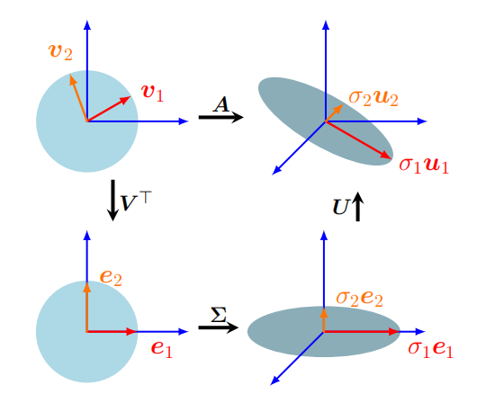

## 4.5 奇异值分解

矩阵的奇异值分解（SVD）是线性代数中的一种核心矩阵分解方法。它被称为“线性代数的基本定理”（Strang, 1993），因为它可以应用于所有矩阵，而不仅仅是方阵，并且它总是存在。此外，正如我们将在下文探讨的，矩阵$A$的SVD，它代表了一个线性映射$\Phi:V\to W$，量化了这两个向量空间底层几何之间的变化。我们推荐阅读Kalman（1996）以及Roy和Banerjee（2014）的工作，以更深入地了解SVD的数学原理。

**定理 4.22（SVD定理）**。设$A\in\mathbb{R}^{m\times n}$是一个秩为$r\in [ 0, \min ( m, n) ]$的矩形矩阵。A的SVD是一种形式如下的分解：

(4.64)

其中，$\boldsymbol{U}\in \mathbb{R} ^{m\times m}$是一个正交矩阵，其列向量为$\boldsymbol{u}_i, i= 1, \ldots , m$；$\boldsymbol{V}\in\mathbb{R}^{n\times n}$也是一个正交矩阵，其列向量为$\boldsymbol{v}_j, j=1,\ldots,n$。此外，$\Sigma$是一个$m\times n$矩阵，其对角线元素$\Sigma_{ii}=\sigma_i\geqslant0$，且当$i\neq j$时，$\Sigma_{ij}=0$。

$\Sigma$的对角线元素$\sigma_i,i=1,\ldots,r$被称为奇异值；$\boldsymbol{u}_i$被称为左奇异向量；而$\boldsymbol{v}_j$（在原文中错误地标记为左奇异向量，实际上应为右奇异向量）被称为右奇异向量。按照惯例，奇异值是有序的，即$\sigma_1\geqslant\sigma_2\geqslant\ldots\geqslant\sigma_r\geqslant0$。

奇异值矩阵$\Sigma$是唯一的，但需要注意。观察到$\Sigma\in\mathbb{R}^{m\times n}$是矩形的。特别是，$\Sigma$与$A$具有相同的矩阵尺寸。这意味着$\Sigma$有一个包含奇异值的对角子矩阵，并且需要额外的零填充。具体来说，如果$m>n$，则矩阵$\Sigma$在行$n$之前具有对角结构，然后从$n+1$行到$m$行由零行向量组成，使得

$$
\boldsymbol{\Sigma}=\begin{bmatrix}\sigma_1&0&0\\0&\ddots&0\\0&0&\sigma_n\\0&\dots&0\\\vdots&&\vdots\\0&\dots&0\end{bmatrix} \tag{4.65}
$$
如果$m<n$，则矩阵$\Sigma$在列$m$之前具有对角结构，而从$m+1$列到$n$列由零列向量组成：

$$
\boldsymbol{\Sigma}=\begin{bmatrix}\sigma_1&0&0&0&\dots&0\\0&\ddots&0&\vdots&&\vdots\\0&0&\sigma_m&0&\dots&0\end{bmatrix}\tag{4.66}
$$
**备注**。对于任何矩阵$A\in\mathbb{R}^{m\times n}$，其SVD都是存在的。

**图4.8**

### 4.5.1 奇异值分解的图形表示

奇异值分解（SVD）提供了几何直观性来描述变换矩阵$A$。接下来，我们将讨论SVD作为在基上顺序执行的线性变换。在示例4.12中，我们将SVD的变换矩阵应用于$\mathbb{R}^2$中的一组向量，这使我们能够更清晰地看到每个变换的效果。

矩阵的SVD可以被解释为相应线性映射（回顾第2.7.1节）$\Phi:\mathbb{R}^n\to\mathbb{R}^m$分解为三个操作；见图4.8。SVD的直观理解在表面上与我们的特征分解直观理解具有相似的结构，见图4.7。广义而言，SVD通过$V^\top$进行基变换，随后通过奇异值矩阵$\Sigma$进行尺度变换和维度增加（或减少）。最后，它通过$U$进行第二次基变换。SVD包含了许多重要的细节和注意事项，因此我们将更详细地回顾我们的直观理解。

1. 矩阵$V$在域$\mathbb{R}^n$中从基$\tilde{B}$（在图4.8的左上角由红色和橙色向量$v_1$和$v_2$表示）变换到标准基$B$。$V^\top=V^{-1}$从基$\bar{B}$变换到基$\tilde{B}$。现在，红色和橙色向量与图4.8左下角的规范基对齐。

2. 将坐标系更改为$\tilde{B}$后，$\Sigma$通过奇异值$\sigma_i$缩放新的坐标（并增加或删除维度），即$\Sigma$是相对于$\tilde{B}$和$\tilde{C}$的$\Phi$的变换矩阵，在图4.8的右下角，由红色和橙色向量被拉伸并位于$e_1$-$e_2$平面上（现在嵌入在第三个维度中）来表示。

3. $U$在陪域$\mathbb{R}^m$中从基$\bar{C}$变换到$\mathbb{R}^m$的规范基，这表现为红色和橙色向量从$e_1-e_2$平面旋转出来，如图4.8的右上角所示。

SVD在域和陪域中都表示了基的变换。这与在同一向量空间内操作的特征分解形成对比，在特征分解中，应用相同的基变换然后撤销它。SVD的特殊之处在于，这两个不同的基同时通过奇异值矩阵$\Sigma$相互关联。

> **例4.12 向量与SVD**
>
> 考虑一个向量方格$\mathcal{X}\in\mathbb{R}^2$的映射，这些向量适合位于以原点为中心的$2\times2$大小的盒子中。使用标准基，我们使用以下公式映射这些向量：
>
> $$
> \begin{aligned}
> \boldsymbol{A} &= \begin{bmatrix}1 & -0.8 \\ 0 & 1 \\ 1 & 0\end{bmatrix} = \boldsymbol{U\Sigma V}^\top \\
> &= \begin{bmatrix}-0.79 & 0 & -0.62 \\ 0.38 & -0.78 & -0.49 \\ -0.48 & -0.62 & 0.62\end{bmatrix}
> \begin{bmatrix}1.62 & 0 \\ 0 & 1.0 \\ 0 & 0\end{bmatrix}
> \begin{bmatrix}-0.78 & 0.62 \\ -0.62 & -0.78\end{bmatrix}
> \end{aligned} \tag{4.67}
> $$
> 我们从一组以网格形式排列的向量$\chi$（彩色点；见图4.9的左上角面板）开始。然后，我们应用$V^\top\in\mathbb{R}^{2\times2}$，它旋转了$\mathcal{X}$。旋转后的向量显示在图4.9的左下角面板中。现在，我们使用奇异值矩阵$\Sigma$将这些向量映射到陪域$\mathbb{R}^3$（见图4.9的右下角面板）。注意，所有向量都位于$x_1-x_2$平面上。第三个坐标始终为0。$x_1-x_2$平面上的向量已被奇异值拉伸。
>
> 向量$\chi$通过$A$直接映射到陪域$\mathbb{R}^3$等于通过$U\Sigma V^\top$对$\mathcal{X}$进行变换，其中$U$在陪域$\mathbb{R}^3$内进行旋转，使得映射后的向量不再局限于$x_1-x_2$平面；它们仍然位于一个平面上，如图4.9的右上角面板所示。
>
> 
>
> **图4.9 SVD与向量映射（用圆盘表示）。各面板遵循与图4.8相同的逆时针结构**

### 4.5.2 奇异值分解（SVD）的构建

接下来，我们将讨论为什么奇异值分解（SVD）存在，并详细展示如何计算它。一般矩阵的SVD与方阵的特征分解有一些相似之处。

**注**：比较对称正定（SPD）矩阵的特征分解
$$S=S^{\top}=PDP^{\top}$$
(4.68)
与相应的SVD
$$S=U\Sigma V^{\top}\:.$$
(4.69)

如果我们设置
$$U=P=V\:,\quad D=\Sigma\:,$$
(4.70)

$\diamondsuit$

我们可以看到，SPD矩阵的SVD就是其特征分解。

接下来，我们将探讨为什么定理4.22成立以及SVD是如何构建的。计算$A\in\mathbb{R}^{m\times n}$的SVD等价于找到陪域$\mathbb{R}^m$和定义域$\mathbb{R}^n$的两组正交归一基$U=(\boldsymbol{u}_1,\ldots,\boldsymbol{u}_m)$和$V=(v_1,\ldots,v_n)$。从这些有序基中，我们将构建矩阵$U$和$V$。

我们的计划是从构建右奇异向量的正交归一集合$v_1,\ldots,v_n\in\mathbb{R}^n$开始。然后，我们构建左奇异向量的正交归一集合$u_1,\ldots,u_m\in\mathbb{R}^m$。之后，我们将两者联系起来，并要求在$A$的变换下保持$v_i$的正交性。这很重要，因为我们知道$Av_i$形成的集合是正交向量。然后，我们将通过标量因子对这些图像进行归一化，这些标量因子最终将是奇异值。

让我们从构建右奇异向量开始。谱定理（定理4.15）告诉我们，对称矩阵的特征向量形成一个正交归一基（ONB），这也意味着它可以被对角化。此外，根据定理4.14，我们可以从任何矩形矩阵$A\in\mathbb{R}^{m\times n}$构造一个对称、半正定矩阵$A^\top A\in\mathbb{R}^{n\times n}$。因此，我们总是可以对$A^\top A$进行对角化，并得到
$$A^\top A=PDP^\top=P\begin{bmatrix}\lambda_1&\cdots&0\\\vdots&\ddots&\vdots\\0&\cdots&\lambda_n\end{bmatrix}P^\top\:,$$
(4.71)

其中$P$是一个正交矩阵，由正交归一的特征基组成。$\lambda_i\geqslant0$是$A^\top A$的特征值。假设$A$的SVD存在，并将(4.64)代入(4.71)，得到
$$A^\top A=(U\Sigma V^\top)^\top(U\Sigma V^\top)=V\Sigma^\top U^\top U\Sigma V^\top\:,$$
(4.72)

其中$U,V$是正交矩阵。因此，由于$U^\top U=I$，我们得到
$$A^\top A=V\Sigma^\top\Sigma V^\top=\boldsymbol{V}\begin{bmatrix}\sigma_1^2&0&0\\0&\ddots&0\\0&0&\sigma_n^2\end{bmatrix}\boldsymbol{V}^\top\:.$$
(4.73)

现在比较(4.71)和(4.73)，我们可以确定
$$\begin{aligned}V^{\top}&=P^{\top}\:,\\\sigma_{i}^{2}&=\lambda_{i}\:.\end{aligned}$$
(4.74) (4.75)

因此，组成$P$的$A^\top A$的特征向量是$A$的右奇异向量$V$（见(4.74)）。$A^\top A$的特征值是$\Sigma$的奇异值的平方（见(4.75)）。

为了得到左奇异向量$U$，我们遵循类似的程序。我们首先计算对称矩阵$AA^{\top}\in\mathbb{R}^{m\times m}$（而不是之前的$A^\top\boldsymbol{A}\in\mathbb{R}^{n\times n}$）的SVD。$A$的SVD得到

(4.76a)
$$\begin{aligned}\boldsymbol{A}\boldsymbol{A}^{\top}&=(\boldsymbol{U}\boldsymbol{\Sigma}\boldsymbol{V}^{\top})(\boldsymbol{U}\boldsymbol{\Sigma}\boldsymbol{V}^{\top})^{\top}=\boldsymbol{U}\boldsymbol{\Sigma}\boldsymbol{V}^{\top}\boldsymbol{V}\boldsymbol{\Sigma}^{\top}\boldsymbol{U}^{\top}\\&=\boldsymbol{U}\begin{bmatrix}\sigma_1^2&0&0\\0&\ddots&0\\0&0&\sigma_m^2\end{bmatrix}U^\top.\end{aligned}$$

(4.76b) 的翻译：

谱定理告诉我们，$AA^\top=SDS^\top$ 可以被对角化，我们可以找到 $AA^\top$ 的特征向量的一个正交归一基（ONB），这些特征向量被收集在 $S$ 中。$AA^\top$ 的正交归一特征向量是左奇异向量 $U$，并在奇异值分解（SVD）的值域中形成一个正交归一基。

接下来是矩阵 $\Sigma$ 的结构问题。由于 $AA^\top$ 和 $A^\top A$ 有相同的非零特征值（见第106页），因此在两种情况的SVD中，$\Sigma$ 矩阵的非零元素必须相同。最后一步是将我们到目前为止所触及的所有部分连接起来。我们在 $V$ 中有一个右奇异向量的正交归一集。为了完成SVD的构建，我们将它们与正交归一向量 $U$ 连接起来。为了达到这个目标，我们使用了一个事实，即 $A$ 下的 $v_i$ 的像也必须是正交的。我们可以通过使用第3.4节的结果来证明这一点。我们要求 $Av_i$ 和 $Av_j$ 之间的内积必须为0，对于 $i\neq j$。对于任何两个正交的特征向量 $v_i, v_j, i\neq j$，都有

$$(A\boldsymbol{v}_{i})^{\top}(\boldsymbol{A}\boldsymbol{v}_{j})=\boldsymbol{v}_{i}^{\top}(\boldsymbol{A}^{\top}\boldsymbol{A})\boldsymbol{v}_{j}=\boldsymbol{v}_{i}^{\top}(\lambda_{j}\boldsymbol{v}_{j})=\lambda_{j}\boldsymbol{v}_{i}^{\top}\boldsymbol{v}_{j}=0$$

(4.77)

对于 $m\geqslant r$ 的情况，$\{\boldsymbol{A}v_1,\ldots,\boldsymbol{A}v_r\}$ 是R$^m$中一个$r$维子空间的基础。为了完成SVD的构建，我们需要左奇异向量是正交归一的：我们将右奇异向量 $Av_i$ 的像进行归一化，得到

(4.78)

$$u_{i}:=\frac{Av_{i}}{\|Av_{i}\|}=\frac{1}{\sqrt{\lambda_{i}}}Av_{i}=\frac{1}{\sigma_{i}}Av_{i}\:,$$

其中最后一个等式是从(4.75)和(4.76b)中得出的，表明$AA^\top$的特征值满足$\sigma_i^2=\lambda_i$。因此，$A^\top A$的特征向量（我们知道它们是右奇异向量$v_i$）和它们在$A$下的归一化像（左奇异向量$u_i$）形成了两个通过奇异值矩阵$\Sigma$连接的自洽正交归一基（ONBs）。

让我们重新排列(4.78)以得到奇异值方程

$$A\boldsymbol{v}_i=\sigma_i\boldsymbol{u}_i\:,\quad i=1,\ldots,r\:.$$

(4.79)

这个方程与特征值方程(4.25)非常相似，但左右两边的向量并不相同。

对于 $n<m$，(4.79) 仅对 $i\leqslant n$ 成立，但(4.79)对 $i>n$ 的 $u_i$ 没有说明。然而，我们通过构造知道它们是正交归一的。相反，对于 $m<n$，(4.79) 仅对 $i\leqslant m$ 成立。对于 $i>m$，我们有 $Av_i=0$，并且我们仍然知道 $v_i$ 形成一个正交归一集。这意味着SVD还提供了 $A$ 的核（零空间）的一个正交归一基，即满足 $Ax=0$ 的向量集（见第2.7.3节）。将 $v_i$ 作为 $V$ 的列，$u_i$ 作为 $U$ 的列进行拼接，得到

$$AV=U\Sigma\:,$$

(4.80)

其中 $\Sigma$ 与 $A$ 有相同的维度，并且在第1到第$r$行具有对角结构。因此，右乘 $V^\top$ 得到 $A=U\Sigma V^\top$，这就是 $A$ 的SVD。

> **例 4.13（计算奇异值分解）**
>
> 让我们找到矩阵
>
> $$ \boldsymbol A = \begin{bmatrix} 1 & 0 & 1 \\ -2 & 1 & 0 \end{bmatrix} $$
>
> 的奇异值分解。
>
> 奇异值分解（SVD）要求我们计算右奇异向量 $v_j$，奇异值 $\sigma_k$，以及左奇异向量 $u_i$。
>
> **步骤 1：右奇异向量作为 $A^\top A$ 的特征基。**
>
> 首先，我们计算
>
> $$ \boldsymbol A^\top \boldsymbol A = \begin{bmatrix} 1 & -2 \\ 0 & 1 \\ 1 & 0 \end{bmatrix} \begin{bmatrix} 1 & 0 & 1 \\ -2 & 1 & 0 \end{bmatrix} = \begin{bmatrix} 5 & -2 & 1 \\ -2 & 1 & 0 \\ 1 & 0 & 1 \end{bmatrix} $$
>
> 接着，我们通过 $A^\top A$ 的特征值分解来计算奇异值和右奇异向量 $v_j$。$A^\top A$ 的特征值分解为
>
> $$ \boldsymbol{A}^\top\boldsymbol{A} = \begin{bmatrix} \frac{5}{\sqrt{30}} & 0 & \frac{-1}{\sqrt{6}} \\ \frac{-2}{\sqrt{30}} & \frac{1}{\sqrt{5}} & \frac{-2}{\sqrt{6}} \\ \frac{1}{\sqrt{30}} & \frac{2}{\sqrt{5}} & \frac{1}{\sqrt{6}} \end{bmatrix} \begin{bmatrix} 6 & 0 & 0 \\ 0 & 1 & 0 \\ 0 & 0 & 0 \end{bmatrix} \begin{bmatrix} \frac{5}{\sqrt{30}} & \frac{-2}{\sqrt{30}} & \frac{1}{\sqrt{30}} \\ 0 & \frac{1}{\sqrt{5}} & \frac{2}{\sqrt{5}} \\ \frac{-1}{\sqrt{6}} & \frac{-2}{\sqrt{6}} & \frac{1}{\sqrt{6}} \end{bmatrix} = \boldsymbol{PDP}^\top $$
>
> 从中我们可以得到右奇异向量为 $P$ 的列向量，即
>
> $$ V = P = \begin{bmatrix} \frac{5}{\sqrt{30}} & 0 & \frac{-1}{\sqrt{6}} \\ \frac{-2}{\sqrt{30}} & \frac{1}{\sqrt{5}} & \frac{-2}{\sqrt{6}} \\ \frac{1}{\sqrt{30}} & \frac{2}{\sqrt{5}} & \frac{1}{\sqrt{6}} \end{bmatrix} $$
>
> **步骤 2：奇异值矩阵。**
>
> 奇异值 $\sigma_i$ 是 $A^\top A$ 特征值的平方根，我们可以直接从 $D$ 中获得它们。由于 $\text{rk}(\boldsymbol{A})=2$，只有两个非零奇异值：$\sigma_1 = \sqrt{6}$ 和 $\sigma_2 = 1$。奇异值矩阵必须与 $A$ 的大小相同，我们得到
>
> $$ \boldsymbol{\Sigma} = \begin{bmatrix} \sqrt{6} & 0 & 0 \\ 0 & 1 & 0 \end{bmatrix} $$
>
> **步骤 3：左奇异向量作为右奇异向量在 $A$ 下的归一化像。**
>
> 我们通过计算右奇异向量在 $A$ 下的像并将它们除以对应的奇异值来归一化，从而找到左奇异向量。我们得到
>
> (4.86)
> $$\begin{aligned}&\boldsymbol{u}_{1}=\frac{1}{\sigma_{1}}\boldsymbol{A}\boldsymbol{v}_{1}=\frac{1}{\sqrt{6}}\begin{bmatrix}1&0&1\\-2&1&0\end{bmatrix}\begin{bmatrix}\frac{5}{\sqrt{30}}\\\frac{-2}{\sqrt{30}}\\\frac{1}{\sqrt{30}}\end{bmatrix}=\begin{bmatrix}\frac{1}{\sqrt{5}}\\-\frac{2}{\sqrt{5}}\end{bmatrix}\:,\\&\boldsymbol{u}_{2}=\frac{1}{\sigma_{2}}\boldsymbol{A}\boldsymbol{v}_{2}=\frac{1}{1}\begin{bmatrix}1&0&1\\-2&1&0\end{bmatrix}\begin{bmatrix}0\\\frac{1}{\sqrt{5}}\\\frac{2}{\sqrt{5}}\end{bmatrix}=\begin{bmatrix}\frac{2}{\sqrt{5}}\\\frac{1}{\sqrt{5}}\end{bmatrix}\:,\\&\boldsymbol{U}=[\boldsymbol{u}_{1},\boldsymbol{u}_{2}]=\frac{1}{\sqrt{5}}\begin{bmatrix}1&2\\-2&1\end{bmatrix}\:.\end{aligned}$$
> (4.87)
>
> (4.88)
>
> 注意到在一台计算机上执行这里描述的操作时数值计算性能并不好，因此矩阵A的SVD分解通常是在没有对$A^TA$进行特征值分解并重排的情况下计算的。

### 4.5.3 特征值分解与奇异值分解

让我们考虑特征值分解 $A=PDP^{-1}$ 和奇异值分解（SVD）$A=U\Sigma V^\top$，并回顾前几节的核心内容。

- 对于任意矩阵 $R^{m\times n}$，奇异值分解总是存在的。而特征值分解仅对方阵 $\mathbb{R}^{n\times n}$ 定义，并且仅当我们可以找到 $R^n$ 的特征向量基时才存在。

- 在特征值分解矩阵 $P$ 中的向量不一定是正交的，即基变换不仅仅是旋转和缩放。另一方面，在SVD中的矩阵 $U$ 和 $V$ 的向量是正交归一的，因此它们确实表示旋转。

- 特征值分解和奇异值分解都是三个线性映射的组合：

1. 域中的基变换
2. 对每个新基向量的独立缩放以及从域到陪域的映射
3. 陪域中的基变换

**图4.10 四部电影的三人电影评分及其SVD分解**

特征值分解与奇异值分解之间的一个关键区别在于，在奇异值分解中，域和陪域可以是不同维度的向量空间。

- 在奇异值分解中，左奇异向量矩阵 $U$ 和右奇异向量矩阵 $V$ 通常不是彼此的逆（它们在不同的向量空间中进行基变换）。在特征值分解中，基变换矩阵 $P$ 和 $P^{-1}$ 是彼此的逆。

- 在奇异值分解中，对角矩阵 $\Sigma$ 中的元素都是实数且非负，这在特征值分解的对角矩阵中通常不成立。

- 奇异值分解和特征值分解通过它们的投影密切相关：
  - $A$ 的左奇异向量是 $AA^\top$ 的特征向量。
  - $A$ 的右奇异向量是 $A^\top A$ 的特征向量。
  - $A$ 的非零奇异值是 $AA^\top$ 和 $A^\top A$ 的非零特征值的平方根。

- 对于对称矩阵 $A\in\mathbb{R}^{n\times n}$，根据谱定理 4.15，其特征值分解和奇异值分解是相同的。

> **例 4.14（在电影评分和消费者中寻找结构）** 
>
> 让我们通过分析人们对电影偏好的数据，对奇异值分解（SVD）进行实际解释。考虑三位观众（阿里、贝阿特丽克丝、钱德拉）对四部不同电影（星球大战、银翼杀手、天使爱美丽、美味）的评分。他们的评分介于 0（最差）和 5（最好）之间，并编码在一个数据矩阵 $A\in\mathbb{R}^{4\times3}$ 中，如图 4.10 所示。每一行代表一部电影，每一列代表一个用户。因此，每部电影评分的列向量（每位观众一个）分别是 $x_{\text{Ali}}, x_{\text{Beatrix}}, x_{\text{Chandra}}$。
>
> 使用 SVD 对 $A$ 进行因式分解，可以帮助我们捕捉人们如何对电影进行评分的关系，特别是如果存在将哪些人喜欢哪些电影联系起来的结构。将 SVD 应用到我们的数据矩阵 $A$ 上，我们做出了一系列假设：
>
> 1. 所有观众都使用相同的线性映射来一致地评分电影。
> 2. 评分中没有错误或噪声。
> 3. 我们将左奇异向量 $u_i$ 解释为典型电影，将右奇异向量 $v_j$ 解释为典型观众。
>
> 然后，我们假设任何观众对特定电影的偏好都可以表示为 $v_j$ 的线性组合。同样地，任何电影的受喜爱程度也可以表示为 $u_i$ 的线性组合。SVD 域中的向量可以被解释为“典型观众空间”中的观众，而 SVD 陪域中的向量则相应地被解释为“典型电影空间”中的电影。让我们检查我们电影-用户矩阵的 SVD。第一个左奇异向量 $u_1$ 在两部科幻电影上有较大的绝对值，并且具有较大的第一个奇异值（图 4.10 中的红色阴影）。因此，这将一类具有特定电影集（科幻主题）的用户进行了分组。类似地，第一个右奇异向量 $v_1$ 显示阿里和贝阿特丽克丝具有较大的绝对值，他们给科幻电影打了高分（图 4.10 中的绿色阴影）。这表明 $v_1$ 反映了科幻爱好者的概念。
>
> 同样地，$u_2$ 似乎捕捉了法国艺术电影的主题，而 $v_2$ 则表明钱德拉接近于这种电影的理想化爱好者。一个理想化的科幻爱好者是纯粹的，只喜欢科幻电影，所以科幻爱好者 $v_1$ 除了科幻主题的电影外，对其他一切都打零分——这是由奇异值矩阵 $\Sigma$ 的对角子结构所隐含的逻辑。因此，一部特定的电影通过它如何（线性地）分解为典型电影来表示。同样地，一个人也会通过他们如何（通过线性组合）分解为电影主题来表示。

值得简要讨论一下SVD（奇异值分解）的术语和约定，因为文献中存在不同的版本。尽管这些差异可能会令人困惑，但数学本质是不变的。

- 为了方便表示和抽象，我们使用一种SVD表示法，其中SVD被描述为具有两个方形的左奇异向量矩阵和右奇异向量矩阵，但奇异值矩阵是非方形的。我们对SVD的定义（4.64）有时被称为“完全SVD（fullSVD）”。

- 一些作者以略有不同的方式定义SVD，并关注方形奇异矩阵。然后，对于$A\in\mathbb{R}^{m\times n}$且$m\geqslant n$，

(4.89)
$$A_{m\times n}=U_{m\times n}\sum_{n\times n}V_{n\times n}^{\top}\:.$$

这里，$A_{m\times n}$是原始矩阵，$U_{m\times n}$是一个$m\times n$的矩阵，其列是左奇异向量；$\sum_{n\times n}$（注意这里通常使用大写希腊字母Σ表示，但在这里用求和符号的简化形式表示）是一个$n\times n$的对角矩阵，其对角线上的元素是奇异值；$V_{n\times n}^{\top}$是$V_{n\times n}$的转置，$V_{n\times n}$是一个$n\times n$的矩阵，其列是右奇异向量。这种表示法在某些文献中也被使用，尽管它并不是SVD的唯一表示方式。

有时，这种表述被称为简化SVD（例如，Datta (2010)）或仅称为SVD（例如，Press et al. (2007)）。这种替代格式仅仅改变了矩阵的构建方式，但保留了SVD的数学结构不变。这种替代表述的便利之处在于$\Sigma$是对角矩阵，就像特征值分解一样。

- 在第4.6节中，我们将学习使用SVD的矩阵近似技术，这也被称为截断SVD。

- 可以定义一个秩为$r$的矩阵$A$的SVD，使得$U$是一个$m\times r$矩阵，$\boldsymbol\Sigma$是一个$r\times r$的对角矩阵，而$V$是一个$n\times r$矩阵。这种构造与我们的定义非常相似，并确保了对角矩阵$\Sigma$的对角线上只有非零元素。这种替代记法的主要便利之处在于$\Sigma$是对角矩阵，就像特征值分解一样。

- 实际上，对于$A$的SVD仅适用于$m\times n$矩阵且$m>n$的限制是不必要的。当$m<n$时，SVD分解将产生一个$\Sigma$，其零列的数量多于行的数量，因此，奇异值$\sigma_{m+1},\ldots,\sigma_n$都是0。

SVD在机器学习中有多种应用，从曲线拟合中的最小二乘问题到线性方程组的求解。这些应用利用了SVD的各种重要属性，包括它与矩阵秩的关系，以及它用低秩矩阵近似给定秩矩阵的能力。用SVD替换矩阵通常具有使计算对数值舍入误差更鲁棒的优势。正如我们将在下一节中探讨的那样，SVD能够以原则性的方式用“更简单”的矩阵近似矩阵，从而开辟了从降维和主题建模到数据压缩和聚类的各种机器学习应用。

