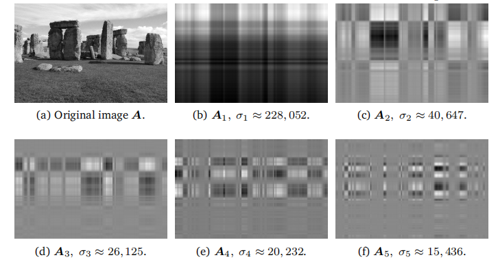
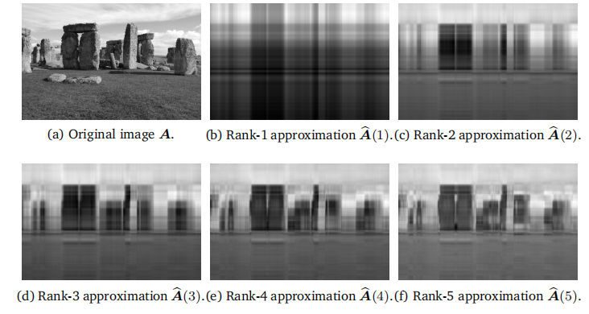
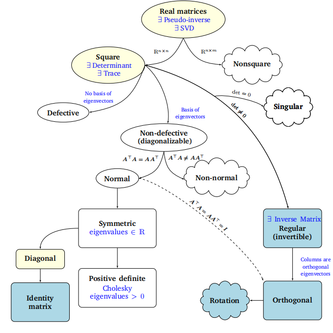

## 4.6 矩阵近似

我们将SVD视为一种将$A=U\Sigma V^\top\in\mathbb{R}^{m\times n}$分解为三个矩阵乘积的方法，其中$U\in\mathbb{R}^{m\times m}$和$V\in\mathbb{R}^{n\times n}$是正交矩阵，而$\Sigma$在其主对角线上包含奇异值。现在，我们不进行完整的SVD分解，而是研究SVD如何允许我们将矩阵$A$表示为更简单（低秩）的矩阵$A_i$之和，这种表示法构成了一种矩阵近似方案，其计算成本低于完整的SVD。

我们构造一个秩为1的矩阵$A_i\in\mathbb{R}^{m\times n}$，形式为
$$A_i:=u_iv_i^\top$$
(4.90)

这是由$U$和$V$的第$i$个正交列向量的外积形成的。图4.11展示了巨石阵的图像，该图像可以由一个矩阵$A\in\mathbb{R}^{1432\times1910}$来表示，以及根据(4.90)定义的一些外积$A_i$。

**图4.11 使用SVD进行图像处理。(a) 原始灰度图像是一个$1,432\times1,910$的矩阵，其值介于0（黑色）和1（白色）之间。(b)-(f) 秩为1的矩阵$A_1,\ldots,A_5$及其对应的奇异值$\sigma_1,\ldots,\sigma_5$。每个秩为1矩阵的网格状结构是由左奇异向量和右奇异向量的外积形成的。**

一个秩为$r$的矩阵$A\in\mathbb{R}^{m\times n}$可以表示为秩为1的矩阵$A_i$之和，即
$$A=\sum_{i=1}^{r}\sigma_{i}\boldsymbol{u}_{i}\boldsymbol{v}_{i}^{\top}=\sum_{i=1}^{r}\sigma_{i}\boldsymbol{A}_{i}$$
(4.91)

其中，外积矩阵$A_i$由第$i$个奇异值$\sigma_i$加权。我们可以理解为什么(4.91)成立：奇异值矩阵$\Sigma$的对角结构仅将匹配的左奇异向量和右奇异向量$u_iv_i^\top$相乘，并按相应的奇异值$\sigma_i$进行缩放。所有$i\neq j$的项$\sum_ij\boldsymbol{u}_i\boldsymbol{v}_j^\top$都消失，因为$\Sigma$是对角矩阵。任何$i>r$的项都消失，因为相应的奇异值为0。

在(4.90)中，我们引入了秩为1的矩阵$A_i$。我们将$r$个单独的秩为1的矩阵相加，以得到一个秩为$r$的矩阵$A$；参见(4.91)。如果求和不是遍历所有矩阵$\boldsymbol{A}_i,i=1,\ldots,r$，而是仅到某个中间值$k<r$，则我们得到一个秩为$k$的近似

(4.92)
$$\hat{\boldsymbol{A}}(k):=\sum_{i=1}^k\sigma_i\boldsymbol{u}_i\boldsymbol{v}_i^\top=\sum_{i=1}^k\sigma_i\boldsymbol{A}_i$$

其中，rk$(\widehat{\boldsymbol{A}}(k))=k$。图4.12展示了巨石阵原始图像$A$的低秩近似$\widehat{\boldsymbol{A}}(k)$。在秩为5的近似中，岩石的形状变得越来越清晰可辨。虽然原始图像需要$1,432\cdot1,910=2,735,120$个数字来表示，但秩为5的近似仅需要存储五个奇异值以及五个左奇异向量和右奇异向量（每个都是1,432维和1,910维），总共需要$5\cdot(1,432+1,910+1)=16,715$个数字——仅为原始数据的$0.6\%$多一点。

为了测量矩阵$A$与其秩为$k$的近似$\widehat{\boldsymbol{A}}(k)$之间的差异（误差），我们需要范数的概念。在3.1节中，我们已经使用了向量的范数来衡量向量的长度。类似地，我们也可以定义矩阵的范数。

**图4.12 使用SVD进行图像重建。(a) 原始图像。(b)-(f) 使用SVD的低秩近似进行图像重建，其中近似由${\tilde{A}}(k) = \sum_{i=1}^{k}\sigma_{i}A_{i}$给出。**

**定义 4.23（矩阵的谱范数）**。对于$x\in\mathbb{R}^n\backslash\{0\}$，矩阵$\dot{A}\in\mathbb{R}^{m\times n}$的谱范数定义为
$$\left\|A\right\|_{2}:=\max_{x}\frac{\left\|Ax\right\|_{2}}{\left\|x\right\|_{2}}\:.$$
(4.93)

我们在矩阵范数（左侧）中引入了下标的符号，这与向量的欧几里得范数（右侧）类似，后者有下标2。谱范数（4.93）决定了任何向量$x$在乘以$A$之后可能达到的最大长度。

**定理 4.24**。矩阵$A$的谱范数是其最大的奇异值$\sigma_1$。

此定理的证明我们留作练习。

**Eckart-Young 定理 4.25（Eckart 和 Young, 1936）**。考虑一个秩为$r$的矩阵$A\in \mathbb{R} ^{m\times n}$，以及一个秩为$k$的矩阵$B\in \mathbb{R} ^{m\times n}$。对于任意$k\leqslant r$，且$\hat{\boldsymbol{A}} ( k) = \sum _{i= 1}^{k}\sigma _{i}u_{i}v_{i}^{\top }$，则
(4.94)
$$\begin{aligned}\widehat{\boldsymbol{A}}(k)&=\operatorname{argmin}_{\operatorname{rk}(\boldsymbol{B})=k}\left\|\boldsymbol{A}-\boldsymbol{B}\right\|_{2}\:,\\\left\|\boldsymbol{A}-\widehat{\boldsymbol{A}}(k)\right\|_{2}&=\sigma_{k+1}\:.\end{aligned}$$
(4.95)

Eckart-Young 定理明确指出了我们使用秩为$k$的近似来近似$A$时引入的误差量。我们可以将使用SVD获得的秩$k$近似解释为全秩矩阵$A$在秩至多为$k$的矩阵构成的低维空间上的投影。在所有可能的投影中，SVD使$A$与任何秩$k$近似之间的误差（就谱范数而言）最小化。

我们可以通过回顾一些步骤来理解为什么（4.95）应该成立。我们观察到，$\boldsymbol{A}-\widehat{\boldsymbol{A}}(k)$之间的差异是一个矩阵，它包含了剩余秩为1的矩阵的总和。

(4.96)
$$\boldsymbol{A}-\widehat{\boldsymbol{A}}(k)=\sum_{i=k+1}^{r}\sigma_{i}\boldsymbol{u}_{i}\boldsymbol{v}_{i}^{\top}\:.$$

根据定理4.24，我们立即得到$\sigma_{k+1}$作为差异矩阵的谱范数。现在让我们更仔细地看一下(4.94)。如果我们假设存在另一个矩阵$B$，其秩rk$(\boldsymbol{B})\leqslant k$，使得

(4.97)
$$\left\|A-B\right\|_{2}<\left\|A-\widehat{A}(k)\right\|_{2}\:,$$

那么存在一个至少$(n-k)$-维的零空间$Z\subseteq\mathbb{R}^n$，使得对于任意$x\in Z$，都有$Bx=0$。由此可得

$$\left\|Ax\right\|_2=\left\|(A-B)x\right\|_2\:,$$
(4.98)

并使用柯西-施瓦茨不等式（3.17）的一个版本，该版本涵盖了矩阵的范数，我们得到

$$\left\|Ax\right\|_{2}\leqslant\left\|A-B\right\|_{2}\left\|x\right\|_{2}<\sigma_{k+1}\left\|x\right\|_{2}\:.$$
(4.99)

然而，存在一个$(k+1)$-维子空间，其中$\|Ax\|_2\geqslant \sigma _{k+ 1}\| x\| _2$，这个子空间由$\boldsymbol{A}$的右奇异向量$v_j, j\leqslant k+ 1$张成。将这两个空间的维度相加会得到一个大于$n$的数，因为这两个空间中必须存在一个非零向量。这与第2.7.3节中的秩-零度定理（定理2.24）相矛盾。

Eckart-Young定理意味着我们可以使用SVD以有原则且最优（在谱范数意义上）的方式将秩为$r$的矩阵$A$减少到秩为$k$的矩阵$\hat{A}$。我们可以将$A$由秩为$k$的矩阵近似视为一种有损压缩的形式。因此，矩阵的低秩近似出现在许多机器学习应用中，例如图像处理、噪声过滤和不适定问题的正则化。此外，正如我们将在第10章中看到的，它在降维和主成分分析中发挥着关键作用。

> **例4.15（在电影评分和消费者中寻找结构（续））**
>
> 回到我们的电影评分示例中，我们现在可以应用低秩近似的概念来近似原始数据矩阵。回想一下，我们的第一个奇异值捕捉了电影中科幻主题和科幻爱好者的概念。因此，通过仅使用电影评分矩阵的秩-1分解中的第一个奇异值项，我们得到预测的评分
>
> $\left\lceil-0.6710\right\rceil$
> $\boldsymbol{A}_1= \boldsymbol{u}_1\boldsymbol{v}_1^\top = \begin{vmatrix} - 0. 7197\\ - 0. 0939\end{vmatrix} \begin{bmatrix} - 0. 7367& - 0. 6515& - 0. 1811\end{bmatrix}$ (4.100a)
> $\left\lfloor-0.1515\right\rfloor$
>
> (4.100b)
> $$=\begin{bmatrix}0.4943&0.4372&0.1215\\0.5302&0.4689&0.1303\\0.0692&0.0612&0.0170\\0.1116&0.0987&0.0274\end{bmatrix}.$$
>
> 这个第一个秩-1近似$A_{1}$是富有洞察力的：它告诉我们阿里和贝阿特丽克斯喜欢科幻电影，如《星球大战》和《银翼杀手》（条目值> 0.4），但未能捕捉到钱德拉对其他电影的评分。这并不奇怪，因为钱德拉喜欢的电影类型没有被第一个奇异值捕捉到。第二个奇异值为我们提供了这些电影主题爱好者的更好的秩-1近似：
>
> (4.101a)
> $$\begin{aligned}\boldsymbol{A}_{2}&=\boldsymbol{u}_2\boldsymbol{v}_2^\top=\begin{bmatrix}0.0236\\0.2054\\-0.7705\\-0.6030\end{bmatrix}\begin{bmatrix}0.0852&0.1762&-0.980\end{bmatrix}\\&=\begin{bmatrix}0.0020&0.0042&-0.0231\\0.0175&0.0362&-0.2014\\-0.0656&-0.1358&0.7556\\-0.0514&-0.1063&0.5914\end{bmatrix}.\end{aligned}$$
> (4.101b)
>
> 在这个第二个秩-1近似$A_2$中，我们很好地捕捉到了钱德拉的评分和电影类型，但没有捕捉到科幻电影。这促使我们考虑秩-2近似$\hat{A}(2)$，其中我们结合了前两个秩-1近似
>
> $$\hat{\boldsymbol A}(2)=\sigma_1\boldsymbol A_1+\sigma_2\boldsymbol A_2=\begin{bmatrix}4.7801&4.2419&1.0244\\5.2252&4.7522&-0.0250\\0.2493&-0.2743&4.9724\\0.7495&0.2756&4.0278\end{bmatrix}.$$
> (4.102)
>
> $\hat{\boldsymbol{A}}(2)$与原始电影评分表相似
>
> (4.103)
> $$A=\begin{bmatrix}5&4&1\\5&5&0\\0&0&5\\1&0&4\end{bmatrix},$$
>
> 这表明我们可以忽略$A_3$的贡献。我们可以这样解释：在数据表中没有第三个电影主题/电影爱好者类别的证据。这也意味着在我们示例中，电影主题/电影爱好者的整个空间是一个由科幻电影和法国艺术电影及其爱好者所跨越的二维空间。

**图4.13 在机器学习中遇到的矩阵的计算方法演化**

