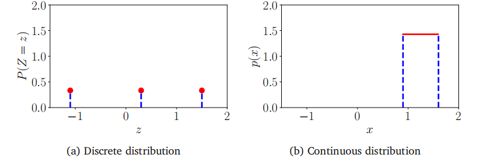

## 6.2 离散概率与连续概率

让我们将注意力集中在如何描述6.1节中介绍的事件的概率上。根据目标空间是离散的还是连续的，描述分布的自然方式是不同的。当目标空间 $\mathcal{T}$ 是离散的时，我们可以指定随机变量 $X$ 取特定值 $x\in\mathcal{T}$ 的概率，表示为 $P(X=x)$。对于离散随机变量 $X$，表达式 $P(X=x)$ 被称为概率质量函数。当目标空间 $\mathcal{T}$ 是连续的，例如实数线 $R$，则更自然地指定随机变量 $X$ 位于某个区间内的概率，对于 $a<b$，表示为 $P(a\leqslant X\leqslant b)$。按照惯例，我们指定随机变量 $X$ 小于特定值 $x$ 的概率，表示为 $P(X\leqslant x)$。对于连续随机变量 $X$，表达式 $P(X\leqslant x)$ 被称为累积分布函数。我们将在6.2.2节中讨论连续随机变量。我们将在6.2.3节中重新回顾术语，并对比离散和连续随机变量。

备注：我们将使用“单变量分布”一词来指代单个随机变量的分布（其状态用非粗体 $x$ 表示）。我们将涉及多个随机变量的分布称为多变量分布，并通常考虑随机变量的向量（其状态用粗体 $x$ 表示）。

### 6.2.1 离散概率

当目标空间是离散的时，我们可以将多个随机变量的概率分布想象为填充一个（多维）数字数组。图6.2给出了一个示例。联合概率的目标空间是每个随机变量目标空间的笛卡尔积。我们将联合概率定义为两个值共同出现的条目
$$P(X=x_i,Y=y_j)=\frac{n_{ij}}{N}\:,$$
(6.9)

其中 $n_{ij}$ 是状态为 $x_i$ 和 $y_j$ 的事件数，$N$ 是事件的总数。联合概率是两个事件交集的概率，即 $P(X=x_i, Y=y_j) = P(X=x_i \cap Y=y_j)$。图6.2展示了离散概率分布的概率质量函数（pmf）。对于两个随机变量 $X$ 和 $Y$，$X=x$ 且 $Y=y$ 的概率（简略地）写为 $p(x,y)$，并称为联合概率。我们可以将概率视为一个函数，它接受状态 $x$ 和 $y$ 并返回一个实数，这就是我们写 $p(x,y)$ 的原因。无论随机变量 $Y$ 的值如何，$X$ 取值 $x$ 的边缘概率（简略地）写为 $p(x)$。我们用 $X\sim p(x)$ 来表示随机变量 $X$ 根据 $p(x)$ 分布。如果我们只考虑 $X=x$ 的情况，那么 $Y=y$ 的实例比例（条件概率）简略地写为 $p(y \mid x)$。

**图6.2具有随机变量X和y的离散二变量概率质量函数的可视化。此图改编自Bishop（2006）。**

> **例6.2**
>
> 考虑两个随机变量 $X$ 和 $Y$，其中 $X$ 有五种可能的状态，而 $Y$ 有三种可能的状态，如图6.2所示。我们用 $n_{ij}$ 表示状态为 $X=x_i$ 和 $Y=y_j$ 的事件数，用 $N$ 表示事件的总数。值 $c_i$ 是第 $i$ 列各个频率的和，即 $c_i=\sum_{j=1}^3n_{ij}$。类似地，值 $r_j$ 是行和，即 $r_j=\sum_{i=1}^5n_{ij}$。使用这些定义，我们可以紧凑地表示 $X$ 和 $Y$ 的分布。
>
> 每个随机变量的概率分布，即边缘概率，可以看作是某一行或列的和
>
> (6.10)
> $$P(X=x_i)=\frac{c_i}{N}=\frac{\sum_{j=1}^3n_{ij}}{N}$$
> $$P(Y=y_j)=\frac{r_j}{N}=\frac{\sum_{i=1}^5n_{ij}}{N},$$
> 并且
>
> (6.11)
>
> 其中 $c_i$ 和 $r_j$ 分别是概率表的第 $i$ 列和第 $j$ 行的值。按照惯例，对于具有有限数量事件的离散随机变量，我们假设概率之和为1，即
> $$\sum_{i=1}^5P(X=x_i)=1\quad\text{和}\quad\sum_{j=1}^3P(Y=y_j)=1\:.$$
> (6.12)
>
> 条件概率是特定单元格中某一行或列的比例。例如，给定 $X$ 的条件下 $Y$ 的条件概率是
> $$P(Y=y_j\mid X=x_i)=\frac{n_{ij}}{c_i}\:,$$
> 而给定 $Y$ 的条件下 $X$ 的条件概率是
> (6.14)
> $$P(X=x_i\mid Y=y_j)=\frac{n_{ij}}{r_j}\:.$$

在机器学习中，我们使用离散概率分布来模拟分类变量，即取有限个无序值的变量。它们可以是分类特征，比如用于预测一个人薪水时所用的大学学位，也可以是分类标签，比如在手写识别中使用的字母表中的字母。离散分布也常被用于构建结合了有限数量连续分布的概率模型（第11章）。

### 6.2.2 连续概率

在本节中，我们考虑实值随机变量，即目标空间是实数线R上的区间。在本书中，我们假设可以对实值随机变量进行操作，就像我们拥有有限状态的离散概率空间一样。然而，这种简化在两种情况下并不精确：一是当我们无限次重复某件事时；二是当我们想从某个区间中抽取一个点时。第一种情况出现在我们讨论机器学习中的泛化误差时（第8章）。第二种情况出现在我们想讨论连续分布时，如高斯分布（第6.5节）。就我们的目的而言，这种不精确性允许我们对概率进行更简洁的介绍。

备注。在连续空间中，存在两个额外的技术性问题，这两个问题都是违反直觉的。首先，所有子集的集合（用于在6.1节中定义事件空间$A$）的行为不够良好。$\mathcal{A}$需要被限制在集合补集、集合交集和集合并集下表现良好。其次，集合的大小（在离散空间中可以通过计数元素来获得）变得棘手。集合的大小被称为其测度。例如，离散集合的基数、实数集R中区间的长度和$\mathbb{R}^d$中区域的体积都是测度。在集合运算下表现良好且还具有拓扑结构的集合被称为Borel $\sigma$-代数。Betancourt详细介绍了从集合论中仔细构造概率空间的方法，而没有陷入技术细节中；对于更精确的构造，我们参考Billingsley（1995）和Jacod及Protter（2004）。see https://tinyurl.com/yb3t6mfd.

在这本书中，我们考虑具有相应Borel $\sigma$-代数的实值随机变量。我们认为取值在$\mathbb{R}^{\dot{D}}$中的随机变量是实值随机变量的向量。

**定义6.1（概率密度函数）**。如果函数$f:\mathbb{R}^D\to\mathbb{R}$满足以下条件，则称为概率密度函数（pdf）：

1. $\forall x\in \mathbb{R} ^D: f( \boldsymbol{x}) \geqslant 0$
2. 其积分存在，且

(6.15)
$$\int_{\mathbb{R}^D}f(\boldsymbol{x})\mathrm{d}\boldsymbol{x}=1\:.$$

对于离散随机变量的概率质量函数（pmf），(6.15)中的积分被替换为求和(6.12)。

请注意，概率密度函数是任何非负且积分为1的函数。我们通过以下方式将随机变量$X$与该函数$f$相关联：
$$P(a\leqslant X\leqslant b)=\int_{a}^{b}f(x)\mathrm{d}x\:,$$
(6.16)

其中$a,b\in\mathbb{R}$且$x\in\mathbb{R}$是连续随机变量$X$的结果。通过考虑向量$x\in\mathbb{R}$，类似地定义$x\in\mathbb{R}^D$的状态。这种关联(6.16)称为随机变量$X$的概率法或分布。

**备注**。与离散随机变量不同，连续随机变量$X$取特定值$x$的概率$P(X=x)$为零。这就像在(6.16)中尝试指定一个区间，其中$a=b$。

**定义6.2（累积分布函数）**。具有状态$x\in\mathbb{R}^D$的多元实值随机变量$X$的累积分布函数（cdf）由下式给出：

(6.17)
$$F_X(\boldsymbol{x})=P(X_1\leqslant x_1,\ldots,X_D\leqslant x_D)\:,$$

其中$X=[X_1,\ldots,X_D]^\top$，$\boldsymbol{x}=[x_1,\ldots,x_D]^\top$，且右侧表示随机变量$X_i$取值小于或等于$x_i$的概率。

cdf也可以表示为概率密度函数$f(x)$的积分，即
$$F_{X}(\boldsymbol{x})=\int_{-\infty}^{x_{1}}\cdots\int_{-\infty}^{x_{D}}f(z_{1},\ldots,z_{D})\mathrm{d}z_{1}\cdots\mathrm{d}z_{D}\:.$$
(6.18)

**备注**。我们重申，在讨论分布时，实际上有两个不同的概念。第一个是pdf（用$f(x)$表示），它是一个非负且积分为1的函数。第二个是随机变量$\bar{X}$的法则，即将随机变量$X$与pdf $f(x)$相关联。

**图6.3(a)离散分布和(b)连续均匀分布的例子。有关分布的详细信息，请参见示例6.3。**

对于这本书的大部分内容，我们将不会使用符号f (x)和FX (x)，因为我们大多不需要区分pdf和cdf。但是，我们需要小心第6.7节中的pdfs和cdfs。

### 6.2.3 离散分布与连续分布的对比

回顾6.1.2节，概率是正的，且所有概率之和为1。对于离散随机变量（见式(6.12)），这意味着每个状态的概率必须位于区间[0,1]内。然而，对于连续随机变量，归一化（见式(6.15)）并不意味着密度值对于所有值都小于或等于1。我们在图6.3中通过离散和连续随机变量的均匀分布来说明这一点。

> **例6.3**
>
> 我们考虑均匀分布的两个例子，其中每个状态发生的可能性都相等。这个例子说明了离散概率分布和连续概率分布之间的一些差异。
>
> 设$Z$是一个具有三个状态$\{z=-1.1, z=0.3, z=1.5\}$的离散均匀随机变量。其概率质量函数可以用概率值的表格来表示：
>
> 
>
> 或者，我们可以将其视为一个图形（图6.3(a)），其中我们使用了一个事实，即状态可以位于$x$轴上，而$y$轴表示特定状态的概率。图6.3(a)中的$y$轴被故意延长，以便与图6.3(b)中的$y$轴相同。
>
> 设$X$是一个在范围$0.9\leqslant X\leqslant1.6$内取值的连续随机变量，如图6.3(b)所示。请注意，密度的高度可以大于1。但是，它必须满足
>
> $$\int_{0.9}^{1.6}p(x)\mathrm{d}x=1\:.$$
> (6.19)

**表6.1：概率分布的命名法。**

**备注**。关于离散概率分布，还有一个微妙的细节。状态$z_1,\ldots,z_d$在原则上没有任何结构，即通常没有办法比较它们，例如$z_1$ = 红色，$z_2$ = 绿色，$z_3$ = 蓝色。然而，在许多机器学习应用中，离散状态会取数值，例如$z_1=-1.1,z_2=0.3,z_3=1.5$，这时我们可以说$z_1<z_2<z_3$。取数值的离散状态特别有用，因为我们经常考虑随机变量的期望值（第6.4.1节）。

不幸的是，机器学习文献中使用的符号和术语掩盖了样本空间$\Omega$、目标空间$\mathcal{T}$和随机变量$X$之间的区别。对于随机变量$X$的可能结果集中的一个值$x$，即$x\in\mathcal{T}$，$p(x)$表示随机变量$X$具有结果$x$的概率。对于离散随机变量，这被写为$P(X=x)$，这被称为概率质量函数（PMF），PMF通常被称为“分布”。对于连续变量，$p(x)$被称为概率密度函数（通常简称为密度）。更进一步地，累积分布函数$P(X\leqslant x)$也经常被称为“分布”。在本章中，我们将使用符号$X$来指代单变量和多变量随机变量，并分别用$x$和$x$表示状态。我们在表6.1中总结了这些术语。

**备注**。我们将使用“概率分布”这一表达，不仅指离散概率质量函数，也指连续概率密度函数，尽管这在技术上是不正确的。与大多数机器学习文献一致，我们也依赖上下文来区分“概率分布”这一短语的不同用法。
