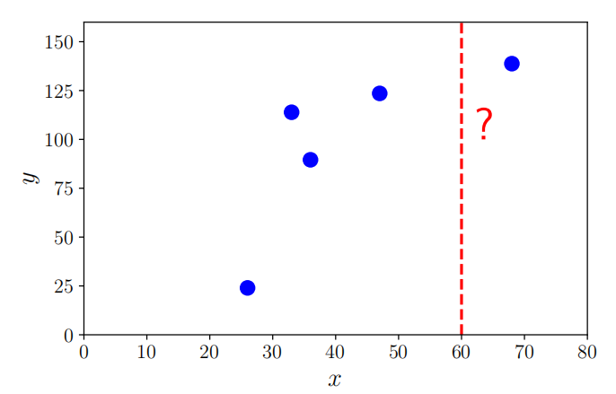
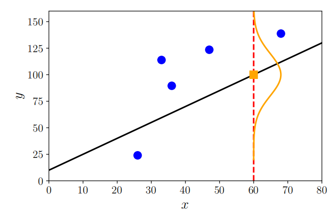

## 8.1 数据，模型与学习

此时，值得停下来思考一下机器学习算法旨在解决的问题。正如第一章所讨论的，机器学习系统主要由三个部分组成：数据、模型和学习。机器学习的主要问题是“我们所说的好模型是什么意思？”。“模型”这个词有很多微妙之处，我们将在本章中多次重新探讨它。同时，如何客观地定义“好”这个词也并非完全显而易见。机器学习的一个指导原则是，好的模型应该在未见过的数据上表现良好。这要求我们定义一些性能指标，如准确率或与真实情况的距离，并找出在这些性能指标下表现良好的方法。本章将介绍一些常用于讨论机器学习模型的数学和统计语言的基本要素。通过这样做，我们简要概述了训练模型的最佳实践，以便得到的预测器在尚未见过的数据上表现良好。

**表8.1来自非数字格式的虚构人力资源数据库的示例数据。**

如第一章所述，“机器学习算法”这个短语有两种不同的含义：训练和预测。我们将在本章中描述这些概念，以及在不同模型之间进行选择的想法。我们将在第8.2节中介绍经验风险最小化的框架，在第8.3节中介绍最大似然估计的原理，在第8.4节中介绍概率模型的思想。我们将在第8.5节中简要概述一种用于指定概率模型的图形语言，并在第8.6节中讨论模型选择。本节的其余部分将详细阐述机器学习的三个主要组成部分：数据、模型和学习。

### 8.1.1 数据作为向量

我们假设数据可以被计算机读取，并以数值格式进行充分表示。数据被假定为表格形式（如图8.1所示），其中每一行代表一个特定的实例或示例，每一列代表一个特定的特征。近年来，机器学习已被应用于许多类型的数据，这些数据并不明显以表格数值格式出现，例如基因组序列、网页的文本和图像内容以及社交媒体图表。我们不在此讨论识别良好特征的重要性和挑战性。这些方面的许多内容都取决于领域专业知识，需要仔细设计，并且在近年来，它们已被纳入数据科学的范畴（Stray, 2016; Adhikari and DeNero, 2018）。

即使我们拥有表格格式的数据，也仍然需要做出选择以获得数值表示。例如，在表8.1中，性别列（一个分类变量）可以转换为数字0表示“男性”，1表示“女性”。或者，性别也可以用数字-1，+1分别表示（如表8.2所示）。此外，在构建表示时经常使用领域知识也很重要，例如知道大学学位从学士到硕士再到博士的进展，或者意识到提供的邮政编码不仅仅是一串字符，而实际上是对伦敦某个地区的编码。在表8.2中，我们将表8.1中的数据转换为数值格式，每个邮政编码都用两个数字表示，即纬度和经度。即使是可能直接读入机器学习算法的数值数据，也应该仔细考虑其单位、缩放和约束。在没有其他信息的情况下，应该对数据集的所有列进行平移和缩放，使其经验均值为0，经验方差为1。为了本书的目的，我们假设领域专家已经对数据进行了适当的转换，即每个输入$x_n$是一个$D$维实数向量，这些实数被称为特征、属性或协变量。我们认为数据集的特征形式如图8.2所示。请注意，在新的数值表示中，我们省略了表8.1中的“姓名”列。这样做有两个主要原因：（1）我们不期望标识符（即姓名）对机器学习任务具有信息性；（2）我们可能希望匿名化数据以保护员工的隐私。

**表8.2来自一个虚构的人力资源数据库的示例数据（见表8.1），被转换为数字格式。**

在本书的这一部分，我们将使用$N$来表示数据集中的示例数量，并用小写字母$n=1,\ldots,N$对示例进行索引。我们假设给定了一组数值数据，表示为一个向量数组（表8.2）。每一行都是一个特定的个体$x_n$，在机器学习中通常被称为示例或数据点。下标$n$表示这是数据集中总共$N$个示例中的第$n$个示例。每一列代表示例的一个特定特征，我们用$d=1,\ldots,D$对特征进行索引。请记住，数据以向量的形式表示，这意味着每个示例（每个数据点）都是一个$D$维向量。表格的方向源自数据库社区，但对于某些机器学习算法（例如，在第10章中），将示例表示为列向量更为方便。

**图8.1用于线性回归的玩具数据。来自表8.2最右边两列的训练数据（xn，yn）对。我们感兴趣的是一个60岁（岁的x=60）的工资，用垂直虚线表示，这不是训练数据的一部分。**

让我们考虑基于表8.2中的数据，根据年龄预测年薪的问题。这被称为监督学习问题，其中每个示例$x_n$（即年龄）都与一个标签$$y_n$$（即薪资）相关联。标签$$y_n$$还有其他各种名称，包括目标、响应变量和注释。数据集被写为一组示例-标签对$\{(\boldsymbol x_1,y_1),\ldots,(\boldsymbol x_n,y_n),\ldots,(\boldsymbol x_N,y_N)\}$。示例表$\{x_1,\ldots,x_N\}$经常被串联起来，并写为$X\in\mathbb{R}^{N\times D}$。图8.1展示了由表8.2中最右两列组成的数据集，其中$x=$年龄，$y=$薪资。

我们使用本书第一部分介绍的概念来形式化机器学习问题，如前面段落中的问题。将数据表示为向量$x_n$使我们能够使用线性代数中的概念（在第2章中介绍）。在许多机器学习算法中，我们还需要能够比较两个向量。正如我们将在第9章和第12章中看到的那样，计算两个示例之间的相似性或距离使我们能够形式化这样一种直觉，即具有相似特征的示例应该具有相似的标签。比较两个向量需要我们构造一个几何结构（在第3章中解释），并允许我们使用第7章中的技术来优化所得的学习问题。

由于我们有了数据的向量表示，我们可以对数据进行操作以找到其潜在的更好表示。我们将通过两种方式讨论如何找到好的表示：找到原始特征向量的低维近似，以及使用原始特征向量的非线性高维组合。在第10章中，我们将看到一个通过找到主成分来找到原始数据空间低维近似的例子。找到主成分与第4章中介绍的特征值和奇异值分解的概念密切相关。对于高维表示，我们将看到一个显式的特征映射$\phi(\cdot)$，它允许我们使用更高维的表示$\phi(x_n)$来表示输入$x_n$。高维表示的主要动机是我们可以将新特征构建为原始特征的非线性组合，这反过来可能使学习问题变得更容易。我们将在第9.2节中讨论特征映射，并在第12.4节中展示这个特征映射如何导致核的出现。近年来，深度学习方法（Goodfellow等人，2016）已显示出使用数据本身来学习新的良好特征的潜力，并在计算机视觉、语音识别和自然语言处理等领域取得了巨大成功。本书这一部分不会涵盖神经网络，但读者可参考第5.6节了解反向传播的数学描述，这是训练神经网络的关键概念。

**图8.2示例函数（黑色实对角线）及其在x = 60处的预测，即f（60）= 100。**

### 8.1.2 模型作为函数

一旦我们将数据以适当的向量形式表示，我们就可以着手构建预测函数（称为预测器）。在第1章中，我们还没有精确描述模型的语言。现在，使用本书第一部分的概念，我们可以介绍“模型”的含义。本书提出了两种主要方法：将预测器视为函数，以及将预测器视为概率模型。我们在这里描述前者，并在下一小节中描述后者。

预测器是一个函数，当给定一个特定的输入示例（在我们的情况下，是一个特征向量）时，会产生一个输出。目前，我们将输出视为一个单一的数字，即一个实值标量输出。这可以写为
$$f:\mathbb{R}^{D}\to\mathbb{R}\:,$$
(8.1)

其中输入向量$x$是$D$维的（具有$D$个特征），然后函数$f$应用于它（写为$f(x)$）并返回一个实数。图8.2展示了一个可能的函数，该函数可用于计算输入值$x$的预测值。

在本书中，我们不考虑所有函数的一般情况，因为这会涉及泛函分析。相反，我们考虑线性函数的特殊情况
$$f(\boldsymbol{x})=\boldsymbol{\theta}^\top\boldsymbol{x}+\theta_0$$
(8.2)

**图8.3示例函数（黑色实对角线）及其在x = 60处的预测不确定性（绘制为高斯曲线）。**

其中$\theta$和$\theta_0$是未知的。这一限制意味着第2章和第3章的内容足以精确阐述非概率（与接下来描述的概率观点相比）机器学习观点下的预测器概念。线性函数在可解决问题的一般性和所需背景数学知识的数量之间取得了良好的平衡。

### 8.1.3 模型作为概率分布

我们通常认为数据是对某些真实潜在效应的有噪声观测，并希望通过应用机器学习从噪声中识别出信号。这要求我们有一种量化噪声效应的语言。我们还经常希望预测器能够表达某种不确定性，例如，量化我们对特定测试数据点的预测值所具有的信心。正如我们在第6章中所见，概率论提供了一种量化不确定性的语言。图8.3展示了函数预测不确定性的高斯分布图示。

我们不必将预测器视为单个函数，而可以将其视为概率模型，即描述可能函数分布的模型。在本书中，我们将自己限制在具有有限维参数的分布的特殊情况，这使我们能够描述概率模型而无需涉及随机过程和随机测度。对于这个特殊情况，我们可以将概率模型视为多元概率分布，这已经允许了一个丰富的模型类别。

我们将在第8.4节中介绍如何使用概率（第6章）中的概念来定义机器学习模型，并在第8.5节中介绍一种图形语言，以便以紧凑的方式描述概率模型。

### 8.1.4 学习是寻找参数

学习的目标是找到一个模型及其对应的参数，使得得到的预测器在未见过的数据上表现良好。在讨论机器学习算法时，从概念上讲，有三个不同的算法阶段：

1. 预测或推断
2. 训练或参数估计
3. 超参数调整或模型选择

预测阶段是我们在之前未见过的测试数据上使用已训练的预测器的过程。换句话说，参数和模型选择已经固定，预测器被应用于代表新输入数据点的新向量。如第1章和前一小节所述，本书将考虑两种机器学习流派，分别对应于预测器是函数还是概率模型。当我们有概率模型（在第8.4节中进一步讨论）时，预测阶段被称为推断。

备注：不幸的是，对于不同的算法阶段并没有统一的命名。单词“推断”有时也用于表示概率模型的参数估计，而较少用于表示非概率模型的预测。

$\diamondsuit$

训练或参数估计阶段是我们根据训练数据调整预测模型的过程。我们希望在给定训练数据的情况下找到好的预测器，并有两种主要策略来实现这一点：基于某种质量度量找到最佳预测器（有时称为找到点估计），或使用贝叶斯推断。找到点估计可以应用于两种类型的预测器，但贝叶斯推断需要概率模型。

对于非概率模型，我们遵循经验风险最小化的原则，这将在第8.2节中描述。经验风险最小化直接为寻找良好参数提供了一个优化问题。对于统计模型，我们使用最大似然原理来找到一组好的参数（第8.3节）。我们还可以使用概率模型来进一步模拟参数的不确定性，这将在第8.4节中更详细地讨论。

我们使用数值方法来找到适合数据的良好参数，大多数训练方法都可以视为寻找目标最大值的爬山方法，例如似然函数的最大值。为了应用爬山方法，我们使用第5章中描述的梯度，并实现第7章中的数值优化方法。

如第1章所述，我们感兴趣的是基于数据学习模型，以便它在未来的数据上表现良好。仅使模型很好地拟合训练数据是不够的，预测器还需要在未见过的数据上表现良好。我们使用交叉验证（第8.2.4节）来模拟预测器在未来未见数据上的行为。正如我们将在本章中看到的，为了实现在未见过的数据上表现良好的目标，我们需要在很好地拟合训练数据和找到现象的“简单”解释之间取得平衡。这种权衡是通过正则化（第8.2.3节）或添加先验（第8.3.2节）来实现的。在哲学上，这既不是归纳也不是演绎，而被称为溯因。根据斯坦福哲学百科全书，溯因是推断最佳解释的过程（Douven，2017）。

我们通常需要就预测器的结构做出高级建模决策，比如要使用的组件数量或要考虑的概率分布类别。组件数量的选择是超参数的一个例子，这个选择可以显著影响模型的性能。在不同模型之间做出选择的问题被称为模型选择，我们将在第8.6节中描述。对于非概率模型，模型选择通常使用嵌套交叉验证来完成，这将在第8.6.1节中描述。我们还使用模型选择来选择我们模型的超参数。

备注：参数和超参数之间的区别有些任意，主要是由可以数值优化与需要使用搜索技术的区别所驱动的。考虑这种区别的另一种方式是，将参数视为概率模型的显式参数，而将超参数（高级参数）视为控制这些显式参数分布的参数。

$\diamondsuit$

在以下部分中，我们将探讨机器学习的三种类型：经验风险最小化（第8.2节）、最大似然原理（第8.3节）和概率建模（第8.4节）。

