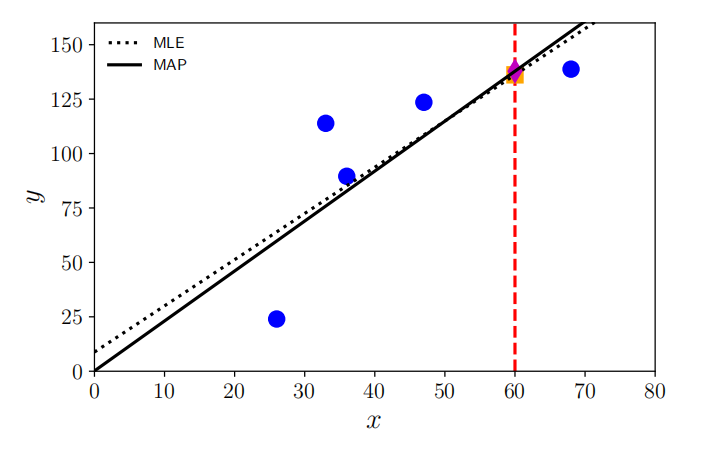
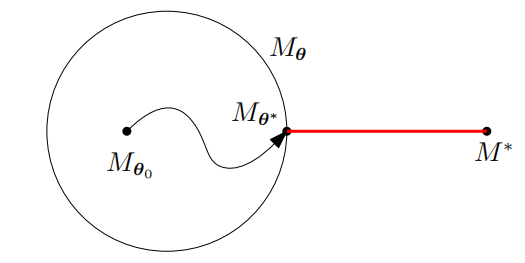

## 8.3 参数估计

在第8.2节中，我们没有使用概率分布来明确建模我们的问题。在本节中，我们将看到如何使用概率分布来建模由于观测过程引起的不确定性以及我们预测器参数中的不确定性。在第8.3.1节中，我们将介绍似然函数，它与经验风险最小化中的损失函数概念（第8.2.2节）类似。先验（第8.3.2节）的概念则与正则化（第8.2.3节）的概念类似。

### 8.3.1 最大似然估计

最大似然估计（MLE）背后的思想是定义一个参数函数，使我们能够找到一个很好地拟合数据的模型。估计问题集中在似然函数上，或者更精确地说，是其负对数。对于由随机变量$x$表示的数据和由参数$\theta$参数化的一组概率密度$p(x\mid\boldsymbol{\theta})$，负对数似然由下式给出：

(8.14)
$$\mathcal{L}_{\boldsymbol{x}}(\boldsymbol{\theta})=-\log p(\boldsymbol{x}\mid\boldsymbol{\theta})\:.$$
符号$\mathcal{L}_x(\boldsymbol{\theta})$强调了参数$\theta$在变化，而数据$x$是固定的。在书写负对数似然时，我们通常会省略对$x$的引用，因为它实际上是$\theta$的函数，并在随机变量表示数据中的不确定性从上下文中清楚时，将其写为$\mathcal{L}(\boldsymbol{\theta})$。

让我们解释对于固定的$\dot{\theta}$值，概率密度$p(x\mid\boldsymbol{\theta})$在建模什么。它是一个分布，用于建模给定参数设置下数据的不确定性。对于给定的数据集$x$，似然函数允许我们表达对不同参数设置$\theta$的偏好，并可以选择更“可能”生成数据的设置。

从另一个互补的角度来看，如果我们认为数据是固定的（因为它已经被观测到），并且我们改变参数$\theta$，那么$\mathcal{L}(\boldsymbol{\theta})$告诉我们什么？它告诉我们对于观测值$x$，$\theta$的特定设置有多大的可能性。基于这一观点，最大似然估计器为我们提供了数据集中最可能的参数$\theta$。

我们考虑监督学习设置，其中我们获得成对的$(\boldsymbol{x}_1,y_1),\ldots,(\boldsymbol{x}_N,y_N)$，其中$\boldsymbol x_n\in\mathbb{R}^D$且标签$y_n\in\mathbb{R}$。我们感兴趣的是构建一个预测器，它以特征向量$x_n$作为输入，并产生预测$y_n$（或接近它的值），即，给定向量$x_n$，我们想要标签$y_n$的概率分布。换句话说，我们为特定参数设置$\theta$下的示例指定了给定样本条件下标签的条件概率分布。

> **示例 8.4**
>
> 经常使用的第一个示例是指定给定示例的标签的条件概率为高斯分布。换句话说，我们假设可以通过均值为零的独立高斯噪声（参考第6.5节）来解释我们的观测不确定性，即$\varepsilon_{n}\sim\mathcal{N}(0,\sigma^{2})$。我们进一步假设使用线性模型$x_n^\top\theta$进行预测。这意味着我们为每个示例-标签对$(x_n,y_n)$指定了一个高斯似然函数，
> $$p(y_n\mid\boldsymbol{x}_n,\boldsymbol{\theta})=\mathcal{N}\big(y_n\mid\boldsymbol{x}_n^\top\boldsymbol{\theta},\:\sigma^2\big)\:.$$
> (8.15)
>
> 图8.3展示了给定参数$\theta$的高斯似然的一个图示。我们将在第9.2节中看到如何根据高斯分布明确展开上述表达式。

我们假设示例集$(x_1,y_1),\ldots,(x_N,y_N)$是独立同分布的（i.i.d.）。“独立”（第6.4.5节）一词意味着涉及整个数据集（$\mathcal{Y}=\{y_1,\ldots,y_N\}$和$\mathcal{X}=\{x_1,\ldots,x_N\}$）的似然函数可以分解为每个单独示例似然函数的乘积

(8.16)
$$p(\mathcal{Y}\mid\mathcal{X},\boldsymbol{\theta})=\prod_{n=1}^{N}p(y_{n}\mid\boldsymbol{x}_{n},\boldsymbol{\theta})\:,$$
其中$p(y_n\mid\boldsymbol{x}_n,\boldsymbol{\theta})$是特定的分布（在示例8.4中是高斯分布）。表达式“同分布”意味着乘积（8.16）中的每个项都遵循相同的分布，并且它们共享相同的参数。从优化的角度来看，计算可以分解为更简单函数之和的函数通常更容易。因此，在机器学习中，我们经常考虑负对数似然

(8.17)
$$\mathcal{L}(\boldsymbol{\theta})=-\log p(\mathcal{Y}\mid\mathcal{X},\boldsymbol{\theta})=-\sum_{n=1}^{N}\log p(y_{n}\mid\boldsymbol{x}_{n},\boldsymbol{\theta})\:.$$
尽管在$p(y_n|x_n,\boldsymbol{\theta})$（8.15）中，$\theta$位于条件符号的右侧，因此可能被误解为是已观测且固定的，但这种解释是不正确的。负对数似然$\mathcal{L}(\boldsymbol{\theta})$是$\theta$的函数。因此，为了找到一个能够很好地解释数据$(x_1,y_1),\ldots,(x_N,y_N)$的良好参数向量$\theta$，我们需要对$\theta$最小化负对数似然$\mathcal{L}(\boldsymbol{\theta})$。

备注。(8.17)中的负号是一个历史遗留问题，源于我们想要最大化似然函数的惯例，但数值优化文献倾向于研究函数的最小化。

> **示例 8.5**
>
> 继续我们在高斯似然（8.15）的示例，负对数似然可以重写为
>
> (8.18a)
>
> (8.18b)
> $$\begin{aligned}\mathcal{L}(\boldsymbol{\theta})&=-\sum_{n=1}^N\log p(y_n\mid\boldsymbol{x}_n,\boldsymbol{\theta})=-\sum_{n=1}^N\log\mathcal{N}(y_n\mid\boldsymbol{x}_n^\top\boldsymbol{\theta},\:\sigma^2)\\&=-\sum_{n=1}^N\log\frac1{\sqrt{2\pi\sigma^2}}\exp\left(-\frac{(y_n-\boldsymbol{x}_n^\top\boldsymbol{\theta})^2}{2\sigma^2}\right)\\&=-\sum_{n=1}^N\log\exp\left(-\frac{(y_n-\boldsymbol{x}_n^\top\boldsymbol{\theta})^2}{2\sigma^2}\right)-\sum_{n=1}^N\log\frac1{\sqrt{2\pi\sigma^2}}\\&=\frac1{2\sigma^2}\sum_{n=1}^N(y_n-\boldsymbol{x}_n^\top\boldsymbol{\theta})^2-\sum_{n=1}^N\log\frac1{\sqrt{2\pi\sigma^2}}\:.\end{aligned}$$
> (8.18c)
>
> (8.18d)
>
> 由于$\sigma$是给定的，所以(8.18d)中的第二项是常数，最小化$\mathcal{L}(\boldsymbol{\theta})$等价于解决第一项表示的最小二乘问题（与(8.8)比较）。

**图8.5对于给定的数据，参数的最大似然估计结果为黑色对角线。橙色方方形表示x = 60处的最大似然预测值。**

**图8.6在x = 60时与最大似然估计和MAP估计进行比较。先验使斜率较陡，截距接近于零。在这个例子中，将截距移近于零的偏差实际上增加了斜率。**

事实证明，对于高斯似然函数，与最大似然估计相对应的优化问题有一个闭式解。我们将在第9章中看到更多细节。图8.5展示了一个回归数据集和由最大似然参数引起的函数。与未正则化的经验风险最小化（第8.2.3节）类似，最大似然估计可能会受到过拟合的影响（第8.3.3节）。对于其他似然函数，即如果我们用非高斯分布对噪声进行建模，则最大似然估计可能没有闭式解析解。在这种情况下，我们求助于第7章中讨论的数值优化方法。

### **8.3.2 最大后验估计**

如果我们有关于参数$\theta$分布的先验知识，我们可以在似然函数上乘以一个额外的项。这个额外的项是参数$\theta$的先验概率分布$p(\boldsymbol{\theta})$。给定一个先验分布，在观察到一些数据$x$之后，我们应该如何更新$\theta$的分布？换句话说，在观察到数据$x$之后，我们应该如何表示对$\theta$的更具体的知识？如第6.3节所述，贝叶斯定理为我们提供了一个有原则的工具来更新随机变量的概率分布。它允许我们从一般的先验陈述（先验分布）$p(\boldsymbol{\theta})$和函数$p(\boldsymbol{x}\mid\boldsymbol{\theta})$（该函数将参数$\theta$和观测数据$x$联系起来，称为似然函数）中计算出参数$\theta$的后验分布$p(\boldsymbol{\theta}\mid\boldsymbol{x})$（更具体的知识）：

(8.19)
$$p(\boldsymbol{\theta}\mid\boldsymbol{x})=\frac{p(\boldsymbol{x}\mid\boldsymbol{\theta})p(\boldsymbol{\theta})}{p(\boldsymbol{x})}\:.$$

请注意，我们感兴趣的是找到使后验概率最大化的参数$\theta$。由于分布$p(x)$不依赖于$\theta$，我们可以在优化过程中忽略分母的值，从而得到

(8.20)
$$p(\boldsymbol{\theta}\mid\boldsymbol{x})\propto p(\boldsymbol{x}\mid\boldsymbol{\theta})p(\boldsymbol{\theta})\:.$$

前面的比例关系隐藏了数据密度$p(x)$，这一密度可能很难估计。因此，我们不是估计负对数似然的最小值，而是估计负对数后验的最小值，这被称为最大后验估计（MAP估计）。图8.6展示了添加一个均值为零的高斯先验的效果示例。

> **示例 8.6**
>
> 除了前一个示例中关于高斯似然的假设外，我们还假设参数向量服从均值为零的多元高斯分布，即$p(\boldsymbol{\theta})=\mathcal{N}(\mathbf{0},\boldsymbol{\Sigma})$，其中$\boldsymbol{\Sigma}$是协方差矩阵（第6.5节）。请注意，高斯分布的共轭先验也是高斯分布（第6.6.1节），因此我们期望后验分布也是高斯分布。我们将在第9章中看到最大后验估计的详细内容。

在机器学习中，将关于良好参数位置的先验知识纳入考虑是一个普遍存在的想法。我们在第8.2.3节中看到的另一种观点是正则化的思想，它引入了一个额外的项，使得到的参数偏向于接近原点。最大后验估计可以被认为是连接非概率世界和概率世界的桥梁，因为它明确承认了先验分布的需求，但它仍然只产生参数的点估计。

**图8.7模型拟合。在参数化的模型Mθ类中，我们优化模型参数θ，以最小化到真（未知）模型M∗的距离。**

**备注**。最大似然估计$\theta_\mathrm{ML}$具有以下性质（Lehmann和Casella，1998；Efron和Hastie，2016）：

- 渐近一致性：在无限多观测值的极限下，最大似然估计会收敛到真实值，加上一个近似正态的随机误差。

- 实现这些性质所需的样本量可能相当大。
- 误差的方差以$1/N$的速度衰减，其中$N$是数据点的数量。
- 特别是在“小”数据范围内，最大似然估计可能导致过拟合。

最大似然估计（和最大后验估计）的原则是使用概率建模来推断数据和模型参数中的不确定性。然而，我们尚未将概率建模发挥到极致。在本节中，所得的训练过程仍然产生预测器的点估计，即训练返回一组表示最佳预测器的参数值。在第8.4节中，我们将采取这样的观点，即参数值也应该被视为随机变量，并且在做出预测时，我们将使用完整的参数分布，而不是估计该分布中的“最佳”值。

### 8.3.3 模型拟合

考虑这样一个场景，我们被给定一个数据集，并希望将数据拟合到一个参数化模型中。当我们谈论“拟合”时，我们通常指的是优化/学习模型参数，以便它们能够最小化某个损失函数，例如负对数似然。在最大似然估计（第8.3.1节）和最大后验估计（第8.3.2节）中，我们已经讨论了两种常用的模型拟合算法。

模型的参数化定义了一个我们可以操作的模型类$M_{\theta}$。例如，在线性回归设置中，我们可能将输入$x$和（无噪声）观测值$y$之间的关系定义为$y=ax+b$，其中$\boldsymbol{\theta}:=\{a,b\}$是模型参数。在这种情况下，模型参数$\theta$描述了仿射函数族，即斜率为$a$、截距为$b$的直线。假设数据来自一个我们未知的模型$M^*$。对于给定的训练数据集，我们优化$\theta$，使得$M_{\theta}$尽可能接近$M^*$，其中“接近”程度由我们优化的目标函数（例如训练数据上的平方损失）定义。图8.7展示了一个场景，其中我们有一个较小的模型类（由圆$M_{\theta}$表示），而数据生成模型$M^*$位于我们考虑的模型集之外。我们从$M_{\theta_0}$开始参数搜索。优化后，即当我们获得最佳参数$\theta^*$时，我们区分以下三种不同情况：（i）过拟合，（ii）欠拟合，和（iii）拟合良好。我们将从高层次上直观理解这三个概念的含义。

粗略地说，过拟合指的是参数化模型类过于丰富，以至于无法很好地建模由$M^*$生成的数据集，即$M_{\theta}$可以建模更复杂的数据集。例如，如果数据集是由一个线性函数生成的，但我们定义$M_{\theta}$为七次多项式的类，那么我们不仅可以建模线性函数，还可以建模二次、三次等多项式。过拟合的模型通常具有大量参数。我们经常观察到的一个现象是，过于灵活的模型类$M_{\theta}$会使用其全部建模能力来减少训练误差。如果训练数据包含噪声，模型很可能会从噪声中捕捉到一些看似有用的信号。这在我们对训练数据之外的数据进行预测时，将会引发严重的问题。图8.8(a)给出了一个回归中的过拟合示例，其中模型参数是通过最大似然估计（见第8.3.1节）学习的。

我们将在第9.2.2节中更详细地讨论回归中的过拟合问题。

**图8.8对不同模型类的拟合（通过最大似然值）到一个回归数据集。**

当我们遇到欠拟合时，我们遇到了相反的问题，即模型类$M_{\theta}$不够丰富。例如，如果我们的数据集是由正弦函数生成的，但$\theta$只参数化直线，那么即使是最优的优化过程也无法使我们接近真实模型。然而，我们仍然会优化参数并找到建模数据集的最佳直线。图8.8(b)展示了一个因灵活性不足而欠拟合的模型示例。欠拟合的模型通常参数较少。

第三种情况是参数化模型类恰到好处。那么，我们的模型就拟合得很好，即既不过拟合也不欠拟合。这意味着我们的模型类刚好足够丰富，可以描述给定的数据集。图8.8(c)展示了一个相当好地拟合给定数据集的模型。理想情况下，这是我们希望使用的模型类，因为它具有良好的泛化性能。

在实践中，我们经常定义非常丰富的模型类$M_{\theta}$，其中包含许多参数，如深度神经网络。为了减轻过拟合问题，我们可以使用正则化（第8.2.3节）或先验（第8.3.2节）。我们将在第8.6节中讨论如何选择模型类。

### 8.3.4 拓展阅读

在考虑概率模型时，最大似然估计原理推广了线性模型的最小二乘回归思想，我们将在第9章中详细讨论这一点。当将预测器限制为具有线性形式，并对输出应用额外的非线性函数$\varphi$时，即，

(8.21)
$$p(y_n|\boldsymbol{x}_n,\boldsymbol{\theta})=\varphi(\boldsymbol{\theta}^\top\boldsymbol{x}_n)\:,$$
我们可以考虑用于其他预测任务的其他模型，如二元分类或计数数据建模（McCullagh 和 Nelder, 1989）。另一种观点是考虑来自指数族（第6.6节）的似然函数。这类模型在参数和数据之间具有线性依赖关系，并可能具有非线性变换$\varphi$（称为链接函数），被称为广义线性模型（Agresti, 2002, 第4章）。

最大似然估计具有悠久的历史，最初由罗纳德·费希尔爵士（Sir Ronald Fisher）在20世纪30年代提出。我们将在第8.4节中进一步阐述概率模型的思想。在使用概率模型的研究者中，一个争论点是贝叶斯统计和频率统计之间的讨论。如第6.1.1节所述，这归根结底是概率的定义问题。回想第6.1节，我们可以将概率视为逻辑推理（通过允许不确定性）的推广（Cheeseman, 1985; Jaynes, 2003）。最大似然估计方法在本质上是频率的，有兴趣的读者可以参阅Efron和Hastie（2016）以获得对贝叶斯和频率统计的均衡观点。

有些概率模型中，可能无法使用最大似然估计。读者可以参阅更高级的统计教材，如Casella和Berger（2002），了解其他方法，如矩估计法、$M$-估计法和估计方程法。
