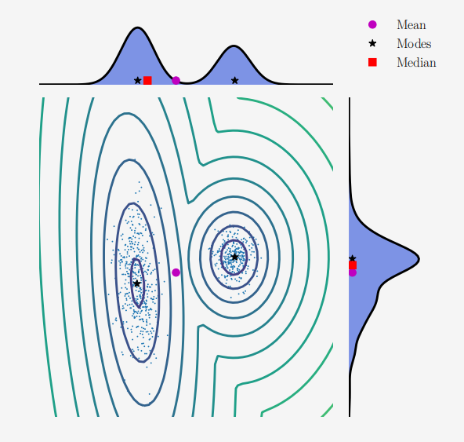
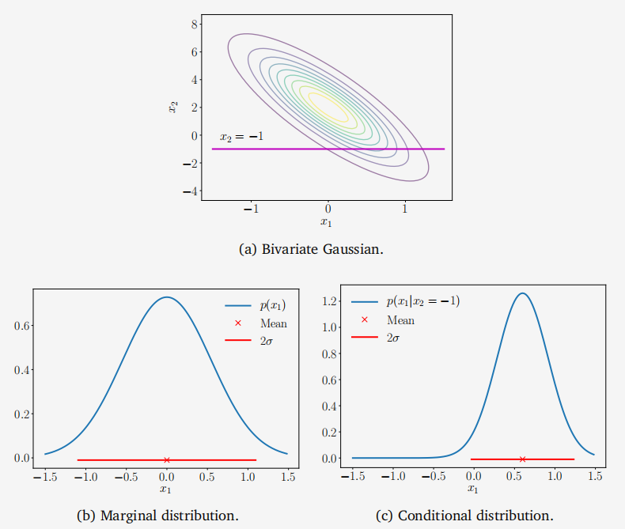
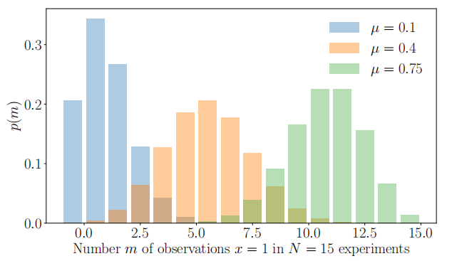
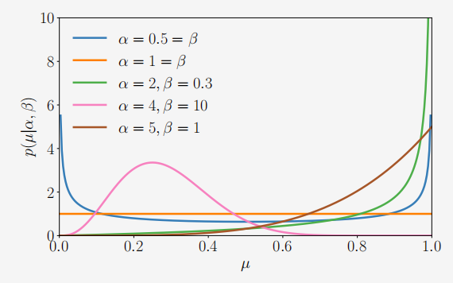

# 第6章 概率分布

概率，简而言之，是研究不确定性的学科。概率可以被视为某一事件发生次数的比例，或者对某一事件发生的信任程度。然后，我们希望利用这种概率来衡量实验中某事件发生的可能性。正如第1章所述，我们经常量化数据中的不确定性、机器学习模型中的不确定性以及模型预测结果中的不确定性。量化不确定性需要随机变量的概念，随机变量是一个函数，它将随机实验的结果映射到我们感兴趣的一组属性上。与随机变量相关联的是一个函数，它测量某一特定结果（或结果集）发生的概率；这被称为概率分布。

概率分布是其他概念（如概率建模（第8.4节）、图形模型（第8.5节）和模型选择（第8.6节））的基石。在下一节中，我们将介绍定义概率空间的三个概念（样本空间、事件和事件的概率）以及它们与第四个概念——随机变量的关系。本次介绍特意采用了较为直观的方式，因为过于严谨的阐述可能会掩盖这些概念背后的直觉。本章介绍的概念概要如图6.1所示。

**图6.1 与随机变量和概率分布相关的概念的思维导图**

## 6.1 概率空间的构建

概率论旨在定义一个数学结构来描述实验结果的随机性。例如，在抛掷一枚硬币时，我们无法确定结果，但通过大量抛掷硬币，我们可以观察到平均结果中的规律性。利用这种概率的数学结构，目标是进行自动化推理，从这个意义上说，概率是对逻辑推理的泛化（Jaynes, 2003）。

### 6.1.1 哲学问题

在构建自动化推理系统时，经典布尔逻辑不允许我们表达某些形式的合理推理。考虑以下场景：我们观察到A为假。我们发现B变得不那么可信，尽管从经典逻辑中无法得出这一结论。我们观察到B为真，似乎A又变得更为可信。我们每天都在使用这种形式的推理。比如，我们在等一位朋友，并考虑三种可能性：H1，她准时到达；H2，她被交通延误了；H3，她被外星人绑架了。当我们观察到朋友迟到时，我们必须从逻辑上排除H1。我们也倾向于认为H2更有可能，尽管逻辑上并不要求我们必须这样做。最后，我们可能会认为H3是可能的，但继续认为它非常不可能。那么，我们如何得出结论认为H2是最合理的答案？从这个角度看，“合理的概率论可以被视为布尔逻辑的一种泛化”。在机器学习的推理背景下，它经常被这样应用，以形式化并扩展自动化推理系统的设计。关于如何以真值概率论的假值为基础构建推理系统的进一步论证，可参见Pearl（1988）。

概率的哲学基础以及它应该如何以某种方式（Jaynes, 2003）与我们认为在逻辑上应该为真的事物相关联，这一问题被Cox研究过（Jaynes, 2003）。另一种思考方式是，如果我们精确地使用常识，最终会构建出概率。E. T. Jaynes（1922-1998）确定了三个数学标准，这些标准必须适用于所有可能性：

1. 可能性的程度由实数表示。

2. 这些数字必须基于常识的规则。

3. 所得推理必须是一致的，其中“一致”一词包含以下三层含义：

   (a) 一致性或无矛盾性：当可以通过不同方式达到相同结果时，在所有情况下都必须找到相同的可能性值。
   (b) 诚实性：必须考虑所有可用数据。
   (c) 可再现性：如果我们对两个问题的知识状态相同，那么我们必须为它们分配相同程度的可能性。

Cox-Jaynes定理证明了这些可能性足以定义适用于可能性$p$的普遍数学规则，直到通过任意单调函数进行变换。至关重要的是，这些规则就是概率的规则。

备注。在机器学习和统计学中，概率有两种主要解释：贝叶斯解释和频率解释（Bishop, 2006; Efron and Hastie, 2016）。贝叶斯解释使用概率来指定用户对某个事件发生的不确定性程度。它有时被称为“主观概率”或“信念程度”。频率解释则考虑感兴趣事件相对于发生事件总数的相对频率。当数据无限时，某事件的概率被定义为该事件的相对频率。

一些关于概率模型的机器学习文献使用了不严谨的记号和术语，这会造成困惑。本文也不例外。多个不同的概念都被称为“概率分布”，读者往往需要从上下文中分辨其含义。一个有助于理解概率分布的技巧是检查我们是在尝试对分类事物（离散随机变量）还是连续事物（连续随机变量）进行建模。我们在机器学习中解决的问题类型与我们是考虑分类模型还是连续模型密切相关。

### 6.1.2 概率与随机变量

在讨论概率时，经常会混淆三个不同的概念。首先是概率空间的概念，它使我们能够量化概率的想法。然而，我们大多不直接处理这个基本的概率空间。相反，我们处理的是随机变量（第二个概念），它将概率转移到一个更方便（通常是数值）的空间。第三个概念是与随机变量相关的分布或定律。我们将在本节中介绍前两个概念，并在6.2节中详细阐述第三个概念。

现代概率论基于Kolmogorov提出的一组公理（Grinstead and Snell, 1997; Jaynes, 2003），这些公理引入了样本空间、事件空间和概率测度这三个概念。概率空间模型用于模拟具有随机结果的现实世界过程（称为实验）。

**样本空间 $\Omega$**. 样本空间是实验所有可能结果的集合，通常表示为 $\Omega$。例如，连续两次抛硬币的样本空间为 $\{hh, tt, ht, th\}$，其中“h”表示“正面”，“t”表示“反面”。

**事件空间 A**. 事件空间是实验潜在结果的集合。如果实验结束时我们可以观察到某个特定结果 $\omega\in\Omega$ 是否在 $A$ 中，则样本空间 $\Omega$ 的子集 $A$ 就属于事件空间 $\mathcal{A}$。事件空间 $A$ 是通过考虑 $\Omega$ 的子集集合获得的，对于离散概率分布（第6.2.1节），$\mathcal{A}$ 通常是 $\Omega$ 的幂集。

**概率 $P$**. 对于每个事件 $A\in\mathcal{A}$，我们关联一个数 $P(A)$，它衡量了事件发生的概率或信念程度。$P(A)$ 被称为 $A$ 的概率。

单个事件的概率必须位于区间 [0,1] 内，样本空间 $\Omega$ 中所有结果的总概率必须为 1，即 $P(\Omega)=1$。给定一个概率空间 $(\Omega,\mathcal{A},P)$，我们希望用它来模拟一些现实世界的现象。在机器学习中，我们通常避免明确提及概率空间，而是指关注量的概率，我们用 $\mathcal{T}$ 来表示。在本书中，我们将 $\mathcal{T}$ 称为目标空间，并将 $\mathcal{T}$ 的元素称为状态。我们引入一个函数 $\bar{X}:\dot{\Omega}\to\mathcal{T}$，它接受 $\Omega$ 的一个元素（一个结果）并返回一个特定的关注量 $x$，即 $\mathcal{T}$ 中的一个值。从 $\Omega$ 到 $T$ 的这种关联/映射被称为随机变量。例如，在抛两枚硬币并计算正面朝上次数的情况下，随机变量 $X$ 映射到三个可能的结果：$X(hh)=2, X(ht)=1, X(th)=1,$ 和 $X(tt)=0$。在这个特定情况下，$\vec{\mathcal{T}}=\{0,1,2\}$，我们关注的是 $\mathcal{T}$ 元素上的概率。对于有限的样本空间 $\Omega$ 和有限的目标空间 $\mathcal{T}$，与随机变量对应的函数本质上是一个查找表。对于 $\mathcal{T}$ 的任何子集 $S\subseteq\mathcal{T}$，我们将 $P_X(S)\in[0,1]$（误解概率）与随机变量 $X$ 对应的特定事件相关联。示例 6.1 提供了术语的具体说明。

**备注** 上述样本空间 $\Omega$ 在不同的书中被称为不同的名称。$\Omega$ 的另一个常见名称是“状态空间”（Jacod and Protter, 2004），但状态空间有时保留用于指动态系统中的状态（Hasselblatt and Katok, 2003）。其他有时用于描述 $\Omega$ 的名称包括：“样本描述空间”、“可能性空间”和“事件空间”。

> 示例 6.1
>
> 我们假设读者已经熟悉计算事件集合的交集和并集的概率。对于更温和且包含许多例子的概率论介绍，可以在 Walpole 等人（2011）的第 2 章中找到。
>
> 考虑一个统计实验，我们模拟一个游乐场游戏，该游戏包括从一个袋子中抽取两枚硬币（放回原袋）。袋子中有来自美国（用 \$表示）和英国（用 £ 表示）的硬币，因为我们从袋子中抽取两枚硬币，所以总共有四种结果。这个实验的状态空间或样本空间 $\Omega$ 因此是 $(\mathfrak{S},\mathfrak{S}),(\mathfrak{S}, E),(E,\Phi),(E,E)$（注意：这里的符号可能有些不一致，通常我们会用更具体的符号如 $($, $), ($, £), (£, \$), (£, £) 来表示，但为了与原文保持一致，我们保留原符号）。假设袋子中硬币的组成是这样的：随机抽取一枚硬币得到 $ 的概率是 0.3。
>
> 我们感兴趣的事件是重复抽取中返回 \$ 的总次数。让我们定义一个随机变量 $X$，它将样本空间 $\Omega$ 映射到 $\mathcal{T}$，后者表示我们从袋子中抽取 ​\$ 的次数。从前面的样本空间可以看出，我们可以得到零次 $，一次 $，或两次 $，因此 $$\mathcal{T}=\{0,1,2\}$。随机变量 $X$（一个函数或查找表）可以表示如下表：
>
> $$
> \begin{aligned}
> X((\$,\$)) &= 2 \\
> X((\$,£)) &= 1 \\
> X((£,\$)) &= 1 \\
> X((£,£)) &= 0
> \end{aligned}
> $$
> 由于我们在抽取第二枚硬币之前将第一枚硬币放回袋子，这意味着两次抽取是相互独立的，我们将在第 6.4.5 节中讨论这一点。请注意，有两个实验结果映射到同一个事件，即只有其中一次抽取返回 $。因此，$X$ 的概率质量函数（第 6.2.1 节）由下式给出：
>
> $$
> \begin{aligned}
> &P(X=2) &&= P((\$,\$)) \\
> &&&= P(\$)\cdot P(\$) \\
> &&&= 0.3\cdot0.3=0.09 \\
> &P(X=1) &&= P((\$,£)\cup(£,\$)) \\
> &&&= P((\$,£))+P((£,\$)) \\
> &&&= 0.3\cdot(1-0.3)+(1-0.3)\cdot0.3=0.42 \\
> &P(X=0) &&= P((£,£)) \\
> &&&= P(£)\cdot P(£) \\
> &&&= (1-0.3)\cdot(1-0.3)=0.49
> \end{aligned}
> $$

在计算中，我们将两个不同的概念等同起来，即 $X$ 的输出概率和 $\Omega$ 中样本的概率。例如，在（6.7）中我们说 $P(X=0)=P((£,£))$。考虑随机变量 $X:\Omega\to\mathcal{T}$ 和一个子集 $S\subseteq\mathcal{T}$（例如，$\mathcal{T}$ 的一个单元素，如投掷两枚硬币时得到一个正面的结果）。令 $X^{-1}(S)$ 是 $S$ 在 $X$ 下的原像，即 $\Omega$ 中在 $X$ 下映射到 $S$ 的元素集合；${\omega\in\Omega:X(\omega)\in S}$。理解从 $\Omega$ 中的事件通过随机变量 $X$ 转换到概率的一种方式是将其与 $S$ 的原像的概率相关联（Jacod 和 Protter，2004）。对于 $S\subseteq\mathcal{T}$，我们使用以下符号：

$$P_{X}(S)=P(X\in S)=P(X^{-1}(S))=P({\omega\in\Omega:X(\omega)\in S})\:.$$
(6.8)

(6.8) 的左侧是我们感兴趣的可能结果集（例如，$=$ 的数量 = 1）的概率。通过随机变量 $X$，它将状态映射到结果，我们在 (6.8) 的右侧看到这是具有某种性质（例如，$S$ 包含 £, £）的状态集（在 $\Omega$ 中）的概率。我们说随机变量 $X$ 根据特定的概率分布 $P_X$ 分布，该分布定义了事件与随机变量结果概率之间的概率映射。换句话说，函数 $P_{X}$ 或等价地 $P\circ X^{- 1}$ 是随机变量 $X$ 的分布律或分布。

**备注**：目标空间，即随机变量 $X$ 的值域 $\mathcal{T}$，用于指示概率空间的类型，即 $T$ 随机变量。当 $\mathcal{T}$ 是有限或可数无限时，这被称为离散随机变量（第 6.2.1 节）。对于连续随机变量（第 6.2.2 节），我们只考虑 $\mathcal{T}=\mathbb{R}$ 或 $\mathcal{T}=\mathbb{R}^D$。

### 6.1.3 统计学

概率论和统计学经常被放在一起讨论，但它们关注的是不确定性的不同方面。对比它们的一种方式是考虑所研究的问题类型。使用概率论，我们可以考虑某个过程的模型，其中潜在的不确定性通过随机变量来捕捉，并利用概率规则来推导出所发生的事情。在统计学中，我们观察到某件事情已经发生，并试图找出解释这些观察结果的潜在过程。从这个意义上说，机器学习的目标更接近统计学，即构建一个能够充分表示数据生成过程的模型。我们可以利用概率规则来获得某些数据的“最佳拟合”模型。

机器学习系统的另一个方面是，我们关注泛化误差（见第8章）。这意味着我们实际上对系统在未来观察到的实例上的性能感兴趣，而这些实例与我们到目前为止已经看到的实例并不相同。对未来性能的这种分析依赖于概率论和统计学，其中大部分内容超出了本章将介绍的范围。有兴趣的读者可以查阅Boucheron等人（2013）以及Shalev-Shwartz和Ben-David（2014）的著作。我们将在第8章中进一步了解统计学。

## 6.2 离散概率与连续概率

让我们将注意力集中在如何描述6.1节中介绍的事件的概率上。根据目标空间是离散的还是连续的，描述分布的自然方式是不同的。当目标空间 $\mathcal{T}$ 是离散的时，我们可以指定随机变量 $X$ 取特定值 $x\in\mathcal{T}$ 的概率，表示为 $P(X=x)$。对于离散随机变量 $X$，表达式 $P(X=x)$ 被称为概率质量函数。当目标空间 $\mathcal{T}$ 是连续的，例如实数线 $R$，则更自然地指定随机变量 $X$ 位于某个区间内的概率，对于 $a<b$，表示为 $P(a\leqslant X\leqslant b)$。按照惯例，我们指定随机变量 $X$ 小于特定值 $x$ 的概率，表示为 $P(X\leqslant x)$。对于连续随机变量 $X$，表达式 $P(X\leqslant x)$ 被称为累积分布函数。我们将在6.2.2节中讨论连续随机变量。我们将在6.2.3节中重新回顾术语，并对比离散和连续随机变量。

备注：我们将使用“单变量分布”一词来指代单个随机变量的分布（其状态用非粗体 $x$ 表示）。我们将涉及多个随机变量的分布称为多变量分布，并通常考虑随机变量的向量（其状态用粗体 $x$ 表示）。

### 6.2.1 离散概率

当目标空间是离散的时，我们可以将多个随机变量的概率分布想象为填充一个（多维）数字数组。图6.2给出了一个示例。联合概率的目标空间是每个随机变量目标空间的笛卡尔积。我们将联合概率定义为两个值共同出现的条目
$$P(X=x_i,Y=y_j)=\frac{n_{ij}}{N}\:,$$
(6.9)

其中 $n_{ij}$ 是状态为 $x_i$ 和 $y_j$ 的事件数，$N$ 是事件的总数。联合概率是两个事件交集的概率，即 $P(X=x_i, Y=y_j) = P(X=x_i \cap Y=y_j)$。图6.2展示了离散概率分布的概率质量函数（pmf）。对于两个随机变量 $X$ 和 $Y$，$X=x$ 且 $Y=y$ 的概率（简略地）写为 $p(x,y)$，并称为联合概率。我们可以将概率视为一个函数，它接受状态 $x$ 和 $y$ 并返回一个实数，这就是我们写 $p(x,y)$ 的原因。无论随机变量 $Y$ 的值如何，$X$ 取值 $x$ 的边缘概率（简略地）写为 $p(x)$。我们用 $X\sim p(x)$ 来表示随机变量 $X$ 根据 $p(x)$ 分布。如果我们只考虑 $X=x$ 的情况，那么 $Y=y$ 的实例比例（条件概率）简略地写为 $p(y \mid x)$。

**图6.2具有随机变量X和y的离散二变量概率质量函数的可视化。此图改编自Bishop（2006）。**

> **例6.2**
>
> 考虑两个随机变量 $X$ 和 $Y$，其中 $X$ 有五种可能的状态，而 $Y$ 有三种可能的状态，如图6.2所示。我们用 $n_{ij}$ 表示状态为 $X=x_i$ 和 $Y=y_j$ 的事件数，用 $N$ 表示事件的总数。值 $c_i$ 是第 $i$ 列各个频率的和，即 $c_i=\sum_{j=1}^3n_{ij}$。类似地，值 $r_j$ 是行和，即 $r_j=\sum_{i=1}^5n_{ij}$。使用这些定义，我们可以紧凑地表示 $X$ 和 $Y$ 的分布。
>
> 每个随机变量的概率分布，即边缘概率，可以看作是某一行或列的和
>
> (6.10)
> $$P(X=x_i)=\frac{c_i}{N}=\frac{\sum_{j=1}^3n_{ij}}{N}$$
> $$P(Y=y_j)=\frac{r_j}{N}=\frac{\sum_{i=1}^5n_{ij}}{N},$$
> 并且
>
> (6.11)
>
> 其中 $c_i$ 和 $r_j$ 分别是概率表的第 $i$ 列和第 $j$ 行的值。按照惯例，对于具有有限数量事件的离散随机变量，我们假设概率之和为1，即
> $$\sum_{i=1}^5P(X=x_i)=1\quad\text{和}\quad\sum_{j=1}^3P(Y=y_j)=1\:.$$
> (6.12)
>
> 条件概率是特定单元格中某一行或列的比例。例如，给定 $X$ 的条件下 $Y$ 的条件概率是
> $$P(Y=y_j\mid X=x_i)=\frac{n_{ij}}{c_i}\:,$$
> 而给定 $Y$ 的条件下 $X$ 的条件概率是
> (6.14)
> $$P(X=x_i\mid Y=y_j)=\frac{n_{ij}}{r_j}\:.$$

在机器学习中，我们使用离散概率分布来模拟分类变量，即取有限个无序值的变量。它们可以是分类特征，比如用于预测一个人薪水时所用的大学学位，也可以是分类标签，比如在手写识别中使用的字母表中的字母。离散分布也常被用于构建结合了有限数量连续分布的概率模型（第11章）。

### 6.2.2 连续概率

在本节中，我们考虑实值随机变量，即目标空间是实数线R上的区间。在本书中，我们假设可以对实值随机变量进行操作，就像我们拥有有限状态的离散概率空间一样。然而，这种简化在两种情况下并不精确：一是当我们无限次重复某件事时；二是当我们想从某个区间中抽取一个点时。第一种情况出现在我们讨论机器学习中的泛化误差时（第8章）。第二种情况出现在我们想讨论连续分布时，如高斯分布（第6.5节）。就我们的目的而言，这种不精确性允许我们对概率进行更简洁的介绍。

备注。在连续空间中，存在两个额外的技术性问题，这两个问题都是违反直觉的。首先，所有子集的集合（用于在6.1节中定义事件空间$A$）的行为不够良好。$\mathcal{A}$需要被限制在集合补集、集合交集和集合并集下表现良好。其次，集合的大小（在离散空间中可以通过计数元素来获得）变得棘手。集合的大小被称为其测度。例如，离散集合的基数、实数集R中区间的长度和$\mathbb{R}^d$中区域的体积都是测度。在集合运算下表现良好且还具有拓扑结构的集合被称为Borel $\sigma$-代数。Betancourt详细介绍了从集合论中仔细构造概率空间的方法，而没有陷入技术细节中；对于更精确的构造，我们参考Billingsley（1995）和Jacod及Protter（2004）。see https://tinyurl.com/yb3t6mfd.

在这本书中，我们考虑具有相应Borel $\sigma$-代数的实值随机变量。我们认为取值在$\mathbb{R}^{\dot{D}}$中的随机变量是实值随机变量的向量。

**定义6.1（概率密度函数）**。如果函数$f:\mathbb{R}^D\to\mathbb{R}$满足以下条件，则称为概率密度函数（pdf）：

1. $\forall x\in \mathbb{R} ^D: f( \boldsymbol{x}) \geqslant 0$
2. 其积分存在，且

(6.15)
$$\int_{\mathbb{R}^D}f(\boldsymbol{x})\mathrm{d}\boldsymbol{x}=1\:.$$

对于离散随机变量的概率质量函数（pmf），(6.15)中的积分被替换为求和(6.12)。

请注意，概率密度函数是任何非负且积分为1的函数。我们通过以下方式将随机变量$X$与该函数$f$相关联：
$$P(a\leqslant X\leqslant b)=\int_{a}^{b}f(x)\mathrm{d}x\:,$$
(6.16)

其中$a,b\in\mathbb{R}$且$x\in\mathbb{R}$是连续随机变量$X$的结果。通过考虑向量$x\in\mathbb{R}$，类似地定义$x\in\mathbb{R}^D$的状态。这种关联(6.16)称为随机变量$X$的概率法或分布。

**备注**。与离散随机变量不同，连续随机变量$X$取特定值$x$的概率$P(X=x)$为零。这就像在(6.16)中尝试指定一个区间，其中$a=b$。

**定义6.2（累积分布函数）**。具有状态$x\in\mathbb{R}^D$的多元实值随机变量$X$的累积分布函数（cdf）由下式给出：

(6.17)
$$F_X(\boldsymbol{x})=P(X_1\leqslant x_1,\ldots,X_D\leqslant x_D)\:,$$

其中$X=[X_1,\ldots,X_D]^\top$，$\boldsymbol{x}=[x_1,\ldots,x_D]^\top$，且右侧表示随机变量$X_i$取值小于或等于$x_i$的概率。

cdf也可以表示为概率密度函数$f(x)$的积分，即
$$F_{X}(\boldsymbol{x})=\int_{-\infty}^{x_{1}}\cdots\int_{-\infty}^{x_{D}}f(z_{1},\ldots,z_{D})\mathrm{d}z_{1}\cdots\mathrm{d}z_{D}\:.$$
(6.18)

**备注**。我们重申，在讨论分布时，实际上有两个不同的概念。第一个是pdf（用$f(x)$表示），它是一个非负且积分为1的函数。第二个是随机变量$\bar{X}$的法则，即将随机变量$X$与pdf $f(x)$相关联。

**图6.3(a)离散分布和(b)连续均匀分布的例子。有关分布的详细信息，请参见示例6.3。**

对于这本书的大部分内容，我们将不会使用符号f (x)和FX (x)，因为我们大多不需要区分pdf和cdf。但是，我们需要小心第6.7节中的pdfs和cdfs。

### 6.2.3 离散分布与连续分布的对比

回顾6.1.2节，概率是正的，且所有概率之和为1。对于离散随机变量（见式(6.12)），这意味着每个状态的概率必须位于区间[0,1]内。然而，对于连续随机变量，归一化（见式(6.15)）并不意味着密度值对于所有值都小于或等于1。我们在图6.3中通过离散和连续随机变量的均匀分布来说明这一点。

> **例6.3**
>
> 我们考虑均匀分布的两个例子，其中每个状态发生的可能性都相等。这个例子说明了离散概率分布和连续概率分布之间的一些差异。
>
> 设$Z$是一个具有三个状态$\{z=-1.1, z=0.3, z=1.5\}$的离散均匀随机变量。其概率质量函数可以用概率值的表格来表示：
>
> 
>
> 或者，我们可以将其视为一个图形（图6.3(a)），其中我们使用了一个事实，即状态可以位于$x$轴上，而$y$轴表示特定状态的概率。图6.3(a)中的$y$轴被故意延长，以便与图6.3(b)中的$y$轴相同。
>
> 设$X$是一个在范围$0.9\leqslant X\leqslant1.6$内取值的连续随机变量，如图6.3(b)所示。请注意，密度的高度可以大于1。但是，它必须满足
>
> $$\int_{0.9}^{1.6}p(x)\mathrm{d}x=1\:.$$
> (6.19)

**表6.1：概率分布的命名法。**

**备注**。关于离散概率分布，还有一个微妙的细节。状态$z_1,\ldots,z_d$在原则上没有任何结构，即通常没有办法比较它们，例如$z_1$ = 红色，$z_2$ = 绿色，$z_3$ = 蓝色。然而，在许多机器学习应用中，离散状态会取数值，例如$z_1=-1.1,z_2=0.3,z_3=1.5$，这时我们可以说$z_1<z_2<z_3$。取数值的离散状态特别有用，因为我们经常考虑随机变量的期望值（第6.4.1节）。

不幸的是，机器学习文献中使用的符号和术语掩盖了样本空间$\Omega$、目标空间$\mathcal{T}$和随机变量$X$之间的区别。对于随机变量$X$的可能结果集中的一个值$x$，即$x\in\mathcal{T}$，$p(x)$表示随机变量$X$具有结果$x$的概率。对于离散随机变量，这被写为$P(X=x)$，这被称为概率质量函数（PMF），PMF通常被称为“分布”。对于连续变量，$p(x)$被称为概率密度函数（通常简称为密度）。更进一步地，累积分布函数$P(X\leqslant x)$也经常被称为“分布”。在本章中，我们将使用符号$X$来指代单变量和多变量随机变量，并分别用$x$和$x$表示状态。我们在表6.1中总结了这些术语。

**备注**。我们将使用“概率分布”这一表达，不仅指离散概率质量函数，也指连续概率密度函数，尽管这在技术上是不正确的。与大多数机器学习文献一致，我们也依赖上下文来区分“概率分布”这一短语的不同用法。

## 6.3 加法规则、乘法规则与贝叶斯公式

我们将概率论视为逻辑推理的扩展。正如我们在第$\dot{6}.1.1$节中讨论的那样，这里提出的概率规则自然而然地满足了所需条件（Jaynes, 2003, 第2章）。概率建模（第8.4节）为设计机器学习方法提供了原则性的基础。一旦我们定义了与数据和我们问题的不确定性相对应的概率分布（第6.2节），就会发现只有两个基本规则：加法规则和乘法规则。

回顾式（6.9），$p(x,y)$是两个随机变量$x,y$的联合分布。分布$p(\boldsymbol{x})$和$p(\boldsymbol{y})$是相应的边缘分布，而$p(y\mid x)$是在给定$x$的条件下$y$的条件分布。根据第6.2节中离散和连续随机变量的边缘和条件概率的定义，我们现在可以介绍概率论中的两个基本规则。

第一个规则，加法规则，表明

$$p(\boldsymbol{x})=\left\{\begin{array}{ll}\displaystyle\sum_{\boldsymbol{y}\in\mathcal{Y}}p(\boldsymbol{x},\boldsymbol{y})&\quad\text{如果}\:\boldsymbol{y}\:\text{是离散的}\\\\\displaystyle\int_{\mathcal{Y}}p(\boldsymbol{x},\boldsymbol{y})\mathrm{d}\boldsymbol{y}&\quad\text{如果}\:\boldsymbol{y}\:\text{是连续的}\end{array}\right.,$$
(6.20)

其中$\mathcal{Y}$是随机变量$Y$的目标空间的状态。这意味着我们对随机变量$Y$的状态集$y$进行求和（或积分）。加法规则也被称为边缘化属性。加法规则将联合分布与边缘分布联系起来。一般来说，当联合分布包含两个以上的随机变量时，加法规则可以应用于随机变量的任何子集，从而得到可能包含多个随机变量的边缘分布。更具体地说，如果$x=[x_1,\ldots,x_D]^\top$，我们通过反复应用加法规则（其中我们积分/求和出除了$x_i$之外的所有随机变量，用$\backslash i$表示“除了$i$之外的所有”），得到边缘分布

$$p(x_i)=\int p(x_1,\ldots,x_D)\mathrm{d}\boldsymbol{x}_{\setminus i}$$
(6.21)

**备注**。概率建模中的许多计算挑战都源于加法规则的应用。当存在许多变量或具有许多状态的离散变量时，加法规则归结为执行高维求和或积分。从计算的角度来看，执行高维求和或积分通常是困难的，因为目前没有已知的多项式时间算法可以精确计算它们。

第二条规则，称为**乘法规则**，它通过以下方式将联合分布与条件分布联系起来：

(6.22)
$$p(\boldsymbol{x},\boldsymbol{y})=p(\boldsymbol{y}\mid\boldsymbol{x})p(\boldsymbol{x})\:.$$
乘法规则可以理解为，任何两个随机变量的联合分布都可以分解为（写成乘积形式）另外两个分布。这两个因子分别是第一个随机变量的边缘分布$p(x)$，以及给定第一个随机变量时第二个随机变量的条件分布$p(\boldsymbol{y}\mid\boldsymbol{x})$。由于在$p(x,y)$中随机变量的顺序是任意的，乘法规则也意味着$p(\boldsymbol{x},\boldsymbol{y})=p(\boldsymbol{x}\mid\boldsymbol{y})p(\boldsymbol{y})$。准确地说，（6.22）是用离散随机变量的概率质量函数来表示的。对于连续随机变量，乘法规则则是用概率密度函数来表示的（第6.2.3节）。

在机器学习和贝叶斯统计中，我们经常在观察到其他随机变量的情况下，对未观察到的（潜在的）随机变量进行推断。假设我们对一个未观察到的随机变量$x$有一些先验知识$p(x)$，以及$x$与我们可以观察到的第二个随机变量$y$之间的某种关系$p(\boldsymbol{y}\mid\boldsymbol{x})$。如果我们观察到了$y$，我们可以使用贝叶斯定理根据观察到的$y$的值来得出关于$x$的一些结论。**贝叶斯定理（也称为贝叶斯规则或贝叶斯定律）**

(6.23)
$$\underbrace{p(\boldsymbol{x}\mid\boldsymbol{y})}_{\text{后验}}=\frac{\overbrace{p(\boldsymbol{y}\mid\boldsymbol{x})}^{\text{似然度}}\overbrace{p(\boldsymbol{x})}^{\text{先验}}}{\underbrace{p(\boldsymbol{y})}_{\text{证据}}}$$
是（6.22）中乘法规则的直接结果，因为
$$p(\boldsymbol{x},\boldsymbol{y})=p(\boldsymbol{x}\mid\boldsymbol{y})p(\boldsymbol{y})$$
(6.24)

以及

(6.25)
$$p(\boldsymbol{x},\boldsymbol{y})=p(\boldsymbol{y}\mid\boldsymbol{x})p(\boldsymbol{x})$$
所以
$$p(\boldsymbol{x}\mid\boldsymbol{y})p(\boldsymbol{y})=p(\boldsymbol{y}\mid\boldsymbol{x})p(\boldsymbol{x})\iff p(\boldsymbol{x}\mid\boldsymbol{y})=\frac{p(\boldsymbol{y}\mid\boldsymbol{x})p(\boldsymbol{x})}{p(\boldsymbol{y})}\:.$$
(6.26)

在（6.23）中，$p(x)$是先验，它包含了我们在观察到任何数据之前对未观察到的（潜在的）变量$x$的主观先验知识。我们可以选择任何对我们有意义的先验，但至关重要的是要确保先验在所有可能的$x$上都有非零的概率密度函数（或概率质量函数），即使它们非常罕见。

似然度$p(\boldsymbol{y}\mid x)$描述了$x$和$y$之间的关系，在离散概率分布的情况下，它是如果我们知道潜在变量$x$，则数据$y$出现的概率。请注意，似然度有时并不被视为$x$上的分布，而只是$y$上的分布（MacKay, 2003）。

后验$p(x\mid y)$是贝叶斯统计中我们感兴趣的量，因为它准确地表达了我们所关心的内容，即观察到$y$之后我们对$x$的了解。

(6.27)式中的量
$$p(\boldsymbol{y}):=\int p(\boldsymbol{y}\mid\boldsymbol{x})p(\boldsymbol{x})\mathrm{d}\boldsymbol{x}=\mathbb{E}_X[p(\boldsymbol{y}\mid\boldsymbol{x})]$$
是边缘似然/证据。式(6.27)的右侧使用了期望算子，我们将在第6.4.1节中定义它。根据定义，边缘似然是对(6.23)式的分子关于隐变量$x$的积分。因此，边缘似然与$x$无关，并且它确保了后验$p(\boldsymbol{x}\mid\boldsymbol{y})$是归一化的。边缘似然也可以被解释为在先验$p(x)$下的期望似然。除了后验的归一化外，边缘似然在贝叶斯模型选择中也起着重要作用，我们将在第8.6节中讨论这一点。由于(8.44)式中的积分，证据的计算通常很困难。

贝叶斯定理(6.23)允许我们反转由似然给出的$x$和$y$之间的关系。因此，贝叶斯定理有时被称为概率逆定理。我们将在第8.4节中进一步讨论贝叶斯定理。

**备注**：在贝叶斯统计中，后验分布是感兴趣的量，因为它包含了先验和数据中的所有可用信息。除了考虑整个后验分布外，还可以关注后验分布的一些统计量，如后验最大值，这将在第8.3节中讨论。然而，关注后验分布的一些统计量会导致信息丢失。如果我们从更大的背景来考虑，后验分布可以在决策系统中使用，并且拥有完整的后验分布可能非常有用，能够做出对扰动具有鲁棒性的决策。例如，在基于模型的强化学习背景下，Deisenroth等人（2015）表明，使用可能转换函数的完整后验分布会导致非常快速（数据/样本高效）的学习，而关注后验最大值则会导致持续的失败。因此，对于下游任务而言，拥有完整的后验分布可能非常有用。在第9章中，我们将在线性回归的背景下继续这一讨论。

## 6.4 汇总统计量与独立性

我们经常对随机变量集的总结和随机变量对的比较感兴趣。随机变量的统计量是该随机变量的确定性函数。分布的汇总统计量提供了一种有用的视角，来了解随机变量的行为，并且顾名思义，它提供了能够总结和描述分布的数值。我们描述了均值和方差，这两种广为人知的汇总统计量。然后，我们讨论了比较一对随机变量的两种方法：首先，如何判断两个随机变量是独立的；其次，如何计算它们之间的内积。

### 6.4.1 均值与协方差

均值和（协）方差通常用于描述概率分布的性质（期望值和离散程度）。我们将在第6.6节中看到，存在一类有用的分布族（称为指数族分布），其中随机变量的统计量捕获了所有可能的信息。

期望值的概念在机器学习中至关重要，概率论本身的基础概念也可以从期望值推导出来（Whittle, 2000）。

**定义 6.3（期望值）**：对于单变量连续随机变量$X\sim p(x)$的函数$g: \mathbb{R} \to \mathbb{R}$，其期望值定义为

(6.28)
$$\operatorname{E}_X[g(x)]=\int_{\mathcal{X}}g(x)p(x)\mathrm{d}x$$

相应地，对于离散随机变量$X\sim p(x)$的函数$g$，其期望值定义为

(6.29)
$$\operatorname{E}_{X}[g(x)]=\sum_{x\in\mathcal{X}}g(x)p(x)$$

其中，$X$是随机变量$X$所有可能结果（目标空间）的集合。

在本节中，我们认为离散随机变量的结果是数值型的。这可以通过观察函数$g$以实数作为输入来看出。

**备注**：我们将多元随机变量$X$视为单变量随机变量$[X_1,\ldots,X_D]^\top$的有限向量。对于多元随机变量，我们逐元素地定义期望值

随机变量函数的期望值有时被称为“无意识统计学家定律”（Casella 和 Berger, 2002, 第2.2节）

(6.30)
$$\mathbb{E}_X[g(\boldsymbol{x})]=\begin{bmatrix}\mathbb{E}_{X_1}[g(x_1)]\\\vdots\\\mathbb{E}_{X_D}[g(x_D)]\end{bmatrix}\in\mathbb{R}^D$$

其中，下标$\mathbb{E} X_d$表示我们正在对向量$x$的第$d$个元素取期望值。

$\diamondsuit$

**定义 6.3**定义了符号$\mathbb{E}_X$的含义，作为指示我们应对概率密度（对于连续分布）或对所有状态求和（对于离散分布）取积分的算子。均值的定义（定义6.4）是期望值的一个特例，通过选择$g$为恒等函数获得。

**定义 6.4（均值）**：随机变量$X$，其状态$x\in\mathbb{R}^D$，的均值是一个平均值，定义为

(6.31)
$$\operatorname{E}_X[\boldsymbol{x}]=\begin{bmatrix}\operatorname{E}_{X_1}[x_1]\\\vdots\\\operatorname{E}_{X_D}[x_D]\end{bmatrix}\in\mathbb{R}^D$$

其中

$$\operatorname{E}_{X_d}[x_d]:=\left\{\begin{array}{ll}\int_{\mathcal{X}}x_dp(x_d)\mathrm dx_d&\text{如果}X\text{是连续随机变量}\\\sum_{x_i\in\mathcal{X}}x_ip(x_d=x_i)&\text{如果}X\text{是离散随机变量}\end{array}\right.$$

(6.32)

对于$d=1,\ldots,D$，下标$d$表示$x$的相应维度。积分和求和是针对随机变量$X$的目标空间状态$\chi$进行的。

在一维情况下，还有另外两个直观的“平均”概念，即中位数和众数。中位数是排序后位于“中间”的值，即50%的值大于中位数，50%的值小于中位数。这个概念可以通过考虑累积分布函数（定义6.2）为0.5时的值来推广到连续值。对于不对称或有长尾分布，中位数提供了一个比均值更接近人类直觉的典型值估计。此外，中位数比均值对异常值更稳健。中位数向更高维度的推广并非易事，因为在一个以上的维度中没有明显的“排序”方式（Hallin et al., 2010; Kong and Mizera, 2012）。众数是出现频率最高的值。对于离散随机变量，众数定义为出现频率最高的$x$值。对于连续随机变量，众数定义为密度$p(\boldsymbol{x})$的峰值。特定的密度$p(\boldsymbol{x})$可能有一个以上的众数，并且在高维分布中可能存在大量的众数。因此，找到分布的所有众数在计算上可能具有挑战性。

> **例 6.4**
>
> 考虑图 6.4 中所示的二维分布：
>
> 
>
> **图6.4一个二维数据集的平均值、模式和中位数及其边缘密度的说明。**
>
> $$p(x)=0.4\mathcal{N}\left(\boldsymbol{x}\:\bigg|\begin{bmatrix}10\\2\end{bmatrix},\begin{bmatrix}1&0\\0&1\end{bmatrix}\right)+0.6\mathcal{N}\left(\boldsymbol{x}\:\bigg|\begin{bmatrix}0\\0\end{bmatrix},\begin{bmatrix}8.4&2.0\\2.0&1.7\end{bmatrix}\right).$$
>
> $(6.33)$
>
> 我们将在第 6.5 节中定义高斯分布 $\mathcal{N}(\mu,\sigma^2)$。同时，还展示了该分布在每个维度上的对应边缘分布。观察到该分布是双峰的（有两个众数），但其中一个边缘分布是单峰的（有一个众数）。水平方向上的双峰一元分布说明了均值和中位数可能彼此不同。尽管我们可能会想要将二维中位数定义为每个维度上中位数的串联，但由于我们无法定义二维点的顺序，这变得困难。当我们说“无法定义顺序”时，我们的意思是存在多种方式来定义关系 <，使得 $\begin{bmatrix}3\\0\end{bmatrix}<\begin{bmatrix}2\\3\end{bmatrix}$ 这样的关系不是唯一的。

**备注**：期望值（定义 6.3）是一个线性算子。例如，给定一个实值函数 $f(\boldsymbol{x})=ag(\boldsymbol{x})+bh(\boldsymbol{x})$，其中 $a,b\in\mathbb{R}$ 且 $x\in\mathbb{R}^D$，我们得到

(6.34a)

(6.34b)
$$\begin{aligned}\operatorname{E}_{X}[f(\boldsymbol{x})]&=\int f(\boldsymbol{x})p(\boldsymbol{x})\mathrm{d}\boldsymbol{x}\\&=\int[ag(\boldsymbol{x})+bh(\boldsymbol{x})]p(\boldsymbol{x})\mathrm{d}\boldsymbol{x}\\&=a\int g(\boldsymbol{x})p(\boldsymbol{x})\mathrm{d}\boldsymbol{x}+b\int h(\boldsymbol{x})p(\boldsymbol{x})\mathrm{d}\boldsymbol{x}\\&=a\operatorname{E}_{X}[g(\boldsymbol{x})]+b\operatorname{E}_{X}[h(\boldsymbol{x})]\:.\end{aligned}$$
(6.34c)

(6.34d)

$\diamondsuit$

对于两个随机变量，我们可能希望描述它们之间的对应关系。协方差直观地表示了随机变量之间依赖性的概念。

**定义 6.5（协方差（单变量））**：两个单变量随机变量 $X,Y\in\mathbb{R}$ 之间的协方差由它们各自偏离各自均值的乘积的期望值给出，即

(6.35)
$$\mathrm{Cov}_{X,Y}[x,y]:=\mathrm{E}_{X,Y}\big[(x-\mathrm{E}_{X}[x])(y-\mathrm{E}_{Y}[y])\big].$$

**备注**：当与期望值或多变量随机协方差相关的随机变量通过其参数明确时，下标通常会被省略（例如，E$_X[x]$ 通常简写为 E$[x])$。

通过使用期望的线性性质，定义 6.5 中的表达式可以重写为乘积的期望值减去期望值的乘积，即

(6.36)
$$\mathrm{Cov}[x,y]=\mathrm{E}[xy]-\mathrm{E}[x]\mathrm{E}[y]\:.$$

变量与其自身的协方差 Cov$[x,x]$ 称为方差，记作 $\mathcal{V}_X[x]$。方差的平方根称为标准差，通常记作 $\sigma(x)$。协方差的概念可以推广到多变量随机变量。

**定义 6.6（协方差（多变量））**：如果我们考虑两个多变量随机变量 $X$ 和 $Y$，其状态分别为 $x\in\mathbb{R}^D$ 和 $y\in\mathbb{R}^E$，则 $X$ 和 $Y$ 之间的协方差定义为

$$\mathrm{Cov}[\boldsymbol{x},\boldsymbol{y}]=\mathrm{E}[\boldsymbol{x}\boldsymbol{y}^{\top}]-\mathrm{E}[\boldsymbol{x}]\mathrm{E}[\boldsymbol{y}]^{\top}=\mathrm{Cov}[\boldsymbol{y},\boldsymbol{x}]^{\top}\in\mathbb{R}^{D\times E}\:.$$
(6.37)

定义 6.6 可以应用于两个参数中的相同多变量随机变量，这导致了一个有用的概念，它直观地捕获了随机变量的“散布”。对于多变量随机变量，方差描述了随机变量各个维度之间的关系。

**定义 6.7（方差）**：随机变量 $X$ 的方差，其状态为 $x\in\mathbb{R}^D$，均值向量为 $\mu\in\mathbb{R}^D$，定义为

(6.38a)
$$\begin{aligned}\mathbb{V}_{X}[\boldsymbol{x}]&=\mathrm{Cov}_{X}[\boldsymbol{x},\boldsymbol{x}]\\&=\mathbb{E}_{X}[(\boldsymbol{x}-\boldsymbol{\mu})(\boldsymbol{x}-\boldsymbol{\mu})^{\top}]=\mathbb{E}_{X}[\boldsymbol{x}\boldsymbol{x}^{\top}]-\mathbb{E}_{X}[\boldsymbol{x}]\mathbb{E}_{X}[\boldsymbol{x}]^{\top}\\&=\begin{bmatrix}\mathrm{Cov}[x_1,x_1]&\mathrm{Cov}[x_1,x_2]&\ldots&\mathrm{Cov}[x_1,x_D]\\\mathrm{Cov}[x_2,x_1]&\mathrm{Cov}[x_2,x_2]&\ldots&\mathrm{Cov}[x_2,x_D]\\\vdots&\vdots&\ddots&\vdots\\\mathrm{Cov}[x_D,x_1]&\ldots&\ldots&\mathrm{Cov}[x_D,x_D]\end{bmatrix}.\end{aligned}$$

(6.38c)中的$D\times D$矩阵被称为多元随机变量$X$的协方差矩阵。协方差矩阵是对称的且是半正定的，它向我们揭示了数据的分布情况。在其对角线上，协方差矩阵包含了边缘分布的方差

(6.39)
$$p(x_i)=\int p(x_1,\ldots,x_D)\mathrm{d}x_{\setminus i}\:,$$
其中“$\setminus i$”表示“除了变量$i$之外的所有变量”。非对角线上的元素是$i,j=1,\ldots,D,i\neq j$时的交叉协方差项$\text{Cov}[x_i,x_j]$。

**图6.5二维数据集沿每个轴（彩色线）具有相同的均值和方差，但具有不同的协方差。**

**备注**。在本书中，我们通常假设协方差矩阵是正定的，以便更好地理解。因此，我们不讨论导致半正定（低秩）协方差矩阵的特殊情况。

$\diamondsuit$
当我们想要比较不同随机变量对之间的协方差时，发现每个随机变量的方差都会影响协方差的值。协方差的归一化版本被称为相关系数。

**定义6.8（相关系数）**。两个随机变量$X,Y$之间的相关系数由
$$\text{corr}[x,y]=\frac{\text{Cov}[x,y]}{\sqrt{\text{V}[x]\text{V}[y]}}\in[-1,1]\:.$$
(6.40)

相关系数矩阵是标准化随机变量$x/\sigma(x)$的协方差矩阵。换句话说，在相关系数矩阵中，每个随机变量都被其标准差（方差的平方根）除。

协方差（和相关系数）表明了两个随机变量之间的关系；见图6.5。正相关$\text{corr}[x,y]$意味着当$x$增长时，$y$也预期会增长。负相关则意味着当$x$增加时，$y$会减小。

### 6.4.2 经验均值和协方差
第6.4.1节中的定义通常也被称为总体均值和总体协方差，因为它指的是总体的真实统计量。在机器学习中，我们需要从数据的经验观察中学习。考虑一个随机变量$X$。从总体统计量到经验统计量的实现，有两个概念上的步骤。首先，我们利用有限数据集（大小为$N$）来构造一个经验统计量，该统计量是有限数量相同随机变量$X_1,\ldots,X_N$的函数。其次，我们观察数据，即查看每个随机变量的实现$x_1,\ldots,x_N$，并应用经验统计量。

具体来说，对于均值（定义6.4），给定一个特定的数据集，我们可以获得均值的估计值，这被称为经验均值或样本均值。经验协方差也是如此。

**定义6.9（经验均值和协方差）**。经验均值向量是每个变量观测值的算术平均值，定义为
$$\bar{\boldsymbol{x}}:=\frac{1}{N}\sum_{n=1}^{N}\boldsymbol{x}_{n}\:,$$
(6.41)

其中$x_n\in\mathbb{R}^D$。

与经验均值类似，经验协方差矩阵是一个$D\times D$矩阵
$$\boldsymbol{\Sigma}:=\frac{1}{N}\sum_{n=1}^{N}(\boldsymbol{x}_{n}-\bar{\boldsymbol{x}})(\boldsymbol{x}_{n}-\bar{\boldsymbol{x}})^{\top}.$$
(6.42)

为了计算特定数据集的统计量，我们将使用实现（观测值）$x_1,\ldots,x_N$，并使用(6.41)和(6.42)。经验协方差矩阵是对称的、半正定的（见第3.2.3节）。

### 6.4.3 方差的三种表达式

我们现在专注于单一随机变量$X$，并使用前面的经验公式推导出方差的三种可能表达式。以下推导对于总体方差是相同的，只是我们需要处理积分。方差的标准定义，对应于协方差（定义6.5）的定义，是随机变量$X$与其期望值$\mu$之间的平方偏差的期望值，即
$$\mathrm V_X[x]:=\mathrm E_X[(x-\mu)^2]\:.$$
(6.43)

在(6.43)中的期望和均值$\mu=\mathbb{E}_X(x)$的计算取决于$X$是离散还是连续随机变量，这通过(6.32)来完成。如(6.43)所示表达的方差是新随机变量$Z:=(X-\mu)^2$的均值。

在经验上估计(6.43)中的方差时，我们需要采用双遍算法：一遍遍历数据以使用(6.41)计算均值$\mu$，然后第二遍使用此估计值$\hat{\mu}$来计算方差。通过重新排列项，我们可以避免双遍遍历。可以将(6.43)中的公式转换为所谓的方差原始分数公式：

(6.44)
$$\mathrm{V}_X[x]=\mathrm{E}_X[x^2]-\left(\mathrm{E}_X[x]\right)^2\:.$$
(6.44)中的表达式可以记忆为“平方的均值减去均值的平方”。我们可以在一遍遍历数据的过程中通过同时累积$x_i$（以计算均值）和$x_i^2$来经验地计算它，其中$x_i$是第$i$个观测值。不幸的是，如果以这种方式实现，它可能在数值上不稳定。当推导等权偏差-方差分解（Bishop, 2006）时，(6.44)中的原始分数版本对于机器学习可能是有用的。

理解方差的第三种方式是，它是所有观测对之间的成对差异之和。考虑随机变量$X$的实现的一个样本$x_1,\ldots,x_N$，我们计算每对$x_i$和$x_j$之间的平方差。通过展开平方，我们可以证明$N^2$个成对差异的总和是观测值的经验方差：

(6.45)
$$\dfrac{1}{N^2}\sum_{i,j=1}^N(x_i-x_j)^2=2\left[\dfrac{1}{N}\sum_{i=1}^Nx_i^2-\left(\dfrac{1}{N}\sum_{i=1}^Nx_i\right)^2\right]\:.$$
我们看到(6.45)是原始分数表达式(6.44)的两倍。这意味着我们可以将成对距离的总和（共有$N^2$个）表示为从均值（共有$N$个）的偏差之和。从几何角度来看，这意味着点集中心与点对距离之间存在等价性。从计算角度来看，这意味着通过计算均值（求和中的$N$项），然后计算方差（再次是求和中的$N$项），我们可以得到一个具有$N^2$项的表达式（即(6.45)的左侧）。

### 6.4.5 统计独立性

**定义6.10（独立性）**。两个随机变量$X,Y$是统计独立的当且仅当

(6.53)
$$p(x,y)=p(x)p(y)\:.$$

直观上，如果两个随机变量$X$和$Y$是独立的，那么知道$y$的值并不会给$x$提供任何额外的信息（反之亦然）。如果$X,Y$是（统计）独立的，那么

$\bullet$ $p(y\mid x) = p(y)$

$\bullet$ $p(x\mid y) = p(x)$

$\mathrm{V}_{X,Y}[x+y]=\mathrm{V}_X[x]+\mathrm{V}_Y[y]$

$\cdot$ $\mathrm{Cov}_{X, Y}[x, y] = 0$

最后一点可能不总是成立的逆命题，即两个随机变量可以有协方差为零但并非统计独立。为了理解这一点，需要回顾协方差只衡量线性依赖关系。因此，非线性依赖的随机变量可能具有零协方差。

> **例6.5**
> 考虑一个均值为零的随机变量$X$（$\mathbb{E}_X[x]=0$）且
>
> $\mathbb{E}_X[x^3]=0$。令$y=x^2$（因此，$Y$依赖于$X$），并考虑$X$和$Y$之间的协方差（6.36）。但这给出
>
> $$\mathrm{Cov}[x,y]=\mathbb{E}[xy]-\mathbb{E}[x]\mathbb{E}[y]=\mathbb{E}[x^{3}]=0\:.$$
> (6.54)

在机器学习中，我们经常考虑可以建模为独立同分布（i.i.d.）随机变量的问题，即$X_{1}, \ldots , X_{N}$是独立且同分布的。对于超过两个随机变量的情况，如果所有子集都是独立的（参见Pollard (2002, 第4章) 和 Jacod and Protter (2004, 第3章)）。“同分布”意味着所有随机变量都来自同一分布。

机器学习中另一个重要的概念是条件独立性。

定义6.11（条件独立性）。两个随机变量$X$和$Y$在给定$Z$的条件下是条件独立的当且仅当

(6.55)
$$p(\boldsymbol{x},\boldsymbol{y}\mid\boldsymbol{z})=p(\boldsymbol{x}\mid\boldsymbol{z})p(\boldsymbol{y}\mid\boldsymbol{z})\quad\mathrm{for~all}\quad\boldsymbol{z}\in\mathcal{Z}\:,$$

其中，$\mathcal{Z}$是随机变量$Z$的状态集。我们用$X\perp Y\mid Z$来表示给定$Z$时，$X$与$Y$是条件独立的。

定义6.11要求（6.55）中的关系必须对$z$的每一个值都成立。（6.55）的解释可以理解为“在知道$z$的情况下，$x$和$y$的分布是可分解的”。如果我们写$X\perp Y\mid\emptyset$，则独立性可以视为条件独立性的一个特例。通过使用概率的乘积规则（6.22），我们可以展开（6.55）的左侧得到

(6.56)
$$p(\boldsymbol{x},\boldsymbol{y}\mid\boldsymbol{z})=p(\boldsymbol{x}\mid\boldsymbol{y},\boldsymbol{z})p(\boldsymbol{y}\mid\boldsymbol{z})\:.$$

通过比较（6.55）的右侧与（6.56），我们发现$p(y\mid z)$同时出现在两者中，因此

(6.57)
$$p(\boldsymbol{x}\mid\boldsymbol{y},\boldsymbol{z})=p(\boldsymbol{x}\mid\boldsymbol{z})\:.$$

方程（6.57）提供了条件独立性的另一种定义，即$X\amalg Y\mid Z$。这种替代表述提供了这样的解释：“在知道$z$的情况下，关于$y$的知识不会改变我们对$x$的知识”。

### 6.4.6 随机变量的内积

回顾第3.2节中内积的定义。我们可以在随机变量之间定义内积，并在本节中简要描述。如果我们有两个不相关的随机变量$X,Y$，则

多变量随机变量可以

（6.58）此处原文似乎有误或遗漏，但基于上下文，我们可以理解为讨论的是不相关随机变量方差的可加性，即：
$$\mathrm{V}[X+Y]=\mathrm{V}[X]+\mathrm{V}[Y]\:.$$

由于方差是以平方单位衡量的，这看起来非常像直角三角形中的勾股定理$c^2=a^2+b^2$。接下来，我们探讨是否能为（6.58）中不相关随机变量的方差关系找到几何解释。

**图6.6随机变量的几何形状。如果随机变量X和Y不相关，则它们是相应向量空间中的正交向量，并应用毕达哥拉斯定理。**

随机变量可以视为向量空间中的向量，我们可以定义内积以获得随机变量的几何性质（Eaton, 2007）。如果我们定义

（6.59）
$$\langle X,Y\rangle:=\mathrm{Cov}[X,Y]$$
对于均值为零的随机变量$X$和$Y$，我们得到了一个内积。可以看出，协方差是对称的、正定的，并且在任一参数上都是线性的。随机变量的“长度”是

$$\|X\|=\sqrt{\mathrm{Cov}[X,X]}=\sqrt{\mathrm{V}[X]}=\sigma[X]\:,$$
（6.60）

即其标准差。随机变量“越长”，其不确定性就越大；长度为0的随机变量是确定的。

如果我们查看两个随机变量$X,Y$之间的角度$\theta$，我们得到

（6.61）
$$\cos\theta=\frac{\langle X,Y\rangle}{\|X\|\:\|Y\|}=\frac{\mathrm{Cov}[X,Y]}{\sqrt{\mathrm{V}[X]\mathrm{V}[Y]}}\:,$$
这是两个随机变量之间的相关性（定义6.8）。这意味着，当我们从几何角度考虑时，可以将相关性视为两个随机变量之间角度的余弦值。根据定义3.7，我们知道$X\perp Y\Longleftrightarrow\langle X,Y\rangle=0$。在我们的情况下，这意味着$X$和$Y$是正交的当且仅当Cov$[X,Y]=0$，即它们是不相关的。图6.6说明了这种关系。

**图6.7两个随机变量x1和x2的高斯分布。**

备注：虽然使用基于前面定义的内积构造的欧几里得距离来比较概率分布很诱人，但遗憾的是，这并不是获得分布之间距离的最佳方式。回想一下，概率质量（或密度）是正的，并且需要加起来等于1。这些约束意味着分布存在于所谓的统计流形上。对这个概率分布空间的研究称为信息几何。计算分布之间的距离通常使用Kullback-Leibler散度，它是考虑统计流形性质的距离的一种推广。就像欧几里得距离是度量（第3.3节）的一个特例一样，Kullback-Leibler散度也是称为Bregman散度和$f$-散度的两种更一般散度类的特例。对散度的研究超出了本书的范围，我们建议查阅信息几何领域创始人之一的Amari（2016）的近期著作，以获取更多详细信息。

## 6.5 高斯分布

高斯分布是所有连续型随机变量的概率分布中被研究的最透彻的一种分布。它也被叫做正态分布。它的重要性事实上来源于一些便于计算的性质，我们将在下面进行讨论。特别地，我们将使用它来定义线性回归的似然和先验（第9章），并考虑密度估计的高斯混合数（第11章）。

机器学习的许多其他领域也受益于使用高斯分布，例如高斯过程、变分推理和强化学习。它也被广泛应用于其他应用领域，如信号处理（如卡尔曼滤波器）、控制（如线性二次调节器）和统计（如假设检验）。

**图6.8高斯分布覆盖了100个样本。(a)一维情况；(b)二维情况。**

对于单变量随机变量，高斯分布（Gaussian distribution）的密度函数由下式给出：

(6.62)
$$p(x\mid\mu,\sigma^2)=\frac{1}{\sqrt{2\pi\sigma^2}}\exp\left(-\frac{(x-\mu)^2}{2\sigma^2}\right).$$

多元高斯分布（Multivariate Gaussian distribution）完全由均值向量$\mu$和协方差矩阵$\Sigma$描述，并定义为：

(6.63)
$$p(\boldsymbol{x}\mid\boldsymbol{\mu},\boldsymbol{\Sigma})=(2\pi)^{-\frac{D}{2}}|\boldsymbol{\Sigma}|^{-\frac{1}{2}}\exp\left(-\frac{1}{2}(\boldsymbol{x}-\boldsymbol{\mu})^{\top}\boldsymbol{\Sigma}^{-1}(\boldsymbol{x}-\boldsymbol{\mu})\right),$$
其中，$\boldsymbol{x}\in\mathbb{R}^D$。我们通常写作$p(\boldsymbol{x})=\mathcal{N}(\boldsymbol{x}\mid\boldsymbol{\mu},\boldsymbol{\Sigma})$或$X\sim\mathcal{N}(\boldsymbol{\mu},\boldsymbol{\Sigma})$。图6.7展示了二元高斯分布（网格图）及其对应的等高线图。图6.8展示了单变量高斯分布和二元高斯分布及其对应的样本。当高斯分布的均值为零且协方差为单位矩阵时，即$\mu=0$且$\Sigma=I$，这种情况被称为标准正态分布（standard normal distribution）。

高斯分布在统计估计和机器学习领域中被广泛使用，因为它们具有边际分布和条件分布的闭式表达式。在第九章中，我们将这些闭式表达式广泛用于线性回归。使用高斯随机变量进行建模的一个主要优势是通常不需要进行变量变换（第6.7节）。由于高斯分布完全由其均值和协方差指定，因此我们通常可以通过对随机变量的均值和协方差进行变换来获得变换后的分布。

### 6.5.1 高斯分布的边际分布和条件分布仍然是高斯分布

以下，我们介绍在多元随机变量的一般情况下的边际化和条件化。如果初次阅读时感到困惑，建议读者先考虑两个单变量随机变量的情况。设$X$和$Y$是两个可能具有不同维度的多元随机变量。为了考虑应用概率和规则和条件化的影响，我们明确地将高斯分布表示为连接状态$[x^\top,y^\top]$的函数，
$$p(\boldsymbol{x},\boldsymbol{y})=\mathcal{N}\left(\begin{bmatrix}\boldsymbol{\mu}_x\\\boldsymbol{\mu}_y\end{bmatrix},\:\begin{bmatrix}\boldsymbol{\Sigma}_{xx}&\boldsymbol{\Sigma}_{xy}\\\boldsymbol{\Sigma}_{yx}&\boldsymbol{\Sigma}_{yy}\end{bmatrix}\right).$$
(6.64)

其中，$\Sigma_{xx}=\text{Cov}[x,x]$和$\Sigma_{yy}=\text{Cov}[y,y]$分别是$x$和$y$的边际协方差矩阵，而$\Sigma_{xy}=\text{Cov}[x,y]$是$x$和$y$之间的互协方差矩阵。

条件分布$p(x\mid y)$也是高斯分布（如图6.9(c)所示），并由（Bishop, 2006的2.3节推导得出）

(6.65)
$$\begin{aligned}p(\boldsymbol{x}\mid\boldsymbol{y})&=\mathcal{N}(\boldsymbol{\mu}_{x\mid y},\:\boldsymbol{\Sigma}_{x\mid y})\\\mu_{x\mid y}&=\boldsymbol{\mu}_{x}+\boldsymbol{\Sigma}_{xy}\boldsymbol{\Sigma}_{yy}^{-1}(\boldsymbol{y}-\boldsymbol{\mu}_{y})\\\boldsymbol{\Sigma}_{x\mid y}&=\boldsymbol{\Sigma}_{xx}-\boldsymbol{\Sigma}_{xy}\boldsymbol{\Sigma}_{yy}^{-1}\boldsymbol{\Sigma}_{yx}\:.\end{aligned}$$
(6.66)

(6.67)

注意，在计算(6.66)中的均值时，$y$的值是一个观测值，不再是随机的。

**备注**。条件高斯分布在许多地方都会出现，特别是在我们对后验分布感兴趣的情况下：

- 卡尔曼滤波器（Kalman, 1960），是信号处理中状态估计最核心的算法之一，其本质就是计算联合分布的高斯条件分布（Deisenroth和Ohlsson, 2011; Särkkä, 2013）。
- 高斯过程（Rasmussen和Williams, 2006），是函数分布的一种实用实现。在高斯过程中，我们对随机变量的联合高斯性做出假设。通过对观测数据进行（高斯）条件化，我们可以确定函数的后验分布。
- 潜在线性高斯模型（Roweis和Ghahramani, 1999; Murphy, 2012），包括概率主成分分析（PPCA）（Tipping和Bishop, 1999）。我们将在第10.7节中更详细地讨论PPCA。

联合高斯分布$p(\boldsymbol{x},\boldsymbol{y})$（见(6.64)）的边际分布$p(\boldsymbol{x})$本身也是高斯分布，通过应用求和规则(6.20)计算得出，具体为

(6.68)
$$p(\boldsymbol{x})=\int p(\boldsymbol{x},\boldsymbol{y})\mathrm{d}\boldsymbol{y}=\mathcal{N}\big(\boldsymbol{x}\:|\:\boldsymbol{\mu}_{x},\:\boldsymbol{\Sigma}_{xx}\big)\:.$$

对于$p(y)$也有相应的结果，它是通过对$x$进行边际化得到的。直观上看，在观察(6.64)中的联合分布时，我们忽略了（即，积分掉）我们不感兴趣的所有内容。这如图6.9(b)所示。

> **例6.6**
>
> 
>
> **图6.9 (a)二元高斯分布；联合高斯分布的(b)边缘是高斯分布；(c)高斯分布的条件分布也是高斯分布。**
>
> 考虑二元高斯分布（如图6.9所示）：
>
> (6.69)
> $$p(x_1,x_2)=\mathcal{N}\left(\begin{bmatrix}0\\2\end{bmatrix},\begin{bmatrix}0.3&-1\\-1&5\end{bmatrix}\right)\:.$$
>
> 我们可以通过应用(6.66)和(6.67)来计算在$x_2=-1$条件下，单变量高斯分布的参数，从而分别得到均值和方差。数值上，这等于
>
> $$\mu_{x_1\mid x_2=-1}=0+(-1)\cdot0.2\cdot(-1-2)=0.6$$
> (6.70)
>
> 以及
>
> $$\sigma_{x_1\mid x_2=-1}^2=0.3-(-1)\cdot0.2\cdot(-1)=0.1\:.$$
> (6.71)
>
> 因此，条件高斯分布由下式给出：
>
> $$p(x_{1}\mid x_{2}=-1)=\mathcal{N}\big(0.6,\:0.1\big)\:.$$
> (6.72)
>
> 相比之下，边际分布$p(x_1)$可以通过应用(6.68)获得，这实质上就是使用随机变量$x_1$的均值和方差，得到
>
> $$p(x_1)=\mathcal{N}(0,\:0.3)\:.$$
> (6.73)

### 6.5.2 高斯密度的乘积

在线性回归（第9章）中，我们需要计算高斯似然函数。此外，我们可能还希望假设一个高斯先验（第9.3节）。我们应用贝叶斯定理来计算后验分布，这涉及到似然函数和先验分布的乘积，即两个高斯密度的乘积。两个高斯分布的乘积 $\mathcal{N} ( x\mid \boldsymbol{a}, \boldsymbol{A}) \mathcal{N} ( x\mid \boldsymbol{b}, \boldsymbol{B})$ 的推导结果是

一个由实数 $c\in\mathbb{R}$ 缩放的高斯分布，表示为 $c\mathcal{N}(x\mid c,C)$，其中相关的练习在

(6.74) (6.75)
$$\begin{aligned}&C=(A^{-1}+B^{-1})^{-1}\\&c=C(A^{-1}a+B^{-1}b)\\&c=(2\pi)^{-\frac{D}{2}}|A+B|^{-\frac{1}{2}}\exp\left(-\frac{1}{2}(a-b)^{\top}(A+B)^{-1}(a-b)\right).\\\end{aligned}$$
(6.76)

缩放常数 $c$ 本身可以写成 $a$ 或 $b$ 的高斯密度形式，但协方差矩阵为“膨胀”的 $A+B$，即 $c= \mathcal{N} ( a\mid b, A+ B) = \mathcal{N} ( \boldsymbol{b}\mid a, A+ B)$。

$备注$。为了方便表示，我们有时会用 $\mathcal{N}(x\mid\boldsymbol{m},\boldsymbol{S})$ 来描述高斯密度的函数形式，即使 $x$ 不是随机变量。在前面的演示中，我们就是这样做的，当时我们写了

(6.77)
$$c=\mathcal{N}\big(\boldsymbol{a}\:|\:\boldsymbol{b},\:\boldsymbol{A}+\boldsymbol{B}\big)=\mathcal{N}\big(\boldsymbol{b}\:|\:\boldsymbol{a},\:\boldsymbol{A}+\boldsymbol{B}\big)\:.$$

这里，$a$ 和 $b$ 都不是随机变量。然而，将 $c$ 写成这种形式比 (6.76) 更简洁。

### 6.5.3 和与线性变换

如果 $X,Y$ 是独立的高斯随机变量（即，联合分布为 $p(\boldsymbol{x},\boldsymbol{y})=p(\boldsymbol{x})p(\boldsymbol{y})$），其中 $p(\boldsymbol{x})=\mathcal{N}(\boldsymbol{x}\mid\boldsymbol{\mu}_x,\boldsymbol{\Sigma}_x)$ 且 $p(\boldsymbol{y})=\mathcal{N}(\boldsymbol{y}\mid\boldsymbol{\mu}_{y},\boldsymbol{\Sigma}_{y})$，那么 $x+y$ 也是高斯分布的，并且由下式给出

$$p(\boldsymbol{x}+\boldsymbol{y})=\mathcal{N}(\boldsymbol{\mu}_{x}+\boldsymbol{\mu}_{y},\:\boldsymbol{\Sigma}_{x}+\boldsymbol{\Sigma}_{y})\:.$$
(6.78)

知道 $p(x+y)$ 是高斯分布的，我们可以立即使用从 (6.46) 到 (6.49) 的结果来确定均值和协方差矩阵。这一性质在我们考虑独立同分布（i.i.d.）高斯噪声作用于随机变量时非常重要，这在线性回归（第9章）中就是这样的情况。

> **例6.7**
>
> 由于期望是线性运算，我们可以得到独立高斯随机变量的加权和的概率分布。对于 $a\boldsymbol{x}+b\boldsymbol{y}$，其概率分布为
>
> $$p(a\boldsymbol{x}+b\boldsymbol{y})=\mathcal{N}\left(a\boldsymbol{\mu}_{x}+b\boldsymbol{\mu}_{y},\:a^{2}\boldsymbol{\Sigma}_{x}+b^{2}\boldsymbol{\Sigma}_{y}\right).$$
> (6.79)
>
> 这里，$a$ 和 $b$ 是常数，$\boldsymbol{x}$ 和 $\boldsymbol{y}$ 是独立的高斯随机变量，$\boldsymbol{\mu}_{x}$ 和 $\boldsymbol{\mu}_{y}$ 分别是 $\boldsymbol{x}$ 和 $\boldsymbol{y}$ 的均值向量，$\boldsymbol{\Sigma}_{x}$ 和 $\boldsymbol{\Sigma}_{y}$ 分别是 $\boldsymbol{x}$ 和 $\boldsymbol{y}$ 的协方差矩阵。这个结果是基于高斯分布的线性变换性质得出的。

备注。在第11章中，高斯密度（Gaussian densities）的加权和将非常有用。这与高斯随机变量（Gaussian random variables）的加权和是不同的。

♦

在定理6.12中，随机变量$x$来自一个由两个密度$p_1(x)$和$p_2(x)$按$\alpha$加权混合而成的密度。该定理可以推广到多元随机变量的情况，因为期望的线性性质对于多元随机变量也同样成立。然而，平方随机变量的概念需要被$xx^\top$所替代。

定理6.12. 考虑两个一元高斯密度的混合

(6.80)
$$p(x)=\alpha p_1(x)+(1-\alpha)p_2(x)\:,$$
其中标量$0<\alpha<1$是混合权重，$p_1(x)$和$p_2(x)$是具有不同参数的一元高斯密度（方程(6.62)），即$(\mu_1, \sigma_1^2) \neq (\mu_2, \sigma_2^2)$。

那么，混合密度$p(x)$的均值由每个随机变量均值的加权和给出：

(6.81)
$$\mathbb{E}[x]=\alpha\mu_1+(1-\alpha)\mu_2\:.$$

混合密度$p(x)$的方差由

$$\mathrm{V}[x]=\left[\alpha\sigma_1^2+(1-\alpha)\sigma_2^2\right]+\left(\left[\alpha\mu_1^2+(1-\alpha)\mu_2^2\right]-\left[\alpha\mu_1+(1-\alpha)\mu_2\right]^2\right)$$
给出。

证明：混合密度$p(x)$的均值由每个随机变量均值的加权和给出。我们应用均值的定义（定义6.4），并将我们的混合公式（6.80）代入，得到

$(6.83a)$

(6.83b)
$$\begin{aligned}\mathbf{E}[x]&=\int_{-\infty}^{\infty}xp(x)\mathrm{d}x\\&=\int_{-\infty}^{\infty}\left(\alpha xp_1(x)+(1-\alpha)xp_2(x)\right)\mathrm{d}x\\&=\alpha\int_{-\infty}^{\infty}xp_1(x)\mathrm{d}x+(1-\alpha)\int_{-\infty}^{\infty}xp_2(x)\mathrm{d}x\\&=\alpha\mu_1+(1-\alpha)\mu_2.\end{aligned}$$
(6.83c)

(6.83d)

为了计算方差，我们可以使用（6.44）中的方差原始分数版本，这需要平方随机变量的期望的表达式。在这里，我们使用随机变量函数（平方）的期望的定义（定义6.3），

(6.84a)
$$\begin{aligned}\operatorname{E}[x^2]&=\int_{-\infty}^{\infty}x^2p(x)\mathrm{d}x\\&=\int_{-\infty}^{\infty}\left(\alpha x^2p_1(x)+(1-\alpha)x^2p_2(x)\right)\mathrm{d}x\end{aligned}$$
(6.84b)

(6.84c)
$$=\alpha\int_{-\infty}^{\infty}x^{2}p_{1}(x)\mathrm{d}x+(1-\alpha)\int_{-\infty}^{\infty}x^{2}p_{2}(x)\mathrm{d}x\\=\alpha(\mu_{1}^{2}+\sigma_{1}^{2})+(1-\alpha)(\mu_{2}^{2}+\sigma_{2}^{2})\:,$$
(6.84d)

在最后这个等式中，我们再次使用了方差的原始分数版本（6.44），即$\sigma^2=\text{E}[x^2]-\mu^2$。这个等式被重新排列，使得平方随机变量的期望是均值的平方和方差的和。

因此，方差是通过从(6.84d)中减去(6.83d)来给出的，

(6.85a) $(6.85b)$
$$\begin{aligned}\mathrm{V}[x]&=\mathbb{E}[x^{2}]-(\mathbb{E}[x])^{2}\\&=\alpha(\mu_{1}^{2}+\sigma_{1}^{2})+(1-\alpha)(\mu_{2}^{2}+\sigma_{2}^{2})-(\alpha\mu_{1}+(1-\alpha)\mu_{2})^{2}\\&=\left[\alpha\sigma_{1}^{2}+(1-\alpha)\sigma_{2}^{2}\right]\\&+\left(\left[\alpha\mu_{1}^{2}+(1-\alpha)\mu_{2}^{2}\right]-\left[\alpha\mu_{1}+(1-\alpha)\mu_{2}\right]^{2}\right)\:.\end{aligned}$$
(6.85c)

备注。前面的推导适用于任何密度，但由于高斯分布完全由均值和方差确定，因此混合密度可以以封闭形式确定。

♦

对于混合密度，各个组成部分可以被认为是条件分布（以组件身份为条件）。方程(6.85c)是条件方差公式的一个例子，也称为全方差定律，它一般地表明对于两个随机变量$X$和$Y$，有$\text{V}_X[x]=\text{E}_Y[\text{V}_X[x|y]]+\text{V}_Y[\text{E}_X[x|y]]$，即$X$的（总）方差是条件方差的期望值加上条件均值的方差。

在示例6.17中，我们考虑了一个二元标准高斯随机变量$X$，并对其进行了线性变换$Ax$。结果是一个均值为零、协方差为$AA^\top$的高斯随机变量。请注意，添加一个常数向量会改变分布的均值，但不会影响其方差，即随机变量$x+\mu$是均值为$\mu$、协方差为单位矩阵的高斯分布。因此，高斯随机变量的任何线性/仿射变换都是高斯分布的。

考虑一个高斯分布的随机变量$X\sim\mathcal{N}(\boldsymbol{\mu},\boldsymbol{\Sigma})$。对于给定形状的矩阵$A$的变换，设$Y$是一个随机变量，使得$y=Ax$是$x$的变换版本。我们可以利用期望是线性运算（6.50）来计算高斯$y$的均值，如下所示：

$$\text{E}[y]=\text{E}[Ax]=A\text{E}[x]=A\mu\:.$$
(6.86)

类似地，我们可以使用（6.51）来找到$y$的方差：

$$\text{V}[y]=\text{V}[Ax]=A\text{V}[x]A^{\top}=A\Sigma A^{\top}.$$
(6.87)

这意味着随机变量$y$的分布是

$$p(\boldsymbol{y})=\mathcal{N}(\boldsymbol{y}\mid A\boldsymbol{\mu},\:A\boldsymbol{\Sigma}\boldsymbol{A}^{\top}).$$
(6.88)

现在让我们考虑反向变换：当我们知道一个随机变量的均值是另一个随机变量的线性变换时。对于给定的满秩矩阵$A\in\mathbb{R}^{M\times N}$，其中$M\geqslant N$，设$y\in\mathbb{R}^M$是一个均值为$Ax$的高斯随机变量，即，

(6.89)
$$p(\boldsymbol{y})=\mathcal{N}(\boldsymbol{y}\:|\:\boldsymbol{A}\boldsymbol{x},\:\boldsymbol{\Sigma})\:.$$

那么对应的概率分布$p(x)$是什么？如果$A$是可逆的，那么我们可以写$x=A^{-1}y$并应用前一段中的变换。但是，一般来说$A$是不可逆的，我们使用与伪逆（3.57）类似的方法。即，我们先对两边同时左乘$A^\top$，然后求$A^\top A$的逆，它是对称且正定的，从而得到关系
$$y=Ax\iff(A^{\top}A)^{-1}A^{\top}y=x\:.$$
(6.90)

因此，$x$是$y$的线性变换，我们得到
(6.91)
$$p(\boldsymbol{x})=\mathcal{N}\big(\boldsymbol{x}\mid(\boldsymbol{A}^{\top}\boldsymbol{A})^{-1}\boldsymbol{A}^{\top}\boldsymbol{y},\:(\boldsymbol{A}^{\top}\boldsymbol{A})^{-1}\boldsymbol{A}^{\top}\boldsymbol{\Sigma}\boldsymbol{A}(\boldsymbol{A}^{\top}\boldsymbol{A})^{-1}\big)\:.$$

### 6.5.4 从多元高斯分布中采样

我们不会详细解释计算机上随机采样的微妙之处，感兴趣的读者可以参考Gentle（2004）的著作。在多元高斯分布的情况下，该过程包含三个阶段：首先，我们需要一个伪随机数源，它能在区间[0,1]内提供均匀样本；其次，我们使用非线性变换，如Box-Müller变换（Devroye，1986），从一元高斯分布中获取样本；第三，我们将这些样本向量组合起来，以获得来自多元标准正态分布$\mathcal{N}(\mathbf{0},\boldsymbol{I})$的样本。

对于一般的多元高斯分布，即均值非零且协方差不是单位矩阵的情况，我们使用高斯随机变量的线性变换的性质。假设我们想要从均值为$\mu$、协方差矩阵为$\Sigma$的多元高斯分布中生成样本$\boldsymbol x_i,i=1,\ldots,n$。我们希望从一个能为多元标准正态分布$\mathcal{N}(\mathbf{0},\bar{\boldsymbol{I}})$提供样本的采样器中构造样本。

为了从多元正态分布$\mathcal{N}(\mu,\Sigma)$中获取样本，我们可以利用高斯随机变量的线性变换的性质：如果$x\sim\mathcal{N}(0,\boldsymbol{I})$，那么$y=Ax+\mu$，其中$AA^\top=\Sigma$，且$y$是具有均值$\mu$和协方差矩阵$\Sigma$的高斯分布。选择$A$的一个方便方法是使用协方差矩阵$\Sigma = AA^\top$的Cholesky分解（第4.3节）。Cholesky分解的优点是$A$是三角矩阵，这有助于提高计算效率。

## 6.6 共轭性与指数族分布

我们在统计学教科书中遇到的许多“有名”的概率分布都是为了模拟特定类型的现象而发现的。例如，我们在6.5节中见到了高斯分布。这些分布之间也以复杂的方式相互关联（Leemis 和 McQueston, 2008）。对于该领域的初学者来说，要弄清楚应该使用哪种分布可能会感到不知所措。此外，许多这些分布的发现时期，统计和计算还只能通过笔和纸来完成。因此，很自然地会提出这样的问题：在计算时代（Efron 和 Hastie, 2016），哪些概念是职位描述中有意义的？

在上一节中，我们看到，当分布是高斯分布时，许多用于推断的操作都可以方便地计算。此时，值得回顾在机器学习上下文中操作概率分布的期望属性：

1. 在应用概率规则时，存在一些“封闭性”，例如贝叶斯定理。这里的封闭性意味着应用特定操作会返回同类型的对象。
2. 当我们收集更多数据时，不需要更多参数来描述分布。
3. 由于我们感兴趣的是从数据中学习，因此我们希望参数估计能够表现良好。

事实证明，被称为指数族的分布类在保持一般性的同时，也保留了有利的计算和推断特性。在介绍指数族之前，让我们再来看三个“有名”的概率分布成员：伯努利分布（示例6.8）、二项分布（示例6.9）和贝塔分布（示例6.10）。

> **例 6.8**
>
> 伯努利分布是针对单个二元随机变量$X$的分布，其状态$x\in\{0,1\}$。它由一个连续参数$\mu\in[0,1]$控制，该参数表示$X=1$的概率。伯努利分布Ber$(\mu)$定义为
>
> (6.92)
> $$\begin{aligned}
> p(x\mid\mu)&=\mu^{x}(1-\mu)^{1-x}\:,\quad x\in\{0,1\}\:,\\
> \mathbf{E}[x]&=\mu\:,\\
> \mathbf{V}[x]&=\mu(1-\mu)\:,
> \end{aligned}$$
>
> 其中，E$[x]$和V$[x]$分别是二元随机变量$X$的均值和方差。

可以使用伯努利分布的一个例子是，当我们对抛硬币时“头”的概率建模感兴趣时。

**图6.10µ∈{0.1、0.4、0.75}和N = 15的二项式分布示例。**

**备注**。上面改写伯努利分布，我们使用布尔变量作为数值0或1，用指数表示，是机器学习教科书中经常使用的技巧。另一种情况是在表示多项分布时。

> **例 6.9（二项分布）**
>
> 二项分布是伯努利分布在整数上的一个推广（如图6.10所示）。特别是，二项分布可以用于描述从伯努利分布中抽取$N$个样本时，观察到$X=1$出现$m$次的概率，其中$p(X=1) = \mu \in [0,1]$。二项分布Bin$(N,\mu)$定义为
>
> (6.95)
> $$\begin{aligned}
> p(m\mid N,\mu)&=\binom{N}{m}\mu^m(1-\mu)^{N-m}\:,\\
> \mathbb{E}[m]&=N\mu\:,\\
> \mathbb{V}[m]&=N\mu(1-\mu)\:,
> \end{aligned}$$
>
> 其中，E$[m]$和V$[m]$分别是$m$的均值和方差。

二项式的一个例子是，如果我们想描述在N个抛硬币实验中观察到m个“头”的概率，如果在单个实验中观察到头部的概率是µ。

> **例 6.10（贝塔分布）**
>
> 我们可能希望对有限区间上的连续随机变量进行建模。贝塔分布是一个在连续随机变量$\mu\in[0,1]$上的分布，它经常用于表示某些二元事件（例如，控制伯努利分布的参数）的概率。贝塔分布Beta($\alpha,\beta)$（如图6.11所示）本身由两个参数$\alpha>0,\beta>0$控制，并定义为
>
> (6.98)
> $$\begin{aligned}
> p(\mu\mid\alpha,\beta)&=\frac{\Gamma(\alpha+\beta)}{\Gamma(\alpha)\Gamma(\beta)}\mu^{\alpha-1}(1-\mu)^{\beta-1}\\
> \mathrm{E}[\mu]&=\frac{\alpha}{\alpha+\beta}\:,\quad\mathrm{V}[\mu]=\frac{\alpha\beta}{(\alpha+\beta)^{2}(\alpha+\beta+1)}
> \end{aligned}$$
> (6.99)
>
> 其中，$\Gamma(\cdot)$是伽马函数，定义为
> $$\Gamma(t):=\int_{0}^{\infty}x^{t-1}\exp(-x)dx,\quad t>0\:.\quad\Gamma(t+1)=t\Gamma(t)\:.$$
> (6.100)
>
> (6.101)
>
> 请注意，(6.98)中的伽马函数之比用于对贝塔分布进行归一化。
>
> 
>
> **图6.11α和β不同值的Beta分布示例。**

直观上，$\alpha$ 将概率质量向 1 移动，而 $\beta$ 将概率质量向 0 移动。这里有一些特殊情况（Murphy, 2012）：

$\bullet$ 当 $\alpha=1=\beta$ 时，我们得到均匀分布 $\mathcal{U}[0,1]$。
$\bullet$ 当 $\alpha,\beta<1$ 时，我们得到一个在 0 和 1 处有尖峰的双峰分布。
$\bullet$ 当 $\alpha,\beta>1$ 时，分布是单峰的。
$\bullet$ 当 $\alpha,\beta>1$ 且 $\alpha=\beta$ 时，分布是单峰的、对称的，并且以区间 [0,1] 为中心，即众数/均值为 $\frac{1}{2}$。

备注。存在大量具有名称的分布，它们之间以不同的方式相互关联（Leemis 和 McQueston, 2008）。值得注意的是，每个命名的分布都是出于特定原因而创建的，但可能具有其他应用。了解特定分布创建背后的原因通常能够洞察如何最好地使用它。我们介绍了前面的三个分布，以便能够说明共轭性（第 6.6.1 节）和指数族（第 6.6.3 节）的概念。

### 6.6.1 共轭性

根据贝叶斯定理（6.23），后验概率与先验概率和似然函数的乘积成正比。先验概率的指定可能由于两个原因而变得棘手：首先，先验概率应该包含我们在看到任何数据之前对问题的了解，这通常很难描述。其次，通常不可能通过解析方法计算后验分布。然而，有一些计算上方便的先验概率：共轭先验。

**定义 6.13（共轭先验）**。如果后验概率与先验概率具有相同的形式/类型，则该先验概率是似然函数的共轭先验。

共轭性特别方便，因为我们可以通过更新先验分布的参数来代数地计算后验分布。

**备注**。在考虑概率分布的几何形状时，共轭先验保留了与似然函数相同的距离结构（Agarwal 和 Daumé III，2010）。

$\diamondsuit$

为了介绍共轭先验的一个具体例子，我们在示例 6.11 中描述了二项分布（定义在离散随机变量上）和贝塔分布（定义在连续随机变量上）。

> **例 6.11（贝塔-二项共轭性）**
>
> 考虑一个二项随机变量 $x\sim\operatorname{Bin}(N,\mu)$，其中
> $$p(x\mid N,\mu)=\begin{pmatrix}N\\x\end{pmatrix}\mu^x(1-\mu)^{N-x},\quad x=0,1,\dots,N\:,$$
> (6.102)
>
> 表示在 $N$ 次硬币抛掷中找到 $x$ 次“正面”的概率，其中 $\mu$ 是出现“正面”的概率。我们对参数 $\mu$ 放置一个贝塔先验，即 $\mu\sim$Beta$(\alpha,\beta)$，其中
> $$p(\mu\mid\alpha,\beta)=\frac{\Gamma(\alpha+\beta)}{\Gamma(\alpha)\Gamma(\beta)}\mu^{\alpha-1}(1-\mu)^{\beta-1}\:.$$
> (6.103)
>
> 如果我们现在观察到某个结果 $x=h$，即在 $N$ 次硬币抛掷中看到 $h$ 次“正面”，我们可以计算 $\mu$ 的后验分布为
>
> (6.104a) $(6.104b)$
> $$\begin{aligned}
> p(\mu\mid x=h,N,\alpha,\beta)&\propto p(x\mid N,\mu)p(\mu\mid\alpha,\beta)\\
> &\propto\mu^{h}(1-\mu)^{(N-h)}\mu^{\alpha-1}(1-\mu)^{\beta-1}\\
> &=\mu^{h+\alpha-1}(1-\mu)^{(N-h)+\beta-1}
> \end{aligned}$$
> (6.104c)
>
> (6.104d)
> $$\propto\text{Beta}(h+\alpha,N-h+\beta)\:,$$
>
> 即，后验分布是一个贝塔分布，与先验分布相同，即贝塔先验是二项似然函数中参数 $\mu$ 的共轭先验。

**表6.2常见似然函数的共轭先验的例子。**

在下面的例子中，我们将得到一个类似于贝塔二项共轭结果的结果。这里我们将证明贝塔分布是伯努利分布的共轭先验.

> **例 6.12（贝塔-伯努利共轭性）**
>
> 设 $x\in\{0,1\}$ 根据参数为 $\theta\in[0,1]$ 的伯努利分布进行分布，即 $p(x=1\mid\theta)=\theta$。这也可以表示为 $p(x\mid\theta)=\theta^x(1-\theta)^{1-x}$。设 $\theta$ 根据参数为 $\alpha,\beta$ 的贝塔分布进行分布，即 $p(\theta\mid\alpha,\beta)\propto\theta^{\alpha-1}(1-\theta)^{\beta-1}$。
>
> 将贝塔分布和伯努利分布相乘，我们得到
>
> (6.105a)
>
> (6.105b)
> $$\begin{aligned}
> p(\theta\mid x,\alpha,\beta)&=p(x\mid\theta)p(\theta\mid\alpha,\beta)\\
> &\propto\theta^{x}(1-\theta)^{1-x}\theta^{\alpha-1}(1-\theta)^{\beta-1}\\
> &=\theta^{\alpha+x-1}(1-\theta)^{\beta+(1-x)-1}\\
> &\propto p(\theta\mid\alpha+x,\beta+(1-x))\:.
> \end{aligned}$$
> (6.105c)
>
> (6.105d)
>
> 最后一行是参数为 $(\alpha+x,\beta+(1-x))$ 的贝塔分布。

表6.2列出了在概率建模中使用的一些标准似然函数参数的共轭先验示例。在任何统计文本中都可以找到如伽马先验、多项式先验、逆伽马先验、逆Wishart先验和狄利克雷先验等分布是共轭的，例如在Bishop（2006）中就有描述。

贝塔分布是单变量高斯分布、二项分布和伯努利似然函数中参数$\mu$的共轭先验。对于高斯似然函数，我们可以在均值上放置一个共轭的高斯先验。表中高斯似然函数出现两次的原因是我们需要区分单变量和多变量的情况。在单变量（标量）情况下，逆伽马是先验方差的共轭先验。在多变量情况下，我们使用共轭的逆Wishart分布作为协方差矩阵的先验。狄利克雷分布是多项式似然函数的共轭先验。更多详情，请参阅Bishop（2006）。

### 6.6.2 充分统计量

回顾一下，随机变量的统计量是该随机变量的一个确定性函数。例如，如果$x=[x_1,\ldots,x_N]^\top$是一个单变量高斯随机变量的向量，即$x_n\sim\mathcal{N}(\mu,\sigma^2)$，那么样本均值$\hat{\mu}=\frac{1}{N}(x_{1}+\cdots+x_{N})$就是一个统计量。罗纳德·费希尔爵士（Sir Ronald Fisher）发现了充分统计量的概念：即存在统计量，它们包含了可以从与所考虑分布相对应的数据中推断出的所有可用信息。换句话说，充分统计量携带了关于总体进行推断所需的所有信息，即它们是足以表示分布的统计量。

对于一组由$\theta$参数化的分布，设$X$是一个具有分布$p(x\mid\theta_0)$的随机变量，其中$\theta_0$是未知的。如果统计量的向量$\phi(x)$包含了关于$\theta_0$的所有可能信息，则称$\phi(x)$为$\theta_0$的充分统计量。为了更正式地说明“包含所有可能信息”，这意味着在给定$\theta$的情况下，$x$的概率可以分解为两部分：一部分不依赖于$\theta$，另一部分仅通过$\phi(x)$依赖于$\theta$。费希尔-奈曼（Fisher-Neyman）分解定理正式化了这一概念，我们在定理6.14中不加证明地陈述了这一定理。

定理6.14（Fisher-Neyman）。[Lehmann和Casella（1998）中的定理6.5]设$X$具有概率密度函数$p(x\mid\theta)$。那么，统计量$\phi(x)$是$\theta$的充分统计量当且仅当$p(x\mid\theta)$可以写成以下形式：
$$p(x\mid\theta)=h(x)g_\theta(\phi(x))\:,$$
(6.106)

其中$h(x)$是与$\theta$无关的分布，而$g_{\theta}$通过充分统计量$\phi(x)$捕获了所有对$\theta$的依赖。

如果$p(x\mid\theta)$不依赖于$\theta$，那么对于任何函数$\phi$，$\phi(x)$显然是$\theta$的充分统计量。更有趣的情况是$p(x\mid\theta)$仅依赖于$\phi(x)$而不依赖于$x$本身。在这种情况下，$\phi(x)$是$\theta$的充分统计量。

在机器学习中，我们考虑从分布中抽取的有限数量的样本。可以想象，对于简单的分布（如示例6.8中的伯努利分布），我们只需要少量样本就可以估计分布的参数。我们还可以考虑相反的问题：如果我们有一组数据（来自未知分布的样本），那么哪个分布最适合这些数据？一个自然的问题是，随着我们观察更多数据，是否需要更多参数$\theta$来描述分布？一般来说，答案是肯定的，这在非参数统计中有所研究（Wasserman，2007）。一个相反的问题是考虑哪一类分布具有有限维充分统计量，即描述它们所需的参数数量不会任意增加。答案是指数族分布，这将在下一节中介绍。

### 6.6.3 指数族分布

在考虑分布（无论是离散随机变量还是连续随机变量的分布）时，我们可以有三个不同层次的抽象。在第一层次（最具体的一端），我们有一个具有固定参数的特定命名分布，例如均值为0、方差为1的单变量高斯分布$\mathcal{N}(0,1)$。在机器学习中，我们经常使用第二层次的抽象，即我们固定参数形式（如单变量高斯分布），并从数据中推断参数。例如，我们假设一个具有未知均值$\mu$和未知方差$\sigma^2$的单变量高斯分布$\mathcal{N}(\mu,\sigma^2)$，并使用最大似然拟合来确定最佳参数$(\mu,\sigma^2)$。在第9章考虑线性回归时，我们将看到这样的例子。第三层次的抽象是考虑分布族，而在本书中，我们关注的是指数族分布。单变量高斯分布是指数族分布的一个成员。表6.2中列出的许多广泛使用的统计模型，包括所有“命名”模型，都是指数族分布的成员。它们都可以统一到一个概念下（Brown, 1986）。

注。一个简短的历史趣闻：像数学和科学中的许多概念一样，指数族分布也是由不同的研究者同时独立发现的。在1935-1936年间，塔斯马尼亚的埃德温·皮特曼（Edwin Pitman）、巴黎的乔治·达莫瓦（Georges Darmois）和纽约的伯纳德·库普曼（Bernard Koopman）分别证明了在重复独立抽样下，指数族分布是唯一具有有限维充分统计量的分布族（Lehmann and Casella, 1998）。

$\diamondsuit$

指数族分布是一个由参数$\theta\in\mathbb{R}^{\acute{D}}$参数化的概率分布族，其形式为
(6.107)
$$p(\boldsymbol{x}\mid\boldsymbol{\theta})=h(\boldsymbol{x})\exp\left(\langle\boldsymbol{\theta},\boldsymbol{\phi}(\boldsymbol{x})\rangle-A(\boldsymbol{\theta})\right)\:,$$
其中$\phi(x)$是充分统计量的向量。一般来说，在(6.107)中可以使用任何内积（第3.2节），为了具体起见，我们将在这里使用标准点积（$\langle\boldsymbol\theta,\phi(\boldsymbol x)\rangle=\boldsymbol{\theta}^\top\phi(\boldsymbol x)$）。注意，指数族分布的形式本质上是费希尔-奈曼定理（定理6.14）中$g_\theta(\phi(x))$的一个特定表达式。

通过将另一个条目（$\log h(\boldsymbol x)$）添加到充分统计量向量$\phi(x)$中，并约束对应的参数$\theta_0=1$，因子$h(x)$可以被吸收到点积项中。项$A(\boldsymbol{\theta})$是归一化常数，它确保分布的总和或积分为1，被称为对数配分函数。忽略这两个项，并将指数族分布视为形式如下的分布，我们可以获得对指数族分布的良好直观理解：

(6.108)
$$p(\boldsymbol{x}\mid\boldsymbol{\theta})\propto\exp\left(\boldsymbol{\theta}^{\top}\boldsymbol{\phi}(\boldsymbol{x})\right).$$

对于这种参数化形式，参数$\theta$被称为自然参数。乍一看，指数族分布似乎只是通过在点积的结果上添加指数函数而进行的平凡变换。然而，由于我们能够在$\phi(x)$中捕获有关数据的信息，这带来了许多便于建模和高效计算的启示。

> **示例 6.13（高斯分布作为指数族分布）**
>
> 考虑单变量高斯分布 $\mathcal{N}(\mu, \sigma^2)$。令 $\phi(x) = \begin{bmatrix} x \\ x^2 \end{bmatrix}$。
>
> 然后，利用指数族分布的定义（6.109）式，我们有
>
> $$ p(x \mid \boldsymbol{\theta}) \propto \exp(\theta_{1}x + \theta_{2}x^{2}) $$
>
> 设定
>
> $$ \boldsymbol{\theta} = \left[\frac{\mu}{\sigma^2}, -\frac{1}{2\sigma^2}\right]^\top $$
>
> （6.110）
>
> 并将此代入（6.109）式，我们得到
>
> $$ p(x \mid \boldsymbol{\theta}) \propto \exp\left(\frac{\mu x}{\sigma^{2}} - \frac{x^{2}}{2\sigma^{2}}\right) \propto \exp\left(-\frac{1}{2\sigma^{2}}(x-\mu)^{2}\right) $$
>
> （6.111）
>
> 因此，单变量高斯分布是指数族分布的一个成员，其充分统计量为 $\phi(x) = \begin{bmatrix} x \\ x^2 \end{bmatrix}$，自然参数由（6.110）式中的 $\theta$ 给出。

> **示例 6.14（伯努利分布作为指数族分布）** 回顾示例 6.8 中的伯努利分布
>
> (6.112)
> $$ p(x \mid \mu) = \mu^x (1-\mu)^{1-x} \,,\quad x \in \{0,1\}. $$
> (6.113a)
>
> 这个分布可以写成指数族分布的形式：
> $$ \begin{aligned}
> p(x \mid \mu) &= \exp\left[\log\left(\mu^{x}(1-\mu)^{1-x}\right)\right] \\
> &= \exp\left[x\log\mu + (1-x)\log(1-\mu)\right] \\
> &= \exp\left[x\log\mu - x\log(1-\mu) + \log(1-\mu)\right] \\
> &= \exp\left[x\log\frac{\mu}{1-\mu} + \log(1-\mu)\right].
> \end{aligned} $$
> (6.113c)
>
> (6.113d)
>
> 最后一行（6.113d）可以识别为符合指数族分布的形式（6.107），通过观察可知
> $$ h(x) = 1 $$
> (6.114)
>
> (6.115)
> $$ \begin{aligned}
> \theta &= \log\frac{\mu}{1-\mu} \\
> \phi(x) &= x \\
> A(\theta) &= -\log(1-\mu) = \log(1+\exp(\theta)).
> \end{aligned} $$
> (6.116)
>
> (6.117)
>
> $\theta$ 和 $\mu$ 之间的关系是可逆的，因此
>
> (6.118)
> $$ \mu = \frac{1}{1+\exp(-\theta)} \,. $$
> 关系式（6.118）用于获得（6.117）中的右侧等式。

原始伯努利参数 $\mu$ 和自然参数 $\theta$ 之间的关系被称为 sigmoid 函数或逻辑函数。值得注意的是，$\mu$ 的取值范围是 $(0,1)$，但 $\theta$ 的取值范围是 $\mathbb{R}$，因此 sigmoid 函数将实数值压缩到 $(0,1)$ 范围内。这一性质在机器学习中非常有用，例如，在逻辑回归（Bishop, 2006, 第 4.3.2 节）中，以及在神经网络中作为非线性激活函数（Goodfellow 等人, 2016, 第 6 章）中都会用到它。

$\diamondsuit$
对于如何找到某个特定分布的共轭分布的参数形式，这通常并不明显（例如，表 6.2 中的那些分布）。指数族分布提供了一种方便的方法来找到分布的共轭对。考虑随机变量 $X$ 是指数族分布（6.107）的一个成员：

(6.119)
$$ p(\boldsymbol{x} \mid \boldsymbol{\theta}) = h(\boldsymbol{x}) \exp\left(\langle \boldsymbol{\theta}, \boldsymbol{\phi}(\boldsymbol{x}) \rangle - A(\boldsymbol{\theta}) \right) \,. $$

指数族的每一个成员都有一个共轭先验（Brown, 1986）

(6.120)
$$ p(\boldsymbol{\theta} \mid \boldsymbol{\gamma}) = h_c(\boldsymbol{\theta}) \exp\left(\left\langle \begin{bmatrix} \gamma_1 \\ \gamma_2 \end{bmatrix}, \begin{bmatrix} \boldsymbol{\theta} \\ -A(\boldsymbol{\theta}) \end{bmatrix} \right\rangle - A_c(\boldsymbol{\gamma}) \right) \,, $$

其中 $\gamma = \begin{vmatrix} \gamma_1 \\ \gamma_2 \end{vmatrix}$ 的维度是 $\text{dim}(\boldsymbol\theta) + 1$。共轭先验的充分统计量或共轭先验是 $\begin{bmatrix} \theta \\ -A(\boldsymbol{\theta}) \end{bmatrix}$。利用指数族共轭先验一般形式的知识，我们可以推导出与特定分布相对应的共轭先验的函数形式。

正如上一节所述，指数族的主要动机是它们具有有限维充分统计量。此外，共轭分布很容易写出来，而且共轭分布也来自指数族。从推断的角度来看，最大似然估计表现良好，因为充分统计量的经验估计是充分统计量总体值的最优估计（回想一下高斯分布的均值和协方差）。从优化的角度来看，对数似然函数是凹函数，允许应用有效的优化方法（第7章）。

## 6.7 变量变换/逆变换

虽然已知的分布种类似乎很多，但实际上，我们有明确名称的分布集合是相当有限的。因此，了解变换后的随机变量的分布方式通常很有用。例如，假设$X$是一个服从单变量正态分布$\mathcal{N}(0,1)$的随机变量，那么$X^2$的分布是什么？另一个在机器学习中很常见的例子是，如果$X_1$和$X_2$都是标准正态分布的单变量，那么$\frac{1}{2}(X_1+X_2)$的分布是什么？

计算$\frac{1}{2}(X_1+X_2)$分布的一种方法是先计算$X_1$和$X_2$的均值和方差，然后再进行组合。正如我们在6.4.4节中看到的，当我们考虑随机变量的仿射变换时，可以计算出结果随机变量的均值和方差。然而，我们可能无法获得变换后分布的函数形式。此外，我们可能对随机变量的非线性变换感兴趣，而这些变换的闭式表达式并不容易获得。

注（符号）：在本节中，我们将明确随机变量及其取值。因此，请回忆一下，我们使用大写字母$X,Y$来表示随机变量，使用小写字母$x,y$来表示随机变量在目标空间$\mathcal{T}$中取的值。我们将离散随机变量$X$的概率质量函数（PMF）明确写为$P(X=x)$。对于连续随机变量$X$（第6.2.2节），概率密度函数（PDF）写为$f(x)$，累积分布函数（CDF）写为$F_X(x)$。

$\diamondsuit$

我们将探讨两种方法来获得随机变量变换后的分布：一种方法是使用累积分布函数的定义进行直接计算，另一种方法是使用微积分中的链式法则（第5.2.2节）的变量变换方法。变量变换方法被广泛使用，因为它提供了一个尝试计算变换后分布的“配方”。我们将解释针对单变量随机变量的技术，并仅简要给出多变量随机变量一般情况的结果。

离散随机变量的变换可以通过直接变换来理解（第6.2.1节），并考虑一个可逆函数$U(x)$。考虑变换后的随机变量$Y:=U(X)$，其PMF为$P(Y=y)$。那么

$P(Y=y)=P(U(X)=y)$ （感兴趣的变换，6.125a）

$=P(X=U^{-1}(y))$ （逆变换，6.125b）

其中我们可以观察到$x=U^{-1}(y)$。因此，对于离散随机变量，变换直接改变了各个事件（同时适当地变换了概率）。

### 6.7.1 分布函数技术

分布函数技术回归到基本原理，利用累积分布函数（CDF）$F_X(x)=\bar{P}(X\leqslant x)$的定义，以及其微分为概率密度函数（PDF）$f(x)$的事实（Wasserman, 2004, 第2章）。对于随机变量$X$和函数$U$，我们通过以下步骤找到随机变量$Y:=U(X)$的PDF：

1. 找到CDF：
$$F_Y(y)=P(Y\leqslant y)$$
(6.126)

2. 对CDF $F_Y(y)$求导，得到PDF $f(y)$。

(6.127)
$$f(y)=\frac{\mathrm{d}}{\mathrm{d}y}F_{Y}(y)$$

我们还需要记住，由于$U$的变换，随机变量的定义域可能已经改变。

> **例6.16**
> 设$\dot{X}$是一个连续随机变量，其概率密度函数为
>
> 在$0\leqslant x\leqslant1$上
> $$f(x)=3x^2$$
> (6.128)
>
> 我们感兴趣的是找到$Y=X^2$的概率密度函数（PDF）。
>
> 函数$f$是$x$的增函数，因此得到的$y$值位于区间[0,1]内。我们得到
> (6.129a) (6.129b) (6.129c) (6.129d)
> $$\begin{aligned}
> F_{Y}(y)&=P(Y\leqslant y)&\text{CDF的定义}\\
> &=P(X^{2}\leqslant y)&\text{感兴趣的变换}\\
> &=P(X\leqslant y^{\frac{1}{2}})&\text{逆变换}\\
> &=F_{X}(y^{\frac{1}{2}})&\text{CDF的定义}\\
> &=\int_{0}^{y^{\frac{1}{2}}}3t^{2}\mathrm{d}t&\text{CDF作为定积分}\\
> &=\left[t^{3}\right]_{t=0}^{t=y^{\frac{1}{2}}}&\text{积分结果}\\
> &=y^{\frac{3}{2}}\:,\quad0\leqslant y\leqslant1\:.
> \end{aligned}$$
> (6.129e) (6.129f) (6.129g)
> 因此，$Y$的CDF为
> $$F_Y(y)=y^{\frac32}$$
> (6.130)
>
> 对于$0\leqslant y\leqslant1$。为了得到PDF，我们对CDF求导
>
> (6.131)
> $$f(y)=\dfrac{\mathrm d}{\mathrm dy}F_Y(y)=\dfrac{3}{2}y^{\frac{1}{2}}$$
> $\text{对于}0\leqslant y\leqslant1.$

在例6.16中，我们考虑了一个严格单调递增的函数$f(x)=3x^2$。这意味着我们可以计算其反函数。一般来说，我们要求感兴趣的函数$y=U(x)$具有反函数$x=U^{-1}(y)$。通过考虑随机变量$X$的累积分布函数$F_X(x)$，并将其用作变换$U(x)$，我们可以得到一个有用的结果。这导致了以下定理。

**定理6.15. [Casella和Berger (2002)中的定理2.1.10]** 设$X$是一个具有严格单调累积分布函数$F_X(x)$的连续随机变量。那么定义为

(6.132)
$$Y:=F_X(X)$$
的随机变量$Y$具有均匀分布。

定理6.15被称为概率积分变换，它用于通过转换来自均匀随机变量的抽样结果来推导从分布中抽样的算法（Bishop，2006）。该算法的工作原理是，首先从一个均匀分布中生成一个样本，然后通过逆cdf（假设这是可用的）转换它，以从期望的分布中获得一个样本。概率积分变换也用于假设检验一个样本是否来自一个特定的分布（Lehmann和Romano，2005）。cdf的输出给出均匀分布的想法也形成了连接的基础（Nelsen，2006）。

### 6.7.2 变量替换

第6.7.1节中的分布函数技术是基于第一性原理推导出来的，它基于累积分布函数（CDF）的定义，并利用反函数、微分和积分的性质。这种从第一性原理出发的论证依赖于两个事实：

1. 我们可以将$Y$的CDF转换为$X$的CDF的表达式。
2. 我们可以对CDF求导以获得PDF。

让我们逐步分解推理过程，以理解定理6.16中更一般的变量替换方法。

注记：“变量替换”的名称来源于在面对复杂积分时改变积分变量的想法。对于单变量函数的变量替换，我们使用积分的换元法，
$$\int f(g(x))g'(x)\mathrm{d}x=\int f(u)\mathrm{d}u\:,\quad\mathrm{where}\quad u=g(x)\:.$$
(6.133)

这个规则的推导基于微积分的链式法则（5.32）并应用微积分基本定理两次。微积分基本定理将积分和微分在某种程度上形式化为“逆”运算。通过（大致上）考虑方程$u=g(x)$的小变化（微分），即考虑$\Delta u=g^\prime(x)\Delta x$作为$u=g(x)$的微分，我们可以直观地理解这个规则。通过将$u=g(x)$代入，积分右侧括号内的自变量变为$f(g(x))$。通过假设d$u$可以近似为d$u\approx\Delta u=g^\prime(x)\Delta x$，且d$x\approx\Delta x$，我们得到(6.133)。

$\diamondsuit$

考虑一个单变量随机变量$X$，以及一个可逆函数$U$，它给我们另一个随机变量$Y=U(X)$。我们假设随机变量$X$的状态$x$位于区间$[a, b]$。**根据CDF的定义**，我们有

(6.134)
$$F_Y(y)=P(Y\leqslant y)\:.$$

我们感兴趣的是随机变量的函数$U$

(6.135)
$$P(Y\leqslant y)=P(U(X)\leqslant y)\:,$$
其中我们假设函数$U$是可逆的。在区间上的可逆函数要么是严格递增的，要么是严格递减的。在$U$严格递增的情况下，其反函数$U^{-1}$也是严格递增的。通过对$P(U(X)\leqslant y)$的自变量应用反函数$U^{-1}$，我们得到
$$P(U(X)\leqslant y)=P(U^{-1}(U(X))\leqslant U^{-1}(y))=P(X\leqslant U^{-1}(y))$$
(6.136)
(6.136)中的最右边项是$X$的CDF的表达式。回想一下根据PDF定义的CDF
$$P(X\leqslant U^{-1}(y))=\int_{a}^{U^{-1}(y)}f(x)\mathrm{d}x\:.$$
(6.137)

现在我们有了关于$x$的$Y$的CDF的表达式：
$$F_Y(y)=\int_a^{U^{-1}(y)}f(x)\mathrm{d}x\:.$$
(6.138)

为了得到PDF，我们对(6.138)关于$y$求导：
$$f(y)=\frac{\mathrm d}{\mathrm dy}F_y(y)=\frac{\mathrm d}{\mathrm dy}\int_a^{U^{-1}(y)}f(x)\mathrm dx\:.$$
(6.139)

请注意，右侧的积分是关于$x$的，但我们需要一个关于$y$的积分，因为我们要对$y$求导。特别地，我们使用(6.133)进行替换
$$\int f(U^{-1}(y))U^{-1'}(y)\mathrm{d}y=\int f(x)\mathrm{d}x\quad\mathrm{where}\quad x=U^{-1}(y)\:.$$
将(6.140)应用于(6.139)的右侧，我们得到
$$\begin{aligned}f(y)=\frac{\mathrm{d}}{\mathrm{d}y}\int_{a}^{U^{-1}(y)}f_{x}(U^{-1}(y))U^{-1'}(y)\mathrm{d}y\:.\end{aligned}$$
(6.141)

然后，我们回忆到微分是一个线性算子，并且我们使用下标$x$来提醒自己$f_x(U^{-1}(y))$是$x$的函数而不是$y$的函数。再次调用微积分基本定理，我们得到
$$f(y)=f_x(U^{-1}(y))\cdot\left(\frac{\mathrm{d}}{\mathrm{d}y}U^{-1}(y)\right)\:.$$

(6.142)

回忆一下，我们假设$U$是一个严格增函数。对于减函数，按照相同的推导，我们会发现前面有一个负号。为了对增函数和减函数都使用相同的表达式，我们引入微分的绝对值：
$$f(y)=f_x(U^{-1}(y))\cdot\left|\frac{\mathrm{d}}{\mathrm{d}y}U^{-1}(y)\right|\:.$$
(6.143)

这被称为变量变换技术。在变量变换技术中，术语$\left|\frac{\mathrm{d}}{\mathrm{d}y}U^{-1}(y)\right|$

(6.143)用于衡量在应用$U$时单位体积的变化量（也请参见第5.3节中雅可比行列式的定义）。

备注。与(6.125b)中的离散情况相比，我们有一个额外的因子$\left|\frac{\mathrm{d}}{\mathrm{d}y}U^{-1}(y)\right|$。连续情况需要更加小心，因为对于所有$y$，$P(Y=y)=0$。概率密度函数$f(y)$不能描述为涉及$y$的事件的概率。

$\diamondsuit$

到目前为止，在本节中，我们一直在研究单变量变量的变换。多变量随机变量的情况类似，但由于绝对值不能用于多变量函数，因此情况更为复杂。相反，我们使用雅可比矩阵的行列式。从(5.58)中回忆，雅可比是一个偏导数矩阵，非零行列式的存在表明我们可以对雅可比进行求逆。回想第4.1节中的讨论，行列式的出现是因为我们的微分（体积的立方体）通过雅可比变换成平行六面体。让我们在以下定理中总结前面的讨论，该定理为我们提供了多变量变量变换的方法。

定理6.16。[比林斯利（1995）中的定理17.2]设$f(x)$是多元连续随机变量$X$的概率密度的值。如果向量值函数$y=U(x)$在其定义域内的所有值上都是可微且可逆的，则对于对应的$y$值，$Y=U(X)$的概率密度由下式给出：
$$f(\boldsymbol{y})=f_{\boldsymbol{x}}(U^{-1}(\boldsymbol{y}))\cdot\left|\det\left(\frac{\partial}{\partial\boldsymbol{y}}U^{-1}(\boldsymbol{y})\right)\right|.$$
(6.144)

这个定理初看起来有些吓人，但关键点是多元随机变量的变量变换遵循单变量变量变换的程序。首先，我们需要求出逆变换，并将其代入$x$的密度函数中。然后，我们计算雅可比矩阵的行列式并乘以结果。以下示例说明了双变量随机变量的情况。

> **例6.17**
> 考虑一个双变量随机变量$X$，其状态为$x=\begin{bmatrix}x_1\\x_2\end{bmatrix}$，且概率密度函数为
> $$f\left(\begin{bmatrix}x_1\\x_2\end{bmatrix}\right)=\dfrac{1}{2\pi}\exp\left(-\dfrac{1}{2}\begin{bmatrix}x_1\\x_2\end{bmatrix}^\top\begin{bmatrix}x_1\\x_2\end{bmatrix}\right)\:.$$
> (6.145)
>
> 我们使用定理6.16中的变量变换技术来推导随机变量的线性变换（第2.7节）的效果。
> 考虑一个矩阵$A\in\mathbb{R}^{2\times2}$，定义为
>
> (6.146)
> $$A=\begin{bmatrix}a&b\\c&d\end{bmatrix}\:.$$
> 我们感兴趣的是找到变换后的双变量随机变量$Y$（其状态为$y=Ax$）的概率密度函数。
> 回忆一下，对于变量变换，我们需要将$x$作为$y$的函数进行逆变换。由于我们考虑的是线性变换，逆变换由矩阵的逆给出（参见第2.2.2节）。对于$2\times2$矩阵，我们可以明确写出其公式，即
> $$\begin{bmatrix}x_1\\x_2\end{bmatrix}=\boldsymbol{A}^{-1}\begin{bmatrix}y_1\\y_2\end{bmatrix}=\dfrac{1}{ad-bc}\begin{bmatrix}d&-b\\-c&a\end{bmatrix}\begin{bmatrix}y_1\\y_2\end{bmatrix}.$$
> (6.147)
>
> 请注意，$ad-bc$是矩阵$A$的行列式（第4.1节）。
>
> 相应的概率密度函数由下式给出：
> $$f(\boldsymbol{x})=f(\boldsymbol{A}^{-1}\boldsymbol{y})=\frac{1}{2\pi}\exp\left(-\frac{1}{2}\boldsymbol{y}^{\top}\boldsymbol{A}^{-\top}\boldsymbol{A}^{-1}\boldsymbol{y}\right).$$
> (6.148)
>
> 矩阵乘以向量关于向量的偏导数就是矩阵本身（第5.5节），因此
> $$\frac\partial{\partial \boldsymbol{y}}A^{-1}\boldsymbol{y}=A^{-1}\:.$$
> (6.149)
>
> 回忆第4.1节，逆矩阵的行列式是行列式的倒数，所以雅可比矩阵的行列式为
>
> (6.150)
> $$\det\left(\frac{\partial}{\partial \boldsymbol{y}}\boldsymbol{A}^{-1}\boldsymbol{y}\right)=\frac{1}{ad-bc}\:.$$
> 现在我们可以应用定理6.16中的变量变换公式，将(6.148)与(6.150)相乘，得到
>
> (6.151a)
> $$\begin{aligned}f(\boldsymbol{y})&=f(\boldsymbol{x})\left|\det\left(\frac{\partial}{\partial\boldsymbol{y}}A^{-1}\boldsymbol{y}\right)\right|\\&=\frac{1}{2\pi}\exp\left(-\frac{1}{2}\boldsymbol{y}^{\top}\boldsymbol{A}^{-\top}\boldsymbol{A}^{-1}\boldsymbol{y}\right)|ad-bc|^{-1}.\end{aligned}$$
> (6.151b)

尽管示例6.17是基于双变量随机变量的，这使得我们可以很容易地计算矩阵的逆，但前面的关系在高维情况下也是成立的。

$备注$。我们在第6.5节中看到，(6.148)中的密度函数$f(x)$实际上是标准高斯分布，而变换后的密度函数$f(\boldsymbol{y})$是具有协方差$\Sigma=AA^\top$的双变量高斯分布。

$\diamondsuit$

我们将在本章中使用这些思想来描述第8.4节中的概率建模，并在第8.5节中引入图形语言。我们将在第9章和第11章中看到这些思想在机器学习中的直接应用。

## 6.8 进阶阅读

本章内容有时较为简洁。Grinstead和Snell（1997）以及Walpole等人（2011）提供了更为宽松且适合自学的讲解。对概率的哲学层面感兴趣的读者可以阅读Hacking（2001），而与软件工程更相关的方法则由Downey（2014）介绍。Barndorff-Nielsen（2014）提供了指数族分布的概述。我们将在第8章中看到更多关于如何使用概率分布来建模机器学习任务的内容。具有讽刺意味的是，最近神经网络兴趣的激增使得人们对概率模型有了更广泛的认识。例如，标准化流（normalizing flows）的概念（Jimenez Rezende和Mohamed，2015）依赖于变量变换来转换随机变量。Goodfellow等人（2016）所著书籍的第16至20章概述了将变分推断方法应用于神经网络的方法。

我们通过避免测度理论问题（Billingsley，1995；Pollard，2002）并假设我们已有实数以及实数上集合的定义方式及其适当的出现频率（而无需构建这些），从而绕过了连续随机变量中的大部分困难。这些细节在某些情况下很重要，例如在为连续随机变量$x,y$指定条件概率$p(y\mid x)$时（Proschan和Presnell，1998）。这种简略的记法隐藏了我们想要指定$X=x$（这是一个测度为零的集合）的事实。此外，我们还对$y$的概率密度函数感兴趣。更精确的记法应该是$\mathbb{E}_y[f(y)\mid\sigma(x)]$，其中我们对测试函数$f$关于$x$的$\sigma$-代数取$y$的期望。对概率论细节感兴趣的更专业的读者有很多选择（Jaynes，2003；MacKay，2003；Jacod和Protter，2004；Grimmett和Welsh，2014），包括一些非常技术性的讨论（Shiryayev，1984；Lehmann和Casella，1998；Dudley，2002；Bickel和Doksum，2006；Çinlar，2011）。另一种研究概率的方法是从期望的概念出发，“逆向工作”以推导出概率空间所需的性质（Whittle，2000）。随着机器学习使我们能够在越来越复杂的数据类型上建模更复杂的分布，概率机器学习模型的开发者将不得不理解这些更技术性的方面。以概率建模为重点的机器学习著作包括MacKay（2003）、Bishop（2006）、Rasmussen和Williams（2006）、Barber（2012）以及Murphy（2012）的书籍。

## 练习

6.1 考虑以下两个离散随机变量$X$和$Y$的双变量分布$p(x,y)$。

计算：

a. 边缘分布$p(x)$和$p(y)$。

b. 条件分布$p(x|Y=y_1)$和$p(y|X=x_3)$。

6.2 考虑两个高斯分布的混合（如图6.4所示），

$$0.4\mathcal{N}\left(\begin{bmatrix}10\\2\end{bmatrix},\begin{bmatrix}1&0\\0&1\end{bmatrix}\right)+0.6\mathcal{N}\left(\begin{bmatrix}0\\0\end{bmatrix},\begin{bmatrix}8.4&2.0\\2.0&1.7\end{bmatrix}\right).$$

a. 计算每个维度的边缘分布。

b. 计算每个边缘分布的均值、众数和中位数。

c. 计算二维分布的均值和众数。

6.3 你编写了一个计算机程序，该程序有时会编译成功，有时会编译失败（代码没有改变）。你决定使用参数为$\mu$的伯努利分布来模拟编译器的这种随机性（成功与不成功）$x$：

$$p(x|\mu)=\mu^x(1-\mu)^{1-x},\quad x\in\{0,1\}.$$

为伯努利似然选择一个共轭先验，并计算后验分布$p(\dot{\mu}|x_1,\ldots,x_N)$。

6.4 有两个袋子。第一个袋子里有四个芒果和两个苹果；第二个袋子里有四个芒果和四个苹果。

我们还有一个有偏的硬币，正面朝上的概率为0.6，反面朝上的概率为0.4。如果硬币正面朝上，我们从袋子1中随机挑选一个水果；否则，从袋子2中随机挑选一个水果。

你的朋友抛了硬币（你看不到结果），从对应的袋子中随机挑选了一个水果，并给了你一个芒果。

从袋子2中挑选出这个芒果的概率是多少？

$提示：使用\textit{贝叶斯定理。}$

6.5 考虑时间序列模型

$$x_{t+1}=Ax_{t}+w,\quad w\sim\mathcal{N}(0,Q)\\y_{t}=Cx_{t}+v,\quad v\sim\mathcal{N}(0,R),$$

其中$w,v$是独立同分布的高斯噪声变量。进一步假设$p(x_0)=\mathcal{N}(\mu_{0},\Sigma_{0})$。

a. $p(x_0,x_1,\ldots,x_T)$的形式是什么？证明你的答案（你不需要显式地计算联合分布）。

b. 假设$p(x_t|y_1,\ldots,y_t)=\mathcal{N}(\mu_t,\Sigma_t)$。

1. 计算$p(x_{t+1}|y_1,\ldots,y_t)$。
2. 计算$p(x_{t+1},y_{t+1}|y_{1},\ldots,y_{t})$。
3. 在时间$t+1$，我们观察到值$y_{t+1}=\hat{y}$。计算条件分布$p(x_{t+1}|y_1,\ldots,y_{t+1})$。

6.6 证明（6.44）中的关系，该关系将方差的标准定义与方差的原始分数表达式联系起来。

6.7 证明（6.45）中的关系，该关系将数据集中示例之间的成对差异与方差的原始分数表达式联系起来。

6.8 将伯努利分布表示为指数族分布的自然参数形式，参见（6.107）。

6.9 将二项式分布表示为指数族分布。同样，将贝塔分布表示为指数族分布。证明贝塔分布和二项式分布的乘积也是指数族分布的成员。

**6.10 以两种方式推导出第6.5.2节中的关系**：

a. 通过完成平方

b. 通过将高斯分布表达为其指数族形式

两个高斯分布 $\mathcal{N}(x\mid a,\boldsymbol{A})\mathcal{N}(x\mid\boldsymbol{b},\boldsymbol{B})$ 的乘积是一个未归一化的高斯分布 $c\mathcal{N}(x\mid c,C)$，其中

$$\begin{aligned}
&C=(A^{-1}+B^{-1})^{-1}\\
&c=C(A^{-1}a+B^{-1}b)\\
&c=(2\pi)^{-\frac{D}{2}}\mid A+B\mid^{-\frac{1}{2}}\exp\left(-\frac{1}{2}(a-b)^{\top}(A+B)^{-1}(a-b)\right).
\end{aligned}$$

注意，归一化常数 $c$ 本身可以视为在 $a$ 或 $b$ 上的（归一化）高斯分布，具有“膨胀”的协方差矩阵 $A+B$，即 $c= \mathcal{N} ( a\mid b, A+ \boldsymbol{B}) = \mathcal{N} ( b\mid a, A+ B)$。

**6.11 迭代期望**

考虑两个具有联合分布 $p(x,y)$ 的随机变量 $x,y$。证明

$$\mathrm{E}_X[x]=\mathrm{E}_Y\left[\mathrm{E}_X[x\:|\:y]\right].$$

这里，$\mathbb{E}_X[x\mid y]$ 表示在条件分布 $p(x\mid y)$ 下 $x$ 的期望值。

**6.12 高斯随机变量的操作**

考虑一个高斯随机变量 $x\sim\mathcal{N}(x\mid\mu_x,\Sigma_x)$，其中 $x\in\mathbb{R}^D$。

此外，我们有

$$y=Ax+b+w\:,$$

其中 $y\in\mathbb{R}^E,A\in\mathbb{R}^{E\times D},b\in\mathbb{R}^E$，且 $w\sim\mathcal{N}(w\mid0,Q)$ 是独立的高斯噪声。“独立”意味着 $x$ 和 $w$ 是独立的随机变量，且 $Q$ 是对角的。

a. 写下似然 $p(\boldsymbol{y}\mid\boldsymbol{x})$。

b. 分布 $p(\boldsymbol{y})=\int p(\boldsymbol{y}\mid\boldsymbol{x})p(\boldsymbol{x})d\boldsymbol{x}$ 是高斯的。计算均值 $\mu_y$ 和协方差 $\Sigma_y$。详细推导你的结果。

c. 随机变量 $y$ 根据测量映射进行变换

$$z=Cy+v\:,$$

其中 $z\in\mathbb{R}^F,C\in\mathbb{R}^{F\times E}$，且 $v\sim\mathcal{N}(v\mid\mathbf{0},\boldsymbol{R})$ 是独立的高斯（测量）噪声。

- 写下 $p(\boldsymbol z\mid\boldsymbol y)$。
- 计算 $p(z)$，即均值 $\mu_z$ 和协方差 $\Sigma_z$。详细推导你的结果。

d. 现在，测量了一个值 $\hat{y}$。计算后验分布 $p(\boldsymbol x\mid\hat{\boldsymbol{y}})$。

**解题提示**：这个后验也是高斯的，即我们只需要确定其均值和协方差矩阵。首先明确计算联合高斯 $p(\boldsymbol x,\boldsymbol y)$。这也需要我们计算交叉协方差 Cov$_{x,y}[x,y]$ 和 Cov$_{y,x}[y,x]$。然后应用高斯条件规则。

**6.13 概率积分变换**

给定一个连续随机变量 $X$，其累积分布函数为 $F_X(x)$，证明随机变量 $Y:=F_X(X)$ 是均匀分布的（定理6.15）。

